**Laboratorio 0 – Configurar el lab environment para Power App**

**Objetivo:** En este laboratorio, obtendrá la licencia de Apps trial
license y configurará el Microsoft Teams apps.

**Duración estimada:** 7 minutos

**Tarea 1: Asigne la licencia Power Apps trial**

1.  Abra un navegador web en su VM y vaya a
    [*https://powerapps.microsoft.com/en-us/free/\*\*+++*](https://powerapps.microsoft.com/en-us/free/**+++).

> 

2.  Seleccione **Start free**.

> 

3.  Introduzca sus **Office 365 admin credentials**, seleccione la
    casilla de **accept the agreement** y haga clic en **Start Free**.

> 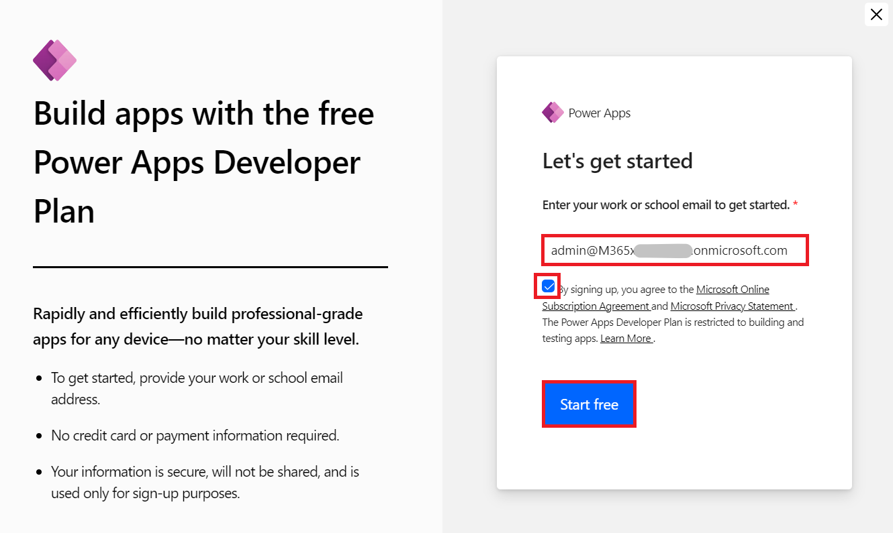

4.  Introduzca **la contraseña de su Office 365 tenant id** y
    seleccione **Sign in**.

> 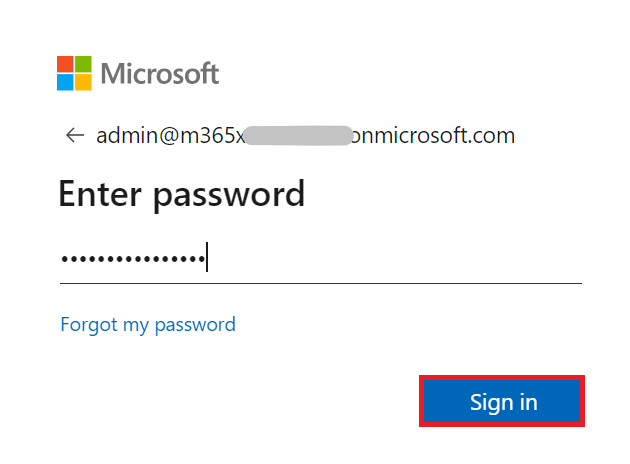

5.  Seleccione **Yes** en el popup **Stay signed in?**.

> 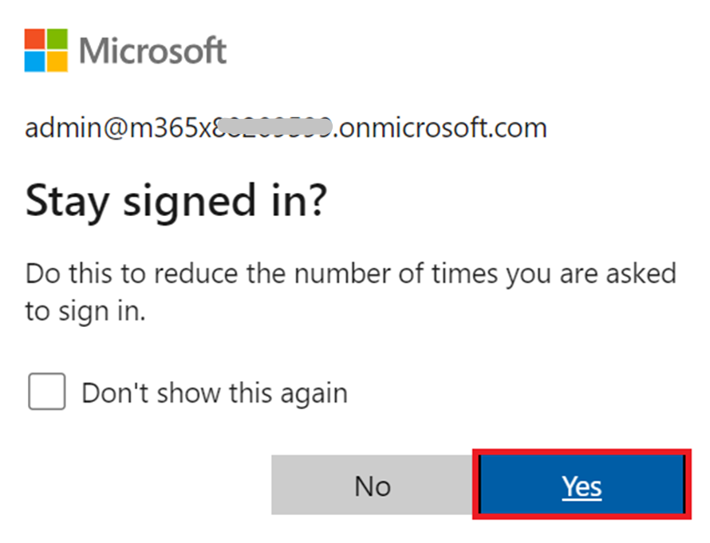

6.  Si aparece el pop-up, proporcione **Contact Information**, como se
    menciona a continuación, y seleccione **Submit**.

    - Email: **los** **Office 365 admin tenant credentials**

    - Country/region: **United States**

    - Phone number: **Su número de teléfono**

> 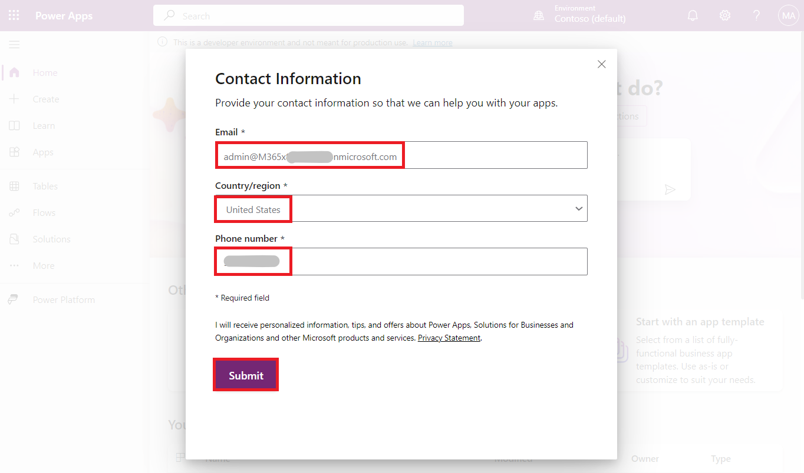

7.  Ahora puede ver **la página de inicio de Power Apps.** Desde el
    environment selector, seleccione el developer environment – **Dev
    One** que está creado para usted.

> 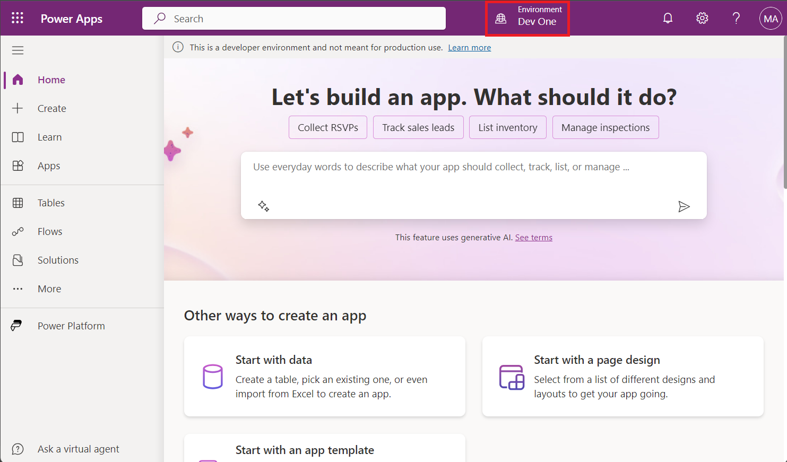

8.  Abra una nueva pestaña y vaya a Power Platform admin center en
    +++\*\* y si es necesario, inicie sesión con los Office 365 tenant
    admin credentials. **Cierre** el **popup** diciendo, ‘Welcome to the
    Power Platform admin center'. Seleccione **Manage** desde el panel
    de navegación izquierdo

> 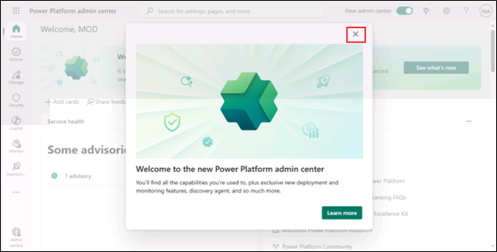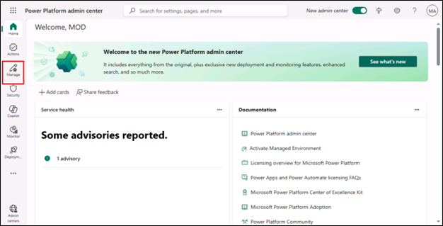

9.  Desde el panel de navegación izquierdo,
    seleccione **Environments** y luego puede ver, **Dev One** es su
    Dataverse environment.

> 

**Tarea 2: Cree un team en Microsoft Teams**

1.  Inicie sesión en Microsoft Teams en +++\*\* con sus Office 365
    tenant credentials.

2.  En la ventana Welcome to Teams, seleccione **Get Started**.

> 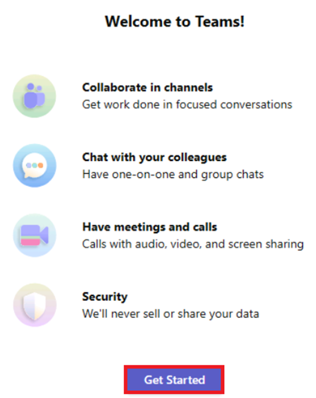

3.  Cierre la ventana pidiendo escanear un código QR.

> 

4.  En la parte derecha de Teams, haga clic en **Teams**, haga clic en
    el símbolo **+** en **Join or create a team**.

> 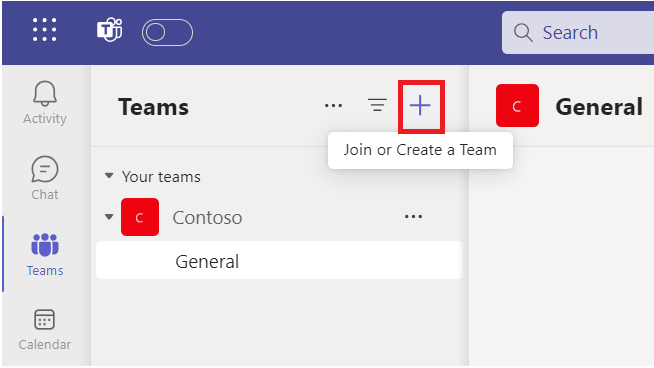

5.  Haga clic en **Create team**.

> 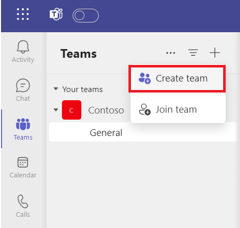

6.  Introduzca el Team name : +++**Test Team**+++, en Name the first
    channel como +++**TestChannel**+++ y haga clic en **Private**.

> 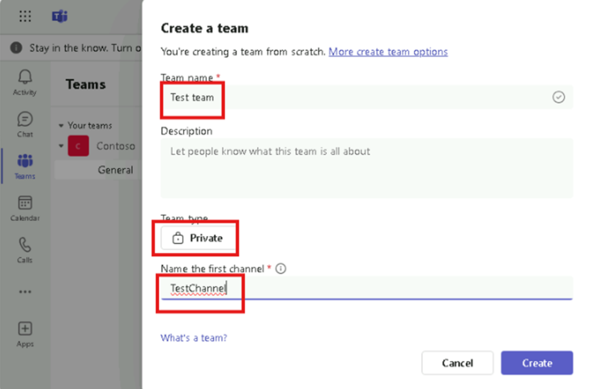

7.  Seleccione **Org-wide**.

> 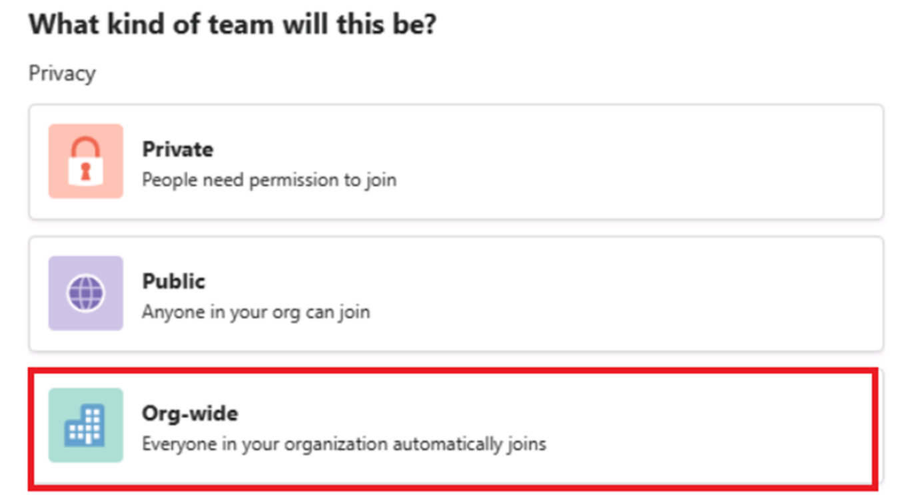

8.  Seleccione **Create**.

> 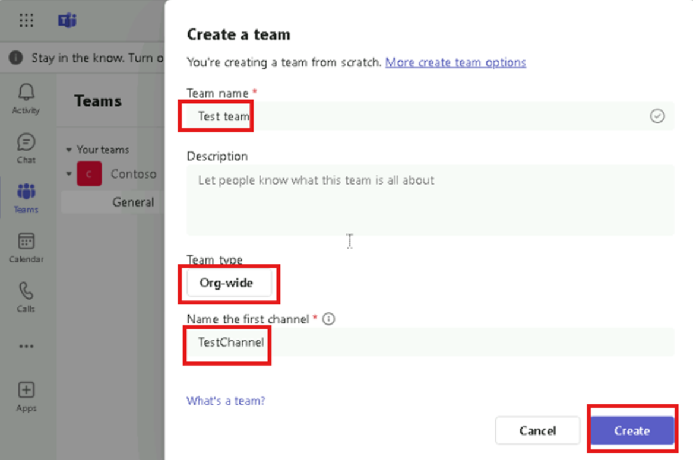

**Resumen:** En este laboratorio, ha obtenido una licencia Power Apps
trial y ha configurado Microsoft Teams.
