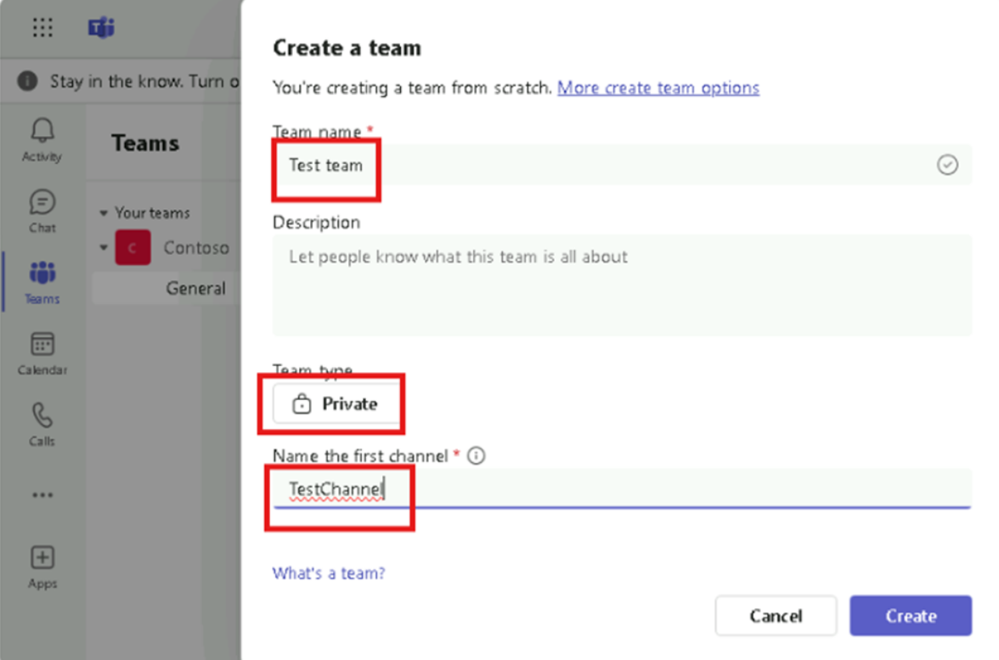

# **Laboratoire 0 - Configuration de l'environnement de laboratoire pour Power App**

**Objectif :** Dans ce laboratoire, vous allez acquérir une licence
d'évaluation de Power Apps et configurer les applications Micorsoft
Teams.

**Durée estimée :** 7 min

### **Tâche 1 : Attribuer une licence d'essai Power Apps**

1.  Ouvrez un navigateur Web sur votre machine virtuelle et accédez à
    **+++https://powerapps.microsoft.com/en-us/free/+++.**

- 

2.  Sélectionnez **Start free**.

- 

3.  Entrez vos **informations d'identification de Office 365 admin** ,
    cochez la case pour **accepter l'accord** et cliquez sur **Start
    Free**.

- 

4.  Entrez **le mot de passe de votre ID de locataire Office 365** ,
    puis sélectionnez **Sign in**.

- 

5.  Sélectionnez **Yes** sur **Rester connecté ?** fenêtre contextuelle.

- 

6.  Si une fenêtre contextuelle s'affiche, indiquez **les coordonnées**
    ci-dessous, puis sélectionnez **Submit**.

    - E-mail : **Informations d'identification de Office 365 admin
      tenant**
    - Pays/région : **United states**
    - Numéro de téléphone : **Votre numéro de téléphone**

- 

7.  Vous pouvez maintenant voir **la page d'accueil de Power Apps.**
    Dans le sélecteur d'environnement, sélectionnez l'environnement de
    développement **Dev** **One** qui est créé pour vous.

- 

8.  Ouvrez le nouvel onglet et accédez au centre d'administration Power
    Platform en accédant à
    **+++https://admin.powerplatform.microsoft.com+++** et, si
    nécessaire, connectez-vous à l'aide de vos informations
    d'identification d'administrateur de locataire Office 365.
    **Fermez** la **fenêtre contextuelle** indiquant ‘Welcome to the new
    Power Platform admin center’. Sélectionnez **Gérer** dans le volet
    de navigation de gauche.

- 

  

9.  Dans le volet de navigation de gauche, sélectionnez
    **Environnements** , puis **Dev** **One** est votre environnement
    Dataverse.

- 

### Tâche 2 : Créer une équipe dans Microsoft Teams

1.  Connectez-vous à Microsoft Teams à l'aide de
    +++**https://teams.microsoft.com**+++ avec vos informations
    d'identification de Office 365 tenant.

2.  Dans la fenêtre Bienvenue dans Teams, sélectionnez **Get Started**.

- 

3.  Fermez la fenêtre qui demande de scanner le code QR.

- 

4.  Sur le côté gauche de Teams, cliquez sur **Teams**, cliquez sur **+
    sign** pour **Join or create a team**.

- 

5.  Cliquez sur **Créer une équipe**.

- 

6.  Entrez le nom de l'équipe : **+++Test Team+++,** sur Nommez le
    premier canal comme **+++TestChannel+++** et cliquez sur
    **Private**.

- 

7.  Sélectionnez **Org-wide**.

- 

8.  Sélectionnez **Create**.

- 

**Résumé :** Dans ce Laboratoire, vous avez acquis une licence
d'évaluation Power Apps et configuré Microsoft Teams.
