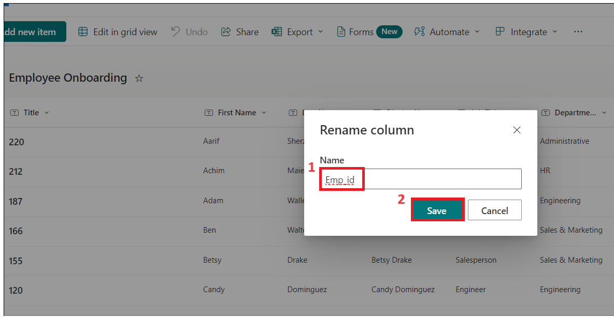
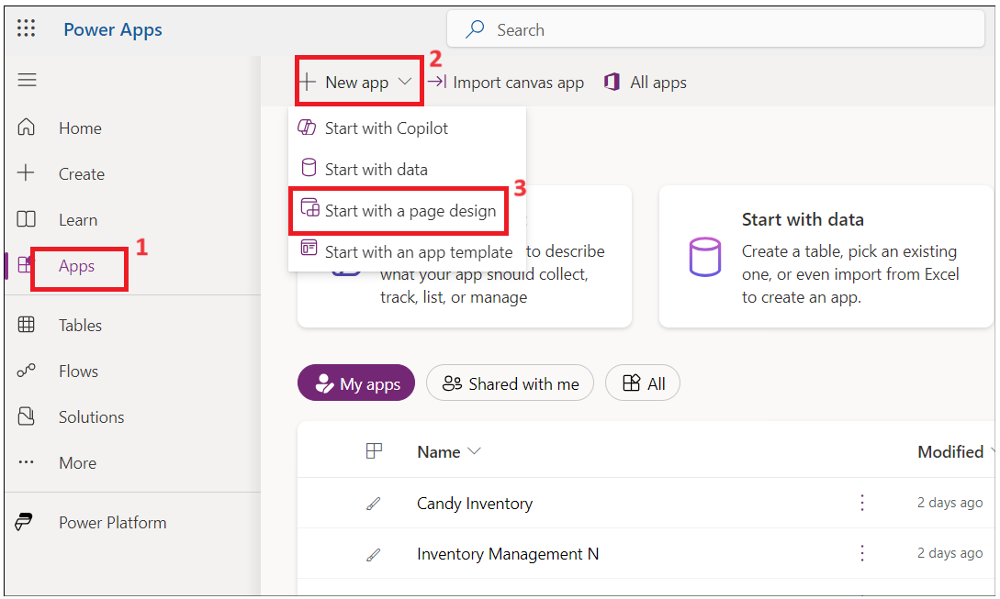
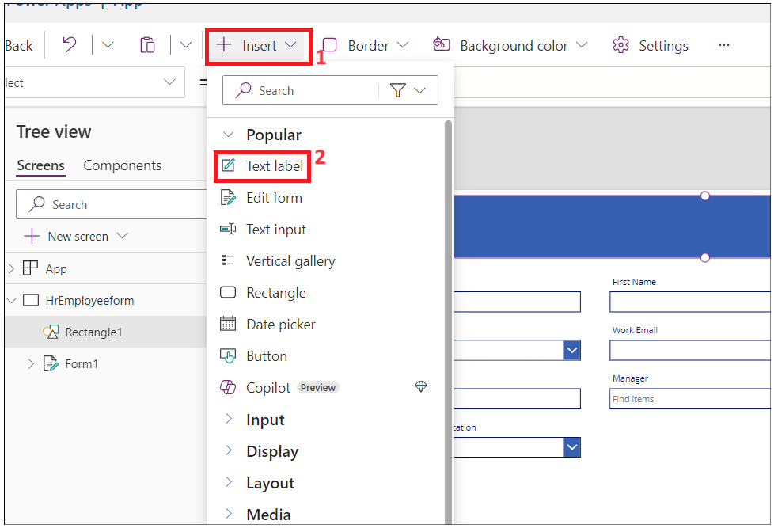
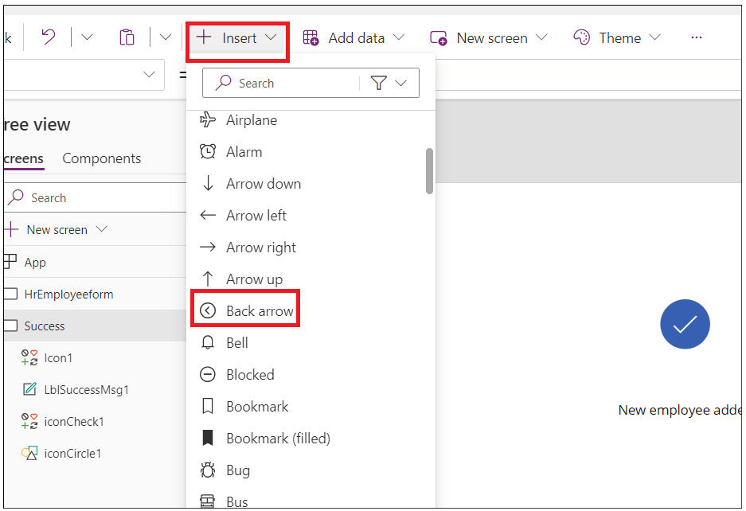
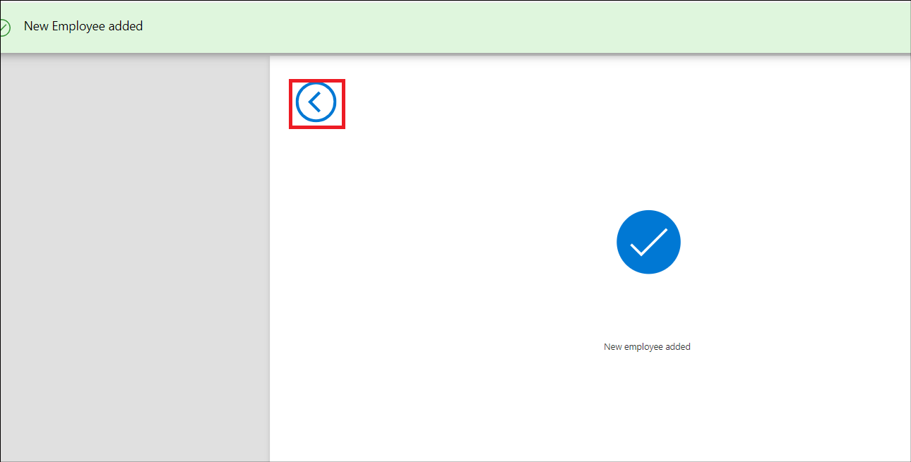
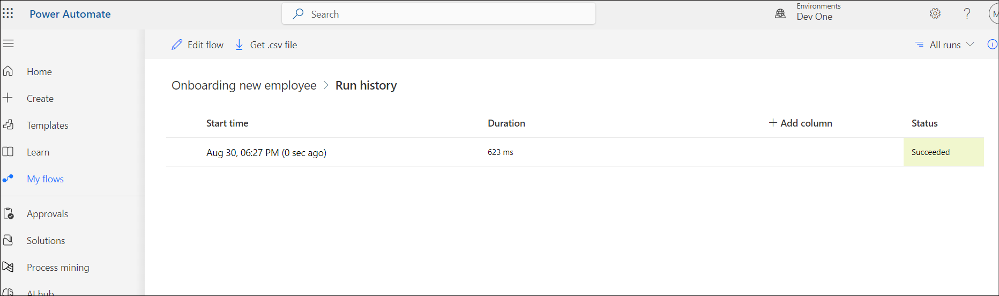

# **實驗 1 - 新員工自動入職**

**目標：** 本實驗室的主要目標是指導參與者使用 Microsoft Power Platform
自動化員工入職流程。這些練習的重點是創建 SharePoint 列表來存儲員工和 HR
信息、在 Power Apps 中自定義表單以進行數據輸入，以及使用 Power Automate
實施自動化工作流。參與者將學習利用 SharePoint 進行數據管理，利用 Power
Apps
增強用戶體驗，並集成自動化流程以簡化入職任務。這種實踐經驗旨在使參與者具備實用技能，以有效管理和自動化其組織內的
HR 流程。

**預計時間：** 60 分鐘

# 練習 1：在 Share point 中創建員工、人力資源和經理列表。

## 任務 1：驗證您的 Dataverse 環境

1.  打開瀏覽器並轉到
    **+++https://admin.powerplatform.microsoft.com+++**。使用 Office 365
    租戶憑據登錄。

2.  選擇 **Manage** \> **Environments** 在左側導航欄中。 **Dev One**
    Developer 環境應該已為您創建，如下圖所示。

- 

3.  使用相同的開發人員環境執行此實驗室的所有練習。

## 任務 2：在 SharePoint 中創建網站

1.  導航到 **+++https：\office.com+++** 並使用 office 365 tenant。

2.  單擊左上角的 matrix，然後從**應用程序**列表中選擇 **SharePoint**。

- 

  

3.  點擊 頂部菜單上的 +Create site。

- 

4.  在**“Create a site**”窗口中選擇**“Communication site**”。

- 

5.  向下滾動並選擇 **Blank** template。

- 

6.  單擊 **Use template**。

- 

7.  輸入站點名稱和描述，然後單擊 **Next** 按鈕.

    - 站點名稱: +++**Contoso Corp**+++

    - 網站描述: +++**Onboarding new employee.**+++

- 

8.  保留默認語言，然後單擊 **Create Site。**

- 

  

## 任務 3：從 CSV 文件在 SharePoint 站點中創建員工列表

1.  單擊 **Home –\> New –\> List。**

- 

2.  從 **Create a list** 窗口中選擇 **From CSV tile**。

- 

3.  單擊 **Upload file** 並瀏覽到 **C：Files** 並選擇 **Employee.csv**
    file。

- 

4.  將 **Work Email** 列類型更改為 **Single line of text** ，然後單擊
    **Next**。

- 

5.  然後輸入名稱為：**+++ Employee Onboarding+++**，如果詢問，請輸入
    描述：**+++New Contoso Corp employee+++**，然後單擊 **Create**。

- 

  

6.  現在已為您創建 Employees 列表。通過選擇 **Title drop-down \> Column
    settings \> Rename，**將 **Title** 列重命名為 **+++Emp_id+++**。

- 

  

7.  現在 employee 表應該像這樣

- 

8.  單擊 **Settings -\>List settings。**

- 

9.  單擊 **Department** 列鏈接。

- 

10. 更改以下值，然後單擊 **Ok**。

    - 列類型 : **Choice**

    - 允許 “Fill-in” 選項: **Yes**

- 

11. 對 **Job title** 列重複上述步驟。

12. 選擇 **Have you been to orientation yet?** 列並製作到 chagnes
    下面，然後單擊 **OK。**

    - 列類型 : **Choice**

    - 允許 “Fill-in” 選項: **Yes**

    - 在單獨的行中鍵入每個選項 : **Yes No**

- 

13. 對 **Orientation Location** with below properties
    重複上述步驟，然後選擇 **Ok**。

    - 列類型 : **Choice**

    - 允許 “Fill-in” 選項: **Yes**

    - 在單獨的行中鍵入每個選項 : **Redmon Reno**

- 

14. 對 **Manager** 列重複上述步驟 ，並添加以下屬性，然後選擇 **Ok**.

    - 列類型 : **Choice**

    - 允許 “Fill-in” 選項: **Yes**

- 

15. 單擊 **Home** 返回 **Site**。

- 

## 任務 4：從 CSV 文件在 SharePoint 網站中創建 HR 列表

1.  單擊 **Home –\> New –\> List。**

- 

2.  從 **Create a list window** 中選擇 **From CSV tile。**

- 

3.  單擊 Upload **file** 並瀏覽 **C：Files** 並選擇
    **Import_HR_M365.CSV** 然後單擊 **Open**。

- 

4.  將 **Work Email** 列類型更改為 **Single line of text**，然後單擊
    **Next**。

- 

5.  輸入以下詳細信息

    - 名字 : +++**Contoso HR**+++

    - 描述 : +++**Contoso Human Resource**+++, 然後點擊 **Create**
      按鈕。

- 

6.  單擊 **Title –\> Column settings –\> Rename** 為 **+++Emp_id+++。**

- 

  

7.  HR 表現在應如下圖所示。

- 

# 練習 2：創建 Power Apps for SharePoint 列表

在本練習中，您將構建應用程序，向員工發送一封包含官方信息的電子郵件，並要求他填寫和上傳文檔。

## 任務 1：使用 PowerApps 自定義員工表單，供 HR 填寫。

1.  從 **SharePoint –\> Employee onboarding**，複製 URL
    並將其保存在記事本中。

- 

2.  打開一個新選項卡並轉到
    **+++https://make.powerapps.com/+++**。使用您的 Office 365
    管理員租戶登錄，然後選擇您的 **Dev One** （Developer） 環境。現在，
    請 **disable** 顯示“Try the new Power Apps experience”的切換按鈕。

- 

3.  單擊 左側導航菜單中的 Apps。選擇 **New App – \> Start with a page
    design.**

- 

4.  選擇 **Blank Canvas** 磁貼。

- 

5.  右鍵單擊 **Screen1** 並選擇 **Rename。**

- 

6.  重命名為 **HrEmployeeform**

- 

7.  選擇表單，然後單擊 **Insert –\> Edit form。**

- 

8.  搜索 **SharePoint**，然後從 **Select a data source** 下拉列表中選擇
    **SharePoint connector**。

- 

9.  在 **Connect** 下選擇 **SharePoint。**

- 

10. 在“**Enter SharePoint URL**”文本字段中輸入複製的表單步驟 1 的
    **SharePoint list URL**，然後單擊“**Connect**”。

- 

11. 選擇 **Employee Onboarding list** ，然後單擊 **Connect** 。

- 

12. 將表單拖拽並放入容器中。

- 

13. 將 Form1 容器向下拖動一點，然後單擊 **Insert –\> Rectangle**
    以將標題插入表單。

- 

14. 將矩形調整為容器寬度。單擊 **Insert –\> Text label**。

- 

15. 將文本字段的寬度更改為矩形並更新以下屬性。

    - **Tex: New Employee Onboarding Form**

    - **Font Size:** 27

    - **Font weight:** Bold

    - **Text alignment:** Centre

    - **Colour:** White

- 

16. 將 **Emp_Id、 First Name** 和 **Last_Name** 作為必填字段。

17. 選擇 **Emp_Id** 字段並更改 value **required**。單擊 **Properties**
    下的 **Advanced**，然後選擇 **Unlock to change properties**。

- 

18. 現在，將 **Required** 值設置為 true。您應該會在字段**Emp_id next**
    看到 star 。

- 

19. 對 **First Name** 和 **Last_Name** 重複上述兩個步驟

> **注意**：如果您沒有看到字段，請選擇container -\> properties -\>
> Edit（ fields） .add 字段並重新排序。

- 

20. 選擇 Rectangular form/FormScreen1，然後單擊 **Insert –\> Button**。

- 

21. 將按鈕拖放到 表單中的**Department**下，並更新下面的屬性。

- **Text**: **Submit**

  

22. 單擊 **New Screen** 並選擇 **Success** template。

- 

23. 選擇新屏幕並 **rename** 為 **Success** ，如下圖所示。

- 

24. 選擇 **Lb1Successmsg1** 並將文本更改為 **New employee added**。

- 

25. 現在，單擊 **Insert –\> Icons –\> Back 箭頭。**

- 

26. 選擇 Back Arrow 並設置以下屬性。

- Tool Tip: **Go Back**

- OnSelect: +++**Back(ScreenTransition.CoverRight)**+++

&nbsp;

- 

27. 單擊 **HrEmployeeform。** 選擇 **Button** 並選擇 **Onselect**
    並輸入以下公式。

> **注意：** 使用 SharePoint 表單更新公式。

- +++**SubmitForm(*Form1*);ResetForm(*Form1*);Navigate(*Success*)**+++

  

28. 選擇 **Form1，** 選擇 **OnSuccess** 並將公式替換為以下公式。

- +++**ResetForm(Self); RequestHide();Notify(“New Employee
  added”,NotificationType.Success)**+++

  

29. 單擊 **Save – \> Save as** 按鈕，輸入名稱 **EmpformforHr**，然後單擊
    **Save**。

- 

30. 選擇表單並將 **Default** 模式 更改為 **New** ，然後單擊 **Save -\>
    Preview** 圖標。

- 

31. 輸入隨機的 **Emp ID、First Name** 和 **Last Name**，然後單擊
    **Submit** 按鈕。

- 

32. 您應該會看到 **New employee added message。** 點擊 **Back**
    按鈕**。**

- 

33. 單擊 **Publish** 按鈕，然後單擊 **Publish this version** 按鈕。

- 

34. 返回到瀏覽器中的 SharePoint
    選項卡。您應該會在列表中看到您添加的新員工的 employee 記錄。

## 任務 2：為員工創建員工入職 Canvas 應用程序

1.  從 **SharePoint-onboarding**中，複製 URL 並將其保存在記事本中。

- 

2.  打開一個新選項卡並轉到
    **+++https://make.powerapps.com/+++**。使用您的 Office 365
    管理員租戶登錄，然後選擇您的 **Dev One** 開發人員環境。

3.  單擊 左側導航菜單中的 Apps。選擇 **New App -\> Start with a page
    design**。

- 

4.  選擇 **Blank Canvas** 磁貼。

- 

5.  右鍵單擊 **Screen1** 並選擇 **Rename。**

- 

6.  重命名為 **Employeeform**

- 

7.  單擊 **Insert** 並選擇 **Edit** form。

- 

8.  搜索 **SharePoint**，然後從 **Select a data source** 下拉列表中選擇
    **SharePoint connector**。

- 

9.  在 **Add Connection** 下選擇 **SharePoint。**

- 

10. 在“輸入 SharePoint URL”文本字段中輸入複製的表單步驟 1 的
    **SharePoint list URL**，然後單擊“**Connect**”。

11. 在 **Choose a list** –\> 下，選擇 **Employee Onboarding list**
    然後單擊 **Next。**

- 

12. 選擇 **Employee Onboarding list**，然後單擊 **Connect**。

- 

13. 將表單拖拽並放入容器中。

- 

14. 在 **Properties** 下選擇 **Form 1** 和 **Display** 模式為 **New**。

- 

15. 將 Form1 容器向下拖動一點，然後單擊 **Insert -\> Rectangle**
    將標題插入表單。

- 

16. 將矩形的寬度更改為容器，然後選擇 **Insert –\> Text label**。

- 

17. 選擇 Label 並設置以下 **properties**。

    - **Text: Employee Onboarding Form**

    - **Font Size: 25**

    - **Font weight: Bold**

    - **Text alignment: Centre**

    - **Colour: White**

- 

18. 選擇**Emp_Id**字段名稱，然後在 Properties 下將 **Font size** 更改為
    **16** 並將 **Font weight** 更改為
    **Bold**。如果找不到**Emp_Id**字段，請將鼠標懸停在畫布中的 **Form1**
    上，選擇 **Fields \> Add fields**，選擇 **Emp_Id** （如果
    在此列表中也沒有看到Emp_Id，請選擇 **Title**，然後選擇 **Add**。

- 

19. 對所有字段重複上述步驟。

- 

20. 選擇 **Orientation location** 項目，並將 **Visible** 屬性設置為
    **false。**

- 

21. 選擇 **Have you been to orientation yet**？文本字段，然後單擊
    **Edit** label。

- 

22. 將標簽值更改為 **Orientationdropdown**

- 

23. 選擇 **Orientation Location data card**並選擇 **Visible**
    並放置在公式下方，如下圖所示。

- +++**If(*Orientationdropdown*.Selected.Value=“No”,true,false)**+++

  

24. 單擊 **Save** 並輸入應用程序名稱為： **EmployeeOnboardingForm**
    ，然後單擊 **Save** 按鈕。

- 

25. **Emp_id**、 **First Name**、 **Last Name** 和 **Manager** 將由 HR
    填充，因此將顯示模式更改為 **View**。

26. 選擇字段並單擊 **Advanced –\> Unlock to change properties**並將
    **Display mode** 更新為 **Parent.DisplayMode.View**

- 

  

  

  

  

27. 選擇 **Work email** Field **Unlock property**，並將 **Required**
    屬性更新為 **true。** 如果需要，對其他字段重複此作。

- 

28. 選擇 **Form1** 並將 **OnFailed** 字段值更新為

- +++**Notify(“Required Fields can’t be
  empty.”,NotificationType.Error)**+++

  

29. 選擇 **OnSuccess** 並將值設置為

- +++**Notify(“Thank you for filling out the
  form”,NotificationType.Success)**+++

  

30. 現在，讓我們在表單末尾添加要提交的按鈕。單擊 **Inset –\> Button。**

- 

31. 更改按鈕的 Properties 並保存表單。

    - Text: **Submit.**

    - Onselect: +++**SubmitForm(*Form1*);NewForm(*Form1*)**+++

- 

32. 單擊 **Save**，然後單擊 **Preview** 應用程序按鈕。

- 

33. 輸入詳細信息，然後單擊 **Submit**。

- 

34. 您應該會看到成功通知。

- 

35. 關閉預覽窗口。

36. 在 **Tree View** 中單擊“**App**”。選擇“**OnStart**”並輸入以下公式。

- Set(

          onboardinglistitem,

          LookUp(

              'Employee Onboarding',

              ID = Value(Param("ItemID"))

          )

      )

  

37. 從 **Tree View** 中選擇 **Form1**。選擇 item 並輸入值，如下所示：
    **onboardinglistitem**

- 

38. 單擊 **Save** 並 **Publish –\> Publish this version**。

- 

39. 返回到 **Power Apps 主頁** ，單擊 **Apps –\> Your app –\>
    Details**。

- 

40. 複製 Web 鏈接以在下一個任務中使用。

- 

41. 關閉預覽窗口並導航到 SharePoint 選項卡，然後檢查列表中的上述記錄。

- 

## 任務 3：創建 Power Automate 流以將表單發送給新員工

1.  返回到 **SharePoint** 選項卡並複製 URL。

- 

2.  打開一個新選項卡，轉到
    +++https://make.powerautomate.com/+++，然後使用您的管理員租戶帳戶登錄。

3.  選擇您的 **Dev One** 開發人員環境。

4.  單擊 左側導航菜單中的 **My flows** 單擊 **New Flow–\> Automated
    Cloud flow。**

- 

5.  將流程名稱輸入為： **Onboarding new employee**。搜索 **When an item
    is created** 並從 SharePoint 中選擇它，然後單擊 **create**。

- 

6.  選擇作。單擊 **Site Address –\> Enter custom value。**

- 

7.  輸入在步驟 1 中複製的 地址 ，然後選擇 **Employee Onboarding**
    列表，如下圖所示。

- 

8.  單擊 **+** 添加新作。

- 

9.  搜索並選擇 **Send an email （V2）**

- 

10. 單擊 to text field 並選擇 **Enter the data from previous step**。

- 

11. 選擇 **“Work email”。**

- 

12. 輸入主題行：**Welcome to Firm**，並從上一步中選擇**First Name**。

- 

13. 在電子郵件的正文中輸入以下數據。插入動態值，如圖所示。

- 高名字姓氏 ,

  請點擊下面的鏈接填寫您的入職表格。

  

  

14. 輸入在任務 2 中複製的 Web 鏈接 — 並在鏈接末尾添加
    **&itemID=**，然後選擇動態 ID，如下圖所示。

- 

  

15. 剪切鏈接，然後輸入文本： **Onboarding Form**
    ，然後選擇並單擊鏈接圖標。粘貼從上述步驟複製的鏈接。

- 

16. 立即保存流。

- 

  

## 任務 4：測試流。

1.  返回到 **Power Apps** 選項卡，選擇 **EmpformforHr** 應用。

- 

2.  如果詢問，則允許權限。

- 

3.  在表格中填寫您的詳細信息。輸入工作電子郵件作為您的管理員租戶
    ID，然後 **提交** 表單。

- 

  

4.  返回到 Power Automate 流並檢查流狀態。

- 

  

5.  打開一個新選項卡，轉到 **+++https：\outlook.com+++**，然後使用
    Office 365 租戶帳戶登錄並簽入收件箱。單擊 HR 生成的電子郵件中的
    **Onboarding Form** 鏈接。

- 

**結論：** 完成本實驗後，參與者將全面瞭解如何使用 Microsoft Power
Platform 工具創建和管理員工入職工作流。他們將成功創建和配置 SharePoint
列表以存儲員工數據，構建供 HR 使用的自定義 Power Apps 表單，並設置自動化
Power Automate
流程以與新員工進行無縫溝通。這種體驗將使參與者能夠增強他們的組織入職流程，提高數據準確性，並在人力資源管理中培養更高效的工作流程。總體而言，該實驗室為參與者提供了寶貴的技能，這些技能可以應用於實際場景以優化業務運營。
