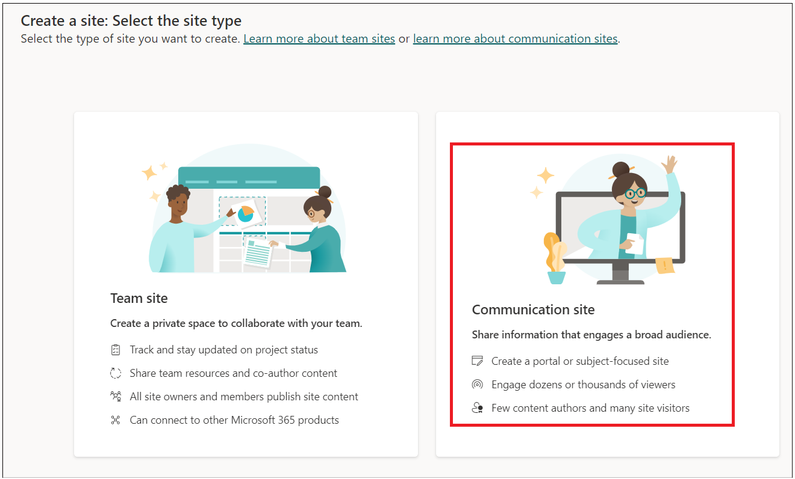
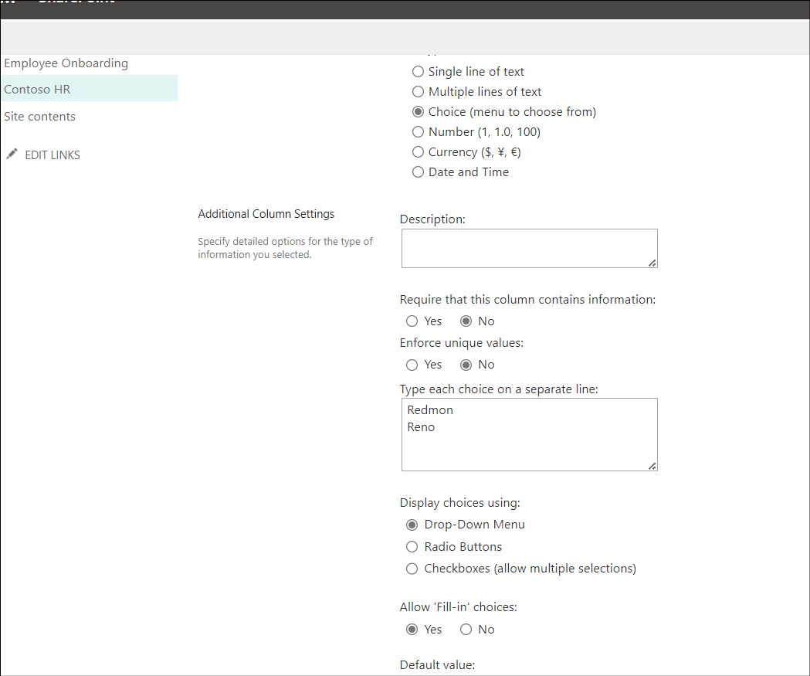

# **Lab 1 - Automatizzare l'onboarding dei nuovi dipendenti**

**Obiettivo:** l'obiettivo principale di questo lab è guidare i
partecipanti nell'automazione del processo di onboarding dei dipendenti
utilizzando Microsoft Power Platform. Gli esercizi si concentrano sulla
creazione di elenchi SharePoint per archiviare le informazioni sui
dipendenti e sulle risorse umane, sulla personalizzazione dei moduli in
Power Apps per l'immissione dei dati e sull'implementazione di flussi di
lavoro automatizzati tramite Power Automate. I partecipanti impareranno
a sfruttare SharePoint per la gestione dei dati, a utilizzare Power Apps
per migliorare l'esperienza utente e a integrare processi automatizzati
per semplificare le attività di onboarding. Questa esperienza pratica
mira a fornire ai partecipanti competenze pratiche per gestire e
automatizzare efficacemente i processi HR all'interno delle loro
organizzazioni.

**Tempo stimato:** 60 minuti

# Esercizio 1: Creare l'elenco dei dipendenti, delle risorse umane e dei manager nel Share point.

## Attività 1: Verifica dell'ambiente Dataverse

1.  Aprire un browser e vai a
    +++**https://admin.powerplatform.microsoft.com**+++. Accedere con le
    credenziali del tenant di Office 365.

2.  Selezionare **Manage** \> **Environments** nel riquadro di
    spostamento a sinistra. L' ambiente **Dev** **One** Developer
    dovrebbe essere stato creato per te, come mostrato nell'immagine qui
    sotto.

- 

3.  Utilizzare lo stesso ambiente di sviluppo per eseguire tutti gli
    esercizi di questo laboratorio.

## Attività 2: Creare un sito in SharePoint

1.  Passare a +++**https:\office.com**+++ e accedere con il tenant di
    Office 365.

2.  Fare clic su matrice nell'angolo in alto a sinistra e selezionare
    **SharePoint** dall'elenco delle **apps**.

- 

  

3.  Fare clic su **+Create site** nel menu in alto.

- 

4.  Selezionare il riquadro **Communication site** nella finestra
    **Create a site**.

- 

5.  Scorrere verso il basso e selezionare **Blank** template.

- 

6.  Fare clic su **Use template**.

- 

7.  Inserire il nome e la descrizione del sito, quindi fare clic sul
    pulsante **Next**.

    - Site Name: +++**Contoso Corp**+++

    - Site Description: +++**Onboarding new employee.**+++

- 

8.  Mantieni la lingua predefinita e poi cliccare su **Create Site.**

- 

  

## Attività 3: Creare un elenco di dipendenti nel sito di SharePoint da un file CSV

1.  Fare clic su **Home –\> New –\> List.**

- 

2.  Selezionare riquadro **From CSV** da **Create a list** finestra.

- 

3.  Fare clic su **Upload file** e accedere a **C:Files** e selezionare
    **Employee.csv** file.

- 

4.  Cambiare il tipo di colonna **Work Email** in **single line of
    text**, quindi fare clic su **Next**.

- 

5.  Immettere quindi Name come: +++**Employee Onboarding**+++ e, se
    richiesto, immettere Description: +++**New Contoso Corp
    employee**+++ e quindi fare clic su **Create**.

- 

  

6.  L'elenco Dipendenti è stato creato automaticamente. Rinominare la
    colonna **Title** in +++**Emp_id**+++ selezionando **Title
    drop-down** \> **Column settings** \> **Rename**.

- 

  

7.  Ora la tabella dei dipendenti dovrebbe essere così

- 

8.  Fare clic su **Settings -\>List settings.**

- 

9.  Fare clic sul collegamento della colonna **Department**.

- 

10. Modificare i valori sottostanti e quindi fare clic su **Ok**.

    - Type of Column : **Choice**

    - Allow ‘Fill-in’ choices: **Yes**

- 

11. Ripetere il passaggio precedente per la colonna **Job title**.

12. Selezionare **Have you been to orientation yet?** colonna e
    apportare le modifiche seguenti, quindi fare clic su **OK.**

    - Type of Column : **Choice**

    - Allow ‘Fill-in’ choices: **Yes**

    - Type each choice on a separate line : **Yes No**

- 

13. Ripetere il passaggio precedente per **Orientation Location** con le
    proprietà seguenti, quindi selezionare **Ok**.

    - Type of Column : **Choice**

    - Allow ‘Fill-in’ choices: **Yes**

    - Type each choice on a separate line : **Redmon Reno**

- 

14. Ripetere il passaggio precedente per la colonna **Manager** con le
    proprietà sottostanti aggiungere e quindi selezionare **Ok**.

    - Type of Column : **Choice**

    - Allow ‘Fill-in’ choices: **Yes**

- 

15. Cliccare su **Home** per tornare al **Site**.

- 

## Attività 4: Creare un elenco HR nel sito SharePoint da un file CSV

1.  Fare clic su **Home –\> New –\> List.**

- 

2.  Selezionare **From CSV tile** da **Create a list window.**

- 

3.  Fare clic su Upload **file** e sfogliare **C:Files** e selezionare
    **Import_HR_M365.CSV** e fare clic su **Open**.

- 

4.  Modificare il tipo di colonna **Work Email** in **Single line of
    text**, quindi fare clic su **Next**.

- 

5.  Inserire i dettagli qui sotto

    - Name : +++**Contoso HR**+++

    - Description : +++**Contoso Human Resource**+++, then click on
      **Create** button.

- 

6.  Fare clic su **Title –\> Column settings –\> Rename** colonna in
    +++**Emp_id**+++.

- 

  

7.  La tabella delle risorse umane dovrebbe essere simile all'immagine
    qui sotto ora.

- 

# Esercizio 2: Creare elenchi Power Apps per SharePoint

In questo esercizio, costruirai la tua applicazione per inviare un
messaggio di posta elettronica al dipendente con le informazioni
ufficiali e chiedergli di compilare e caricare documenti.

## Attività 1: Personalizzare il modulo Dipendente con PowerApps per le risorse umane da compilare.

1.  Da **SharePoint –\> Employee onboarding**, copiare l'URL e salvarlo
    nel Blocco note.

- 

2.  Aprire una nuova scheda e vai a
    +++**https://make.powerapps.com/**+++. Accedere con il tenant
    amministratore di Office 365 e selezionare l'ambiente **Dev One**
    (sviluppatore). Per ora, **disabilitare** il pulsante di
    attivazione/disattivazione che dice ‘Try the new Power Apss
    experience’.

- 

3.  Fare clic su **Apps** dal menu di navigazione a sinistra.
    Selezionare **New App –\> Start with a page design.**

- 

4.  Selezionare il riquadro **Blank Canvas**.

- 

5.  Fare clic con il pulsante destro del mouse su **Screen1** e
    selezionare **Rename.**

- 

6.  Rinominare in **HrEmployeeform**

- 

7.  Selezionare il modulo e fare clic su **Insert –\> Edit form.**

- 

8.  Cercare **SharePoint** e selezionare **SharePoint connector**
    dall'elenco a discesa **Select a data**.

- 

9.  Selezionare **SharePoint** in **Connect.**

- 

10. Immettere **SharePoint list URL** copiato dal passaggio 1 nel campo
    di testo **Enter SharePoint URL** e quindi fare clic su **Connect**.

- 

11. Selezionare l'elenco **Employee Onboarding** e quindi fare clic su
    **Connect**.

- 

12. Trascinare e adattare il modulo al contenitore.

- 

13. Trascinare il contenitore Form1 un po' verso il basso e fare clic su
    **Insert –\> Rectangle** per inserire l'intestazione nel modulo.

- 

14. Regolare il rettangolo in base alla larghezza del contenitore. Fare
    clic su **Insert –\> Text label**.

- 

15. Modificare la larghezza del campo di testo in rettangolo e
    aggiornare le proprietà seguenti.

    - **Tex: New Employee Onboarding Form**

    - **Font Size:** 27

    - **Font weight:** Bold

    - **Text alignment:** Centre

    - **Colour:** White

- 

16. Inserire **Emp_Id, First Name** e **Last_Name** come campi
    obbligatori.

17. Selezionare **Emp_Id** campo e modificare il valore **richiesto**.
    Fare clic su **Advanced** in **Properties** e selezionare **Unlock
    to change properties**.

- 

18. A questo punto, impostare il valore **Required** su true. Dovresti
    vedere la stella accanto **Emp_id** campo.

- 

19. Ripetere i due passaggi precedenti per **First Name** e
    **Last_Name**

- **Nota**: Se non vedi il campo, seleziona le proprietà del contenitore
  -\> properties -\> Edit( fields) .add field e re-order.

  

20. Selezionare il modulo rettangolare/FormScreen1 e quindi fare clic su
    **Insert –\> Button**.

- 

21. Trascinare e posizionare il pulsante sotto **Department** archiviato
    nel modulo e aggiornare le proprietà sottostanti.

- **Text**: **Submit**

  

22. Fare clic su **New Screen** e selezionare **Success** template.

- 

23. Selezionare la nuova schermata e **rinominala** in **Success** come
    mostrato nelle immagini seguenti.

- 

24. Selezionare **Lb1Successmsg1** e modificare il testo in **New
    employee added**.

- 

25. Ora, fare clic su **Insert –\> Icons –\> Back arrow.**

- 

26. Selezionare Back Arrow e impostare le proprietà seguenti.

- Tool Tip: **Go Back**

- OnSelect: +++**Back(ScreenTransition.CoverRight)**+++

&nbsp;

- 

27. Fare clic su **HrEmployeeform.** Selezionare **Button** e
    selezionare **Onselect** e inserire la formula sottostante.

- **Nota:** Aggiornare la formula con il modulo SharePoint.

  +++**SubmitForm(*Form1*);ResetForm(*Form1*);Navigate(*Success*)**+++

  

28. Selezionare **Form1,** selezionare **OnSuccess** e sostituire la
    formula con la formula seguente.

- +++**ResetForm(Self); RequestHide();Notify(“New Employee
  added”,NotificationType.Success)**+++

  

29. Fare clic sul pulsante **Save –\> Save as** e inserire il nome come
    **EmpformforHr,** quindi fare clic su **Save**.

- 

30. Selezionare il modulo e modificare la modalità **Default** in
    **New**, quindi fare clic sull' icona **Save -\>** **Preview**.

- 

31. Inserire **Emp id, First Name** e **Last Name** casuali, quindi fare
    clic sul pulsante **Submit**.

- 

32. Dovrebbe essere visualizzato il messaggio **New employee added.**
    Fare clic sul pulsante **Back.**

- 

33. Fare clic sul pulsante **Publish** e quindi fare clic sul pulsante
    **Publish this version**.

- 

34. Tornare alla scheda SharePoint in un browser. Dovresti vedere il
    record del nuovo dipendente aggiunto da te nell'elenco.

## Attività 2: Creare l'app Canvas per l'onboarding dei dipendenti

1.  Da **SharePoint-onboarding**, copiare l'URL e salvarlo nel Notepad.

- 

2.  Aprire una nuova scheda e vai a
    +++**https://make.powerapps.com/**+++. Accedere con il tenant
    amministratore di Office 365 e selezionare l'ambiente di sviluppo
    **Dev One**.

&nbsp;

4.  Fare clic su **Apps** dal menu di navigazione a sinistra.
    Selezionare **New App -\> Start with a page design.**

- 

3.  Selezionare il riquadro **Blank Canvas**.

- 

4.  Fare clic con il pulsante destro del mouse su **Screen1** e
    selezionare **Rename.**

- 

5.  Rinominare in **Employeeform**

- 

6.  Fare clic su **Insert** e selezionare **Edit** **form**.

- 

7.  Cercare **SharePoint** e selezionare **SharePoint connector**
    dall'elenco a discesa **Select a data source**.

- 

8.  Selezionare **SharePoint** in **Add Connection.**

- 

9.  Immettere **SharePoint list URL** copiato dal passaggio 1 nel campo
    di testo Inserisci URL SharePoint e quindi fare clic su **Connect**.

10. In **Choose a list** –\> selezionare **Employee Onboarding** e
    quindi fare clic su **Next.**

- 

11. Selezionare **Employee Onboarding** e quindi fare clic su
    **Connect**.

- 

12. Trascinare e adattare il modulo al contenitore.

- 

13. Selezionare **Forma 1** e Modalità di **Display** su **New** in
    Proprietà.

- 

14. Trascinare il contenitore Form1 un po' verso il basso e fare clic su
    **Insert -\> Rectangle** per inserire l'intestazione nel modulo.

- 

15. Modificare la larghezza del rettangolo in contenitore e selezionare
    **Insert –\> Text label**.

- 

16. Selezionare l'etichetta e impostare le **proprietà** seguenti**.**

    - **Text: Employee Onboarding Form**

    - **Font Size: 25**

    - **Font weight: Bold**

    - **Text alignment: Centre**

    - **Colour: White**

- 

17. Selezionare il nome del campo **Emp_Id** e modifica **Font size** su
    **16** e **Font weight** su **Bold** in Proprietà. Se non trovi
    **Emp_Id** campo, passa il mouse su **Form1** nell'area di disegno,
    selezionare **Fields** \> **Add fields**, seleziona **Emp_Id** (se
    non vedi **Emp_Id** anche in questo elenco, seleziona **Title**) e
    quindi seleziona **Add**.

- 

18. Ripetere il passaggio precedente per tutti i campi.

- 

19. Selezionare **Orientation location** e impostare la proprietà
    **Visible** su **false.**

- 

20. Selezionare **Have you been to orientation yet**? campo di testo e
    fare clic su **edit** etichetta.

- 

21. Modificare il valore dell'etichetta in **Orientationdropdown**

- 

22. Selezionare **Orientation Location data card** e selezionare
    **Visible** e posizionare sotto la formula come mostrato
    nell'immagine seguente.

- +++**If(*Orientationdropdown*.Selected.Value=“No”,true,false)**+++

  

23. Fare clic su **Save** e inserire il nome dell'app come:
    **EmployeeOnboardingForm,** quindi fare clic sul pulsante **Save**.

- 

24. **Emp_id**, **First Name**, **Last Name** e **Manager** saranno
    compilati dalle risorse umane, quindi cambia la modalità di
    visualizzazione in **View**.

25. Selezionare il campo e fare clic su **Advanced –\> Unlock to change
    properties** e aggiornare **Display mode** a
    **Parent.DisplayMode.View**

- 

  

  

  

  

26. Selezionare **Unlock property** campo **Work email** e aggiornare la
    proprietà **Required** su **true.** Se necessario, ripetere
    l'operazione per gli altri campi.

- 

27. Selezionare **Form1** e aggiornare il valore del campo su
    **OnFailed**

- +++**Notify(“Required Fields can’t be
  empty.”,NotificationType.Error)**+++

  

28. Selezionare **OnSuccess** e impostare il valore su

- +++**Notify(“Thank you for filling out the
  form”,NotificationType.Success)**+++

  

29. Ora, aggiungiamo il pulsante per inviare alla fine del modulo. Fare
    clic su **Inset –\> Button.**

- 

30. Modificare le proprietà del pulsante e salvare il modulo.

    - Text: **Submit.**

    - Onselect: +++**SubmitForm(*Form1*);NewForm(*Form1*)**+++

- 

31. Fare clic su **Save,** quindi fare clic sui pulsanti **Preview**
    app.

- 

32. Inserire i dettagli e fare clic su **Submit**.

- 

33. Dovrebbe essere visualizzata una notifica di esito positivo.

- 

34. Chiudere la finestra di anteprima.

35. Fare clic su **App** da **Tree View**. Selezionare **OnStart** e
    inserire la formula seguente.

- Set(

          onboardinglistitem,

          LookUp(

              'Employee Onboarding',

              ID = Value(Param("ItemID"))

          )

      )

  

36. Selezionare il **Form1** da **Tree View**. Selezionare l'elemento e
    inserire il valore come: **onboardinglistitem**

- 

37. Fare clic su **Save** e **Publish –\> Publish this version**.

- 

38. Tornare alla **home page di Power Apps**, fare clic su **Apps –\>
    Your app –\> Details**.

- 

39. Copiare il Weblink da utilizzare nell'attività successiva.

- 

40. Chiudere la finestra di anteprima e vai alla scheda SharePoint e
    controllare il record sopra nell'elenco.

- 

## Attività 3: Creare un flusso Power Automate per inviare un modulo al nuovo dipendente

1.  Tornare alla scheda **SharePoint** e copiare l'URL.

- 

2.  Aprire una nuova scheda e passare a
    +++https://make.powerautomate.com/+++ e accedere con l'account
    tenant amministratore.

3.  Selezionare il tuo ambiente di sviluppo **Dev One**.

4.  Fare clic su **My flows** dal menu di navigazione a sinistra, fare
    clic su **New Flow –\> Automated Cloud flow.**

- 

5.  Inserire il nome del flusso come: **Onboarding new employee**.
    Cercare **When an item is created** e selezionalo da SharePoint,
    quindi fare clic su **Create**.

- 

6.  Selezionare l'azione. Fare clic su **Site Address –\> Enter custom
    value.**

- 

7.  Immettere l'indirizzo copiato nel passaggio 1, quindi selezionare
    l'elenco **Employee Onboarding** come mostrato nell'immagine
    seguente.

- 

8.  Fare clic su **+** per aggiungere una nuova azione.

- 

9.  Cercare e selezionare **Send an email (V2)**

- 

10. Fare clic sul campo di testo e selezionare **Enter the data from
    previous step**.

- 

11. Selezionare **Work email.**

- 

12. Inserire la riga dell'oggetto come: **Welcome to Firm**, selezionare
    **First Name** dal passaggio precedente.

- 

13. Inserire i dati sottostanti nel corpo dell'e-mail. Inserire i valori
    dinamici come mostrato nell'immagine.

- Hi first name Lastname,

  Fare clic sul link sottostante per completare il modulo di onboarding.

  

  

14. Inserire il Weblink copiato nell'attività 2 e aggiungi **&itemID=**
    alla fine del collegamento e selezionar Dynamic ID come mostrato
    nell'immagine sottostante.

- 

  

15. Tagliare il link e poi inserire il testo: **Onboarding Form** e
    selezionare e fare clic sull'icona del link. Incollare il link
    copiato dal passaggio precedente.

- 

16. Salvare il flusso ora.

- 

  

## Attività 4: Testare il flusso.

1.  Tornare alla scheda **Power Apps**, selezionare l'app
    **EmpformforHr**.

- 

2.  SE richiesto, consenti le autorizzazioni.

- 

3.  Compilare il form con i tuoi dati. Immettere l'indirizzo e-mail di
    lavoro come ID tenant amministratore e **submit** il modulo.

- 

  

4.  Tornare al flusso di Power Automate e controlla lo stato del flusso.

- 

  

5.  Aprire una nuova scheda e passare a +++**https:\outlook.com**+++ e
    accedere con l'account tenant di Office 365 e controllare la posta
    in arrivo. Fare clic sul link **Onboarding Form** nell'e-mail
    generata dalle risorse umane.

- 

**Conclusione:** Al termine di questo laboratorio, i partecipanti
avranno sviluppato una comprensione completa di come creare e gestire i
flussi di lavoro di onboarding dei dipendenti utilizzando gli strumenti
di Microsoft Power Platform. Verranno creati e configurati correttamente
gli elenchi di SharePoint per archiviare i dati dei dipendenti, creare
moduli Power Apps personalizzati per l'uso delle risorse umane e
configurare flussi Power Automate automatizzati per una comunicazione
senza interruzioni con i nuovi dipendenti. Questa esperienza consentirà
ai partecipanti di migliorare i processi di onboarding organizzativo,
migliorare l'accuratezza dei dati e promuovere un flusso di lavoro più
efficiente nella gestione delle risorse umane. Nel complesso, il
laboratorio fornisce ai partecipanti competenze preziose che possono
essere applicate in scenari del mondo reale per ottimizzare le
operazioni aziendali.
