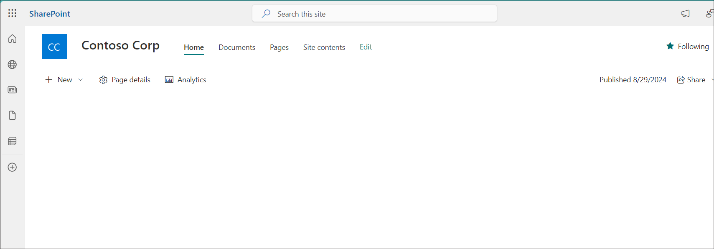
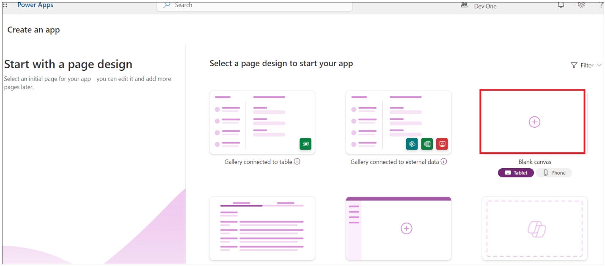
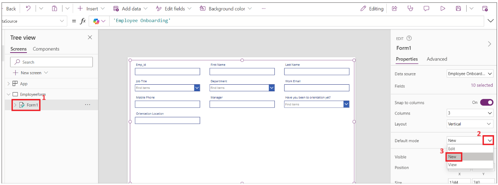
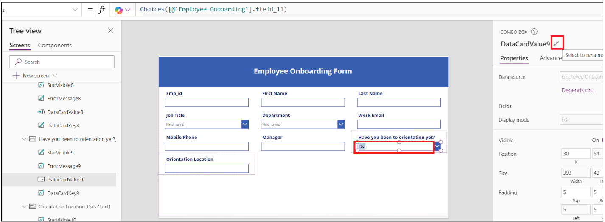
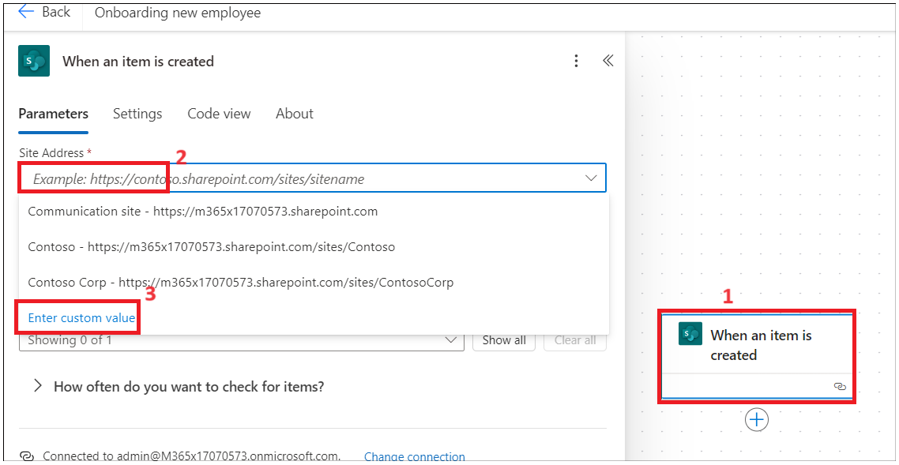

**ラボ１－新入社員のオンボーディングを自動化する**

**目的：**このラボの主な目的は、Microsoft Power Platform
を用いて従業員のオンボーディングプロセスを自動化する方法を参加者に指導することです。演習では、従業員と人事情報を保存するための
SharePoint リストの作成、Power Apps
でのデータ入力用フォームのカスタマイズ、Power Automate
を用いた自動化ワークフローの実装に焦点を当てます。参加者は、SharePoint
をデータ管理に活用する方法、Power Apps
を活用してユーザーエクスペリエンスを向上させる方法、そして自動化プロセスを統合してオンボーディングタスクを効率化する方法を学びます。このハンズオン演習を通して、参加者は組織内の人事プロセスを効果的に管理および自動化するための実践的なスキルを習得できます。

**所要時間：** 60分

**演習 1: Share Point
で従業員、人事、マネージャーのリストを作成します。**

**タスク 1: データバース環境の検証**

1.  ブラウザを開き、+++\*\*。office 365 tenant
    credentialでサインインします。

2.  左側のナビゲーションから**Environments**を選択します。下の画像に示すように、**Developer
    environment**が作成されているはずです。

> 

3.  このラボのすべての演習を実行するには、同じ開発者環境を使用します。

**タスク 2: SharePoint でサイトを作成する**

1.  +++**https:\office.com +++**に移動し、office 365
    tenantでサインインします。

2.  左上隅のマトリックスをクリックし、**apps**のリストから**SharePoint**を選択します。

> 
>
> 

3.  上部メニューの**+Create site**をクリックします。

> 

4.  **Create a site**ウィンドウで**Communication
    site**タイルを選択します。

> 

5.  下にスクロールして、**Blank**テンプレートを選択します。

> 

6.  **Use template**をクリックします。

> 

7.  サイト名と説明を入力し、**Next**ボタンをクリックします。

    - サイト名: +++ **Contoso Corp** +++

    - サイトの説明: +++**Onboarding new employee.**+++

> 

8.  デフォルトの言語をそのままにして、**Create Site**をクリックします。

> 
>
> 

**タスク 3: CSV ファイルから SharePoint サイトに従業員リストを作成する**

1.  **Home --\> New --\> List**をクリックします**。**

> 

2.  **Create a list** ウィンドウ**From CSV**タイルを選択します。

> 

3.  **Upload file**をクリックし、**C:\Lab
    Files**を参照して、**Employee.csv**ファイルを選択します。

> 

4.  **Work Email**の列タイプを**single line of
    text**に変更し、**Next**をクリックします。

> 

5.  名前に+++**Employee Onboarding**+++、説明に+++**New Contoso Corp
    employee**+++と入力し、**Create**をクリックします。

> 
>
> 

6.  従業員リストが作成されました。**Title**列の名前を**+++ Emp_id
    +++**に変更してください。

> 
>
> 

7.  従業員テーブルは次のようになります。

> 

8.  **Settings -\>List settings**をクリックします。

> 

9.  **Department**列のリンクをクリックします。

> 

10. 以下の値を変更し、**OK**をクリックします。

    - 列の種類:**Choice**

    - 記入の選択肢を許可する:**Yes**

> 

11. **Job title**列でも上記の手順を繰り返します

12. **「Have you been to orientation
    yet?」**列を選択し、以下の変更を行ってから**OK**をクリックします。

    - 列の種類:**Choice**

    - 「記入」の選択肢を許可する:**Yes**

    - 各選択肢を別々の行に入力してください:**Yes No**

> 

13. 以下のプロパティを使用して、**Orientation
    Location**について上記の手順を繰り返します。

    - 列の種類:**Choice**

    - 「記入」の選択肢を許可する:**Yes**

    - 各選択肢を別々の行に入力してください: **Redmon Reno**

> 

14. 以下のプロパティを持つ**Manager**列に対して上記の手順を繰り返します。

    - 列の種類:**Choice**

    - 「記入」の選択肢を許可する:**Yes**

> 

**タスク 4: CSV ファイルから SharePoint サイトに HR リストを作成する**

1.  **Home --\> New --\> List**をクリックします**。**

> 

2.  **Create a list window**から**From CSV tile**を選択します。

> 

3.  **file**アップロードをクリックし、**C:\Lab
    Files**を参照して**Import_HR_M365.CSV**を選択し、**Open**をクリックします。

> 

4.  **Work Email**の列タイプを**Single line of
    text**変更し、**Next**をクリックします。

> 

5.  以下の詳細を入力してください:

    - 名前: +++ **Contoso HR** +++

    - 説明: +++ **Contoso Human Resource**
      +++、次に**Create**ボタンをクリックします。

> 

6.  **Title --\> Column settings --\> Rename**列を +++ **Emp_id +++**
    に変更をクリックします。

> 
>
> 

7.  HR テーブルは、以下の画像のようになるはずです。

> 

**演習 2: SharePoint リスト用の Power Apps を作成する**

この演習では、従業員に公式情報を記載したメールを送信し、書類の記入とアップロードを依頼するアプリケーションを構築します。

**タスク 1: HR が入力できるように、PowerApps
を使用して従業員フォームをカスタマイズします。**

1.  **SharePoint --\> Employee onboarding**からURL
    をコピーし、メモ帳に保存します。

> 

2.  新しいタブを開き、++++\*\*
    [*https://make.powerapps.com/\*\*+++*にアクセスし](https://make.powerapps.com/**+++)、Office
    365 管理テナントでサインインして、 **Dev One** (開発者)
    環境を選択します。

> **注**：テナントによっては、環境名が異なる場合があります。選択した環境が**developer**環境であることを確認してください。

3.  左側のナビゲーションメニューから**Apps**をクリックします。**New App
    --\> Start with a page design**を選択します。

> 

4.  **Blank Canvas**タイルを選択します。

> 

5.  **Screen1**を右クリックして、**Rename**を選択します。

> 

6.  **HrEmployeeform**に変更します。

> 

7.  フォームを選択し、**Insert --\> Edit form**をクリックします。

> 

8.  **SharePoint**を検索し、**Select a data
    source**ドロップダウンから**SharePoint connector**を選択します。

> 

9.  **Connect**の下にある**SharePoint**を選択します**。**

> 

10. 手順 1 でコピーした**SharePoint list URL**を**Enter SharePoint
    URL**テキスト フィールドに入力し、**Connect**をクリックします。

> 

11. **Employee Onboarding**リストを選択し、**Connect**をクリックします。

> 

12. フォームをドラッグしてコンテナー内に収めます。

> 

13. Form1 コンテナーを少し下にドラッグし、**Insert --\>
    Rectangle**をクリックしてフォームにヘッダーを挿入します。

> 

14. コンテナの幅に合わせて長方形を調整します。**Insert --\> Text
    label**をクリックします。

> 

15. テキスト
    フィールドの幅を長方形に変更し、以下のプロパティを更新します。

    - **Tex: New Employee Onboarding Form**

    - **Font Size:** 27

    - **Font weight:** Bold

    - **Text alignment:** Centre

    - **Colour:** White

> 

16. **Emp_Id、First Name** 、 **Last_Name**を必須フィールドにします。

17. **Emp_Id**フィールドを選択し、**required**値を変更します。**プロパティ**の**Advanced**をクリックし、**Unlock
    to change properties**を変更します。

> 

18. 次に、 **Required** の値を true
    に設定します。**Emp_id**フィールドの横に星印が表示されます。

\

19. 上記の2つの手順を**First Name**と**Last_Name**に対して繰り返します。

20. \> Note: If you don’t see field then select the container -\>
    properties -\>

編集(フィールド)。フィールドを追加して順序を変更します。

\

20. 長方形フォーム/FormScreen1 を選択し、**Insert --\>
    Button**をクリックします。

> 

21. ボタンをフォームの
    **Department**フィールドの下にドラッグして配置し、以下のプロパティを更新します。

- **Text: Submit**

> 

22. **New Screen**をクリックし、**Success**テンプレートを選択します。

> 

23. 新しい画面を選択し、下の画像に示すように**rename** を**Success**に変更します。

> 

24. **Lb1Successmsg1**を選択し、テキストを**New employee
    added**に変更します。

> 

25. 次に、**Insert --\> Icons --\> Back arrow**をクリックします。

> 

26. 戻る矢印を選択し、以下のプロパティを設定します。

- ツールヒント:**Go Back**

- OnSelect: +++**Back(ScreenTransition.CoverRight)**+++

> 

27. **HrEmployeeform.**をクリックします。**Button**を選択し、
    **Onselect**を選択して、以下の数式を入力します。

> **注:** SharePoint フォームで数式を更新します。
>
> +++**SubmitForm(*Form1*);ResetForm(*Form1*);Navigate(*Success*)**+++
>
> 

28. **Form1**を選択し、
    **OnSuccess**を選択して、数式を以下の数式に置き換えます。

> +++**ResetForm(Self); RequestHide();Notify("New Employee
> added",NotificationType.Success)**+++
>
> 

29. **Save --\> Save
    as**をクリックし、名前に**EmpformforHr**と入力して、**Save**をクリックします。

> 

30. フォームを選択し、**Default**モードを**New**に変更して、**Save-\>** **Preview**アイコンをクリックします。 

> 

31. ランダムな**Emp id, First Name** **、Last
    Name**を入力し、**Submit**ボタンをクリックします。

> 

32. **New employee added
    message**というメッセージが表示されます。**Back**ボタンをクリックします。

> 

33. **Publish**ボタンをクリックし、**Publish this
    version**ボタンをクリックします。

> 

34. ブラウザでSharePointタブに戻ります。リストに追加した新しい従業員の従業員レコードが表示されます。

**タスク2: 従業員向けのオンボーディングキャンバスアプリを作成する**

1.  **SharePoint-\Employee onboarding**からURL
    をコピーし、メモ帳に保存します。

> 

2.  新しいタブを開き、++++
    [*https://make.powerapps.com/\*\*+++*にアクセスします](https://make.powerapps.com/**+++)。Office
    365 管理テナントでサインインし、**developer
    environment**を選択します。

3.  左側のナビゲーションメニューから**Apps**をクリックします。**New App
    -\> Start with a page design**を選択します。

> 

4.  **Blank Canvas** タイルを選択します。

> 

5.  **Screen1**を右クリックして、**Rename**を選択します。

> 

6.  **Employeeform**に名前を変更します。

> 

7.  **Insert**をクリックし、フォームの**Edit**を選択します。

> 

8.  **SharePoint**を検索し、**Select a data
    source**ドロップダウンから**SharePoint connector**を選択します。

> 

9.  **Add Connection**で**SharePoint**を選択します**。**

> 

10. 手順 1 でコピーした**SharePoint list URL**をSharePoint URL
    を入力テキスト フィールドに入力し、**Connect**をクリックします。

11. **Choose a list**の下で、**Employee
    Onboarding**を選択し、**Next**をクリックします。

> 

12. **Employee Onboarding**リストを選択し、**Connect**をクリックします。

> 

13. フォームをドラッグしてコンテナー内に収めます。

> 

14. **Form 1**を選択し、**Display**モードを**New**に設定します。

> 

15. Form1 コンテナーを少し下にドラッグし、**Insert -\>
    Rectangle**をクリックしてフォームにヘッダーを挿入します。

> 

16. コンテナーの四角形の幅を変更し、**Insert --\> Text
    label**を選択します。

> 

17. ラベルを選択し、以下の**properties**を設定します。

    - **Text: Employee Onboarding Form**

    - **Font Size: 25**

    - **Font weight: Bold**

    - **Text alignment: Centre**

    - **Colour: White**

> 

18. **Emp_Id**フィールド名を選択し、プロパティで**Font
    size**を**16**に、**Font weight**を**Bold**に変更します。

> 

19. すべてのフィールドに対して上記の手順を繰り返します。

> 

20. **Orientation location**項目を選択し、
    **Visible**プロパティを**false**に設定します。

> 

21. **Have you been to orientation yet**?テキスト
    フィールドを選択し、ラベルの**edit**をクリックします。

> 

22. ラベルの値を**Orientationdropdown**に変更します。

> 

23. **Orientation Location data
    card**を選択し、**Visible** を選択して、下の画像に示すように以下の数式を配置します。

> +++**If(*Orientationdropdown*.Selected.Value="No",true,false)**+++
>
> 

24. **Save**をクリックし、アプリ名として**EmployeeOnboardingForm**と入力して、**Save**ボタンをクリックします。

> 

25. **Emp_id** 、 **First Name** 、 **Last Name** 、 **Manager** はHR
    によって入力されるため、表示モードを**View**に変更します。

26. フィールドを選択し、**on Advanced --\> Unlock to change
    properties**、**Display
    mode**を**Parent.DisplayMode.View**に更新します。

> 
>
> 
>
> 
>
> 
>
> 

27. **Work email**のフィールド**Unlock
    property** を選択し、**Required**プロパティを**true**に更新します。必要に応じて、他のフィールドでもこの手順を繰り返します。

> 

28. **Form1**を選択し、
    **OnFailed**フィールドの値を次のように更新します。

> +++**Notify("Required Fields can't be
> empty.",NotificationType.Error)**+++
>
> 

29. **OnSuccess**を選択し、値を+++**Notify("Thank you for filling out
    the form",NotificationType.Success)**+++にします。

> 

30. それでは、フォームの最後に送信するボタンを追加しましょう。**Inset
    --\> Button**をクリックします。

> 

31. ボタンのプロパティを変更し、フォームを保存します。

    - Text: **Submit.**

    - Onselect: +++**SubmitForm(*Form1*);NewForm(*Form1*)**+++

> 

32. **Save**をクリックし、アプリの**Preview**ボタンをクリックします。

> 

33. 詳細を入力して、**Submit**をクリックします。

> 

34. 成功通知が表示されます。

> 

35. プレビューウィンドウを閉じます。

36. **Tree
    View**から**App**をクリックします。OnStartを選択し**、**以下の数式を入力します。

37. Set(

38. 

39.     onboardinglistitem,

40. 

41.     LookUp(

42. 

43.         'Employee Onboarding',

44. 

45.         ID = Value(Param("ItemID"))

46. 

47.     )

48. 

49. )

> 

50. **Tree
    View**から**Form1**を選択します。itemを選択し、値を次のように入力します:
    **onboardinglistitem**

> 

51. **Save**して**Publish --\> Publish this version**をクリックします。

> 

52. **Power Apps Home**ページに戻り、**Apps --\> Your app --\>
    Details**をクリックします。

> 

53. 次のタスクで使用するために Web リンクをコピーします。

> 

54. プレビュー ウィンドウを閉じて、SharePoint
    タブに移動し、リスト内の上記のレコードを確認します。

> 

**タスク 3: 新しい従業員にフォームを送信する Power Automate
フローを作成する**

1.  **SharePoint**タブに戻り、URL をコピーします。

> 

2.  新しいタブを開き、https:\flow.microsoft.comにアクセスして、管理者テナント
    アカウントでサインインします。

3.  **developer environment**を選択します。

4.  左側のナビゲーション メニューから**Flows**をクリックし、**New Flow
    --\> Automated Cloud flow**をクリックします。

> 

5.  フロー名を**Onboarding new employee**と入力します。**「When an item
    is created」**を検索して SharePoint
    から選択し、**create**をクリックします。

> 

6.  アクションを選択します。**Site Address --\> Enter custom
    value**を入力します。

> 

7.  手順 1 でコピーした住所を入力し、下の画像に示すように**Employee
    Onboarding**リストを選択します。

> 

8.  新しいアクションを追加するには、**+**をクリックします。

> 

9.  **Send an email (V2)**を検索して選択する。

> 

10. テキスト フィールドをクリックし、**Enter the data from previous
    step**を選択します。

> 

11. **Work email**を選択します**。**

> 

12. 件名に**Welcome to Firm**と入力し、前の手順で選択した**First
    Name**を選択します。

> 

13. メール本文に以下のデータを入力してください。画像のように動的な値を挿入してください。

> Hi first name Lastname,
>
> オンボーディングフォームを完了するには、以下のリンクをクリックしてください。
>
> 
>
> 

14. タスク 2 でコピーした Web
    リンクを入力し、リンクの末尾に**&itemID=**を追加して、下の画像に示すように動的
    ID を選択します。

> 
>
> 

15. リンクを切り取って、**Onboarding
    Form**というテキストを入力し、リンク
    アイコンを選択してクリックします。上記の手順でコピーしたリンクを貼り付けます。

> 

16. 今すぐフローを保存します。

> 
>
> 

**タスク 4: フローをテストする。**

1.  **Power Apps tab**に戻り、 **EmpformforHr**アプリを選択します。

> 

2.  要求された場合は、権限を許可します。

> 

3.  フォームに詳細を入力してください。admin tenant
    idとして職場のメールアドレスを入力し、フォームを**submit**してください。

> 
>
> 

4.  Power Automate フローに戻り、フローの状態を確認します。

> 
>
> 

5.  新しいタブを開き、+++**https:\outlook.com**+++にアクセスしてOffice
    365 tenant
    accountでサインインし、受信トレイを確認してください。人事部から送信されたメール内の**Onboarding
    Form**リンクをクリックしてください。

> 

**まとめ：**このラボを完了すると、参加者はMicrosoft Power
Platformツールを使用して従業員オンボーディングワークフローを作成および管理する方法を包括的に理解できるようになります。従業員データを保存するためのSharePointリストを作成および構成し、人事部門向けにカスタマイズされたPower
Appsフォームを構築し、新入社員とのシームレスなコミュニケーションを実現するPower
Automateの自動フローを設定することができます。この経験を通して、参加者は組織のオンボーディングプロセスを強化し、データの精度を向上させ、人事管理におけるより効率的なワークフローを促進できるようになります。全体として、このラボは、実際のシナリオに適用してビジネスオペレーションを最適化するための貴重なスキルを参加者に提供します。
