**Laboratorio 1 – Automatice el Onboarding de un nuevo empleado**

**Objetivo:** El objetivo principal de este laboratorio es guiarle en
automatizar el proceso de incorporación de los empleados mediante
Microsoft Power Platform. Los ejercicios se centran en crear listas
SharePoint para almacenar la información de los empleados y de recursos
humanos, personlizar formularios en Power Apps para data entry, e
implementar los workflows automatizados mediante Power Automate. Usted
aprenderá a aprovechar SharePoint para la gestión de datos, utilice
Power Apps para mejorar la experiencia de usuario, e integrar los
procesos automatizados para agilizar las tareas de onboarding. Esta
experiencia práctica pretende habilitar a los participantes con
habilidades prácticas para gestionar y automatizar los procesos de RRHH
dentro de sus organizaciones.

**Duración estimada:** 60 minutos

Ejercicio 1: Cree listas de empleados, recursos humanos, y gerentes en
Share point.

Tarea 1: Verificar su Dataverse environment

1.  Abra un navegador y vaya a +++\*\*. Inicie sesión con sus office 365
    tenant credentials.

2.  Seleccione **Manage** \> **Environments** en la parte izquierda. Se
    debe haber creado el **Dev One** Developer environment como se ve en
    la imagen.

> 

3.  Use el mismo developer environment para ejecutar todos los
    ejercicios de este laboratorio.

Tarea 2: Cree un sitio en SharePoint

1.  Navegue a +++**https:\office.com**+++ e inicie sesión con su office
    365 tenant.

2.  Haga clic en matrix en la esquina superior izquierda y
    seleccione **SharePoint** desde la lista de **aplicaciones**.

> 
>
> 

3.  Haga clic en **+Create site** en el menú superior.

> 

4.  Seleccione la opción **Communication site** en la ventana **Create a
    site**.

> 

5.  Baje y seleccione **Blank** template.

> 

6.  Haga clic en **Use template**.

> 

7.  Introduzca Site name y description y haga clic en el botón **Next**.

    - Site Name: +++**Contoso Corp**+++

    - Site Description: +++**Onboarding new employee.**+++

> 

8.  Mantenga el default language y haga clic en **Create Site.**

> 
>
> 

Tarea 3: Cree un Employees list en el sitio SharePoint desde un CSV file

1.  Haga clic en **Home --\> New --\> List.**

> 

2.  Seleccione **From CSV** desde la ventana **Create a list**.

> 

3.  Haga clic en **Upload file** y navegue a **C:\Lab Files** y
    seleccione **Employee.csv** file.

> 

4.  Cambie el **Work Email** column type a **single line of text** y
    haga clic en **Next**.

> 

5.  Introduzca el Name como: +++**Employee Onboarding**+++ y
    Description: +++**New Contoso Corp employee**+++ y haga clic
    en **Create**.

> 
>
> 

6.  Se ha creado el Employees list. Renombre la columna **Title** a
    +++**Emp_id**+++ al seleccionar **Title drop-down** \> **Column
    settings** \> **Rename**.

> 
>
> 

7.  Ahora la tabla employee debe aparecer así

> 

8.  Haga clic en **Settings -\>List settings.**

> 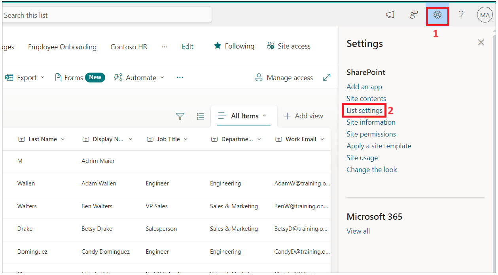

9.  Haga clic en el enlace en la columna **Department**.

> 

10. Cambie los siguientes valores y haga clic en **Ok**.

    - Type of Column : **Choice**

    - Allow 'Fill-in' choices: **Yes**

> 

11. Repita el paso anterior para la columna **Job title**

12. Seleccione la columna **Have you been to orientation yet?**, haga
    los siguientes cambios y haga clic en **OK**.

    - Type of Column : **Choice**

    - Allow 'Fill-in' choices: **Yes**

    - Type each choice on a separate line : **Yes No**

> 

13. Repita el paso anterior para **Orientation Location** con los
    siguientes valores

    - Type of Column : **Choice**

    - Allow 'Fill-in' choices: **Yes**

    - Type each choice on a separate line: **Redmon Reno**

> 

14. Repita el paso anterior para la columna **Manager** con los
    siguientes valores

    - Type of Column : **Choice**

    - Allow 'Fill-in' choices: **Yes**

> 

15. Haga clic en **Home** para volver al **Sitio.**

Tarea 4: Cree una lista HR en el sitio SharePoint desde CSV file

1.  Haga clic en **Home --\> New --\> List.**

> 

2.  Seleccione **From CSV tile** desde **Create a list window.**

> 

3.  Haga clic en Upload **file**, busque en **C:\Lab Files** y
    seleccione **Import_HR_M365.CSV** y haga clic en **Open**.

> 

4.  Cambie el **Work Email** column type a **Single line of text** y
    haga clic en **Next**.

> 

5.  Introduzca los siguientes detalles

    - Name : +++**Contoso HR**+++

    - Description : +++**Contoso Human Resource**+++, y haga clic en el
      botón **Create**.

> 

6.  Haga clic en **Title --\> Column settings --\> Rename column** a
    +++**Emp_id**+++.

> 
>
> 

7.  El HR table se debe ver así.

> 

Ejercicio 2: Cree Power Apps para las listas SharePoint

En este ejercicio, construirá su aplicación para mandar un email a un
empleado con información oficial pidiéndole que rellene y suba los
documentos.

Tarea 1: Personalice el formulario del empleado con PowerApps para el
RRHH.

1.  Desde su **SharePoint --\> Employee onboarding**, copie el URL y
    guárdelo en un Notepad.

> 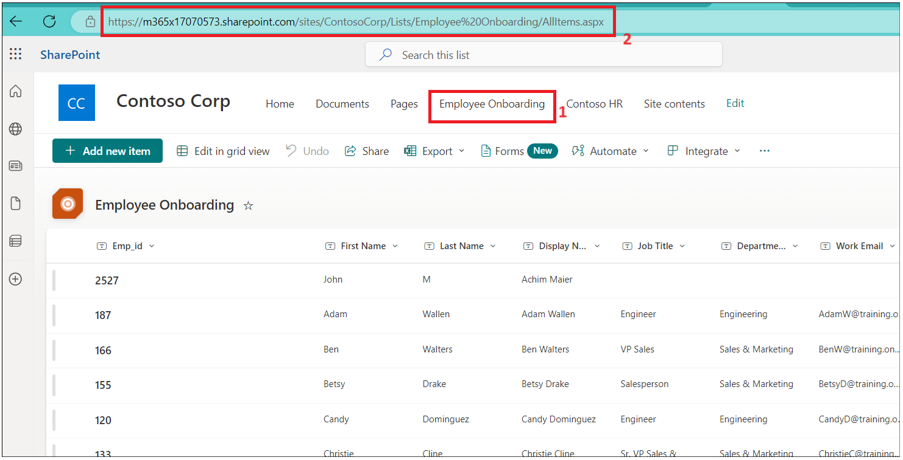

2.  Abra una nuva pestaña y vaya a
    +++\*\*[*https://make.powerapps.com/\*\*+++*](https://make.powerapps.com/**+++) Inicie
    sesión con sus office 365 admin tenant credentials y seleccione
    su **Dev One** (Developer) environment. Por ahora, **deshabilite**
    el botón de alternancia que dice ‘Try the new Power Apps experience’

> 

3.  Haga clic en **Apps** desde el menú izquierdo. Seleccione **New App
    --\> Start with a page design.**

> 

4.  Seleccione el **Blank Canvas** tile.

> 

5.  Haga clic derecho en **Screen1** y seleccione **Rename.**

> 

6.  Renombre a **HrEmployeeform**

> 

7.  Seleccione el formulario y haga clic en **Insert --\> Edit form.**

> 

8.  Busque **SharePoint** y seleccione **SharePoint
    connector** desde **Select a data source** dropdown.

> 

9.  Seleccione **SharePoint** en **Connect.**

> 

10. Introduzca el **SharePoint list URL** copiado en el paso 1 en el
    campo de texto **Enter SharePoint URL** y haga clic en **Connect**.

> 

11. Seleccione **Employee Onboarding** list y haga clic en **Connect**.

> 

12. Arrastre y llene el form en el container.

> 

13. Arrastre el Form1 container un pppoco abajo y haga clic en **Insert
    --\> Rectangle** para insertar el header en el form.

> 

14. Ajuste el rectángulo al ancho de container. Haga clic en **Insert
    --\> Text label**.

> 

15. Cambie el ancho del text field al rectángulo y actualice los
    siguientes valores.

    - **Tex: New Employee Onboarding Form**

    - **Font Size:** 27

    - **Font weight:** Bold

    - **Text alignment:** Centre

    - **Colour:** White

> 

16. Haga **Emp_Id, First Name** and **Last_Name** como los required
    fields.

17. Seleccione el campo **Emp_Id** y cambie el valor **required**. Haga
    clic en **Advanced** en **Properties** y selecccione **Unlock to
    change properties**.

> 

18. Ahora establezca el valor **Required** a true. Debería aparecer una
    estrella junto a **Emp_id** field.

> 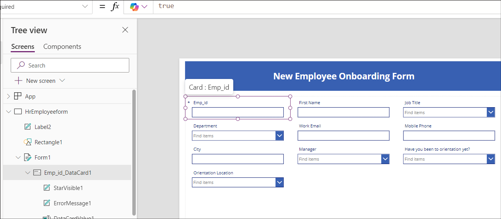

19. Repita los dos pasos anteriores para **First Name** y **Last_Name**

> **Note**: If you don’t see field then select the container -\>
> properties -\> Edit( fields) .add field y reordene.
>
> 

20. Seleccione el Rectangular form/FormScreen1 y haga clic en **Insert
    --\> Button**.

> 

21. Arrastre y deje el botón en el campo **Department** en el form y
    actualice los siguientes valores.

> **Text: Submit**
>
> 

22. Haga clic en **New Screen** y seleccione **Success** template.

> 

23. Seleccione la nueva pantalla y **renombre** a **Success** como se ve
    aquí.

> 

24. Seleccione **Lb1Successmsg1** y cambie el texto a **New employee
    added**.

> 

25. Ahora, haga clic en **Insert --\> Icons --\> Back arrow.**

> 

26. Seleccione Back Arrow y establezca los siguientes valores.

- Tool Tip: **Go Back**

- OnSelect: +++**Back(ScreenTransition.CoverRight)**+++

> 

27. Haga clic en **HrEmployeeform.** Seleccione **Button** y
    seleccione **Onselect** e introduzca el siguiente formula.

> **Ojo:** Actualice el formula con su SharePoint Form.
>
> +++**SubmitForm(*Form1*);ResetForm(*Form1*);Navigate(*Success*)**+++
>
> 

28. Seleccione **Form1,** seleccione **OnSuccess** y reemplace el
    formula con el siguiente formula.

> +++**ResetForm(Self); RequestHide();Notify("New Employee
> added",NotificationType.Success)**+++
>
> 

29. Haga clic en **Save --\> Save as** e introduzca el name
    como **EmpformforHr** y haga clic en **Save**.

> 

30. Seleccione el form y cambie el **Default** mode a **New** y haga
    clic en el **Save -\>** **Preview**.

> 

31. Introduzca **Emp id, First Name** y **Last Name** aleatorios y haga
    clic en el botón **Submit**.

> 

32. Debería ver **New employee added message.** Haga clic en el
    botón **Back**\*\*.\*\*

> 

33. Haga clic en el botón **Publish** y haga clic en el botón **Publish
    this version**.

> 

34. Vuelva a la pestaña SharePoint en el navegador. Debe ver el employee
    record del nuevo empleado que agregó en la lista.

Tarea 2: Cree employee onboarding Canvas app para el empleado

1.  Desde su **SharePoint-\Employee onboarding**, copie el URL y
    guárdelo en el Notepad.

> 

2.  Abra una nueva pestaña y vaya a
    +++\*\*[*https://make.powerapps.com/\*\*+++*](https://make.powerapps.com/**+++).
    Inicie sesión con su office 365 admin tenant y seleccione
    su **developer environment**.

3.  Haga clic en **Apps** desde el menú izquierdo. Seleccione **New App
    -\> Start with a page design.**

> 

4.  Seleccione **Blank Canvas** tile.

> 

5.  Haga clic derecho en **Screen1** y seleccione **Rename.**

> 

6.  Renombre a **Employeeform**

> 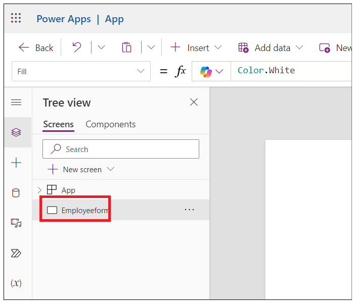

7.  Haga clic en **Insert** y seleccione **Edit** **form**.

> 

8.  Busque **SharePoint** y seleccione **SharePoint
    connector** desde **Select a data source** dropdown.

> 

9.  Seleccione **SharePoint** en **Add Connection.**

> 

10. Introduzca el **SharePoint list URL** copiado desde el paso 1 en el
    campo de texto Enter SharePoint URL y haga clic en **Connect**.

11. En **Choose a list** --\> seleccione **Employee Onboarding** list y
    haga clic en **Next.**

> 

12. Seleccione **Employee Onboarding** list y haga clic en **Connect**.

> 

13. Arrastre y lleme el form en el container.

> 

14. Seleccione **Form 1** y **Display** mode a **New** en properties.

> 

15. Arrastre el Form1 container un poco abajo y haga clic en **Insert
    -\> Rectangle** para insertar el header en el form.

> 

16. Cambie el ancho del rectángulo al container y seleccione **Insert
    --\> Text label**.

> 

17. Seleccione el Label y establezca los siguientes **properties.**

    - **Text: Employee Onboarding Form**

    - **Font Size: 25**

    - **Font weight: Bold**

    - **Text alignment: Centre**

    - **Colour: White**

> 

18. Seleccione the **Emp_Id** field name y cambie **Font
    size** a **16** y **Font weight** a **Bold** en Properties. Si no
    encuentra **Emp_Id**, flote el mouse sobre **Form1** en el canvas,
    seleccione **Fields** \> **Add fields**, seleccione **Emp_Id** (si
    tampoco ve **Emp_Id** en la lista, seleccione **Title**) y
    seleccione **Add**

> 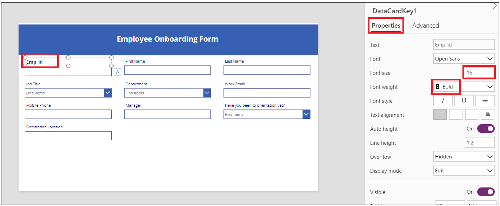

19. Repita el paso anterior para todos los campos.

> 

20. Seleccione **Orientation location** item y establezca
    **Visible** property a **false.**

> 

21. Seleccione **Have you been to orientation yet**? text field y haga
    clic en **edit** label.

> 

22. Cambie el label value a **Orientationdropdown**

> 

23. Seleccione **Orientation Location data card** y
    seleccione **Visible** y deje el siguiente formula como se ve en la
    imagen.

> +++**If(*Orientationdropdown*.Selected.Value="No",true,false)**+++
>
> 

24. Haga clic en **Save** e introduzca el app name
    como: **EmployeeOnboardingForm** y haga clic en el botón **Save**.

> 

25. **Emp_id**, **First Name**, **Last Name** y **Manager** serán
    rellenados por el HR, pues cambie el display mode a **View**.

26. Seleccione el field y haga clic en **Advanced --\> Unlock to change
    properties** y actualice **Display
    mode** a **Parent.DisplayMode.View**

> 
>
> 
>
> 
>
> 

27. Seleccione el **Work email** Field **Unlock property** y
    actualice **Required** property a **true.** Repita para otros campos
    si es necesario.

> 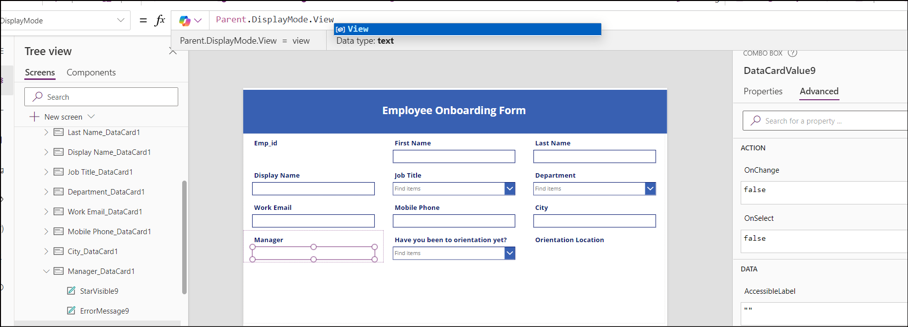

28. Seleccione el **Form1** y actualice **OnFailed** field value a

> +++**Notify("Required Fields can't be
> empty.",NotificationType.Error)**+++
>
> 

29. Seleccione **OnSuccess** y establezca el valor a

> +++**Notify("Thank you for filling out the
> form",NotificationType.Success)**+++
>
> 

30. Ahora, agreguemos un botón para submit al final del form. Haga clic
    en **Insert --\> Button.**

> 

31. Cambie los Properties del botón y guarde el form.

    - Text: **Submit.**

    - Onselect: +++**SubmitForm(*Form1*);NewForm(*Form1*)**+++

> 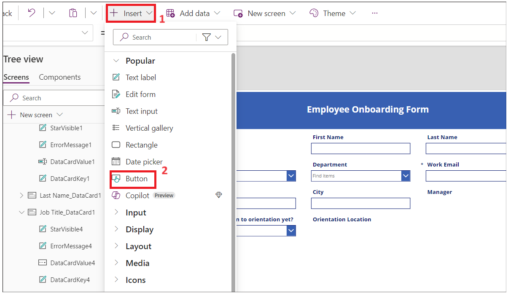

32. Haga clic en **Save** y luego en **Preview** app buttons.

> 

33. Introduzca los detalles y haga clic en **Submit**.

> 

34. Debería aparecer una notificación de éxito.

> 

35. Cierre la ventana preview.

36. Haga clic en **App** desde **Tree View**. Seleccione **OnStart** e
    introduzca el siguiente formula.

> Set(
>
>     onboardinglistitem,
>
>     LookUp(
>
>         'Employee Onboarding',
>
>         ID = Value(Param("ItemID"))
>
>     )
>
> )
>
> 

37. Seleccione el **Form1** desde **Tree View**. Seleccione el elemento
    e introduzca el valor como: **onboardinglistitem**

> 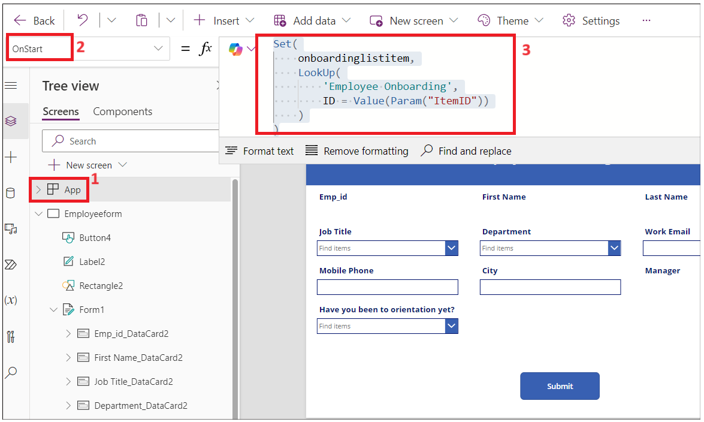

38. Haga clic en **Save** y **Publish --\> Publish this version**.

> 

39. Vuelva a la página **Power Apps Home**, haga clic en **Apps --\>
    Your app --\> Details**.

> 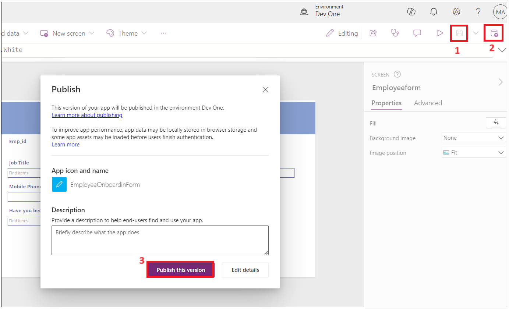

40. Copie el Weblink para usarlo en la siguiente tarea.

> 

41. Cierre la ventana preview y navegue a su pestaña SharePoint y
    averigüe el record en la lista.

> 

Tarea 3: Cree Power Automate flow para mandar un form al nuevo empleado

1.  Vuelva a **SharePoint** y copie el URL.

> 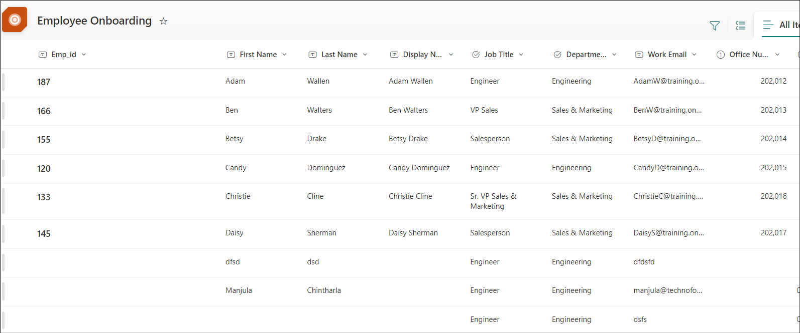

2.  Abra una nueva pestaña y vaya a
    +++https://make.powerautomate.com/+++ e inicie sesión con su cuenta
    admin tenant.

3.  Seleccione su **Dev One** developer environment.

4.  Haga clic en **My flows** desde el menú izquierdo, haga clic
    en **New Flow --\> Automated Cloud flow.**

> 

5.  Introduzca el flow name como: **Onboarding new employee**.
    Busque **When an item is created** y selecciónelo desde SharePoint y
    haga clic en **create**.

> 

6.  Seleccione el action. Haga clic en **Site Address --\> Enter custom
    value.**

> 

7.  Introduzca el Address copiado en el paso 1 y seleccione **Employee
    Onboarding** list como se ve en la imagen.

> 

8.  Haga clic en **+** para agregar un nuevo action.

> 

9.  Busque y seleccione **Send an email (V2)**

> 

10. Haga clic en text field y seleccione **Enter the data from previous
    step**.

> 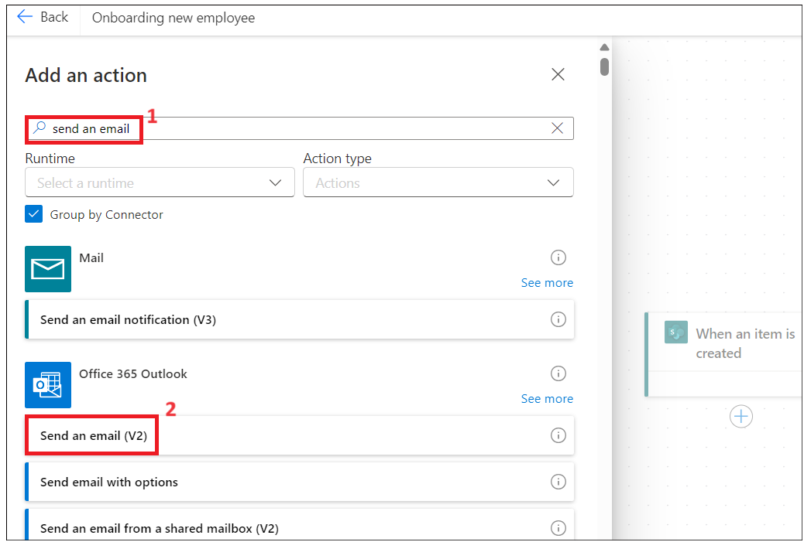

11. Seleccione **Work email.**

> 

12. Introduzca el subject line como: **Welcome to
    Firm** seleccione **First Name** desde el paso anterior.

> 

13. Introduzca los siguientes datos en el Body del email. Inserte
    dynamic values como se ve en la imagen.

> Hi first name Lastname,
>
> Please click on link below to complete your onboarding form.
>
> 
>
> 

14. Introduzca el Weblink copiado en la tarea 2 – y
    agregue **&itemID=** en el final del enlace y seleccione Dynamic ID
    como se ve en la imagen.

> 
>
> 

15. Corte el enlace e introduzca el texto: **Onboarding Form** y
    seleccione y haga clic en el ícono. Pegue el enlace copiado en el
    paso anterior.

> 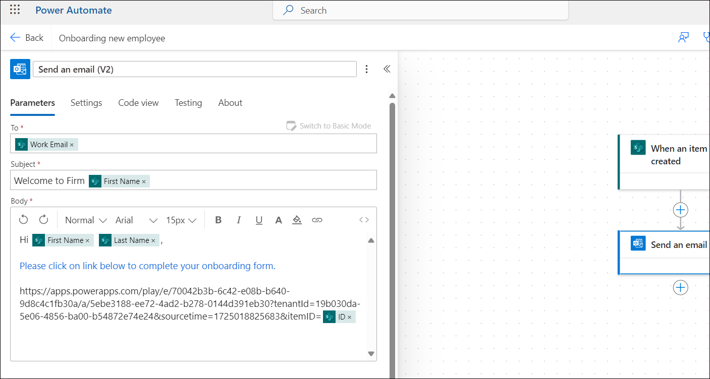

16. Guarde el flow ahora.

> 
>
> 

Tarea 4: Pruebe el flow.

1.  Vuelva a **Power Apps**, seleccione **EmpformforHr** app.

> 

2.  SI le pide, haga allow permissions.

> 

3.  Rellene el formulario con sus detalles. Introduzca el work email
    como su admin tenant id y haga **submit** en el form.

> 
>
> 

4.  Vuelva a Power Automate flow y averigüe el flow Status.

> 
>
> 

5.  Abra una nueva pestaña y vaya a +++**https:\outlook.com**+++ e
    inicie sesión con su cuenta Office 365 tenant y vea el inbox. Haga
    clic en el enlace **Onboarding Form** en el email generado por HR.

> 

**Conclusión:** Al completar este laboratorio, los participantes habrán
desarrollado una comprensión integral de cómo crear y administrar
workflow de incorporación de empleados utilizando las herramientas de
Microsoft Power Platform. Crearán y configurarán con éxito listas de
SharePoint para almacenar datos de empleados, crearán formularios
personalizados de Power Apps para uso de RRHH y configurarán flujos
automatizados de Power Automate para una comunicación fluida con los
nuevos empleados. Esta experiencia permitirá a los participantes mejorar
sus procesos de incorporación organizacional, mejorar la precisión de
los datos y fomentar un workflow más eficiente en la gestión de recursos
humanos. En general, el laboratorio equipa a los participantes con
habilidades valiosas que se pueden aplicar en escenarios del mundo real
para optimizar las operaciones comerciales.
