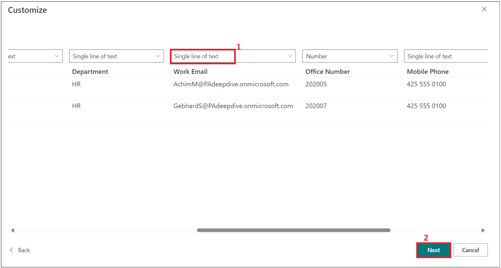
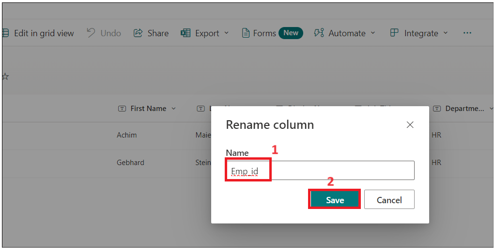
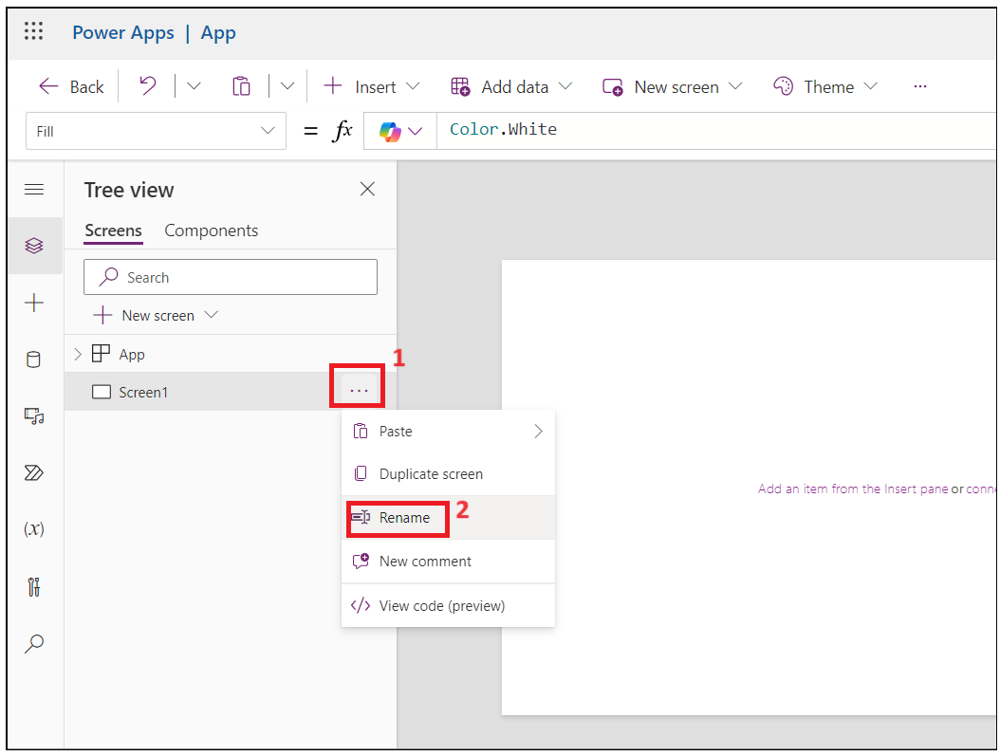
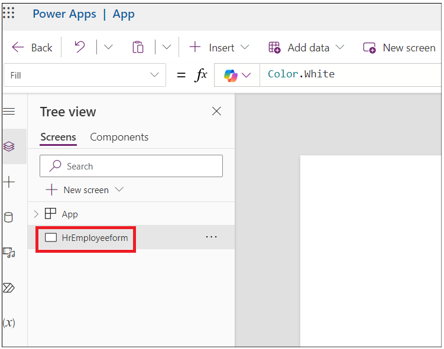
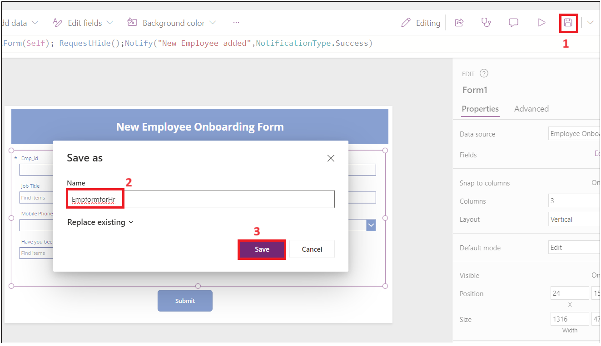
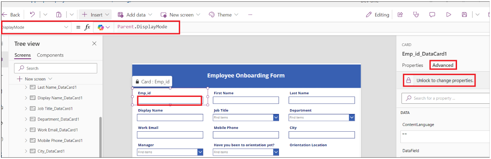
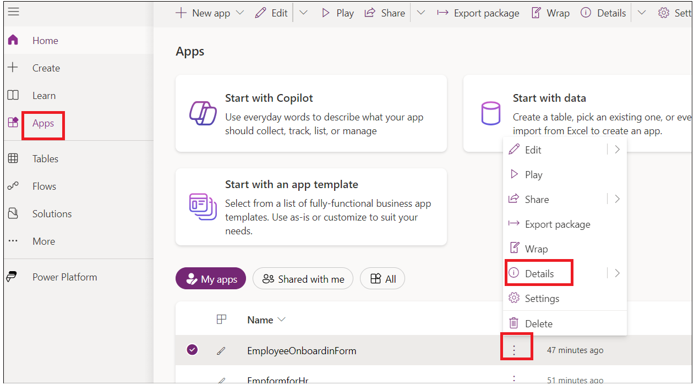

# **实验 1 - 新员工自动入职**

**目标：** 本实验室的主要目标是指导参与者使用 Microsoft Power Platform
自动化员工入职流程。这些练习的重点是创建 SharePoint 列表来存储员工和 HR
信息、在 Power Apps 中自定义表单以进行数据输入，以及使用 Power Automate
实施自动化工作流。参与者将学习利用 SharePoint 进行数据管理，利用 Power
Apps
增强用户体验，并集成自动化流程以简化入职任务。这种实践经验旨在使参与者具备实用技能，以有效管理和自动化其组织内的
HR 流程。

**预计时间：** 60 分钟

# 练习 1：在 Share point 中创建员工、人力资源和经理列表。

## 任务 1：验证您的 Dataverse 环境

1.  打开浏览器并转到
    **+++https://admin.powerplatform.microsoft.com+++**。使用 Office 365
    租户凭据登录。

2.  选择 **Manage** \> **Environments** 在左侧导航栏中。 **Dev One**
    Developer 环境应该已为您创建，如下图所示。

- 

3.  使用相同的开发人员环境执行此实验室的所有练习。

## 任务 2：在 SharePoint 中创建网站

1.  导航到 **+++https：\office.com+++** 并使用 office 365 tenant。

2.  单击左上角的 matrix，然后从**应用程序**列表中选择 **SharePoint**。

- 

  

3.  点击 顶部菜单上的 +Create site。

- 

4.  在**“Create a site**”窗口中选择**“Communication site**”。

- 

5.  向下滚动并选择 **Blank** template。

- 

6.  单击 **Use template**。

- 

7.  输入站点名称和描述，然后单击 **Next** 按钮.

    - 站点名称: +++**Contoso Corp**+++

    - 网站描述: +++**Onboarding new employee.**+++

- 

8.  保留默认语言，然后单击 **Create Site。**

- 

  

## 任务 3：从 CSV 文件在 SharePoint 站点中创建员工列表

1.  单击 **Home –\> New –\> List。**

- 

2.  从 **Create a list** 窗口中选择 **From CSV tile**。

- 

3.  单击 **Upload file** 并浏览到 **C：Files** 并选择 **Employee.csv**
    file。

- 

4.  将 **Work Email** 列类型更改为 **Single line of text** ，然后单击
    **Next**。

- 

5.  然后输入名称为：**+++ Employee Onboarding+++**，如果询问，请输入
    描述：**+++New Contoso Corp employee+++**，然后单击 **Create**。

- 

  

6.  现在已为您创建 Employees 列表。通过选择 **Title drop-down \> Column
    settings \> Rename，**将 **Title** 列重命名为 **+++Emp_id+++**。

- 

  

7.  现在 employee 表应该像这样

- 

8.  单击 **Settings -\>List settings。**

- 

9.  单击 **Department** 列链接。

- 

10. 更改以下值，然后单击 **Ok**。

    - 列类型 : **Choice**

    - 允许 “Fill-in” 选项: **Yes**

- 

11. 对 **Job title** 列重复上述步骤。

12. 选择 **Have you been to orientation yet?** 列并制作到 chagnes
    下面，然后单击 **OK。**

    - 列类型 : **Choice**

    - 允许 “Fill-in” 选项: **Yes**

    - 在单独的行中键入每个选项 : **Yes No**

- 

13. 对 **Orientation Location** with below properties
    重复上述步骤，然后选择 **Ok**。

    - 列类型 : **Choice**

    - 允许 “Fill-in” 选项: **Yes**

    - 在单独的行中键入每个选项 : **Redmon Reno**

- 

14. 对 **Manager** 列重复上述步骤 ，并添加以下属性，然后选择 **Ok**.

    - 列类型 : **Choice**

    - 允许 “Fill-in” 选项: **Yes**

- 

15. 单击 **Home** 返回 **Site**。

- 

## 任务 4：从 CSV 文件在 SharePoint 网站中创建 HR 列表

1.  单击 **Home –\> New –\> List。**

- 

2.  从 **Create a list window** 中选择 **From CSV tile。**

- 

3.  单击 Upload **file** 并浏览 **C：Files** 并选择
    **Import_HR_M365.CSV** 然后单击 **Open**。

- 

4.  将 **Work Email** 列类型更改为 **Single line of text**，然后单击
    **Next**。

- 

5.  输入以下详细信息

    - 名字 : +++**Contoso HR**+++

    - 描述 : +++**Contoso Human Resource**+++, 然后点击 **Create**
      按钮。

- 

6.  单击 **Title –\> Column settings –\> Rename** 为 **+++Emp_id+++。**

- 

  

7.  HR 表现在应如下图所示。

- 

# 练习 2：创建 Power Apps for SharePoint 列表

在本练习中，您将构建应用程序，向员工发送一封包含官方信息的电子邮件，并要求他填写和上传文档。

## 任务 1：使用 PowerApps 自定义员工表单，供 HR 填写。

1.  从 **SharePoint –\> Employee onboarding**，复制 URL
    并将其保存在记事本中。

- 

2.  打开一个新选项卡并转到
    **+++https://make.powerapps.com/+++**。使用您的 Office 365
    管理员租户登录，然后选择您的 **Dev One** （Developer） 环境。现在，
    请 **disable** 显示“Try the new Power Apps experience”的切换按钮。

- 

3.  单击 左侧导航菜单中的 Apps。选择 **New App – \> Start with a page
    design.**

- 

4.  选择 **Blank Canvas** 磁贴。

- 

5.  右键单击 **Screen1** 并选择 **Rename。**

- 

6.  重命名为 **HrEmployeeform**

- 

7.  选择表单，然后单击 **Insert –\> Edit form。**

- 

8.  搜索 **SharePoint**，然后从 **Select a data source** 下拉列表中选择
    **SharePoint connector**。

- 

9.  在 **Connect** 下选择 **SharePoint。**

- 

10. 在“**Enter SharePoint URL**”文本字段中输入复制的表单步骤 1 的
    **SharePoint list URL**，然后单击“**Connect**”。

- 

11. 选择 **Employee Onboarding list** ，然后单击 **Connect** 。

- 

12. 将表单拖拽并放入容器中。

- 

13. 将 Form1 容器向下拖动一点，然后单击 **Insert –\> Rectangle**
    以将标题插入表单。

- 

14. 将矩形调整为容器宽度。单击 **Insert –\> Text label**。

- 

15. 将文本字段的宽度更改为矩形并更新以下属性。

    - **Tex: New Employee Onboarding Form**

    - **Font Size:** 27

    - **Font weight:** Bold

    - **Text alignment:** Centre

    - **Colour:** White

- 

16. 将 **Emp_Id、 First Name** 和 **Last_Name** 作为必填字段。

17. 选择 **Emp_Id** 字段并更改 value **required**。单击 **Properties**
    下的 **Advanced**，然后选择 **Unlock to change properties**。

- 

18. 现在，将 **Required** 值设置为 true。您应该会在字段**Emp_id next**
    看到 star 。

- 

19. 对 **First Name** 和 **Last_Name** 重复上述两个步骤

> **注意**：如果您没有看到字段，请选择container -\> properties -\>
> Edit（ fields） .add 字段并重新排序。

- 

20. 选择 Rectangular form/FormScreen1，然后单击 **Insert –\> Button**。

- 

21. 将按钮拖放到 表单中的**Department**下，并更新下面的属性。

- **Text**: **Submit**

  

22. 单击 **New Screen** 并选择 **Success** template。

- 

23. 选择新屏幕并 **rename** 为 **Success** ，如下图所示。

- 

24. 选择 **Lb1Successmsg1** 并将文本更改为 **New employee added**。

- 

25. 现在，单击 **Insert –\> Icons –\> Back 箭头。**

- 

26. 选择 Back Arrow 并设置以下属性。

- Tool Tip: **Go Back**

- OnSelect: +++**Back(ScreenTransition.CoverRight)**+++

&nbsp;

- 

27. 单击 **HrEmployeeform。** 选择 **Button** 并选择 **Onselect**
    并输入以下公式。

> **注意：** 使用 SharePoint 表单更新公式。

- +++**SubmitForm(*Form1*);ResetForm(*Form1*);Navigate(*Success*)**+++

  

28. 选择 **Form1，** 选择 **OnSuccess** 并将公式替换为以下公式。

- +++**ResetForm(Self); RequestHide();Notify(“New Employee
  added”,NotificationType.Success)**+++

  

29. 单击 **Save – \> Save as** 按钮，输入名称 **EmpformforHr**，然后单击
    **Save**。

- 

30. 选择表单并将 **Default** 模式 更改为 **New** ，然后单击 **Save -\>
    Preview** 图标。

- 

31. 输入随机的 **Emp ID、First Name** 和 **Last Name**，然后单击
    **Submit** 按钮。

- 

32. 您应该会看到 **New employee added message。** 点击 **Back**
    按钮**。**

- 

33. 单击 **Publish** 按钮，然后单击 **Publish this version** 按钮。

- 

34. 返回到浏览器中的 SharePoint
    选项卡。您应该会在列表中看到您添加的新员工的 employee 记录。

## 任务 2：为员工创建员工入职 Canvas 应用程序

1.  从 **SharePoint-onboarding**中，复制 URL 并将其保存在记事本中。

- 

2.  打开一个新选项卡并转到
    **+++https://make.powerapps.com/+++**。使用您的 Office 365
    管理员租户登录，然后选择您的 **Dev One** 开发人员环境。

3.  单击 左侧导航菜单中的 Apps。选择 **New App -\> Start with a page
    design**。

- 

4.  选择 **Blank Canvas** 磁贴。

- 

5.  右键单击 **Screen1** 并选择 **Rename。**

- 

6.  重命名为 **Employeeform**

- 

7.  单击 **Insert** 并选择 **Edit** form。

- 

8.  搜索 **SharePoint**，然后从 **Select a data source** 下拉列表中选择
    **SharePoint connector**。

- 

9.  在 **Add Connection** 下选择 **SharePoint。**

- 

10. 在“输入 SharePoint URL”文本字段中输入复制的表单步骤 1 的
    **SharePoint list URL**，然后单击“**Connect**”。

11. 在 **Choose a list** –\> 下，选择 **Employee Onboarding list**
    然后单击 **Next。**

- 

12. 选择 **Employee Onboarding list**，然后单击 **Connect**。

- 

13. 将表单拖拽并放入容器中。

- 

14. 在 **Properties** 下选择 **Form 1** 和 **Display** 模式为 **New**。

- 

15. 将 Form1 容器向下拖动一点，然后单击 **Insert -\> Rectangle**
    将标题插入表单。

- 

16. 将矩形的宽度更改为容器，然后选择 **Insert –\> Text label**。

- 

17. 选择 Label 并设置以下 **properties**。

    - **Text: Employee Onboarding Form**

    - **Font Size: 25**

    - **Font weight: Bold**

    - **Text alignment: Centre**

    - **Colour: White**

- 

18. 选择**Emp_Id**字段名称，然后在 Properties 下将 **Font size** 更改为
    **16** 并将 **Font weight** 更改为
    **Bold**。如果找不到**Emp_Id**字段，请将鼠标悬停在画布中的 **Form1**
    上，选择 **Fields \> Add fields**，选择 **Emp_Id** （如果
    在此列表中也没有看到Emp_Id，请选择 **Title**，然后选择 **Add**。

- 

19. 对所有字段重复上述步骤。

- 

20. 选择 **Orientation location** 项目，并将 **Visible** 属性设置为
    **false。**

- 

21. 选择 **Have you been to orientation yet**？文本字段，然后单击
    **Edit** label。

- 

22. 将标签值更改为 **Orientationdropdown**

- 

23. 选择 **Orientation Location data card**并选择 **Visible**
    并放置在公式下方，如下图所示。

- +++**If(*Orientationdropdown*.Selected.Value=“No”,true,false)**+++

  

24. 单击 **Save** 并输入应用程序名称为： **EmployeeOnboardingForm**
    ，然后单击 **Save** 按钮。

- 

25. **Emp_id**、 **First Name**、 **Last Name** 和 **Manager** 将由 HR
    填充，因此将显示模式更改为 **View**。

26. 选择字段并单击 **Advanced –\> Unlock to change properties**并将
    **Display mode** 更新为 **Parent.DisplayMode.View**

- 

  

  

  

  

27. 选择 **Work email** Field **Unlock property**，并将 **Required**
    属性更新为 **true。** 如果需要，对其他字段重复此作。

- 

28. 选择 **Form1** 并将 **OnFailed** 字段值更新为

- +++**Notify(“Required Fields can’t be
  empty.”,NotificationType.Error)**+++

  

29. 选择 **OnSuccess** 并将值设置为

- +++**Notify(“Thank you for filling out the
  form”,NotificationType.Success)**+++

  

30. 现在，让我们在表单末尾添加要提交的按钮。单击 **Inset –\> Button。**

- 

31. 更改按钮的 Properties 并保存表单。

    - Text: **Submit.**

    - Onselect: +++**SubmitForm(*Form1*);NewForm(*Form1*)**+++

- 

32. 单击 **Save**，然后单击 **Preview** 应用程序按钮。

- 

33. 输入详细信息，然后单击 **Submit**。

- 

34. 您应该会看到成功通知。

- 

35. 关闭预览窗口。

36. 在 **Tree View** 中单击“**App**”。选择“**OnStart**”并输入以下公式。

- Set(

          onboardinglistitem,

          LookUp(

              'Employee Onboarding',

              ID = Value(Param("ItemID"))

          )

      )

  

37. 从 **Tree View** 中选择 **Form1**。选择 item 并输入值，如下所示：
    **onboardinglistitem**

- 

38. 单击 **Save** 并 **Publish –\> Publish this version**。

- 

39. 返回到 **Power Apps 主页** ，单击 **Apps –\> Your app –\>
    Details**。

- 

40. 复制 Web 链接以在下一个任务中使用。

- 

41. 关闭预览窗口并导航到 SharePoint 选项卡，然后检查列表中的上述记录。

- 

## 任务 3：创建 Power Automate 流以将表单发送给新员工

1.  返回到 **SharePoint** 选项卡并复制 URL。

- 

2.  打开一个新选项卡，转到
    +++https://make.powerautomate.com/+++，然后使用您的管理员租户帐户登录。

3.  选择您的 **Dev One** 开发人员环境。

4.  单击 左侧导航菜单中的 **My flows** 单击 **New Flow–\> Automated
    Cloud flow。**

- 

5.  将流程名称输入为： **Onboarding new employee**。搜索 **When an item
    is created** 并从 SharePoint 中选择它，然后单击 **create**。

- 

6.  选择作。单击 **Site Address –\> Enter custom value。**

- 

7.  输入在步骤 1 中复制的 地址 ，然后选择 **Employee Onboarding**
    列表，如下图所示。

- 

8.  单击 **+** 添加新作。

- 

9.  搜索并选择 **Send an email （V2）**

- 

10. 单击 to text field 并选择 **Enter the data from previous step**。

- 

11. 选择 **“Work email”。**

- 

12. 输入主题行：**Welcome to Firm**，并从上一步中选择**First Name**。

- 

13. 在电子邮件的正文中输入以下数据。插入动态值，如图所示。

- 高名字姓氏 ,

  请点击下面的链接填写您的入职表格。

  

  

14. 输入在任务 2 中复制的 Web 链接 — 并在链接末尾添加
    **&itemID=**，然后选择动态 ID，如下图所示。

- 

  

15. 剪切链接，然后输入文本： **Onboarding Form**
    ，然后选择并单击链接图标。粘贴从上述步骤复制的链接。

- 

16. 立即保存流。

- 

  

## 任务 4：测试流。

1.  返回到 **Power Apps** 选项卡，选择 **EmpformforHr** 应用。

- 

2.  如果询问，则允许权限。

- 

3.  在表格中填写您的详细信息。输入工作电子邮件作为您的管理员租户
    ID，然后 **提交** 表单。

- 

  

4.  返回到 Power Automate 流并检查流状态。

- 

  

5.  打开一个新选项卡，转到 **+++https：\outlook.com+++**，然后使用
    Office 365 租户帐户登录并签入收件箱。单击 HR 生成的电子邮件中的
    **Onboarding Form** 链接。

- 

**结论：** 完成本实验后，参与者将全面了解如何使用 Microsoft Power
Platform 工具创建和管理员工入职工作流。他们将成功创建和配置 SharePoint
列表以存储员工数据，构建供 HR 使用的自定义 Power Apps 表单，并设置自动化
Power Automate
流程以与新员工进行无缝沟通。这种体验将使参与者能够增强他们的组织入职流程，提高数据准确性，并在人力资源管理中培养更高效的工作流程。总体而言，该实验室为参与者提供了宝贵的技能，这些技能可以应用于实际场景以优化业务运营。
