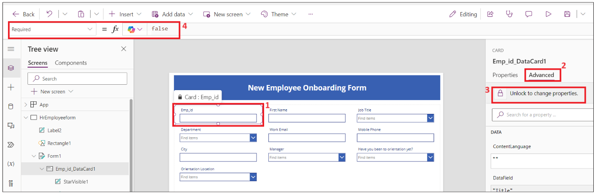
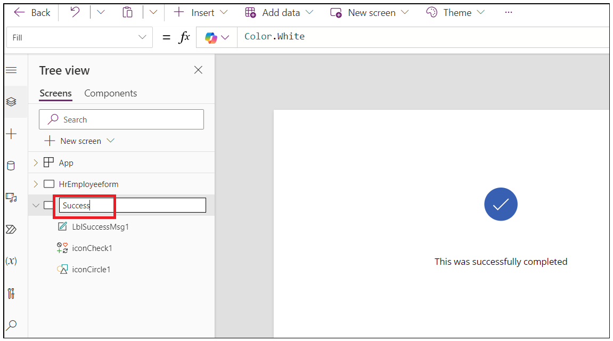
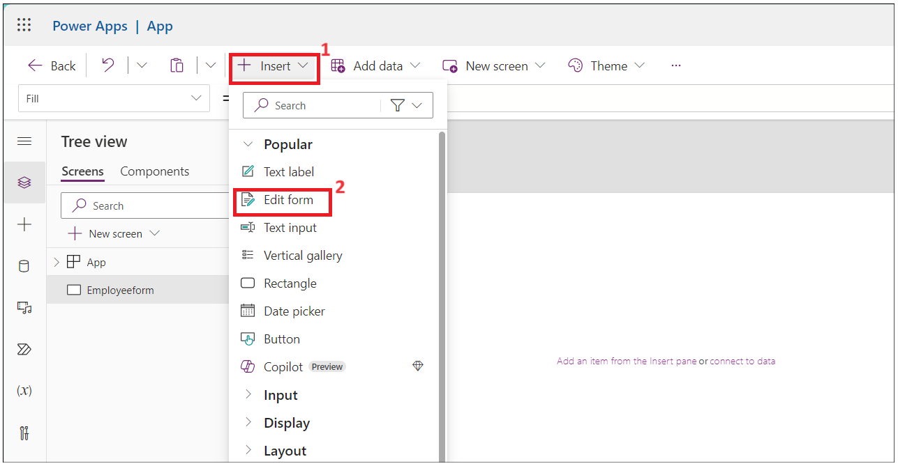
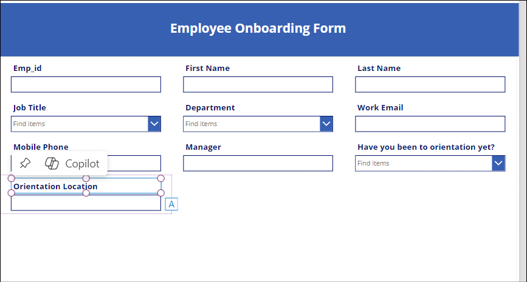
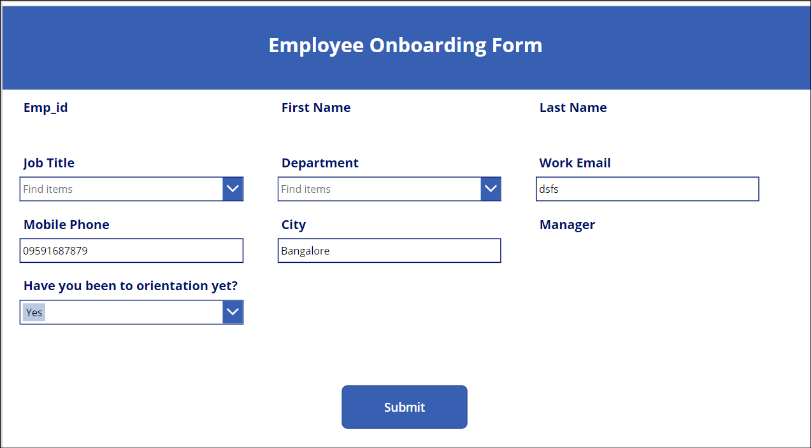
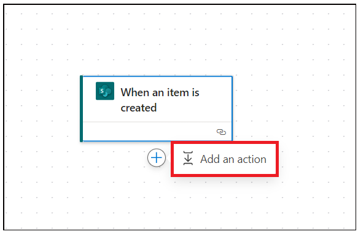
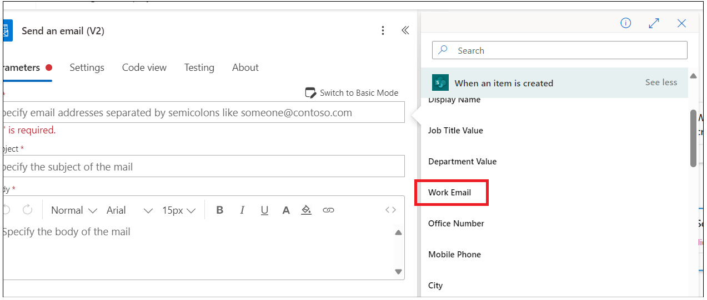

# **Lab 1 - Automatisieren Sie das Onboarding neuer Mitarbeiter**

**Ziel:** Das Hauptziel dieses Labs besteht darin, die Teilnehmer bei
der Automatisierung des Onboarding-Prozesses für Mitarbeiter mit
Microsoft Power Platform zu unterstützen. Die Übungen konzentrieren sich
auf das Erstellen von SharePoint-Listen zum Speichern von Mitarbeiter-
und HR-Informationen, das Anpassen von Formularen in Power Apps für die
Dateneingabe und das Implementieren automatisierter Workflows mit Power
Automate. Die Teilnehmer lernen, SharePoint für das Datenmanagement zu
nutzen, Power Apps zur Verbesserung der Benutzererfahrung zu nutzen und
automatisierte Prozesse zu integrieren, um Onboarding-Aufgaben zu
optimieren. Diese praktische Erfahrung zielt darauf ab, die Teilnehmer
mit praktischen Fähigkeiten auszustatten, um HR-Prozesse in ihren
Organisationen effektiv zu verwalten und zu automatisieren.

**Geschätzte Zeit:** 60 Minuten

# Übung 1: Erstellen der Liste "Mitarbeiter", "Personalwesen" und "Manager" in SharePoint.

## Aufgabe 1: Überprüfen Ihrer Dataverse-Umgebung

1.  Öffnen Sie einen Browser und gehen Sie zu
    +++**https://admin.powerplatform.microsoft.com**+++. Melden Sie sich
    mit Ihren Office 365-Tenantanmeldeinformationen an.

2.  Wählen Sie im linken Navigationsbereich **Manage** \>
    **Environments** aus. Die **Dev One** Developer-Umgebung sollte für
    Sie erstellt worden sein, wie in der Abbildung unten gezeigt.

- 

3.  Verwenden Sie dieselbe Entwicklerumgebung, um alle Übungen dieses
    Labs auszuführen.

## Aufgabe 2: Erstellen einer Website in SharePoint

1.  Navigieren Sie zu +++**https:\office.com**+++ und melden Sie sich
    mit Ihrem Office 365-Tenant an.

2.  Klicken Sie auf die Matrix in der oberen linken Ecke und wählen Sie
    **SharePoint** aus der Liste der **Apps** aus.

- 

  

3.  Klicken Sie im oberen Menü auf **+Create site**.

- 

4.  Wählen Sie unter **Create a site**-Fenster **Communication
    site**-Kachel aus.

- 

5.  Scrollen Sie nach unten und wählen Sie **Blank-**Vorlage aus.

- 

6.  Klicken Sie auf **Use template**.

- 

7.  Geben Sie den Namen und die Beschreibung der Website ein und klicken
    Sie dann auf die Schaltfläche **Next**.

    - Name der Website: +++**Contoso Corp**+++

    - Beschreibung der Website: +++ **Onboarding new employee.**+++

- 

8.  Behalten Sie die Standardsprache bei und klicken Sie dann auf
    **Create Site.**

- 

  

## Aufgabe 3: Erstellen einer Mitarbeiterliste auf der SharePoint-Website aus einer CSV-Datei

1.  Klicken Sie auf **Home –\> New –\> List.**

- 

2.  Wählen Sie **From CSV**-Kachel aus **Create a list-**Fenster aus.

- 

3.  Klicken Sie auf **Upload file** und navigieren Sie zu **C:Files**
    und wählen Sie **Employee.csv**-Datei aus.

- 

4.  Ändern Sie den Spaltentyp "**Work Email**" in **eine einzelne
    Textzeile** und klicken Sie dann auf **"Next**".

- 

5.  Geben Sie dann Name wie folgt ein: +++ **Employee Onboarding** +++
    und geben Sie bei Aufforderung Beschreibung: +++ **New Contoso Corp
    employee**+++ ein, und klicken Sie dann auf **Create**.

- 

  

6.  Die Liste "Mitarbeiter" wird jetzt für Sie erstellt. Benennen Sie
    die Spalte **Title** in +++**Emp_id**+++ um, indem Sie **Title
    drop-down** \> **Column settings** \> **Rename** auswählen.

- 

  

7.  Nun sollte die Mitarbeitertabelle wie folgt aussehen

- 

8.  Klicken Sie auf **Settings -\>List settings.**

- 

9.  Klicken Sie auf den Link zur Spalte **Department**.

- 

10. Ändern Sie die untenstehenden Werte und klicken Sie dann auf **OK**.

    - Art der Spalte : **Choice**

    - "Fill in" zulassen: **Yes**

- 

11. Wiederholen Sie den obigen Schritt für die Spalte **Job title**.

12. Wählen Sie die Spalte **Have you been to orientation yet?** aus ,
    nehmen Sie die untenstehenden Änderungen vor und klicken Sie
    anschließend auf „**OK**“.

    - Art der Spalte: **Choice**

    - "Fill in" zulassen: **Yes**

    - Geben Sie jede Auswahl in eine separate Zeile ein: **Yes No**

- 

13. Wiederholen Sie den obigen Schritt für **Orientation Location** mit
    den folgenden Eigenschaften, und wählen Sie dann **OK** aus.

    - Art der Spalte : **Choice**

    - "Fill-in" zulassen: **Yes**

    - Geben Sie jede Auswahl in einer separaten Zeile ein: **Redmon
      Reno**

- 

14. Wiederholen Sie den obigen Schritt für die Spalte **Manager** mit
    den folgenden Eigenschaften, und wählen Sie dann **OK** aus.

    - Art der Spalte : **Choice**

    - "Fill-in" zulassen: **Yes**

- 

15. Klicken Sie auf **Home**, um zur **Website** zurückzukehren.

- 

## Aufgabe 4: Erstellen einer HR-Liste auf der SharePoint-Website aus einer CSV-Datei

1.  Klicken Sie auf **Home –\> New –\> List.**

- 

2.  Wählen Sie **From CSV tile** aus **Create a list window**-Fenster
    aus.

- 

3.  Klicken Sie auf **Upload** **file** und durchsuchen Sie **C:Files**,
    wählen Sie **Import_HR_M365.CSV** aus und klicken Sie auf **Open**.

- 

4.  Ändern Sie den Spaltentyp " **Work Email** " in **" Single line of
    text "** und klicken Sie dann auf **"Next**".

- 

5.  Geben Sie die folgenden Details ein

    - Name : +++**Contoso HR**+++

    - Beschreibung: +++**Contoso Human Resource**+++, und klicken Sie
      dann auf die Schaltfläche **Create**.

- 

6.  Klicken Sie auf **Title –\> Column settings –\> Rename Column** in
    +++**Emp_id**+++.

- 

  

7.  Die HR-Tabelle sollte jetzt wie das folgende Bild aussehen.

- 

# Übung 2: Erstellen von Power Apps für SharePoint-Listen

In dieser Übung erstellen Sie Ihre Anwendung, um eine E-Mail mit
offiziellen Informationen an den Mitarbeiter zu senden und ihn
aufzufordern, Dokumente auszufüllen und hochzuladen.

## Aufgabe 1: Anpassen des Mitarbeiterformulars mit PowerApps für HRs, die ausgefüllt werden sollen.

1.  Kopieren Sie in Ihrem **SharePoint –\> Employee onboarding** die
    URL, und speichern Sie sie im Editor.

- 

2.  Öffnen Sie einen neuen Tab und gehen Sie zu
    +++**https://make.powerapps.com/**+++. Melden Sie sich mit Ihrem
    Office 365-Administratortenant an, und wählen Sie Ihre **Dev One**
    (Developer)-Umgebung aus. **Deaktivieren Sie** vorerst die
    Umschalttaste mit der Aufschrift " Try the new Power Apps experience
    ".

- 

3.  Klicken Sie im linken Navigationsmenü auf Apps. Wählen Sie **New App
    –\> Start with a page design.**

- 

4.  Wählen Sie **Blank Canvas**-Kachel aus.

- 

5.  Klicken Sie mit der rechten Maustaste auf **Screen1** und wählen Sie
    **Rename.**

- 

6.  Umbenennen in **HrEmployeeform**

- 

7.  Wählen Sie das Formular aus und klicken Sie auf **Insert –\> Edit
    form.**

- 

8.  Suchen Sie nach **SharePoint,** und wählen Sie
    **SharePoint-Connector** aus der Dropdownliste **Select a data
    source** aus.

- 

9.  Wählen Sie **SharePoint** unter **Connect** aus.

- 

10. Geben Sie die aus Schritt 1 kopierte **SharePoint-List-URL** in das
    Textfeld **Enter SharePoint URL** ein und klicken Sie dann auf
    **Connect**.

- 

11. Wählen Sie die Liste **Employee Onboarding** aus und klicken Sie
    dann auf **Connect**.

- 

12. Ziehen Sie das Formular in den Container und passen Sie es an.

- 

13. Ziehen Sie den Form1-Container etwas nach unten und klicken Sie auf
    **Insert –\> Rectangle** , um die Kopfzeile in das Formular
    einzufügen.

- 

14. Passen Sie das Rechteck an die Containerbreite an. Klicken Sie auf
    **Insert –\> Text label**.

- 

15. Ändern Sie die Breite des Textfelds in das Rechteck und
    aktualisieren Sie die Eigenschaften unter .

    - **Text: New Employee Onboarding Form**

    - **Font Size:** 27

    - **Font weight:** Bold

    - **Text alignment:** Centre

    - **Colour:** White

- 

16. Legen Sie **Emp_Id, First Name** und **Last_Name** als Pflichtfelder
    fest.

17. Wählen Sie **Emp_Id** Feld aus und ändern Sie den **gewünschten**
    Wert. Klicken Sie unter **Properties** auf **Advanced** und wählen
    Sie **Unlock to change properties**.

- 

18. Legen Sie nun den Wert **Required** auf true fest. Neben **Emp_id**
    Feld sollte der Stern angezeigt werden.

- 

19. Wiederholen Sie die beiden obigen Schritte für **First Name** und
    **Last_Name**

- **Hinweis**: Wenn Sie das Feld nicht sehen, wählen Sie den Container
  -\> Properties -\> Edit ( Felder) .add-Feld aus und ordnen Sie es neu
  an.

  

20. Wählen Sie das rechteckige Formular/FormScreen1 aus und klicken Sie
    dann auf **Insert –\> Button**.

- 

21. Ziehen Sie die Schaltfläche und platzieren Sie sie unter
    **Department** abgelegt im Formular und aktualisieren Sie sie unter
    den Eigenschaften.

- **Text**: **Submit**

  

22. Klicken Sie auf **New Screen** und wählen Sie **Success**-Vorlage.

- 

23. Wählen Sie den neuen Bildschirm aus, und **benennen Sie** ihn in
    **Success** um, wie in den folgenden Bildern gezeigt.

- 

24. Wählen Sie **Lb1Successmsg1** aus, und ändern Sie den Text in **New
    employee added**.

- 

25. Klicken Sie nun auf **Insert –\> Icons –\> Back arrow.**

- 

26. Wählen Sie Zurück-Pfeil aus, und legen Sie die folgenden
    Eigenschaften fest.

- Tool-Tipp: **Go Back**

- OnSelect: +++ **Back(ScreenTransition.CoverRight)**+++

&nbsp;

- 

27. Klicken Sie auf **HrEmployeeform.** Wählen Sie **Button** und wählen
    Sie **Onselect** und geben Sie die folgende Formel ein.

- **Hinweis:** Aktualisieren Sie die Formel mit Ihrem
  SharePoint-Formular.

  +++ **SubmitForm(*Form1*);ResetForm(*Form1*);Navigate(*Success*)**+++

  

28. Wählen Sie **Form1** aus, wählen Sie **OnSuccess** aus, und ersetzen
    Sie die Formel durch die folgende Formel.

- +++**ResetForm(Self); RequestHide();Notify(“New Employee
  added”,NotificationType.Success)**+++

  

29. Klicken Sie auf die Schaltfläche **Save –\> Save as**, geben Sie den
    Namen als **EmpformforHr** ein und klicken Sie dann auf **Save**.

- 

30. Wählen Sie das Formular aus, ändern Sie den **Default**-Modus in
    **New** und klicken Sie dann auf das Symbol **Save -\>**
    **Preview**.

- 

31. Geben Sie die zufällige **Emp-ID, First Name** und **Last Name** ein
    und klicken Sie dann auf die Schaltfläche **Submit**.

- 

32. Die Nachricht " **New employee added** " sollte angezeigt werden.
    Klicken Sie auf die Schaltfläche **Back.**

- 

33. Klicken Sie auf die Schaltfläche **Publish** und dann auf die
    Schaltfläche **Publish this version**.

- 

34. Kehren Sie in einem Browser zur Registerkarte SharePoint zurück. In
    der Liste sollte der Mitarbeiterdatensatz des neuen Mitarbeiters,
    den Sie hinzugefügt haben, angezeigt werden.

## Aufgabe 2: Erstellen einer Canvas-App für das Mitarbeiter-Onboarding für den Mitarbeiter

1.  Kopieren Sie aus Ihrem **SharePoint-Onboarding** die URL, und
    speichern Sie sie im Editor.

- 

2.  Öffnen Sie einen neuen Tab und gehen Sie zu
    +++**https://make.powerapps.com/**+++. Melden Sie sich mit Ihrem
    Office 365-Administratortenant an, und wählen Sie Ihre **Dev**
    One-Entwicklerumgebung aus.

3.  Klicken Sie im linken Navigationsmenü auf **Apps**. Wählen Sie **New
    App -\> Start with a page design.**

- 

4.  Wählen Sie **Blank Canvas-**Kachel aus.

- 

5.  Klicken Sie mit der rechten Maustaste auf **Screen1** und wählen Sie
    **Rename.**

- 

6.  Umbenennen in **Employeeform**

- 

7.  Klicken Sie auf **Insert** und wählen Sie **Edit form**.

- 

8.  Suchen Sie nach **SharePoint,** und wählen Sie
    **SharePoint-Connector** aus der Dropdownliste **Select a data
    source** aus.

- 

9.  Wählen Sie **SharePoint** unter **Add Connection** aus.

- 

10. Geben Sie die aus Schritt 1 kopierte **SharePoint-List-URL** in das
    Textfeld “Enter SharePoint URL” ein und klicken Sie dann auf
    **Connect**.

11. Wählen Sie unter **Choose a list** –\> die Option **Employee
    Onboarding**-Liste aus und klicken Sie dann auf **Next**.

- 

12. Wählen Sie die Liste **Employee Onboarding** aus und klicken Sie
    dann auf **Connect**.

- 

13. Ziehen Sie das Formular in den Container und passen Sie es an.

- 

14. Wählen Sie unter **Properties Form 1** und **Display**-Modus auf
    **New** aus .

- 

15. Ziehen Sie den Form1-Container etwas nach unten und klicken Sie auf
    **Insert -\> Rectangle**, um die Kopfzeile in das Formular
    einzufügen.

- 

16. Ändern Sie die Breite des Rechtecks in den Container, und wählen Sie
    **Insert –\> Text label** aus.

- 

17. Wählen Sie die Beschriftung aus, und legen Sie die folgenden
    **Eigenschaften** fest.

    - **Text: Employee Onboarding Form**

    - **Font Size: 25**

    - **Font weight: Bold**

    - **Text alignment: Centre**

    - **Colour: White**

- 

18. Wählen Sie den **Emp_Id** Feldnamen aus und ändern Sie **Font size**
    in **16** und **Font weight** in **Bold** unter Properties. Wenn Sie
    **Emp_Id** Feld nicht finden, zeigen Sie mit der Maus auf **Form1**
    im Zeichenbereich, wählen Sie **Fields** \> **Add fields** aus,
    wählen Sie **Emp_Id** aus (wenn Sie **Emp_Id** auch in dieser Liste
    nicht sehen, wählen Sie **Title** aus) und wählen Sie dann **Add**
    aus.

- 

19. Wiederholen Sie den obigen Schritt für alle Felder.

- 

20. Wählen Sie das Element **Orientation location** aus, und legen Sie
    die Eigenschaft **Visible** auf **false** fest.

- 

21. Wählen Sie das Textfeld **Have you been to orientation**? und
    klicken Sie auf Beschriftung **Edit**.

- 

22. Ändern des Beschriftungswerts in **Orientationdropdown**

- 

23. Wählen Sie **die Datenkarte " Orientation Location "** aus, wählen
    Sie **"Visible"** aus, und platzieren Sie sie unter der Formel, wie
    in der folgenden Abbildung gezeigt.

- +++ **If(*Orientationdropdown*.Selected.Value=“No”,true,false)**+++

  

24. Klicken Sie auf **Save** und geben Sie den App-Namen wie folgt ein:
    **EmployeeOnboardingForm** und klicken Sie dann auf die Schaltfläche
    **Save**.

- 

25. **Emp_id**, **First Name**, **Last Name** und **Manager** werden von
    der Personalabteilung ausgefüllt, ändern Sie also den Anzeigemodus
    in **View**.

26. Wählen Sie das Feld aus und klicken Sie **auf** **Advanced –\>
    Unlock to change properties** und den **Display**-Modus auf
    **Parent.DisplayMode.View** zu aktualisieren.

- 

  

  

  

  

27. Wählen Sie die Eigenschaft **“Unlock”** des Feldes “**Work email**”
    aus und setzen Sie die Eigenschaft “**Required”** auf **“true”**.
    Wiederholen Sie dies bei Bedarf für andere Felder.

- 

28. Wählen Sie **Form1** aus, und aktualisieren Sie den Wert des Felds
    **OnFailed** auf

- +++**Notify(“Required Fields can’t be
  empty.”,NotificationType.Error)**+++

  

29. Wählen Sie **OnSuccess** aus, und legen Sie den Wert auf

- +++**Notify(“Thank you for filling out the
  form”,NotificationType.Success)**+++

  

30. Fügen wir nun die Schaltfläche zum Senden am Ende des Formulars
    hinzu. Klicken Sie auf die Schaltfläche **Insert –\> Button.**

- 

31. Ändern Sie die Eigenschaften der Schaltfläche und speichern Sie das
    Formular.

    - Text: **Submit.**

    - Onselect: +++**SubmitForm(*Form1*);NewForm(*Form1*)**+++

- 

32. Klicken Sie auf **Save** und dann auf App-Schaltflächen in der
    **Preview**.

- 

33. Geben Sie die Details ein und klicken Sie dann auf **Submit**.

- 

34. Es sollte eine Erfolgsbenachrichtigung angezeigt werden.

- 

35. Schließen Sie das Vorschaufenster.

36. Klicken Sie in der **Tree View** auf **App**. Wählen Sie **OnStart**
    aus, und geben Sie die folgende Formel ein.

- Set(

          onboardinglistitem,

          LookUp(

              'Employee Onboarding',

              ID = Value(Param("ItemID"))

          )

      )

  

37. Wählen Sie das **Form1** in der **Tree View** aus. Wählen Sie ein
    Element aus, und geben Sie den Wert wie folgt ein:
    **onboardinglistitem**

- 

38. Klicken Sie auf **Save** und **Publish –\> Publish this version**.

- 

39. Gehen Sie zurück zur **Power Apps-Startseite** , klicken Sie auf
    **Apps –\> Your App –\> Details**.

- 

40. Kopieren Sie den Weblink, um ihn in der nächsten Aufgabe zu
    verwenden.

- 

41. Schließen Sie das Vorschaufenster, navigieren Sie zu Ihrer
    SharePoint-Registerkarte und überprüfen Sie den obigen Datensatz in
    der Liste.

- 

## Aufgabe 3: Erstellen eines Power Automate-Flows, um ein Formular an den neuen Mitarbeiter zu senden

1.  Kehren Sie zur Registerkarte **SharePoint** zurück und kopieren Sie
    die URL.

- 

2.  Öffnen Sie einen neuen Tab, gehen Sie zu
    +++https://make.powerautomate.com/+++ und melden Sie sich mit Ihrem
    Administrator-Tenantkonto an.

3.  Wählen Sie Ihre **Dev** **One**-Entwicklerumgebung aus.

4.  Klicken Sie im linken Navigationsmenü auf **My flows**. Klicken Sie
    auf **New Flow –\> Automated Cloud-Flow.**

- 

5.  Geben Sie den Flow-Namen wie folgt ein: **Onboarding new employee**.
    Suchen Sie nach **When an item is created**, wählen Sie es aus
    SharePoint aus und klicken Sie dann auf **Create**.

- 

6.  Wählen Sie die Aktion aus. Klicken Sie auf **Site-Address –\> Enter
    custom value.**

- 

7.  Geben Sie die in Schritt 1 kopierte Adresse ein, und wählen Sie dann
    die Liste **Employee Onboarding** aus, wie in der folgenden
    Abbildung gezeigt.

- 

8.  Klicken Sie auf **+** , um eine neue Aktion hinzuzufügen.

- 

9.  Suchen Sie nach und wählen Sie **Send an email (V2)** aus.

- 

10. Klicken Sie auf das Textfeld und wählen Sie **Enter the data from
    previous step** ein.

- 

11. Wählen Sie **Work email** aus.

- 

12. Geben Sie die Betreffzeile wie folgt ein: **Welcome to Firm,**
    wählen Sie **First Name** aus dem vorherigen Schritt aus.

- 

13. Geben Sie die folgenden Daten in den Text der E-Mail ein. Fügen Sie
    dynamische Werte ein, wie im Bild gezeigt.

- Hi first name Lastname,

  Please click on link below to complete your onboarding form.

  

  

14. Geben Sie den in Aufgabe 2 kopierten Weblink ein – fügen Sie
    **&itemID=** am Ende des Links hinzu und wählen Sie Dynamische ID
    aus, wie in der folgenden Abbildung gezeigt.

- 

  

15. Schneiden Sie den Link ab und geben Sie dann den Text ein:
    **Onboarding-Form** und wählen Sie das Linksymbol aus und klicken
    Sie darauf. Fügen Sie den Link ein, der aus dem obigen Schritt
    kopiert wurde.

- 

16. Speichern Sie den Flow jetzt.

- 

  

## Aufgabe 4: Testen Sie den Flow.

1.  Kehren Sie zur **Registerkarte Power Apps** zurück, und wählen Sie
    die App **EmpformforHr** aus.

- 

2.  Wenn Sie gefragt werden, erlauben Sie die Berechtigungen.

- 

3.  Füllen Sie das Formular mit Ihren Daten aus. Geben Sie die
    geschäftliche E-Mail-Adresse als Admin-Tenant-ID ein und **senden
    Sie** das Formular **ab**.

- 

  

4.  Kehren Sie zum Power Automate-Flow zurück, und überprüfen Sie den
    Flowstatus.

- 

  

5.  Öffnen Sie eine neue Registerkarte, wechseln Sie zu
    +++**https:\outlook.com**+++ und melden Sie sich mit Ihrem Office
    365-Tenantkonto und Check-in-Posteingang an. Klicken Sie auf den
    Link **Onboarding-Form** in der E-Mail, die von der
    Personalabteilung generiert wurde.

- 

**Fazit:** Nach Abschluss dieses Labs haben die Teilnehmer ein
umfassendes Verständnis dafür entwickelt, wie sie mit Microsoft Power
Platform-Tools Onboarding-Workflows für Mitarbeiter erstellen und
verwalten können. Sie erstellen und konfigurieren erfolgreich
SharePoint-Listen zum Speichern von Mitarbeiterdaten, erstellen
benutzerdefinierte Power Apps-Formulare für die Personalabteilung und
richten automatisierte Power Automate-Flows für eine nahtlose
Kommunikation mit neuen Mitarbeitern ein. Diese Erfahrung wird die
Teilnehmer in die Lage versetzen, ihre organisatorischen
Onboarding-Prozesse zu verbessern, die Datengenauigkeit zu verbessern
und einen effizienteren Workflow im Personalmanagement zu fördern.
Insgesamt vermittelt das Lab den Teilnehmern wertvolle Fähigkeiten, die
in realen Szenarien angewendet werden können, um den Geschäftsbetrieb zu
optimieren.
