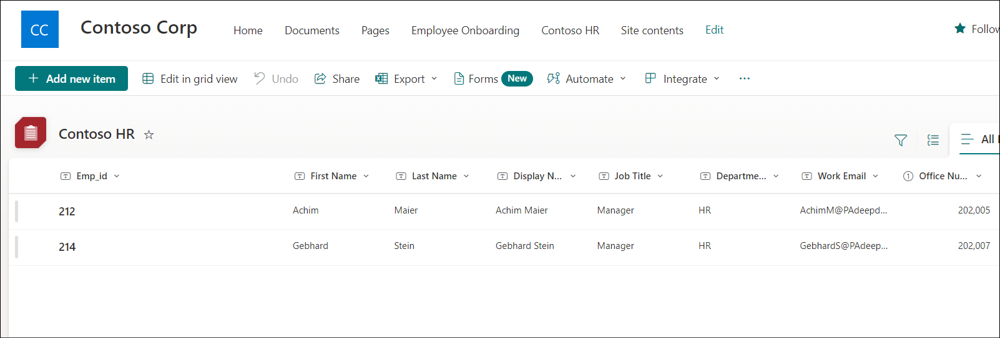
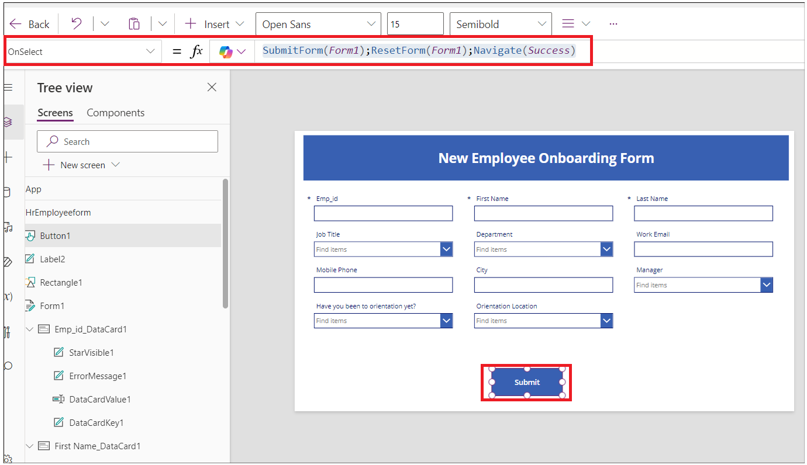
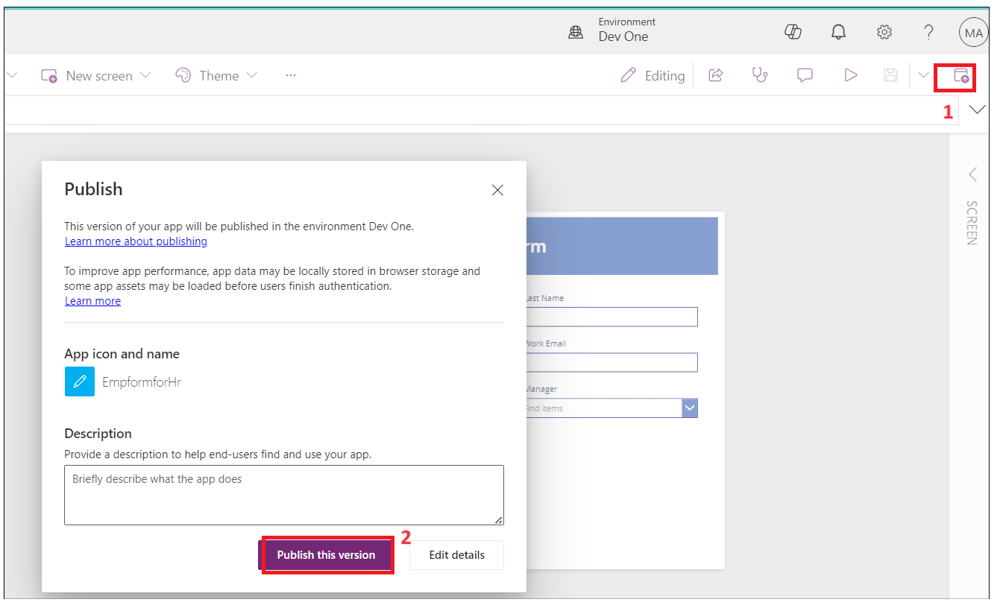
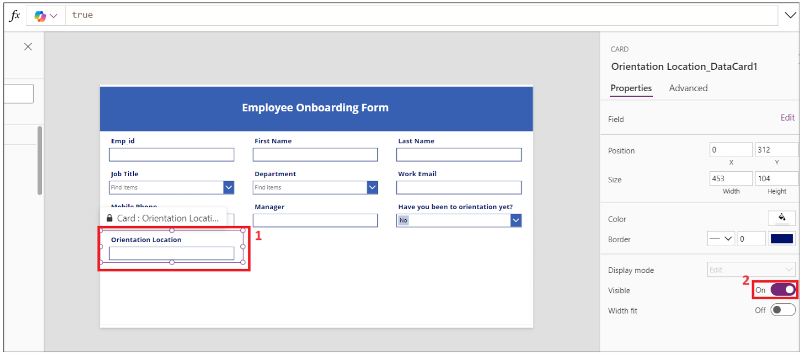
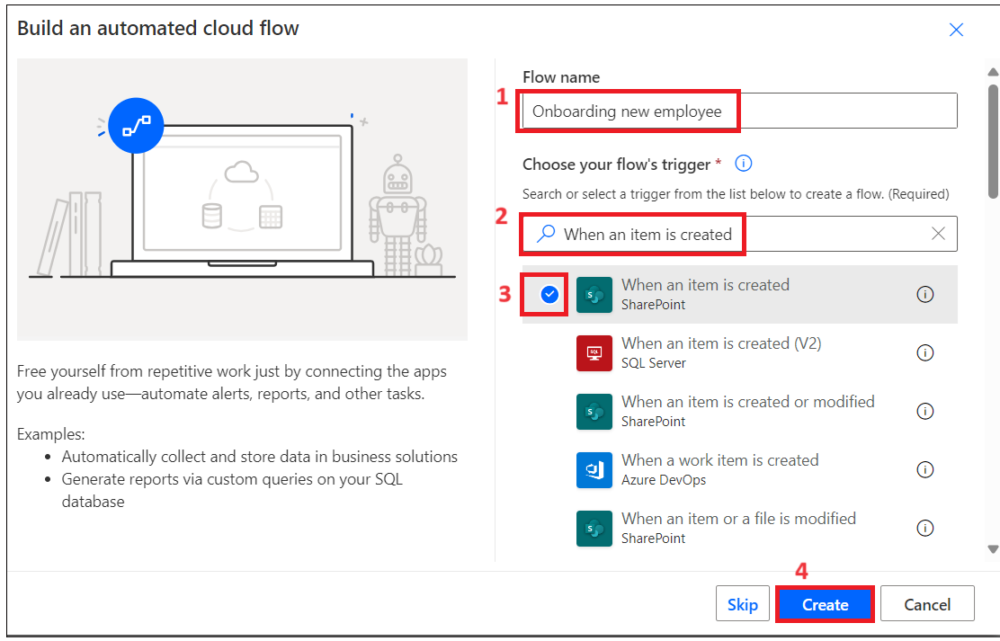
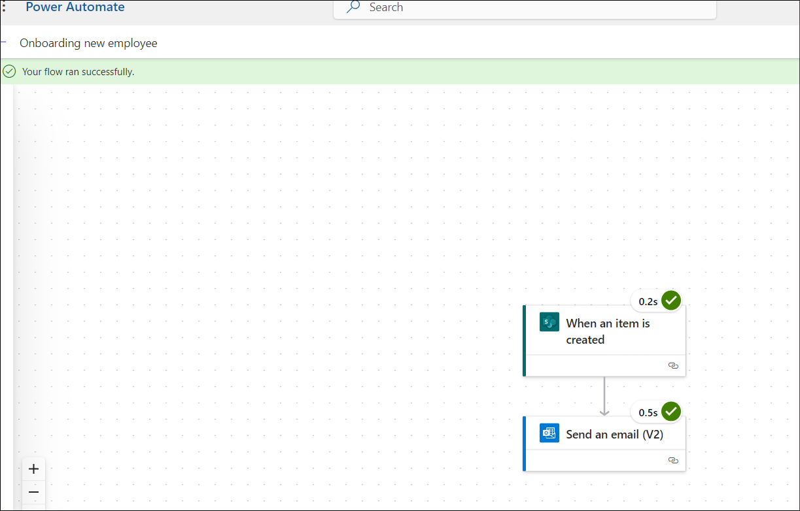

# **Laboratório 1 - Automatizar a Integração de Novos Funcionários**

**Objetivo**: o objetivo principal deste laboratório é orientar os
participantes na automatização do processo de integração de funcionários
utilizando a Microsoft Power Platform. Os exercícios se concentram na
criação de listas do SharePoint para armazenar informações sobre
funcionários e RH, na personalização de formulários no Power Apps para
entrada de dados e na implementação de fluxos de trabalho automatizados
utilizando o Power Automate. Os participantes aprenderão a usar o
SharePoint para gerenciamento de dados, utilizar o Power Apps para
melhorar a experiência do usuário e integrar processos automatizados
para otimizar as tarefas de integração. Esta experiência prática tem
como objetivo equipar os participantes com habilidades práticas para
gerenciar e automatizar com eficácia os processos de RH dentro de suas
organizações.

**Tempo estimado:** 60 minutos

# Exercício 1: Criar lista de funcionários, RH e gerentes no SharePoint.

## Tarefa 1: Verificar seu ambiente Dataverse

1.  Abra um navegador e acesse
    +++**https://admin.powerplatform.microsoft.com**+++. Faça login com
    suas credenciais de locatário do office 365.

- No menu à esquerda, selecione **Manage** \> **Environments.** O
  ambiente **Dev One** Developer já deve ter sido criado para você,
  conforme mostrado na imagem abaixo.

2.  Use o mesmo ambiente de desenvolvedor para executar todos os
    exercícios deste laboratório.

## Tarefa 2: Criar um site no SharePoint

1.  Acesse +++**https:\office.com**+++ e faça login com sua conta de
    locatário do office 365.

2.  Clique no ícone de matriz no canto superior esquerdo e selecione o
    **SharePoint** na lista de **apps**.

- 

  

3.  Clique em **+Create site** no menu superior.

- 

4.  Selecione o bloco **Communication site** na janela **Create a
    site**.

- 

5.  Role para baixo e selecione o **Blank** template.

- 

6.  Clique em **Use template**.

- 

7.  Insira o Site name e a description, depois clique no botão **Next**.

    - Site Name: +++**Contoso Corp**+++

    - Site Description: +++**Onboarding new employee.**+++

- 

8.  Mantenha o idioma padrão e clique em **Create Site.**

- 

  

## Tarefa 3: Criar uma lista de funcionários no site do SharePoint a partir de um arquivo CSV

1.  Clique em **Home –\> New –\> List.**

- 

2.  Selecione o bloco **From CSV** na janela **Create a list**.

- 

3.  Clique em **Upload file** e navegue até **C:Files,** depois
    selecione o arquivo **Employee.csv**.

- 

4.  Altere o tipo da coluna **Work Email** para **single line of text**
    e depois clique em **Next**.

- 

5.  Inisira o Name como: +++**Employee Onboarding**+++ e se solicitado,
    insira a Description: +++**New Contoso Corp employee**+++ e então
    clique em **Create**.

- 

  

6.  A lista Employees foi criada para você. Renomeie a coluna **Title**
    para +++**Emp_id**+++ selecionando o menu suspenso da coluna **Title
    drop-down** \> **Column settings** \> **Rename**.

- 

  

7.  Agora a tabela de funcionários deve estar assim

- 

8.  Clique em **Settings -\>List settings.**

- 

9.  Clique no link da coluna **Department**.

- 

10. Altere os valores abaixo e então clique em **Ok**.

    - Type of Column : **Choice**

    - Allow ‘Fill-in’ choices: **Yes**

- 

11. Repita o passo acima para a coluna **Job title**.

12. Selecione a coluna **Have you been to orientation yet?** Faça as
    alterações abaixo e então clique em **OK**.

    - Type of Column : **Choice**

    - Allow ‘Fill-in’ choices: **Yes**

    - Type each choice on a separate line : **Yes No**

- 

13. Repita o passo acima para a coluna **Orientation Location** com as
    propriedades abaixo e então selecione **OK**.

    - Type of Column : **Choice**

    - Allow ‘Fill-in’ choices: **Yes**

    - Type each choice on a separate line : **Redmon Reno**

- 

14. Repita o passo acima para a coluna **Manager** com as propriedades
    abaixo adicionadas e então selecione **OK**.

    - Type of Column : **Choice**

    - Allow ‘Fill-in’ choices: **Yes**

- 

15. Clique em **Home** para voltar ao **Site**.

- 

## 

## Tarefa 4: Criar uma lista de RH no site do SharePoint a partir de um arquivo CSV

1.  Clique em **Home –\> New –\> List.**

- 

2.  Selecione o **bloco From CSV** na janela **Create a list window.**

- 

3.  Clique em **Upload** **file,** navegue até **C:Files,** e selecione
    **Import_HR_M365.CSV** e clique em **Open**.

- 

4.  Altere o tipo da coluna **Work Email** para **Single line of text**
    e depois clique em **Next**.

- 

5.  Insira os detalhes abaixo

    - Name : +++**Contoso HR**+++

    - Description : +++**Contoso Human Resource**+++, em seguida clique
      no botão **Create**.

- 

6.  Clique em **Title** → **Column settings –\> Rename** a coluna para
    +++**Emp_id**+++.

- 

  

7.  A tabela HR deve estar como na imagem abaixo agora.

- 

# Exercício 2: Criar Power Apps para listas do SharePoint

Neste exercício, você criará seu aplicativo para enviar um e-mail ao
funcionário com informações oficiais e solicitando que ele preencha e
envie documentos.

## Tarefa 1: Personalizar o formulário do funcionário com o PowerApps para que os RHs preencham.

1.  No seu **SharePoint** → **Employee onboarding**, copie a URL e
    salve-a no Bloco de notas.

- 

2.  Abra uma nova guia e acesse +++**https://make.powerapps.com/**+++.
    Faça login com seu administrador de locatário do office 365 e
    selecione seu ambiente **Dev One** (Developer)**.** Por enquanto,
    desative o botão de alternância que diz ‘Try the new Power Apps
    experience’.

- 

3.  Clique em **Apps** no menu de navegação à esquerda. Selecione **New
    App** → **Start with a page design.**

- 

4.  Selecione o bloco **Blank Canvas**.

- 

5.  Clique com o botão direito em **Screen1** e selecione **Rename.**

- 

6.  Renomeie para **HrEmployeeform**

- 

7.  Selecione o formulário e clique em **Insert –\> Edit form.**

- 

8.  Pesquise por **SharePoint** e selecione o **SharePoint connector**
    no menu suspenso **Select a data source**.

- 

9.  Selecione **SharePoint** em **Connect.**

- 

10. Insira a **URL da lista do** **SharePoint** copiada no passo 1 no
    campo de texto **Enter SharePoint URL** e clique em **Connect**.

- 

11. Selecione a lista **Employee Onboarding** e clique em **Connect**.

- 

12. Arraste e ajuste o formulário no contêiner.

- 

13. Arraste o contêiner Form1 um pouco para baixo e clique em **Insert
    –\> Rectangle** para inserir o cabeçalho no formulário.

- 

14. Ajuste o retângulo à largura do contêiner. Clique em **Insert –\>
    Text label**.

- 

15. Altere a largura do campo de texto para o retângulo e atualize as
    propriedades abaixo.

    - **Tex: New Employee Onboarding Form**

    - **Font Size:** 27

    - **Font weight:** Bold

    - **Text alignment:** Centre

    - **Colour:** White

- 

16. Defina **Emp_Id, First Name** e **Last_Name** como campos
    obrigatórios.

17. Selecione o campo **Emp_Id** e altere a opção **value required**.
    Clique em **Advanced** em **Properties** e selecione **Unlock to
    change properties**.

- 

18. Agora defina o valor **Required** como true. Você deverá ver um
    asterisco ao lado do campo **Emp_id**.

- 

19. Repita os dois passos acima para **First Name** e **Last_Name**

- **Observação**: Se você não visualizar o campo, selecione o container
  -\> properties -\> Edit( fields). Adicione o campo e reorganize a
  ordem.

  

20. Selecione o formulário retangular /FormScreen1 e depois clique em
    **Insert –\> Button**.

- 

21. Arraste e posicione o botão abaixo do campo **Department** no
    formulário e atualize as propriedades abaixo.

- **Text**: **Submit**

  

22. Clique em **New Screen** e selecione o **Success template**.

- 

23. Selecione a nova tela e **renomeie** para **Success**, como mostrado
    nas imagens abaixo.

- 

24. Selecione **Lb1Successmsg1** e altere o texto para **New employee
    added**.

- 

25. Agora, clique em **Insert –\> Icons –\> Back arrow.**

- 

26. Selecione a Seta Voltar e defina as propriedades abaixo.

- Tool Tip: **Go Back**

- OnSelect: +++**Back(ScreenTransition.CoverRight)**+++

&nbsp;

- 

27. Clique em **HrEmployeeform**. Selecione o **Button**, escolha
    **OnSelect** e insira a fórmula abaixo.

- **Observação**: atualize a fórmula com seu formulário do SharePoint.

  +++**SubmitForm(*Form1*);ResetForm(*Form1*);Navigate(*Success*)**+++

  

28. Selecione **Form1**, escolha **OnSuccess** e substitua a fórmula
    pela fórmula abaixo.

- +++**ResetForm(Self); RequestHide();Notify(“New Employee
  added”,NotificationType.Success)**+++

  

29. Clique em **Save** → **Save as**, digite o nome **EmpformforHr** e
    depois clique em **Save**.

- 

30. Selecione o formulário, altere o **Default mode** para **New** e
    depois clique no ícone **Save -\>** **Preview**.

- 

31. Insira um **Emp id**, **First Name** e **Last Name** aleatórios e
    depois clique no botão **Submit**.

- 

32. Você deverá ver a **mensagem** **New employee added**. Clique no
    botão **Voltar.**

- 

33. Clique no botão **Publish** e depois clique em **Publish this
    version**.

- 

34. Volte para a guia SharePoint no navegador. Você deverá ver o
    registro do novo funcionário adicionado por você na lista.

## Tarefa 2: Criar um aplicativo Canvas de integração de funcionários para o funcionário

1.  No seu **SharePoint-onboarding**, copie a URL e salve-a no Bloco de
    notas.

- 

2.  Abra uma nova guia e acesse +++**https://make.powerapps.com/**+++.
    Faça login com suas credenciais de administrador de locatário do
    office 365 e selecione seu ambiente **Dev One** developer.

3.  Clique em **Apps** no menu de navegação à esquerda. Selecione **New
    App** → **Start with a page design.**

- 

4.  Selecione o bloco **Blank Canvas**.

- 

5.  Clique com o botão direito em **Screen1** e selecione **Rename.**

- 

6.  Renomeie para **Employeeform**

- 

7.  Clique em **Insert** e selecione **Edit form**.

- 

8.  Pesquise por **SharePoint** e selecione o **SharePoint connector**
    no menu suspenso **Select a data source**.

- 

9.  Selecione **SharePoint** em **Add Connection.**

- 

10. Insira a **URL da lista do** **SharePoint** copiada no passo 1 no
    campo de texto Enter SharePoint URL e clique em **Connect**.

11. Em **Choose a list** → selecione a lista **Employee Onboarding** e
    clique em **Next.**

- 

12. Selecione a lista **Employee Onboarding** e clique em **Connect**.

- 

13. Arraste e ajuste o formulário no contêiner.

- 

14. Select **Form1** and set the **Default mode** to **New** in
    Properties.

- 

15. Arraste o Form1 container um pouco para baixo e clique em **Insert**
    → **Rectangle** para inserir um cabeçalho no formulário.

- 

16. Altere a largura do retângulo para o contêiner e selecione **Insert
    –\> Text label**.

- 

17. Selecione o Label e defina as **propriedades** abaixo**.**

    - **Text: Employee Onboarding Form**

    - **Font Size: 25**

    - **Font weight: Bold**

    - **Text alignment: Centre**

    - **Colour: White**

- 

18. Selecione o campo **Emp_Id** e altere o **Font size** para **16** e
    o **Font weight** para **Bold** em **Properties**. Se não encontrar
    o campo **Emp_Id**, passe o mouse sobre o **Form1** na tela,
    selecione **Fields** \> **Add fields**, selecione **Emp_Id** (se não
    encontrar **Emp_Id** nessa lista também, selecione **Title**) e
    então clique em **Add**.

- 

> 19\. Repita o passo acima para todos os campos.

- 

20. Selecione o item **Orientation location** e defina a propriedade
    **Visible** como **false.**

- 

21. Selecione o campo de texto **Have you been to orientation yet?** e
    clique em **edit label**.

- 

22. Altere o valor do label para **Orientationdropdown**

- 

23. Selecione o **Orientation Location data card**, escolha **Visible**
    e insira a fórmula abaixo, conforme mostrado na imagem abaixo.

- +++**If(*Orientationdropdown*.Selected.Value=“No”,true,false)**+++

  

24. Clique em **Save** e insira o nome do app como:
    **EmployeeOnboardingForm**, depois clique no botão **Save**.

- 

25. **Emp_id, First Name, Last Name e Manager** serão preenchidos pelo
    RH, então altere o display mode para **View**.

26. Selecione o campo, clique em **Advanced –\> Unlock to change
    properties** e atualize o **Display mode** para
    **Parent.DisplayMode.View**

- 

  

  

  

  

27. Selecione o campo **Work email**, **Unlock property** e atualize a
    **Required** property para **true**. Repita para os outros campos,
    se necessário.

- 

28. Selecione o **Form1** e atualize o valor do campo **OnFailed** para

- +++**Notify(“Required Fields can’t be
  empty.”,NotificationType.Error)**+++

  

29. Selecione **OnSuccess** e defina o valor como

- +++**Notify(“Thank you for filling out the
  form”,NotificationType.Success)**+++

  

30. Agora, vamos adicionar um botão para submit no final do formulário.
    Clique em **Insert** → **Button.**

- 

31. Altere as Properties do botão e salve o formulário.

    - Text: **Submit.**

    - Onselect: +++**SubmitForm(*Form1*);NewForm(*Form1*)**+++

- 

32. Clique em **Save** e depois clique no botão **Preview** app.

- 

33. Insira os dados e depois clique em **Submit**.

- 

34. Uma notificação de sucesso deverá ser exibida.

- 

35. Feche a janela de pré-visualização.

36. Clique em **App** na **Tree View**. Selecione **OnStart** e insira a
    fórmula abaixo.

- Set(

          onboardinglistitem,

          LookUp(

              'Employee Onboarding',

              ID = Value(Param("ItemID"))

          )

      )

  

37. Selecione o **Form1** na **Tree View**. Selecione item e insira o
    valor: **onboardinglistitem**

- 

38. Clique em **Save** e em **Publish** → **Publish this version**.

- 

39. Volte para a página inicial do **Power Apps**, clique em **Apps** →
    seu app → **Details**.

- 

40. Copie o Weblink para usar na próxima tarefa.

- 

41. Feche a janela de pré-visualização, navegue até a guia SharePoint e
    verifique o registro acima na lista.

- 

## Tarefa 3: Criar um fluxo do Power Automate para enviar um formulário ao novo funcionário

1.  Volte para a guia do **SharePoint** e copie a URL.

- 

2.  Abra uma nova guia e acesse +++https://make.powerautomate.com/+++ e
    faça login com sua conta de administrador do locatário.

3.  Selecione seu ambiente **Dev One** developer.

4.  Clique em **My flows** no menu de navegação à esquerda. Clique em
    **New Flow** → **Automated Cloud flow.**

- 

5.  Insira o nome do fluxo como: **Onboarding new employee**. Pesquise
    por **When an item is created**, selecione essa ação do SharePoint e
    clique em **Create**.

- 

6.  Selecione a ação. Clique em **Site Address** → **Enter custom
    value.**

- 

7.  Insira o endereço copiado no passo 1 e selecione a lista **Employee
    Onboarding**, conforme mostrado na imagem abaixo.

- 

8.  Clique em **+** add new action.

- 

9.  Pesquise por **Send an email (V2)** e selecione essa ação

- 

10. Clique no campo To e selecione **Enter the data from previous
    step**.

- 

11. Selecione **Work email.**

- 

12. Insira a linha de Subject como: **Welcome to Firm**, selecione
    **First Name** do passo anterior.

- 

13. Insira os dados abaixo no Body do email. Insira os valores dinâmicos
    conforme mostrado na imagem.

- Hi first name Lastname,

  Por favor, clique no link abaixo para completar seu onboarding form.

  

  

14. Insira o Weblink copiado na Tarefa 2 – e adicione **&itemID=** ao
    final do link, selecionando o Dynamic ID, conforme mostrado na
    imagem abaixo.

- 

  

15. Recorte o link, depois insira o texto: **Onboarding Form**,
    selecione-o, clique no ícone de link e cole o link copiado do passo
    acima.

- 

16. Salve o fluxo agora.

- 

  

## 

## Tarefa 4: Testar o fluxo.

1.  Volte para a guia do **Power Apps** e selecione o app
    **EmpformforHr**.

- 

2.  Se solicitado, conceda as permissões.

- 

3.  Preencha o formulário com seus dados. Insira o e-mail do trabalho
    como sua identificação de administrador e **submit** o formulário.

- 

  

4.  Volte para o fluxo do Power Automate e verifique o flow Status.

- 

  

5.  Abra uma nova guia e acesse +++**https:\outlook.com**+++ e faça
    login com sua conta de locatário do Office 365 e verifique a caixa
    de entrada. Clique no link **Onboarding Form** no e-mail gerado pelo
    RH.

- 

**Conclusão:** Ao concluir este laboratório, os participantes terão
desenvolvido uma compreensão abrangente de como criar e gerenciar fluxos
de trabalho de integração de funcionários usando as ferramentas do
Microsoft Power Platform. Eles criarão e configurarão com sucesso listas
do SharePoint para armazenar dados de funcionários, criarão formulários
personalizados do Power Apps para uso do RH e configurarão fluxos
automatizados do Power Automate para uma comunicação perfeita com novos
funcionários. Essa experiência capacitará os participantes a aprimorar
seus processos de integração organizacional, melhorar a precisão dos
dados e promover um fluxo de trabalho mais eficiente na gestão de RH. No
geral, o laboratório equipa os participantes com habilidades valiosas
que podem ser aplicadas em cenários do mundo real para otimizar as
operações comerciais.
