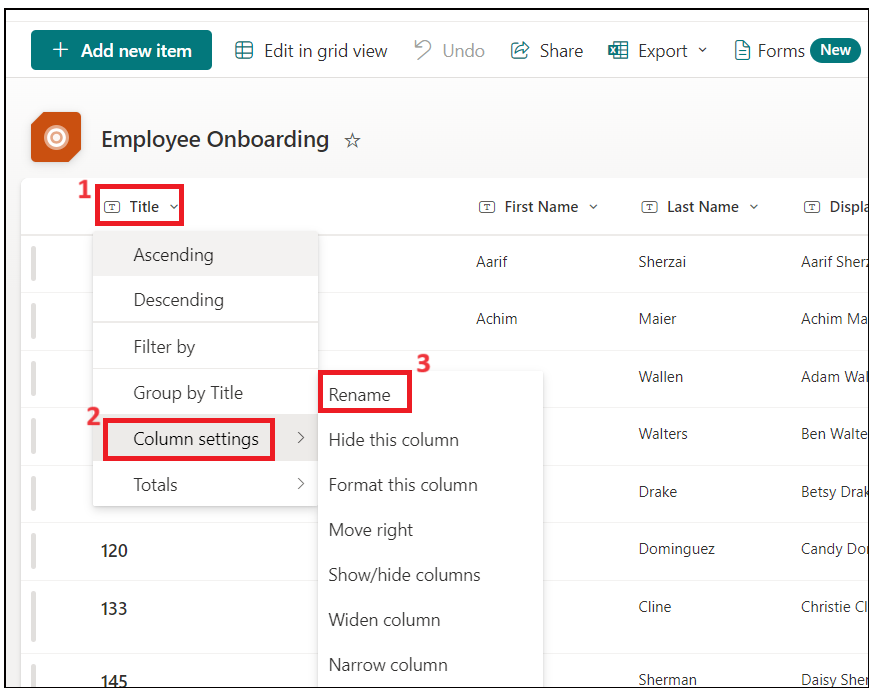
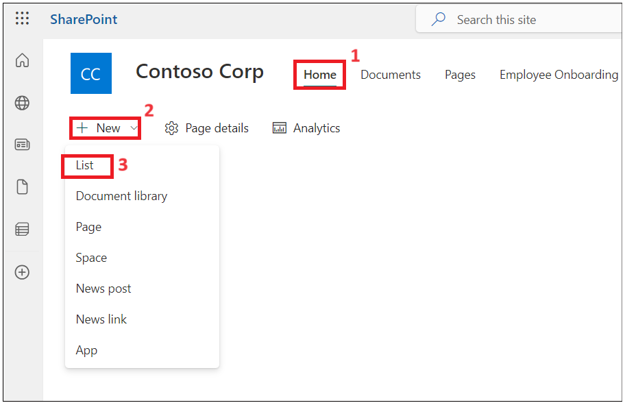
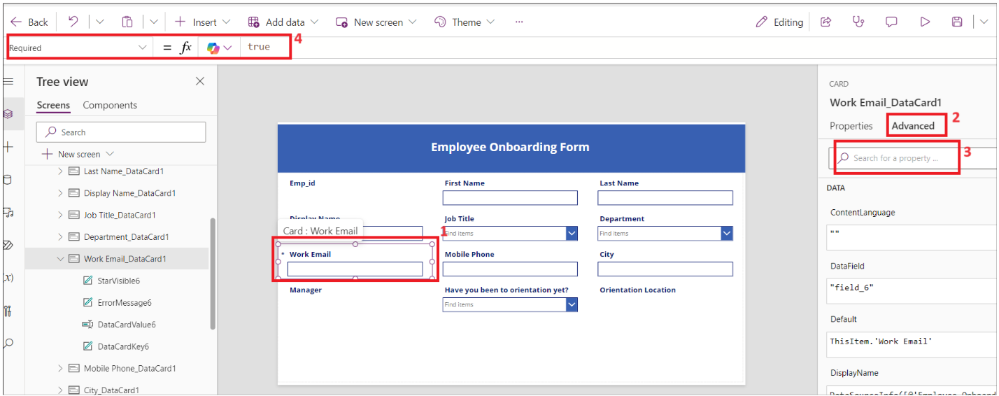
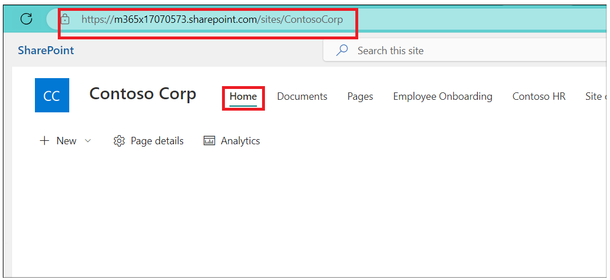
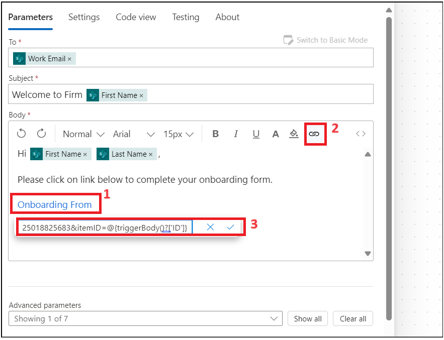

# **실습 1 - 신입 직원 온보딩 자동화**

**목표**: 이 실습의 주요 목표는 Microsoft Power Platform을 사용하여 직원
온보딩 프로세스를 자동화하는 방법을 참가자에게 안내하는 것입니다. 본
실습은 직원 및 HR 정보를 저장하기 위한 SharePoint 목록 생성, 데이터
입력을 위한 Power Apps 양식 사용자 지정, 그리고 Power Automate를 사용한
자동화된 워크플로 구현에 중점을 둡니다. 참가자는 SharePoint를 활용하여
데이터를 관리하고, Power Apps를 활용하여 사용자 경험을 향상시키며,
자동화된 프로세스를 통합하여 온보딩 작업을 간소화하는 방법을 배우게
됩니다. 이 실습 경험은 참가자에게 조직 내 HR 프로세스를 효과적으로
관리하고 자동화할 수 있는 실무 기술을 제공하는 것을 목표로 합니다.

**예상 소요 시간:** 60분

# 연습 1: SharePoint에서 직원, HR 및 관리자 목록을 만들기

## 작업 1: Dataverse 환경 확인

1.  브라우저를 열고 +++ **https://admin.powerplatform.microsoft.com**
    +++로 이동합니다. Office 365 테넌트 자격 증명으로 로그인합니다.

2.  왼쪽 탐색 메뉴에서 **Manage** \> **Environments**을 선택합니다. 아래
    이미지와 같이 **Dev One** Developer 환경이 자동으로 생성되어 있을
    것입니다.

- 

3.  이 실습의 모든 연습을 동일한 개발자 환경에서 실행하세요.

## 작업 2: SharePoint에서 사이트 만들기

1.  +++https:\office.com+++로 이동하여 Office 365 테넌트로 로그인합니다.

2.  왼쪽 상단의 매트릭스를 클릭하고 **앱** 목록에서 **SharePoint**를
    선택하세요.

- 

  

3.  상단 메뉴에서 **+Create site**를 클릭합니다.

- 

4.  **Create a site** 창에서 **Communication site** 타일을 선택합니다.

- 

5.  아래로 스크롤하여 **Blank** 템플릿을 선택합니다.

- 

6.  **Use template**를 선택합니다.

- 

7.  사이트 이름과 설명을 입력한 후 **Next** 버튼을 클릭합니다.

    - Site Name: +++**Contoso Corp**+++

    - Site Description: +++**Onboarding new employee.**+++

- 

8.  기본 언어를 그대로 두고 **Create Site**를 클릭합니다.

- 

  

## 작업 3: CSV 파일을 사용하여 SharePoint 사이트에 직원 목록 만들기

1.  **Home –\> New –\> List**을 클릭합니다.

- 

2.  **Create a list** 창에서 **From CSV** 타일을 선택합니다.

- 

3.  **Upload file**를 클릭하고 **C:Files**로 이동하여 **Employee.csv**
    파일을 선택합니다.

- 

4.  **Work Email** 열 유형을 **single line of text**로 변경한 후
    **Next**를 클릭합니다.

- 

5.  이름을 +++ **Employee Onboarding** +++로 입력하고, 요청 시 설명: +++
    **New Contoso Corp employee** +++을 입력한 다음 **Create**를
    클릭합니다.

- 

  

6.  이제 직원 목록이 생성되었습니다. **Title drop-down** \> **Column
    settings** \> **Rename**를 선택하여**Title** 열의 이름을
    +++**Emp_id**+++로 변경합니다.

- 

  

7.  이제 직원 테이블은 다음과 같아야 합니다.

- 

8.  **Settings -\>List settings**을 클릭합니다.

- 

9.  **Department** 열 링크를 클릭합니다.

- 

10. 아래 값을 변경한 후 **Ok**를 클릭합니다.

    - Type of Column : **Choice**

    - Allow ‘Fill-in’ choices: **Yes**

- 

11. **Job title** 열에 대해서도 위 단계를 반복합니다.

12. **Have you been to orientation yet?**열을 선택하고 아래 사항을
    변경한 후 **OK**를 클릭합니다.

    - Type of Column : **Choice**

    - Allow ‘Fill-in’ choices: **Yes**

    - Type each choice on a separate line : **Yes No**

- 

13. 아래 속성을 사용하여 **Orientation Location**에 대해 위의 단계를
    반복한 다음 **Ok**를 선택합니다.

    - Type of Column : **Choice**

    - Allow ‘Fill-in’ choices: **Yes**

    - Type each choice on a separate line : **Redmon Reno**

- 

14. **Manager** 열에 대해 위 단계를 반복하고 아래 속성을 추가한 다음
    **Ok**를 선택합니다.

    - Type of Column : **Choice**

    - Allow ‘Fill-in’ choices: **Yes**

- 

15. **Home**을 클릭하여 **Site**로 돌아갑니다.

- 

## 작업 4: CSV 파일을 사용하여 SharePoint 사이트에 HR 목록 만들기

1.  **Home –\> New –\> List**를 클릭합니다.

- 

2.  **Create a list window**에서 **From CSV tie**를 선택합니다.

- 

3.  **file** 업로드를 클릭하고 **C:Files**를 찾아
    **Import_HR_M365.CSV**를 선택한 후 **Open**을 클릭합니다.

- 

4.  **Work Email** 열 유형을 **Single line of text**로 변경한 후
    **Next**를 클릭합니다.

- 

5.  아래 세부 정보를 입력합니다

    - Name : +++**Contoso HR**+++

    - Description : +++**Contoso Human Resource**+++, 그런 다음
      **Create** 버튼을 클릭합니다.

- 

6.  **Title –\> Column settings –\> Rename**을 +++**Emp_id**+++로
    바꾸기를 클릭합니다.

- 

  

7.  HR 테이블은 이제 아래 이미지와 같아야 합니다.

- 

# 연습 2: SharePoint 목록용 Power Apps 만들기

이 연습에서는 직원에게 공식 정보를 담은 이메일을 보내고 문서 작성 및
업로드를 요청하는 애플리케이션을 만들어 보겠습니다.

## 작업 1: 인사 담당자가 작성할 수 있도록 PowerApps를 사용하여 직원 양식을 사용자 지정합니다.

1.  **SharePoint –\> Employee onboarding** 메뉴에서 URL을 복사하여
    메모장에 저장합니다.

- 

2.  새 탭을 열고 +++**https://make.powerapps.com/**+++로 이동합니다.
    Office 365 관리자 테넌트로 로그인하고 **Dev One**(개발자) 환경을
    선택합니다. ‘Try the new Power Apss experience’토글 버튼을
    **비활성화**합니다.

- 

3.  왼쪽 탐색 메뉴에서 **Apps**을 클릭합니다. **New App –\> Start with a
    page design** 을 선택합니다.

- 

4.  **Blank Canvas**타일을 선택합니다.

- 

5.  **Screen1**을 마우스 오른쪽 버튼으로 클릭하고 **Rename**을
    선택합니다.

- 

6.  **HrEmployeeform**으로 이름 변경합니다.

- 

7.  양식을 선택하고 **Insert –\> Edit form**을 클릭합니다.

- 

8.  **SharePoint**를 검색하고 **Select a data source**드롭다운에서
    **SharePoint connector**를 선택합니다.

- 

9.  **Connect**에서 **SharePoint**를 선택합니다.

- 

10. 1단계에서 복사한 **SharePoint list URL** URL을 **Enter SharePoint
    URL**텍스트 필드에 입력한 다음 **Connect**를 클릭합니다.

- 

11. **Employee Onboarding** 목록을 선택한 다음 **Connect**를 클릭합니다.

- 

12. 양식을 컨테이너로 끌어서 놓습니다.

- 

13. Form1 컨테이너를 약간 아래로 끌어서 **Insert –\> Rectangle**을
    클릭하여 양식에 헤더를 삽입합니다.

- 

14. 사각형을 컨테이너 너비에 맞게 조정합니다. **Insert –\> Text
    label**을 클릭합니다.

- 

15. 텍스트 필드의 너비를 사각형으로 변경하고 아래 속성을 업데이트합니다.

    - **Tex: New Employee Onboarding Form**

    - **Font Size:** 27

    - **Font weight:** Bold

    - **Text alignment:** Centre

    - **Colour:** White

- 

16. **Emp_Id, First Name**, **Last_Name**을 필수 필드로 설정합니다.

17. **Emp_Id** 필드를 선택하고 필요한 값을 변경합니다. **Properties**
    아래에서 **Advanced**를 클릭하고 **Unlock to change properties**를
    선택합니다.

- 

18. 이제 **Required** 값을 true로 설정합니다. **Emp_id** 필드 옆에
    별표가 표시됩니다.

- 

19. **First Name 및 Last_Name**에 대해 위 두 단계를 반복합니다.

- **참고**: 필드가 보이지 않으면 container -\> properties -\> Edit(
  fields)을 선택한 후 필드를 추가하고 순서를 변경합니다.

  

20. 사각형 양식/FormScreen1을 선택한 다음 **Insert –\> Button**을
    클릭합니다.

- 

21. 버튼을 끌어서 양식의 **Department** 필드에 놓고 아래 속성을
    업데이트합니다.

- **Text**: **Submit**

  

22. **New Screen**을 클릭하고 **Success**템플릿을 선택합니다.

- 

23. 아래 이미지에 표시된 대로 새 화면을 선택하고 이름을 **Success**로
    바꿉니다.

- 

24. **Lb1Successmsg1**을 선택하고 텍스트를 **New employee added**로
    변경합니다.

- 

25. 이제 **Insert –\> Icons –\> Back arrow**를 클릭합니다.

- 

26. 뒤로 화살표를 선택하고 아래 속성을 설정합니다.

- Tool Tip: **Go Back**

- OnSelect: +++**Back(ScreenTransition.CoverRight)**+++

&nbsp;

- 

27. **HrEmployeeform을** 클릭합니다. **Button**을 선택하고
    **Onselect**를 선택한 후 아래 수식을 입력합니다.

- **참고**: SharePoint 양식에 맞게 수식을 업데이트하세요.

  +++**SubmitForm(*Form1*);ResetForm(*Form1*);Navigate(*Success*)**+++

  

28. **Form1**을 선택하고 **OnSuccess**를 선택한 후 수식을 아래 수식으로
    바꿉니다.

- +++**ResetForm(Self); RequestHide();Notify(“New Employee
  added”,NotificationType.Success)**+++

  

29. **Save –\> Save as**버튼을 클릭하고 이름을 **EmpformforHr**로 입력한
    다음 **Save**를 클릭합니다.

- 

30. 양식을 선택하고 **Default** 모드를 **New**로 변경한 다음 **Save
    -\>** **Preview**아이콘을 클릭합니다.

- 

31. 임의의 **Emp id, First Name**, **Last Name**을 입력한 후**Submit**
    버튼을 클릭합니다.

- 

32. **New employee added message** 메시지가 표시됩니다. **Back** 버튼을
    클릭합니다.

- 

33. **Publish** 버튼을 클릭한 다음 **Publish this version** 버튼을
    클릭합니다.

- 

34. 브라우저에서 SharePoint 탭으로 돌아갑니다. 목록에 새로 추가한 직원의
    직원 기록이 표시됩니다.

## 작업 2: 직원을 위한 직원 온보딩 캔버스 앱 만들기

1.  **SharePoint-onboarding**에서 URL을 복사하여 메모장에 저장합니다.

- 

2.  새 탭을 열고 +++**https://make.powerapps.com/**+++로 이동합니다.
    Office 365 관리자 테넌트로 로그인하고 **Dev One** 개발자 환경을
    선택합니다.

3.  왼쪽 탐색 메뉴에서 **Apps**을 클릭합니다. **New App -\> Start with a
    page design**을 선택합니다.

- 

4.  **Blank Canvas** 타일을 선택합니다.

- 

5.  **Screen1**을 마우스 오른쪽 버튼으로 클릭하고 **Rename**를
    선택합니다.

- 

6.  **Employeeform 6. Employeeform**으로 이름을 변경합니다.

- 

7.  **Insert**을 클릭하고 양식**Edit**을 선택합니다.

- 

8.  **SharePoint**를 검색하고 **Select a data source**드롭다운에서
    **SharePoint connector**를 선택합니다.

- 

9.  **Add Connection**에서 **SharePoint**를 선택합니다.

- 

10. 1단계에서 복사한 **SharePoint list URL**을 SharePoint URL 입력
    텍스트 필드에 입력하고 **Connect**을 클릭합니다.

11. **Choose a list**에서 **Employee Onboarding** 목록을 선택한 후
    **Next**을 클릭합니다.

- 

12. **Employee Onboarding** 목록을 선택한 다음 **Connect**을 클릭합니다.

- 

13. 양식을 컨테이너로 끌어서 놓습니다.

- 

14. 속성에서 **Form 1**과 **Display**모드를 **New**로 선택합니다.

- 

15. Form1 컨테이너를 약간 아래로 끌어서 **Insert -\> Rectangle**을
    클릭하여 양식에 헤더를 삽입합니다.

- 

16. 사각형의 너비를 컨테이너로 변경하고 **Insert –\> Text label**을
    선택합니다.

- 

17. 레이블을 선택하고 아래 properties을 설정합니다.

    - **Text: Employee Onboarding Form**

    - **Font Size: 25**

    - **Font weight: Bold**

    - **Text alignment: Centre**

    - **Colour: White**

- 

18. **Emp_Id** 필드 이름을 선택하고 속성에서 **글꼴 크기를 16**으로,
    **글꼴 두께**를 **굵게** 변경합니다. **Emp_Id** 필드가 없으면
    캔버스에서 **Form1** 위에 마우스를 올려놓고 **Fields** \> **Add
    fields**를 선택한 후 **Emp_Id**를 선택합니다(이 목록에도
    **Emp_Id**가 없으면 **Title**을 선택합니다). 그런 다음 **Add**를
    선택합니다.

- 

19. 모든 필드에 대해 위의 단계를 반복합니다.

- 

20. **Orientation location**항목을 선택하고 **Visible** 속성을
    **false**로 설정합니다.

- 

21. **Have you been to orientation yet**? 텍스트 필드를 선택하고 레이블
    **edit**을 클릭합니다.

- 

22. 레이블 값을 **Orientationdropdown**으로 변경합니다.

- 

23. **Orientation Location data card**를 선택하고 **Visible**를 선택한
    다음 아래 이미지에 표시된 대로 수식을 아래에 배치합니다.

- +++**If(*Orientationdropdown*.Selected.Value=“No”,true,false)**+++

  

24. **Save**을 클릭하고 앱 이름을 **EmployeeOnboardingForm**으로 입력한
    다음 **Save** 버튼을 클릭합니다.

- 

25. **Emp_id**, **First Name**, **Last Name**, **Manager**는 HR에서
    입력하므로 표시 모드를 **View**로 변경하세요.

26. 필드를 선택하고 **on Advanced –\> Unlock to change properties**를
    클릭하여 속성을 변경하고 **Display mode**를
    **Parent.DisplayMode.View**로 업데이트합니다.

- 

  

  

  

  

27. **Work email**필드 **Unlock property**속성을 선택하고
    **Required**속성을**true**로 설정합니다. 필요한 경우 다른 필드에도
    이 과정을 반복합니다.

- 

28. **Form1**을 선택하고 **OnFailed** 필드 값을

- +++**Notify(“Required Fields can’t be
  empty.”,NotificationType.Error)**+++로 업데이트합니다.

  

29. **OnSuccess**를 선택하고 값을

- +++**Notify(“Thank you for filling out the
  form”,NotificationType.Success)**+++  
  로 설정합니다.

  

30. 이제 폼 끝에 **submit** 버튼을 추가해 보겠습니다. **Insert –\>
    Button**을 클릭하세요.

- 

31. 버튼의 속성을 변경하고 양식을 저장합니다.

    - Text: **Submit.**

    - Onselect: +++**SubmitForm(*Form1*);NewForm(*Form1*)**+++

- 

32. **Save**을 클릭한 다음 앱 **Preview** 버튼을 클릭합니다.

- 

33. 세부 정보를 입력한 후 **Submit**을 클릭합니다.

- 

34. 성공 알림이 표시됩니다.

- 

35. 미리보기 창을 닫습니다.

36. **Tree View**에서 **App**을 클릭합니다. **OnStart**를 선택하고 아래
    수식을 입력합니다.

- Set(

          onboardinglistitem,

          LookUp(

              'Employee Onboarding',

              ID = Value(Param("ItemID"))

          )

      )

  

37. **Tree View**에서 **Form1**을 선택합니다. 항목을 선택하고 값을
    **onboardinglistitem**으로 입력합니다.

- 

38. **Save** 및 **Publish –\> Publish this version**를 클릭합니다.

- 

39. **Power Apps** 홈페이지로 돌아가서 **Apps –\> Your app –\>
    Details**를 클릭합니다.

- 

40. 다음 작업에 사용할 웹 링크를 복사합니다.

- 

41. 미리 보기 창을 닫고 SharePoint 탭으로 이동하여 목록에서 위의
    레코드를 확인합니다.

- 

## 작업 3: 새 직원에게 양식을 전송하는 Power Automate 흐름 만들기

1.  **SharePoint** 탭으로 돌아가 URL을 복사합니다.

- 

2.  새 탭을 열고 +++https://make.powerautomate.com/+++로 이동하여 관리자
    테넌트 계정으로 로그인합니다.

3.  **Dev One** 개발자 환경을 선택합니다.

4.  왼쪽 탐색 메뉴에서 **My flows**을 클릭하세요. **New Flow –\>
    Automated Cloud flow**을 클릭합니다.

- 

5.  흐름 이름을 **Onboarding new employee**으로 입력합니다. **When an
    item is created**를 검색하여 SharePoint에서 선택한 후 **create**를
    클릭합니다.

- 

6.  작업을 선택합니다. **Site Address –\> Enter custom value**을
    클릭합니다.

- 

7.  1단계에서 복사한 주소를 입력한 후 아래 이미지에 표시된 대로
    **Employee Onboarding**목록을 선택합니다.

- 

8.  **+**를 클릭하여 새로운 작업을 추가합니다.

- 

9.  **Send an email (V2)**를 검색하여 선택합니다.

- 

10. 텍스트 필드를 클릭하고 **Enter the data from previous
    step**.선택합니다.

- 

11. **Work email**을 선택합니다.

- 

12. 제목란에 **Welcome to Firm**을 입력하고 이전 단계에서 **First
    Name**을 선택합니다.

- 

13. 이메일 본문에 아래 데이터를 입력합니다. 그림과 같이 동적 값을
    삽입합니다.

- Hi first name Lastname,

  아래 링크를 클릭하여 온보딩 양식을 작성하세요.

  

  

14. Task 2에서 복사한 웹 링크를 입력하고 링크 끝에 **&itemID=**을 추가한
    후 아래 이미지와 같이 동적 ID를 선택합니다.

- 

  

15. 링크를 잘라낸 다음 **Onboarding Form**이라는 텍스트를 입력하고 링크
    아이콘을 선택하여 클릭합니다. 위 단계에서 복사한 링크를
    붙여넣습니다.

- 

16. 지금 흐름을 저장합니다.

- 

  

## 작업 4: 흐름 테스트

1.  **Power Apps 탭**으로 돌아가서 **EmpformforHr** 앱을 선택합니다.

- 

2.  IF asked then allow permissions.

- 

3.  양식에 정보를 입력합니다. 관리자 테넌트 ID에 회사 이메일을 입력하고
    양식을 제출합니다.

- 

  

4.  Power Automate 흐름으로 돌아가서 흐름 상태를 확인합니다.

- 

  

5.  새 탭을 열고 +++**https:\outlook.com**+++로 이동하여 Office 365
    테넌트 계정으로 로그인하고 받은 편지함을 확인합니다. HR에서 생성된
    이메일에서 **Onboarding Form** 링크를 클릭합니다.

- 

**결론**: 이 실습을 완료하면 참가자는 Microsoft Power Platform 도구를
사용하여 직원 온보딩 워크플로를 생성하고 관리하는 방법을 종합적으로
이해하게 됩니다. SharePoint 목록을 생성 및 구성하여 직원 데이터를
저장하고, HR 부서에서 사용할 맞춤형 Power Apps 양식을 구축하고, 신입
직원과의 원활한 소통을 위해 자동화된 Power Automate 흐름을 설정하는
방법을 익힐 수 있습니다. 이러한 경험을 통해 참가자는 조직의 온보딩
프로세스를 개선하고, 데이터 정확도를 향상시키며, HR 관리 워크플로의
효율성을 높일 수 있습니다. 전반적으로, 이 실습은 참가자에게 실제
비즈니스 운영 최적화에 적용할 수 있는 귀중한 기술을 제공합니다.
