# **Laboratoire 1 - Automatiser l'intégration des nouveaux employés**

**Objectif :** L'objectif principal de ce laboratoire est de guider les
participants dans l'automatisation du processus d'intégration des
employés à l'aide de Microsoft Power Platform. Les exercices se
concentrent sur la création de listes SharePoint pour stocker les
informations sur les employés et les ressources humaines, la
personnalisation des formulaires dans Power Apps pour la saisie de
données et l'implémentation de flux de travail automatisés à l'aide de
Power Automate. Les participants apprendront à tirer parti de SharePoint
pour la gestion des données, à utiliser Power Apps pour améliorer
l'expérience utilisateur et à intégrer des processus automatisés pour
rationaliser les tâches d'intégration. Cette expérience pratique vise à
doter les participants de compétences pratiques pour gérer et
automatiser efficacement les processus ressources humaines au sein de
leurs organisations.

**Temps estimé :** 60 minutes

# Exercice 1 : Créer une liste d'employés, de Ressources humaines et de managers dans Share point.

## Tâche 1 : Vérification de votre environnement Dataverse

1.  Ouvrez un navigateur et accédez à
    **+++https://admin.powerplatform.microsoft.com+++.** Connectez-vous
    à l'aide de vos informations d'identification de Office 365 tenant.

2.  Sélectionnez **Manage** \> **Environments** dans le volet de
    navigation de gauche. L' environnement **Dev One** Developer doit
    avoir été créé pour vous, comme illustré dans l'image ci-dessous.

- 

3.  Utilisez le même environnement de développement pour exécuter tous
    les exercices de cet atelier.

## Tâche 2 : Créer un site dans SharePoint

1.  Accédez à **+++https :\office.com+++** et connectez-vous avec votre
    Office 365 Tenant.

2.  Cliquez sur matrice dans le coin supérieur gauche et sélectionnez
    **SharePoint** dans la liste des **applications**.

- 

  

3.  Cliquez sur **+Create site** dans le menu supérieur.

- 

4.  Sélectionnez la vignette du **site de communication** dans la
    fenêtre **Create site**.

- 

5.  Faites défiler l'écran vers le bas et sélectionnez le Template
    **vierge** .

- 

6.  Cliquez sur **Use template**..

- 

7.  Entrez le nom et la description du site, puis cliquez sur le bouton
    **Next**.

    - Nom du site : +++**Contoso Corp**+++

    - Description du site : +++ **Onboarding new employee** +++

- 

8.  Conservez la langue par défaut puis cliquez sur **Create site.**

- 

  

## Tâche 3 : Créer une liste d'employés dans le site SharePoint à partir d'un fichier CSV

1.  Cliquez sur **Home –\> New –\> List.**

- 

2.  Sélectionnez **From CSV** dans la fenêtre **Create a list**.

- 

3.  Cliquez sur **Upload file** et accédez à **C :Files** et
    sélectionnez **Employee.csv** fichier.

- 

4.  Remplacez le type de colonne **E-mail professionnel** par **une
    seule ligne de texte**, puis cliquez sur **Next**.

- 

5.  Entrez ensuite Nom sous la forme : +++**Employee Onboarding** +++
    et, si vous y êtes invité, entrez Description : +++ **New Contoso
    Corp employee** +++, puis cliquez sur **Create**.

- 

  

6.  La liste Employés est maintenant créée pour vous. Renommez la
    **colonne Titre** en +++**Emp_id**+++ en sélectionnant la **liste
    déroulante Titre** \> **Paramètres de colonne** \> **Renommer**.

- 

  

7.  Maintenant, la table des employés devrait aimer ceci

- 

8.  Cliquez sur **Settings -\>List settings.**

- 

9.  Cliquez sur le lien de la colonne **Département.**

- 

10. Modifiez les valeurs ci-dessous, puis cliquez sur **Ok**.

    - Type de colonne : **Choice**

    - Autoriser les choix ‘Fill-in’ : **Yes**

- 

11. Répétez l'étape ci-dessus pour la **colonne Titre du poste**.

12. Sélectionnez **Avez-vous déjà participé à l'orientation ?** et
    faites ci-dessous chagnes, puis cliquez sur **OK**.

    - Type de colonne : **Choice**

    - Autoriser les choix ‘Fill-in’ : **Yes**

    - Tapez chaque choix sur une ligne distincte : **Yes No**

- 

13. Répétez l'étape ci-dessus pour **l'emplacement d'orientation** avec
    les propriétés ci-dessous, puis sélectionnez **OK**.

    - Type de colonne : **Choice**

    - Autoriser les choix ‘Fill-in’ : **Yes**

    - Tapez chaque choix sur une ligne distincte : **Redmon Reno**

- 

14. Répétez l'étape ci-dessus pour la colonne **Manageur** avec les
    propriétés ci-dessous, ajoutez, puis sélectionnez **OK**.

    - Type de colonne : **Choice**

    - Autoriser les choix ‘Fill-in’ : **Yes**

- 

15. Cliquez sur **Home** pour revenir au **Site**.

- 

## Tâche 4 : Créer une liste Ressouces humaines dans le site SharePoint à partir d'un fichier CSV

1.  Cliquez sur **AHome –\> New –\> List.**

- 

2.  Sélectionnez **From CSV tile** dans la **fenêtre Créer une liste.**

- 

3.  Cliquez sur Télécharger un **fichier** et parcourez **C :Files,
    puis** sélectionnez-**Import_HR_M365.CSV** puis cliquez sur
    **Open.**

- 

4.  Remplacez **le type de colonne** E-mail professionnel par **Une
    seule ligne de texte**, puis cliquez sur **Next**.

- 

5.  Entrez les détails ci-dessous

    - Nom : +++**Contoso HR**+++

    - Description : +++**Contoso Human Resource**+++, puis cliquez sur
      le bouton **Create**.

- 

6.  Cliquez sur **Titre –\> Paramètres de la colonne –\> Renommer** la
    colonne en +++**Emp_id**+++.

- 

  

7.  Le tableau Ressources humaines devraient maintenant être comme
    ci-dessous.

- 

# Exercice 2 : Créer des listes Power Apps pour SharePoint

Dans cet exercice, vous allez construire votre application pour envoyer
un e-mail à l'employé avec des informations officielles et lui demandant
de remplir et de télécharger des documents.

## Tâche 1 : Personnaliser le formulaire de l'employé avec PowerApps pour que les Ressources humaines puissent le remplir.

1.  À partir de l **'intégration de vos employés \> SharePoint**, copiez
    l'URL et enregistrez-la dans le Bloc-notes.

- 

2.  Ouvrez un nouvel onglet et accédez à
    +++**https://make.powerapps.com/+++.** Connectez-vous avec votre
    office 365 admin tenant et sélectionnez votre **environnement Dev
    One** (développeur). Pour l'instant, **disable** le bouton bascule
    qui dit  ‘Try the new Power Apss experience’. 

- 

3.  Cliquez sur **Applications** dans le menu de navigation de gauche.
    Sélectionnez **New App –\> Start with a page design.**

- 

4.  Sélectionnez la vignette **Canvas vierge**

- 

5.  Faites un clic droit sur **l'écran 1** et sélectionnez **Renommer.**

- 

6.  Renommer en **HrEmployeeform**

- 

7.  Sélectionnez le formulaire et cliquez sur **Insérer \> Modifier le
    formulaire.**

- 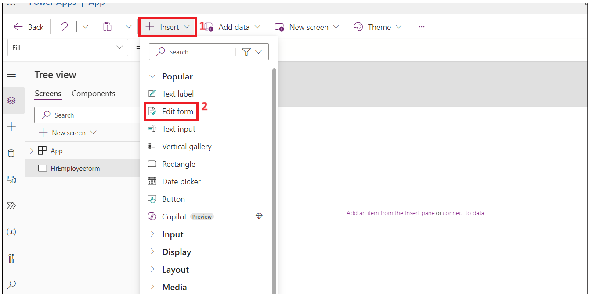

8.  Recherchez **SharePoint** et sélectionnez **SharePoint connector**
    dans la **liste** déroulante **Sélectionner une source de données**.

- 

9.  Sélectionnez **SharePoint** sous **connect.**

- 

10. Entrez l'**URL de la liste SharePoint** copiée à l'étape 1 du
    formulaire dans **le champ de texte Entrer l'URL SharePoint**, puis
    cliquez sur **Connect**.

- 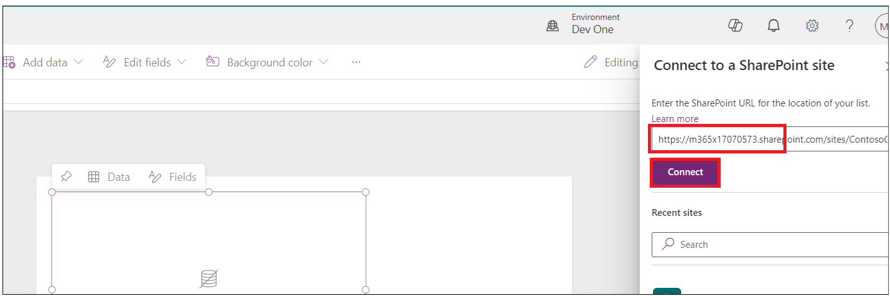

11. Sélectionnez **Liste d'intégration des employés** , puis cliquez sur
    **Connect**.

- 

12. Faites glisser le formulaire et l'insérez dans le conteneur.

- 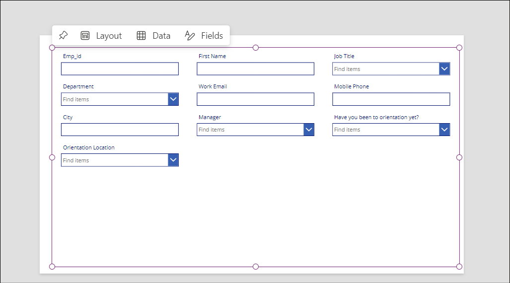

13. Faites glisser le conteneur Form1 un peu vers le bas et cliquez sur
    **Insert –\> Rectangle** pour insérer l'en-tête dans le formulaire.

- 

14. Ajustez le rectangle à la largeur du conteneur. Cliquez sur **Insert
    –\> Text label**.

- 

15. Remplacez la largeur du champ de texte par le rectangle et mettez à
    jour les propriétés ci-dessous.

    - **Tex : Formulaire d'intégration des nouveaux employés**

    - **Taille de la police :** 27

    - **Poids de la police :** Bold

    - **Alignement du texte :** Centre

    - **Couleur :** Blanc

- 

16. Renseignez-**Emp_Id** **, Prénom** et **Last_Name** comme
    obligatoire.

17. Sélectionnez **Emp_Id** champ et modifiez la valeur **requise**.
    Cliquez sur **Avanced** sous **Properties** et sélectionnez **Unlock
    to change properties**.

- 

18. Définissez maintenant la **valeur Required** sur vrai. Vous devriez
    voir étoile à côté **Emp_id** champ.

- 

19. Répétez les deux étapes ci-dessus pour **First Name** et
    **Last_Name**

- **Remarque** : Si vous ne voyez pas le champ, sélectionnez le
  conteneur -\> properties -\> Edit( fields) .add et réorganisez-le.

  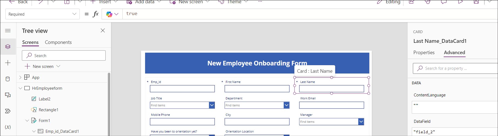

20. Sélectionnez le formulaire rectangulaire/FormScreen1, puis cliquez
    sur le **Insert –\> Button**..

- 

21. Faites glisser et placez le bouton sous **Department** déposé dans
    le formulaire et mettez à jour sous les propriétés.

- **Texte** : **Soumettre**

  

22. Cliquez sur **New Screen** et sélectionnez Modèle **Success**.

- 

23. Sélectionnez le nouvel écran et **renommez-le** en **Success** ,
    comme illustré dans les images ci-dessous.

- 

24. Sélectionnez **Lb1Successmsg1** et remplacez le texte par **New
    employee added**.

- 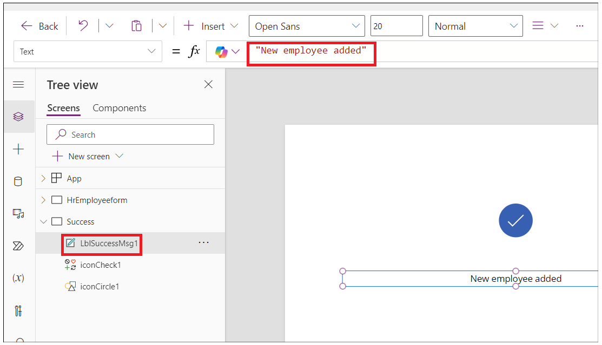

25. Maintenant, cliquez sur **Insert –\> Icons –\> Back arrow.**

- 

26. Sélectionnez Flèche de retour et définissez les propriétés
    ci-dessous.

- Astuce : **Go Back**

- OnSelect : +++**Back(ScreenTransition.CoverRight)**+++

&nbsp;

- 

27. Cliquez sur **HrEmployeeform.** Sélectionnez **Bouton,** puis
    sélectionnez **Onselect** et entrez la formule ci-dessous.

- **Remarque :** Mettez à jour la formule avec votre formulaire
  SharePoint.

  +++**SubmitForm**(***Formulaire1*) ;
  RéinitialiserFormulaire(*Formulaire1*) ; Naviguer(*Succès*)**+++

  

28. Sélectionnez **Form1,** sélectionnez **OnSuccess** et remplacez la
    formule par la formule ci-dessous.

- +++**ResetForm(Self); RequestHide();Notify(“New Employee
  added”,NotificationType.Success)**+++

  

29. Cliquez sur le bouton **Save –\> Save as** sous et entrez le nom
    EmpformforHr , puis cliquez sur **Save**.

- 

30. Sélectionnez le formulaire et changez le **mode par défaut** sur
    **Nouveau**, puis cliquez sur l' icône **Save -\>** **Preview**.

- 

31. Entrez un **Emp id, First Name** et un **Last Name**, puis cliquez
    sur le bouton **Submit**.

- 

32. Vous devriez voir **le message Nouvel employé ajouté.** Cliquez sur
    le bouton **Back.**

- 

33. Cliquez sur le bouton **Publish**, puis sur le bouton **Publish this
    version**.

- 

34. Revenez à l'onglet SharePoint dans un navigateur. Vous devriez voir
    l'enregistrement de l'employé du nouvel employé que vous avez ajouté
    dans la liste.

## Tâche 2 : Créer l'application Canvas d'intégration des employés pour l'employé

1.  À partir de votre **SharePoint-onboarding**, copiez l'URL et
    enregistrez-la dans le Bloc-notes.

- 

2.  Ouvrez un nouvel onglet et accédez à
    +++https://make.powerapps.com/+++. Connectez-vous avec votre client
    administrateur Office 365 et sélectionnez votre **environnement de
    développeur Dev One**.

3.  Cliquez sur **Apps** dans le menu de navigation de gauche.
    Sélectionnez **New App -\> Start with a page design.**

- 

4.  Sélectionnez la vignette **Canvas vierge.**

- 

5.  Faites un clic droit sur **Screen1** et sélectionnez **Renommer.**

- 

6.  Renommer en **Employeeform**

- 

7.  Cliquez sur **Insert** et sélectionnez **Edit** le formulaire.

- 

8.  Recherchez **SharePoint** et sélectionnez **SharePoint connector**
    dans la liste déroulante **Sélectionner une source de données.**

- 

9.  Sélectionnez **SharePoint** sous **Ajouter une connexion.**

- 

10. Entrez l' **URL de la liste SharePoint** copiée à l'étape 1 du
    formulaire dans le champ de texte Entrer l'URL SharePoint, puis
    cliquez sur **Connect**.

11. Sous **Choisir une liste** \> sélectionnez **Liste d'intégration des
    employés** , puis cliquez sur **Next.**

- 

12. Sélectionnez **Liste d'intégration des employés** , puis cliquez sur
    **Connect**.

- 

13. Faites glisser le formulaire et l'insérez dans le conteneur.

- 

14. Sélectionnez **Formulaire 1** et Mode **d'affichage** sur
    **Nouveau** sous Propriétés.

- 

15. Faites glisser le conteneur Form1 un peu vers le bas et cliquez sur
    **Insert -\> Rectangle** pour insérer l'en-tête dans le formulaire.

- 

16. Modifiez la largeur du rectangle en fonction du conteneur et
    sélectionnez **Insert –\> Text label**.

- 

17. Sélectionnez l'étiquette et définissez les propriétés ci-dessous
    **.**

    - **Texte : Formulaire d'intégration des employés**

    - **Taille de la police : 25**

    - **Poids de la police : Bold**

    - **Alignement du texte : Centre**

    - **Couleur : Blanc**

- 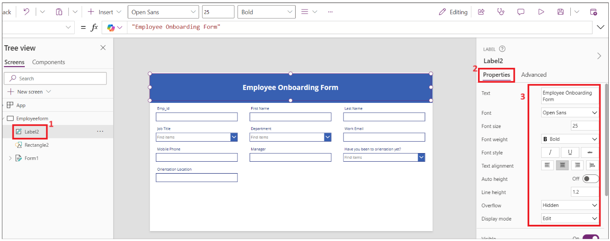

18. Sélectionnez le nom du champ **Emp_Id** et définissez **la taille de
    la police** sur **16** et le **poids de la police** sur **Bold**
    sous Propriétés. Si vous ne trouvez pas **Emp_Id** champ, passez la
    souris sur **Form1** dans le canevas, sélectionnez **Fields** \>
    **Add fields**, sélectionnez **Emp_Id** (si vous ne **Emp_Id** voyez
    pas dans cette liste également, sélectionnez **Titre**), puis
    **Add**.

- 

19. Répétez l'étape ci-dessus pour tous les champs.

- 

20. Sélectionnez **Orientation location** et définissez la propriété
    **Visible** sur **false.**

- 

21. Sélectionnez **le champ de texte Avez-vous déjà été à
    l'orientation** ? et cliquez sur **Edit** l 'étiquette.

- 

22. Remplacez la valeur de l'étiquette par **Orientationdropdown**

- 

23. Sélectionnez **la carte de données Emplacement d'orientation** ,
    puis sélectionnez **la formule Visible** et placez en dessous, comme
    illustré dans l'image ci-dessous.

- +++**If(*Orientationdropdown*.Selected.Value=“No”,true,false)**+++

  

24. Cliquez sur **Save** et entrez le nom de l'application sous la forme
    : **EmployeeOnboardingForm,** puis cliquez sur le bouton **Save**.

- 

25. **Emp_id**, **le prénom**, **le nom** et **le Manageur** sera
    renseignés par les RH, changez donc le mode d'affichage en
    **Affichage**.

26. Sélectionnez le champ et cliquez sur **Advanced –\> Unlock to change
    properties** et mettre à jour **le mode d'affichage** sur
    **Parent.DisplayMode.View**

- 

  

  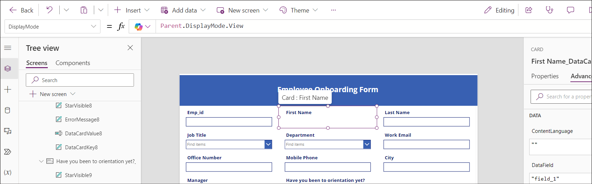

  

  

27. Sélectionnez la **propriété Déverrouiller** le champ **d'adresse
    e-mail professionnelle** et mettez à jour **la propriété
    Obligatoire** sur **true.** Répétez l'opération pour les autres
    champs si nécessaire.

- 

28. Sélectionnez le **Form1** et mettez à jour **la valeur du champ
    OnFailed** sur

- +++**Notify(“Required Fields can’t be
  empty.”,NotificationType.Error)**+++

  

29. Sélectionnez **OnSuccess** et définissez la valeur sur

- +++**Notify(“Thank you for filling out the
  form”,NotificationType.Success)**+++

  

30. Maintenant, ajoutons un bouton à soumettre à la fin du formulaire.
    Cliquez sur **Inset –\> Button.**

- 

31. Modifiez les propriétés du bouton et enregistrez le formulaire.

    - Texte : **Soumettre.**

    - Onselect : +++**SubmitForm(*Form1*) ; NewForm(*Formulaire1*)**+++

- 

32. Cliquez sur **Save**, puis sur les boutons **Preview** de
    l'application.

- 

33. Entrez les détails, puis cliquez sur **Submit**.

- 

34. La notification de réussite doit s'afficher.

- 

35. Fermez la fenêtre d'aperçu.

36. Cliquez sur **Application** dans l' **arborescence**. Sélectionnez
    **OnStart** et entrez la formule ci-dessous.

- Set(

          onboardinglistitem,

          LookUp(

              'Employee Onboarding',

              ID = Value(Param("ItemID"))

          )

      )

  

37. Sélectionnez le **formulaire1** dans l' **arborescence**.
    Sélectionnez l'élément et entrez la valeur sous la forme :
    **onboardinglistitem**

- 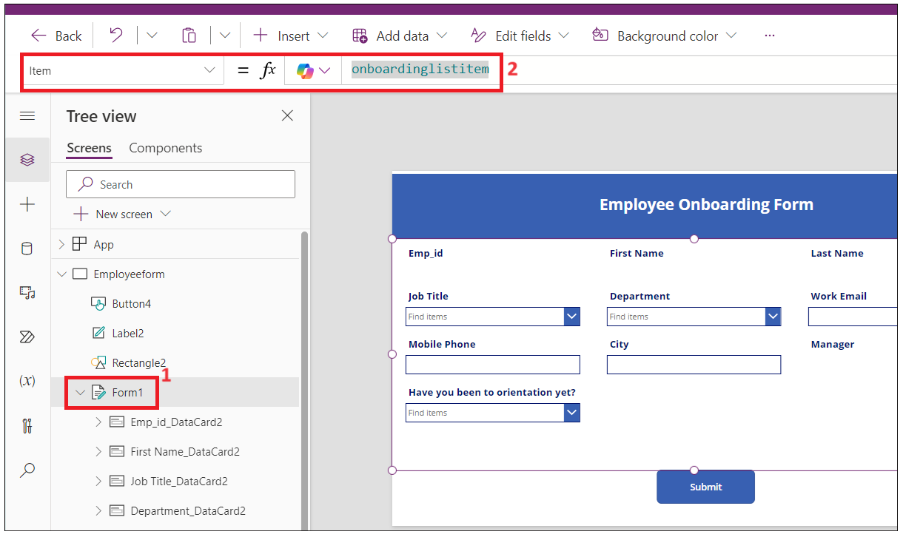

38. Cliquez sur **Save** et **publier \> Publier cette version**.

- 

39. Revenez à la page d'accueil de **Power Apps** , cliquez sur
    **Applications \> Votre application \> Détails**.

- 

40. Copiez le lien Web à utiliser dans la tâche suivante.

- 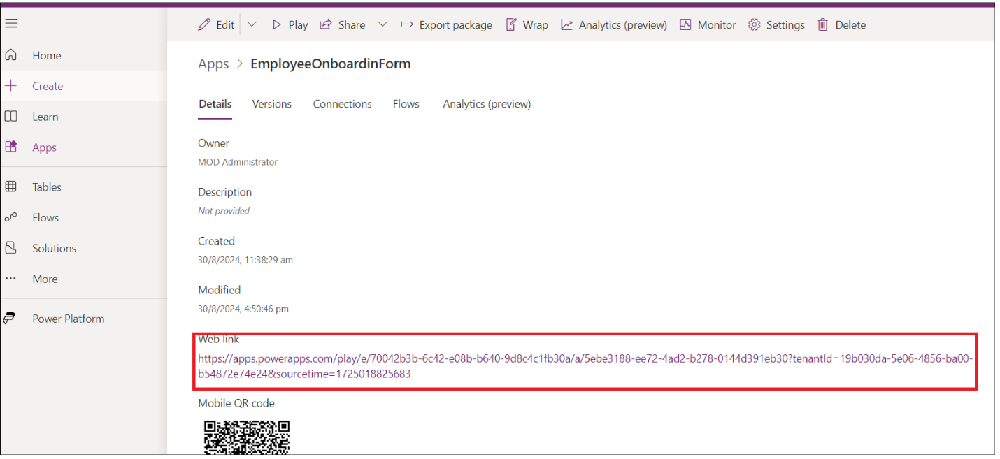

41. Fermez la fenêtre d'aperçu et accédez à votre onglet SharePoint et
    vérifiez l'enregistrement ci-dessus dans la liste.

- 

## Tâche 3 : Créer le Power Automate flow pour envoyer un formulaire au nouvel employé

1.  Revenez à l' **onglet SharePoint** et copiez l'URL.

- 

2.  Ouvrez un nouvel onglet et accédez à
    +++https://make.powerautomate.com/+++ et connectez-vous avec votre
    compte de locataire administrateur.

3.  Sélectionnez votre environnement de développement **Dev One.**

4.  Cliquez sur **Mes flux** dans le menu de navigation de gauche,
    cliquez sur **New Flow –\> Automated Cloud flow.**

- 

5.  Entrez le nom du flux sous la forme : **Intégration d'un nouvel
    employé**. Recherchez **Quand un élément est créé** et
    sélectionnez-le dans SharePoint, puis cliquez sur **create**.

- 

6.  Sélectionnez l'action. Cliquez sur **Adresse du site \> Entrez une
    valeur personnalisée.**

- 

7.  Entrez l'adresse copiée à l'étape 1, puis sélectionnez la liste
    **d'intégration des employés**, comme illustré dans l'image
    ci-dessous.

- 

8.  Cliquez sur **+** pour ajouter une nouvelle action.

- 

9.  Recherchez et sélectionnez **Envoyer un e-mail (V2)**

- 

10. Cliquez sur le champ de texte et sélectionnez **Saisir les données
    de l'étape précédente**.

- 

11. Sélectionnez **E-mail professionnel.**

- 

12. Entrez la ligne d'objet comme suit : **Bienvenue dans le cabinet** ,
    sélectionnez **Prénom** de l'étape précédente.

- 

13. Entrez les données ci-dessous dans le corps de l'e-mail. Insérez les
    valeurs dynamiques comme indiqué dans l'image.

- Salut prénom Nom,

  Veuillez cliquer sur le lien ci-dessous pour remplir votre formulaire
  d'intégration.

  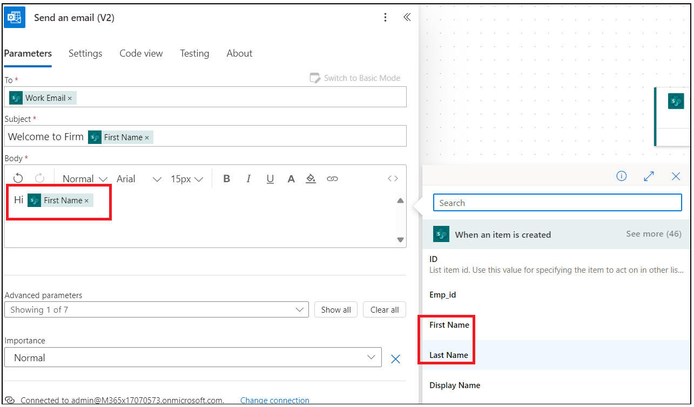

  

14. Entrez le lien Web copié dans la tâche 2 - et ajoutez **&itemID=** à
    la fin du lien et sélectionnez ID dynamique comme indiqué dans
    l'image ci-dessous.

- 

  

15. Coupez le lien, puis entrez le texte : **Formulaire d'intégration**
    et sélectionnez et cliquez sur l'icône du lien. Collez le lien copié
    à l'étape ci-dessus.

- 

16. Enregistrez le flux maintenant.

- 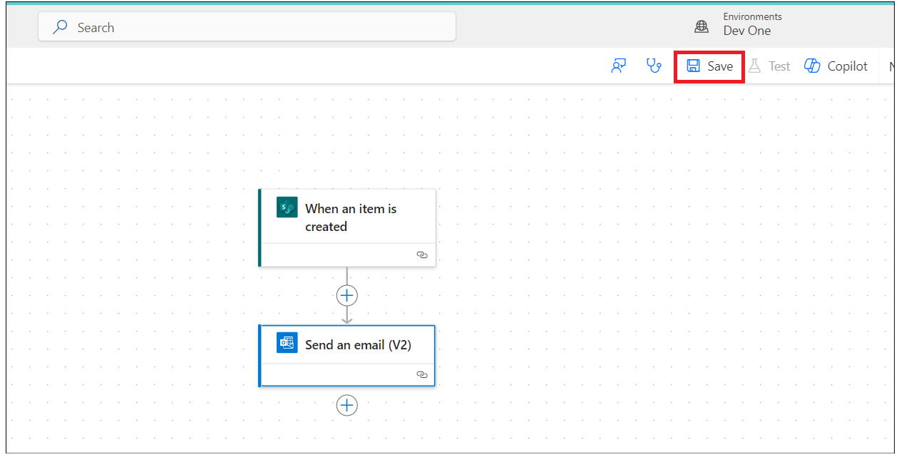

  

## Tâche 4 : Tester le flow.

1.  Revenez à l'**onglet Power Apps**, sélectionnez l 'application
    **EmpformforHR.**

- 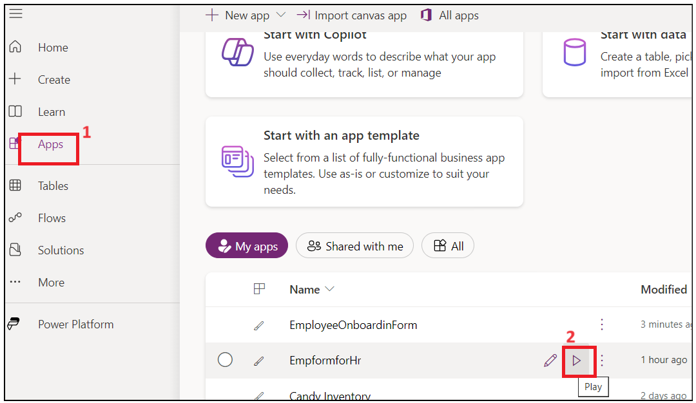

2.  Si on vous le demande, autorisez les autorisations.

- 

3.  Remplissez le formulaire avec vos coordonnées. Entrez l'adresse
    e-mail professionnelle comme ID de locataire administrateur et
    **envoyez** le formulaire.

- 

  

4.  Revenez au flux Power Automate et vérifiez l'état du flux.

- 

  

5.  Ouvrez un nouvel onglet et accédez à +++**https :\outlook.com**+++,
    connectez-vous avec votre compte de locataire Office 365 et vérifiez
    la boîte de réception. Cliquez sur le **lien du formulaire
    d'intégration** dans l'e-mail généré par les ressources humaines.

- 

**Conclusion :** À l'issue de cet atelier, les participants auront
acquis une compréhension approfondie de la création et de la gestion des
flux de travail d'intégration des employés à l'aide des outils Microsoft
Power Platform. Ils créeront et configureront avec succès des listes
SharePoint pour stocker les données des employés, créeront des
formulaires Power Apps personnalisés pour une utilisation par les
ressources humaines et configureront des flux Power Automate automatisés
pour une communication transparente avec les nouveaux employés. Cette
expérience permettra aux participants d'améliorer leurs processus
d'intégration organisationnelle, d'améliorer la précision des données et
de favoriser un flux de travail plus efficace dans la gestion des
ressources humaines. Dans l'ensemble, le laboratoire dote les
participants de compétences précieuses qui peuvent être appliquées dans
des scénarios réels pour optimiser les opérations commerciales.
