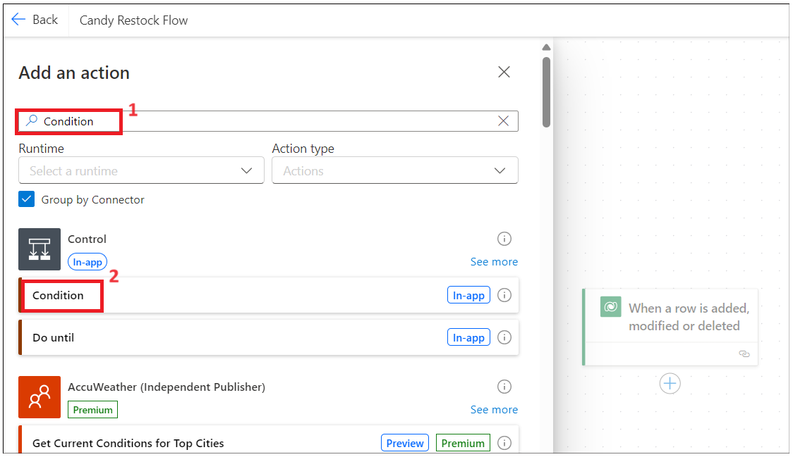
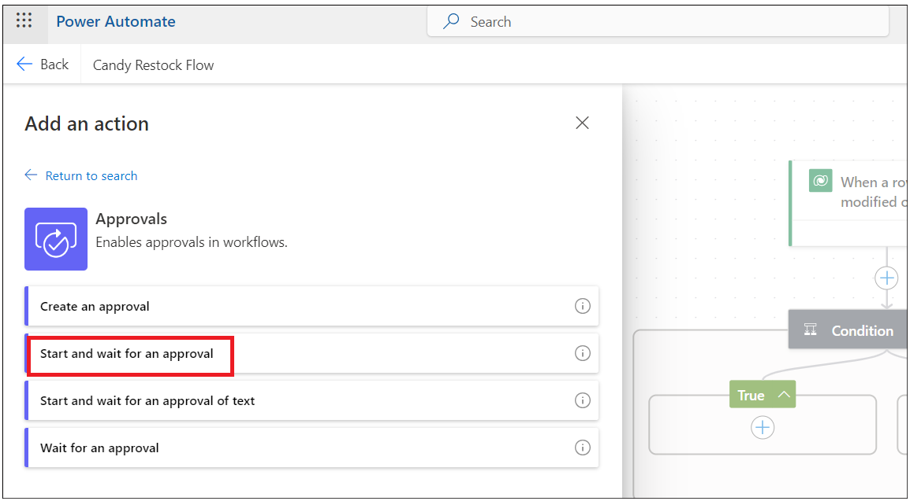
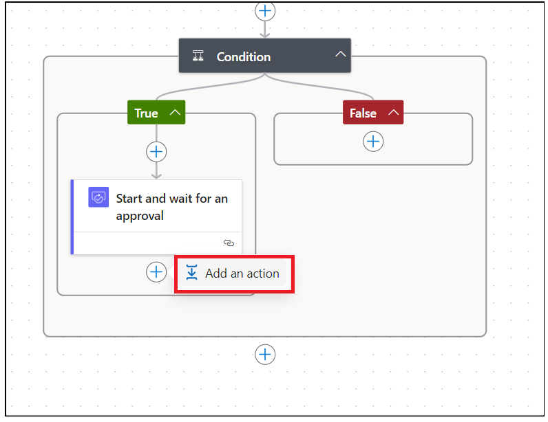

# Lab 2 – Erstellen einer Inventarverwaltungs-App

**Ziel:** Ziel dieses Labs ist es, die Teilnehmer durch die Erstellung
einer funktionalen Inventarverwaltungsanwendung mit Microsoft Power Apps
und Copilot zu führen. Die Teilnehmer lernen, ihre Dataverse-Umgebung
einzurichten, App-Bildschirme zu entwerfen, Daten zu verwalten und
Workflows für die Wiederauffüllung von Lagerbeständen mit Power Automate
zu automatisieren.

**Geschätzte Zeit:** 40 Minuten

## Übung 1: Erstellen einer Inventarverwaltungs-App

### Aufgabe 1: Überprüfen Ihrer Dataverse-Umgebung

1.  Öffnen Sie einen Browser und gehen Sie zu
    +++**https://admin.powerplatform.microsoft.com**+++. Melden Sie sich
    mit Ihrem Office 365-Administratorkonto an.

2.  Wählen Sie im linken Navigationsbereich **Environments** aus. Die
    **Developer environment** sollte für Sie erstellt worden sein, wie
    in der Abbildung unten gezeigt. (Diese Umgebung wird automatisch
    erstellt, sobald Sie die Microsoft Power App for Developer-Lizenz
    mit Ihren Administratorkonten bereitstellen. Der Name der Umgebung
    ist für jedes Administratorkonto unterschiedlich.)

- 

3.  Verwenden Sie dieselbe Entwicklerumgebung, um alle Übungen dieses
    Labs auszuführen.

> **Hinweis**: In diesem Lab wird die Entwicklerumgebung **Dev one**
> verwendet. Der Name der Umgebung kann für verschiedene Benutzer
> unterschiedlich sein. Stellen Sie sicher, dass Sie Ihre
> Entwicklerumgebung auswählen.

### Aufgabe 2: Erstellen einer Inventarverwaltungs-App mit Copilot.

1.  Öffnen Sie einen Browser, und wechseln Sie zu
    +++**https://make.powerapps.com**+++ Melden Sie sich mit dem Office
    365-Administratortenantkonto an.

2.  Klicken Sie auf die Umgebung in der rechten oberen Ecke und wählen
    Sie **Ihre Entwickler**umgebung aus (Dev One ist eine
    Entwicklerumgebung, die in diesem Lab-Leitfaden verwendet wird)

- 

3.  Geben Sie die untenstehende Prompt ein und klicken Sie auf **die**
    **Enter**-Taste.

- +++ **build a candy inventory management app** +++

  

4.  Wählen Sie die Kachel **Start with Copilot** aus

- 

5.  Geben Sie die untenstehende Prompt ein und klicken Sie auf
    **Generate**, um eine Tabelle mit Hilfe von Copilot zu erstellen

- +++ **Candy Inventory management** +++

  

6.  Copilot generiert die Tabellen, wie in der folgenden Abbildung
    gezeigt.

- 

7.  Klicken Sie auf die drei Punkte neben Candy und dann auf **View
    data.**

- 

8.  Die Daten in der Candy-Tabelle sollten Daten enthalten, wie in der
    Abbildung unten gezeigt.

- 

9.  Klicken Sie auf **Supplier –\> View data** und erkunden Sie die
    Daten und schließen Sie dann das Ansichtsfenster.

- 

10. Aktualisieren einer der Lieferanten-E-Mail-IDs mit Ihrer
    geschäftlichen/privaten Arbeits-E-Mail-ID

- 

11. Klicken Sie auf **Order –\> View data**

- 

12. Ener unten Prompt im Textfeld und klicken Sie auf Enter. Diese
    Spalte ist erforderlich, um zu benachrichtigen, wenn die Menge den
    Meldebestand unterschritten hat.

- +++ **Add reorder point column to Candy table** +++

  

13. Fügen Sie eine candyInStock-Spalte mit dem Typ "Number" hinzu. Wenn
    die Menge kleiner als die Meldepunkte ist, wird das Hinzufügen in
    der Spalte "Quantity" mit candyInStock automatisiert.

- +++ **Add** candyInStock\*\* column to Candy table with sample stock
  count \*\*+++

  

14. Die Tabelle wurde mit der Spalte "Reorder point" und der Spalte
    "Candy in Stock" aktualisiert.

- 

15. Klicken Sie auf die Schaltfläche **Save and open app**

- 

16. Auf Fenster **Done working?**, klicken Sie auf **Save and open app**
    und warten Sie, bis die App erstellt wurde.

- 

  

17. Überspringen Sie das Begrüßungsfenster.

- 

18. Die App wird erstellt und sollte wie in der Abbildung unten
    aussehen.

- 

19. Klicken Sie auf die Schaltfläche **Save,** geben Sie den Namen
    **MSCandy Inventory Management App** ein und klicken Sie dann auf
    die Schaltfläche **Save**.

- 

  

20. Erkunde die App. Klicke in der Baumansicht auf **den Candy-Screen**.
    Sie können die Beschriftung des Bildschirms auf **Candy Inventory
    management** aktualisieren

- 

21. Erkunden Sie den Lieferantenbildschirm und aktualisieren Sie ihn
    gemäß Ihren Anforderungen.

- 

### Aufgabe 3: Erstellen Sie den Bildschirm „Candy Quality“

1.  Klicken Sie auf **New Screen** und wählen Sie **Blank**-Vorlage.

- 

2.  Wählen Sie den neuen Bildschirm aus und klicken Sie mit der rechten
    Maustaste auf **Rename**

- 

3.  Benennen Sie den Bildschirm als +++**Candy quality screen**+++

- 

4.  Klicken Sie auf den Bildschirmbereich und wählen Sie **Create a new
    table(preview)**

- 

5.  Klicken Sie auf **New table –\> Add columns and data.**

- 

6.  Klicken Sie auf **New column -\> Edit column.**

- 

7.  Geben Sie den Anzeigenamen als **Candy ID** ein und klicken Sie dann
    auf die Schaltfläche **Update**.

- 

8.  Klicken Sie auf Neue Spalte und geben Sie unten Details ein und
    klicken Sie dann auf **Save**.

    - **Display Name:** Candy Name

    - **Data Type:** Choice

    - **Required:** Yes.

    - **Choices:** add below choices

      - Chocolate Bar

      - Gummy Bears

      - Jellybeans

      - Lollipop

      - Sour Patch Kids

- 

9.  Klicken Sie auf Neue Spalte und fügen Sie eine Spalte mit den
    folgenden Details hinzu und klicken Sie dann auf **Save**.

    - **Display Name:** Candy Quality
    - **Data type:** Choice
    - **Required:** Yes
    - **Choice:** labels
      - Defective
      - Nondefective

- 

> **Hinweis:** Sie können weitere Spalten hinzufügen, je nach den
> Anforderungen Ihrer App.

10. Bearbeiten Sie den Tabellennamen und aktualisieren Sie ihn mit +++
    **Candy Quality check** +++. 

11. Klicken Sie auf **Save and exit -\> Save and exit**.
    

12. Sie navigieren zurück zur Power Apps-App-Seite. Wählen Sie den neu
    hinzugefügten Bildschirm aus und klicken Sie auf “Insert” und wählen
    Sie **Edit form**, wie in der folgenden Abbildung gezeigt.
    

13. Klicken Sie auf den Container und wählen Sie die Datenquellentabelle
    als +++**Candy Qualities table**+++ aus. 

14. Sie sollten das Formular wie im folgenden Bild sehen.
    

15. Passen Sie die Tabelle an die Mitte der Seite an. Klicken Sie auf
    **Insert-\> Text label.** 

16. Passen Sie die Textbeschriftung an und geben Sie den Text wie folgt
    ein: +++ **Candy Quality check** +++ und aktualisieren Sie die
    Textstile. 

17. Wählen Sie das **Form** aus. Klicken Sie auf **Insert** und wählen
    Sie **Button**. 

18. Ziehen Sie die Schaltfläche "Submit" und platzieren Sie sie in der
    Mitte des Containers. Wählen Sie die Schaltfläche aus, und ändern
    Sie den **Properties**-Text in **Submit,** wie in der folgenden
    Abbildung gezeigt. 

19. Wählen Sie die Schaltfläche **Submit** aus, wählen Sie die
    **OnSelect**-Funktion und geben Sie die folgende Funktion ein.

> **Hinweis:** Form4 in der Formel sollte durch Ihren Formularnamen
> ersetzt werden: SubmitForm(Form4) NewForm(Form4).

20. Wählen Sie den Container aus, und wählen Sie unter Properties die
    Option **Default**-Modus auf **New** aus. 

21. Klicken Sie auf **Save** und dann auf die Schaltfläche **Preview
    app,** wie in der folgenden Abbildung gezeigt.
    

22. Geben Sie die Candy-Details ein und klicken Sie dann auf die
    Schaltfläche Submit. 

23. Wechseln Sie zurück zu Ihrer Candy-Qualitätstabelle in der
    Dataverse-Umgebung und Sie sollten den oben hinzugefügten Datensatz
    sehen. 

24. Schließen Sie das Vorschaufenster.

## Übung 2: Erstellen eines Power Automate-Flows, um das Inventar aufzufüllen.

### Aufgabe 1: Erstellen eines Power Platform-Flows zum Auslösen einer E-Mail zum Auffüllen von E-Mails

1.  Wechseln Sie zurück zur Registerkarte Power Automate und klicken Sie
    auf **My flows** -\> **New flow -Cloud flow.**
    

2.  Geben Sie den Flow-Namen wie folgt ein: +++**Candy Restock
    Flow**+++. Suchen Sie nach +++ **When a row** +++ ist, und wählen
    Sie die Aktion **When a row is added or modified** von Dataverse aus
    und klicken Sie dann auf **Create**. 

3.  Wählen Sie die Aktion aus und legen Sie die folgenden Parameter
    fest.

    - Change Type; Added or Modified
    - Table Nam: Candies
    - Scope: Organization 

4.  Fügen Sie eine Aktion nach einer Aktion hinzu **, " when a row is
    added, modified or deleted ".** 

5.  Suchen Sie nach **Condition,** und wählen Sie die Aktion **Control’s
    Condition** aus. 

6.  Klicken Sie auf “Chose value” und wählen Sie “Choose” aus vorheriger
    dynamischer Aktion aus. 

7.  Suchen Sie nach der Spalte +++**Quantity**+++ und wählen Sie sie
    aus. 

8.  Wählen Sie eine Bedingung aus, die “**is less than**” und klicken
    Sie auf “Enter data from previous action.” 

9.  Suchen Sie nach der Spalte +++ **Reorder points** +++ und wählen Sie
    diese aus. 

10. **Add an action** unter der Bedingung "**True**"
    .

11. Wählen Sie die Aktion +++ **Approvals**+++. 

12. Wählen Sie +++ **Start and wait for an Approvals** +++ .
    

13. Wählen Sie den Genehmigungstyp wie folgt aus: +++ **Approve/Reject –
    First to Respond** +++. Geben Sie den Titel ein als: +++ **Approve
    to Restock** +++ - und klicken Sie auf die Schaltfläche Dynamic, um
    die Daten aus dem vorherigen Schritt auszuwählen.
    

14. Suchen Sie nach **Candy Name**+++ und wählen Sie es aus.
    

15. Geben Sie die folgenden Details ein.

- Assigned to: Your work email id.

      Details:

      Hi Sir,  

      is out of stock - for customers to place an order. Please approve to
      restock.  

      Thanks

> **Hinweis:** Sie können den Detailbereich nach Ihren Anforderungen
> anpassen.

16. **Add an action** nach der **Approval**-Aktion.
    

17. Suchen Sie nach +++**condition**+++ und wählen Sie **Control –
    Condition**. 

18. Klicken Sie auf “Choose value”, wählen Sie **Outcome** von Start aus
    und warten Sie auf eine Genehmigungsaktion. 

19. Wählen Sie die Bedingung als **“is equal to”,** und geben Sie den
    Wert als **Approve** ein. 

20. **Fügen Sie** unter der Bedingung "**True**" **eine Aktion hinzu**.
    

21. Suchen Sie nach **Update Row** und wählen Sie sie im Abschnitt
    **Microsoft Dataverse** aus. 

22. Wählen Sie Ihre **Candy**-Tabelle aus und klicken Sie auf
    **Row-ID,** um Dynamische Aktion auszuwählen.
    

23. Suchen Sie eine Spalte mit einem eindeutigen Bezeichner in Ihrer
    Tabelle und wählen Sie sie aus. 

24. Klicken Sie auf das Dropdown-Menü **Advanced Parameters** und wählen
    Sie die Spalte **Quantity**.

- Geben Sie die folgende Funktion ein (Sie geben sie in Ihrer App ein)
  und und klappen Sie anschließend die Aktion ein.

  **Hinweis:** Die folgende Funktion funktioniert für Sie nicht, da der
  Name Ihres Spaltenschemas möglicherweise unterschiedlich ist. Wechseln
  Sie zur table –\> column und kopieren Sie den Schemanamen.

  +++add(triggerBody()?\[‘cr8a3_Quantity’\],triggerBody()?\[‘cr8a3_CandyInStock’\])+++

  

25. Klicken Sie auf die Schaltfläche **Save**, um den Power
    Automate-Flow zu speichern. 

### Aufgabe 2: Testen Sie den Nachfüll-Flow

1.  Wechseln Sie zurück zur Registerkarte **PowerApps**, klicken Sie in
    der linken Baumansicht auf den **Candy**-Bildschirm, und wählen Sie
    **Play** aus**.**

- > **Hinweis:** Sie können den Titel des Bildschirms aktualisieren

  

2.  Wählen Sie das Candy aus und klicken Sie auf **Edit**.
    

3.  Geben Sie den Wert **Quantity** **less than reorder points** ein,
    und **übernehmen Sie** die Änderungen. 

4.  Wechseln Sie zurück zur Registerkarte Power Automate-Flow, und
    klicken Sie auf My flows -\> Your flow. 

5.  Der Flow wird ausgeführt und befindet sich in einem Zustand.
    

6.  Öffnen Sie einen neuen Tab, gehen Sie zu
    +++**https://outlook.com**+++ und melden Sie sich mit Ihrem Office
    365-Administratorkonto an. Sie sollten eine E-Mail erhalten haben,
    um den Vorrat aufzufüllen. **Approve** und **submit**.
    

- 

7.  Der Flow ist jetzt erfolgreich. 

- 

8.  Wechseln Sie zurück zu PowerApps, und überprüfen Sie die oben
    genannte Produktmenge. Es hätte aktualisiert werden sollen (Candy in
    stock + Menge, wenn es weniger als der Bestellpunkt
    ist)

### Schlussfolgerung:

Am Ende dieses Labs werden die Teilnehmer in der Lage sein, ihre
Dataverse-Umgebung zu verifizieren, eine Inventarverwaltungs-App mit
Copilot zu erstellen, einen Candy Quality Check-Bildschirm mit
benutzerdefinierten Feldern zu entwerfen und Power Automate-Flows zu
implementieren, um Nachbestellanforderungen basierend auf Lagerbeständen
auszulösen. Darüber hinaus erwerben sie Fähigkeiten im Testen und
Validieren automatisierter Workflows, um genaue Bestandsaktualisierungen
nach Genehmigungsprozessen zu gewährleisten. Dieser strukturierte Ansatz
wird die Teilnehmer in die Lage versetzen, die Fähigkeiten von Power
Apps und Power Automate effektiv zu nutzen und ihre Fähigkeiten in der
App-Entwicklung und Prozessautomatisierung zu verbessern.
