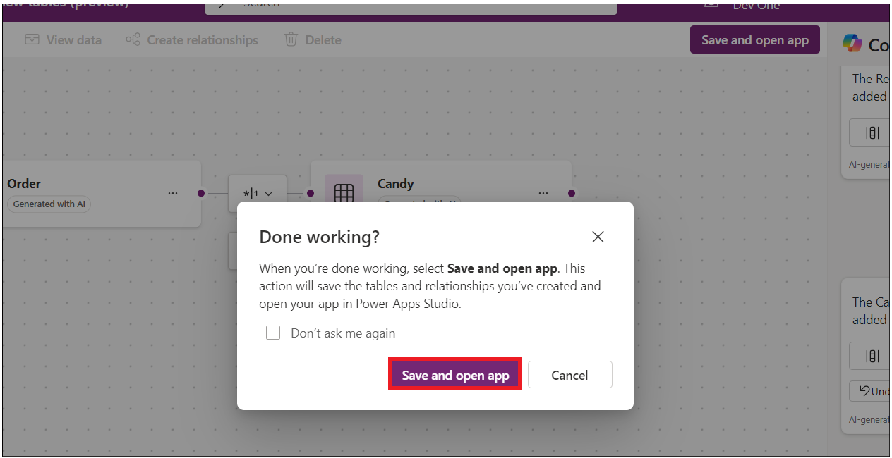
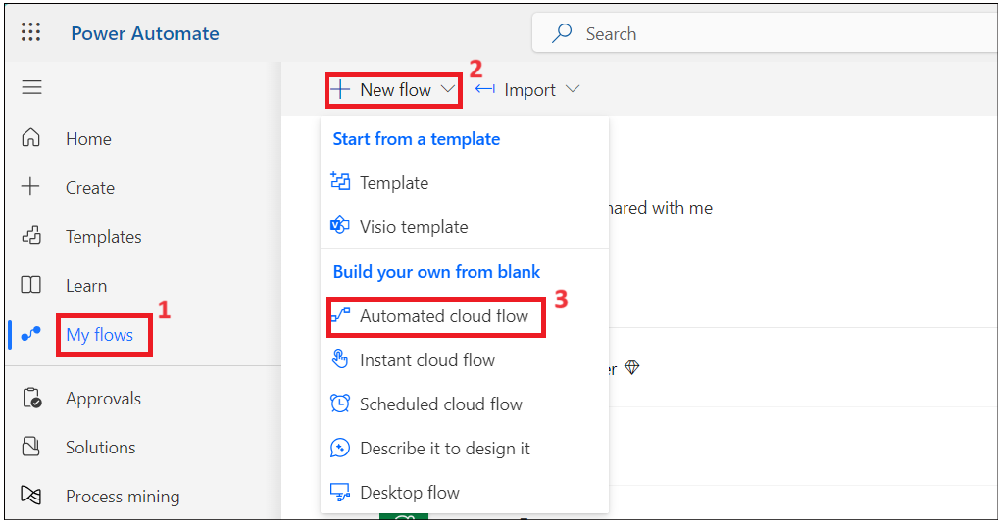
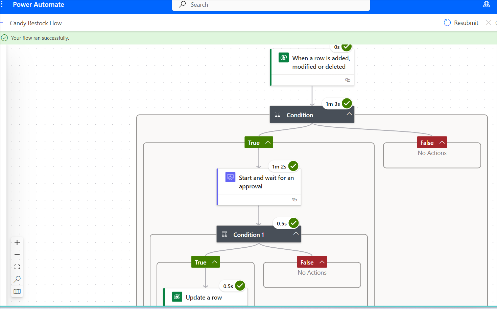

**ラボ 2-在庫管理アプリを構築する**

**目的：**このラボの目的は、Microsoft Power Apps と Copilot
を使用して、機能的な在庫管理アプリケーションを作成する方法を参加者に指導することです。参加者は、データバース環境の設定、アプリ画面の設計、データ管理、そして
Power Automate
を使用した在庫補充ワークフローの自動化について学習します。

**所要時間：** 40分

**演習１：庫管理アプリを構築する**

**タスク １：データバース環境を検証する**

1.  ブラウザを開き、+++\*\* に移動します。office 365 admin
    accountでサインインします。

2.  左側のナビゲーションで**Environments**を選択します。下の画像のように、**Developer
    environment**が作成されているはずです。（この環境は、管理者アカウントを使用してMicrosoft
    Power App for　Developer
    ライセンスを提供するとすぐに自動的に作成されます。環境名は管理者アカウントごとに異なります。）

> 

3.  このラボのすべての演習を実行するには、同じ開発者環境を使用します。

**注意**：このラボでは**Dev
One**開発環境を使用します。環境名はユーザーごとに異なる場合があります。必ずご自身の開発環境を選択してください。

**タスク ２：Copilot を使用して在庫管理アプリを作成します。**

1.  ブラウザを開き、++++\*\* 、Office 365 admin tenant
    accountでサインインします。

2.  右上隅の環境をクリックし、**your developer**環境を選択します (Dev
    環境は、このラボ ガイドで使用される開発者環境です。)

> 

3.  以下のプロンプトを入力し、**the Enter**ボタンをクリックします。

> +++**build a candy inventory management app**+++
>
> 

4.  **Start with Copilot**タイルを選択します。

> 

5.  以下のプロンプトを入力し、**Generate**をクリックして、Copilot
    の助けを借りてテーブルを作成します。

> +++**Candy Inventory management**+++
>
> 

6.  、Copilotは下の画像に示すようにテーブルを生成します。

> 

7.  Candy の横にある 3 つのドットをクリックし、**View
    data**をクリックします。

> 

8.  Candy テーブルのデータは次の画像に示すとおりになります。

> 

9.  **Supplier --\> View
    data** をクリックしてデータを調べ、表示ウィンドウを閉じます。

> 

10. サプライヤーのメールIDの1つを仕事用/個人用のメールidに更新します。

> 

11. **Order --\> View data**をクリックします**。**

> 

12. 以下のプロンプトをテキストボックスに入力し、Enterをクリックしてください。この列は、数量が再注意文ポイントを下回った場合に通知するために必要です。

> +++**Add reorder point column to Candy table**+++
>
> 

13. 数値型でcandyInStock列を追加します。数量が再注意文ポイントより少ない場合、数量列にcandyInStockが自動的に追加されます。

> +++**Add candyInStock column to Candy table with sample stock
> count**+++
>
> 

14. 表は再発注意点の列とCandy in Stock columnで更新されました。

> 

15. **Save and open app**ボタンをクリックします。

> 

16. **「Done working?」**ウィンドウで、**Save and open
    app**をクリックし、アプリが作成されるのを待ちます。

> 
>
> 

17. welcomeウィンドウをスキップします。

> 

18. アプリが作成され、下の画像のようになります。

> 

19. **save**ボタンをクリックし、**MSCandy Inventory management
    app**という名前を入力して、**Save**ボタンをクリックします。

> 
>
> 

20. アプリを探索してみます。ツリービューから**the Candy
    screen**をクリックします。画面のラベルを**Candy Inventory
    management**に更新できます。

> 

21. サプライヤー画面を確認し、要件に応じて更新します。

> 

**タスク３：candy品質スクリーンを作成する**

1.  **New Screen**をクリックし、**Blank**のテンプレートを選択します。

> 

2.  新しい画面を選択し、右クリックして**Rename**を選択します。

> 

3.  画面に+++**Candy quality screen**+++という名前を付けます。

> 

4.  画面領域をクリックし、**Create a new table(preview)**を選択します。

> 

5.  **New table --\> Add columns and data**をクリックします。

> 

6.  **New column -\> Edit column**をクリックします。

> 

7.  表示名を**Candy
    ID** として入力し、**Update**ボタンをクリックします。

> 

8.  「新しい列」をクリックし、以下の詳細を入力して、**Save**をクリックします。

    - **Display Name:** Candy Name

    - **Data Type:** Choice

    - **Required:** Yes.

    - **Choices:** add below choices

      - Chocolate Bar

      - Gummy Bears

      - Jellybeans

      - Lollipop

      - Sour Patch Kids

> 

9.  新しい列をクリックし、以下の詳細を含む列を追加して、**Save**をクリックします。

    - **Display Name:** Candy Quality

    - **Data type:** Choice

    - **Required:** Yes

    - **Choice:** labels

      - Defective

      - Nondefective

> 

**注意:**アプリの要件に応じて列を追加できます。

10. テーブル名を編集し、+++**Candy Quality
    check**+++で更新します。

11. **Save and exit -\> Save and
    exit**をクリックします。

12. Power Apps app
    pageに戻ります。新しく追加された画面を選択し、挿入をクリックして、下の画像のように**Edit
    form**を選択します。

13. コンテナーをクリックし、データ ソース テーブルとして+++**Candy
    Qualities table**+++を選択します。

14. 下の画像のようなフォームが表示されます。

15. 表をページの中央に合わせます。**Insert-\> Text
    label**をクリックします。 

16. テキスト ラベルを調整し、テキストを次のように入力し、+++**Candy
    Quality
    check**+++としてテキストのスタイルを更新します。

17. **Form**を選択します。**Insert**をクリックし、**Button**を選択します。

18. 送信ボタンをドラッグしてコンテナの中央に配置します。下の画像を参照にしてボタンを選択し、**properties**のテキストを**Submit**に変更します。

19. **Submit**ボタンを選択し、
    **OnSelect**関数を選択して、以下の関数を入力します。

**注意:**数式内の Form4 は、フォーム名SubmitForm ( Form4 ); NewForm
(Form4) に置き換える必要があります。

20. コンテナーを選択し、プロパティで、**Default**モードを**New**を選択します。

21. **Save**をクリックし、下の画像に示すように**Preview
    app**ボタンをクリックします。

22. Candyの詳細を入力し、Submitボタンをクリックします。

23. Dataverse 環境の Candy
    品質テーブルに戻ると、上記に追加されたレコードが表示されます。

24. プレビューウィンドウを閉じます。

**演習 2: 在庫を補充するための Power Automate フローを作成する。**

**タスク１：再入荷メールをトリガーする Power Platform フローを作成する**

1.  Power Automate タブに戻り、**My flows** -\> **New flow -\Automated
    cloud flow**をクリックします。

2.  フロー名を+++**Candy Restock Flow**+++と入力します。+++**When a
    row**+++を検索し、Dataverse の**When a row is added or
    modified**アクションを選択して、**Create**をクリックします。

3.  アクションを選択し、以下のパラメータを設定します。

    - Change Type; Added or Modified

    - Table Nam: Candies

    - Scope: Organization 

4.  **when a row is added, modified or
    deleted**のアクションの後にアクションを追加します。

5.  **Condition**を検索し、**Control’s
    Condition**アクションを選択します。

6.  値の選択をクリックし、前のステップから選択動的アクションを選択します。

7.  +++**Quantity**+++列を検索して選択します。

8.  **is less
    than**条件を選択し、前のアクションからデータを入力をクリックします。

9.  +++**Reorder
    points**+++列を検索して選択します。

10. **True**条件で**Add an
    action**を追加します。

11. +++**Approvals**+++アクションを選択します。

12. +++**Start and wait for an
    Approvals**+++を選択します。 

13. +++**Approve/Reject – First to
    Respond**+++として選択します。タイトルを+++**Approve to
    Restock**+++と入力し、ダイナミックボタンをクリックして前の手順のデータを選択します。

14. **Candy Name**+++を検索して選択します。

15. 以下の詳細を入力してください。

16. Assigned to: Your work email id.

17. 

18. Details:

19. 

20. Hi Sir,

21. 

22. is out of stock - for customers to place an order. Please approve to

23. restock.

24. 

25. Thanks

**注意:**必要に応じて詳細セクションをカスタマイズできます。

16. **approval**アクションの後に**Add an
    action**をします。

17. +++**condition**+++を検索し、**Control –
    Condition**を選択します。

18. Choose
    valueをクリックし、Startから**Outcome**を選択して、承認アクションを待ちます。

19. 条件として**is equal
    to**を選択し、値として**Approve**を入力します。

20. **True**条件で**add an action**をします。

21. **Update Row**を検索し、**Microsoft
    Dataverse**セクションから選択します。

22. **Candy**テーブルを選択し、**Row
    Id**をクリックして動的アクションを選択します。

23. テーブルから一意の識別子列を検索して選択します。

24. **Advanced
    Parameters**ドロップダウンをクリックし、**Quantity**列を選択します。

25. 以下の関数（自分でアプリに入力する）を入力し、アクションを折りたたみます。

> **注意:　**列のスキーマ名が異なる場合、以下の関数は機能しません。table
> --\> columnに移動し、スキーマ名をコピーしてください。
>
> +++add(triggerBody()?\['cr8a3_Quantity'\],triggerBody()?\['cr8a3_CandyInStock'\])+++
>
> 

26. Power Automate フローを保存するには、**the
    Save**ボタンをクリックします。 

**タスク２：補充フローをテストする**

1.  **PowerApps**タブに戻り、左側のツリー
    ビューから**Candy**画面をクリックして、**play**を選択します。

> **注意:**画面のタイトルを更新できます
>
> 

2.  Candyを選択し、**Edit**をクリックします。

3.  **Quantity**の値として**less than reorder
    points**を入力し、変更を**commit**にします。

4.  Power Automate フロー タブに戻り、My flows -\> Your flow
    をクリックします。

5.  フローは実行されており、条件を満たしています。

6.  新しいタブを開いて++++ 、office 365 admin
    accountでサインインしてください。在庫補充に関するメールが届いているはずです。**Approve**して**submit**してください。

> 

7.  フローは成功しました。

> 

8.  PowerAppsに戻り、上記の商品数量を確認してください。更新されているはずです（在庫数キャンディー+再発注意点を下回った場合の数量）。

**結論：**

このラボの終了までに、参加者はデータバース環境の検証、Copilotを活用した在庫管理アプリの構築、カスタムフィールドを使用したキャンディの品質チェック画面の設計、在庫レベルに基づいて補充リクエストをトリガーするPower
Automateフローの実装を行えるようになります。さらに、承認プロセス後の在庫更新の精度を確保するために、自動化されたワークフローのテストと検証のスキルも習得します。この体系的なアプローチにより、参加者はPower
AppsとPower
Automateの機能を効果的に活用し、アプリ開発とプロセス自動化のスキルを向上させることができます。
