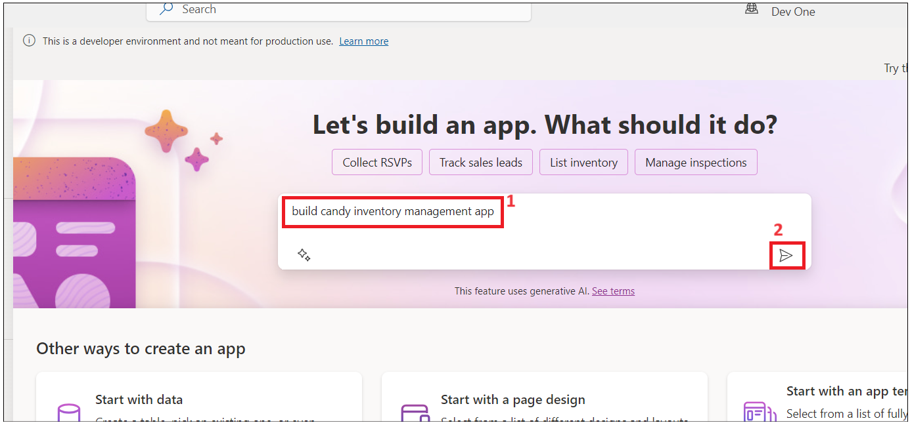
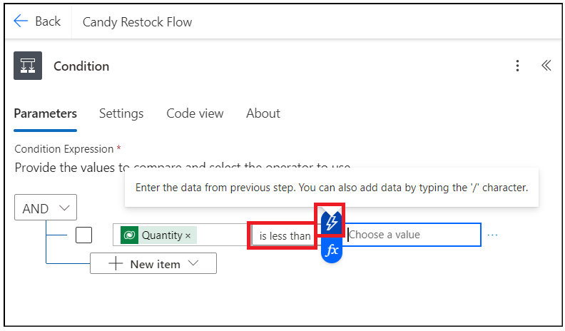

# 实验 2 - 构建库存管理应用程序

**目标：** 本实验的目标是指导参与者使用 Microsoft Power Apps 和 Copilot
创建功能性库存管理应用程序。参与者将学习使用 Power Automate 设置他们的
Dataverse 环境、设计应用程序屏幕、管理数据以及自动化库存补货工作流程。

**预计时间：** 40 分钟

## 练习 1：构建库存管理应用程序

### 任务 1：验证您的 Dataverse 环境

1.  打开浏览器并转到
    **+++https://admin.powerplatform.microsoft.com+++**。使用您的 Office
    365 管理员帐户登录。

2.  选择 **Environment** 在左侧导航栏中。**Developer environment**
    应该已为您创建，如下图所示。（使用管理员帐户提供 Microsoft Power App
    for Developer
    许可证后，系统会自动创建此环境。每个管理员账户的环境名称都不同。

- 

3.  使用相同的开发人员环境执行此实验室的所有练习。

> **注意**：本实验使用 **Dev one**
> 开发人员环境。不同用户的环境名称可能不同。请确保选择您的开发人员环境。

### 任务 2：使用 Copilot 创建库存管理应用程序。

1.  打开浏览器并转到 **+++https://make.powerapps.com+++** 使用 Office
    365 管理员租户帐户登录。

2.  单击右上角的环境，然后选择 **您的开发人员** 环境（Dev One
    是本实验指南中使用的开发人员环境）

- 

3.  输入以下提示，然后单击 **Enter** 按钮。

- +++**build a candy inventory management app**+++

  

4.  选择“**Start with Copilot”**磁贴

- 

5.  输入以下提示，然后单击 **Generate** 在 Copilot 的帮助下创建表格

- +++**Candy Inventory management**+++

  

6.  Copilot 生成表，如下图所示。

- 

7.  单击 Candy 旁边的三个点，然后单击 **View data。**

- 

8.  Candy 表中的数据应包含下图所示的数据。

- 

9.  单击 **Supplier –\> View data** 并浏览数据，然后关闭视图窗口。

- 

10. 使用您的工作/个人工作电子邮件 ID 更新其中一个供应商电子邮件 ID

- 

11. 单击 **Order – \> View data**

- 

12. Ener below 提示符，然后单击
    Enter。此列用于在数量低于再订购点时进行通知。

- +++**Add reorder point column to Candy table**+++

  

13. 添加 type为 Number 的 candyInStock 列。如果 Quantity
    小于再订购点，则 Quantity 列将自动添加 candyInStock。

- +++**Add** candyInStock\*\* column to Candy table with sample stock
  count\*\*+++

  

14. 该表已更新为再订购点列和 Candy in Stock 列

- 

15. 点击 **Save and open app** 按钮

- 

16. 在 **Done working？** 窗口中，单击 **Save and open app**
    并等待应用程序创建。

- 

  

17. 跳过欢迎窗口。

- 

18. 应用程序已创建，应如下图所示。

- 

19. 单击**Save**按钮并输入名称 **MSCandy Inventory management
    app**，然后单击保 Save 按钮。

- 

  

20. 探索应用程序。单击 **Tree view** 中的 **Candy screen**
    。您可以将屏幕的标签更新为 **Candy Inventory management**

- 

21. 浏览 Supplier 屏幕并根据您的要求进行更新。

- 

### 任务 3：创建糖果质量屏幕

1.  单击 **New Screen** 并选择 **Blank** 模板。

- 

2.  选择新屏幕并右键单击 **Rename**

- 

3.  将屏幕命名为 +++**Candy quality screen**+++

- 

4.  单击 屏幕区域，然后选择 **Create a new table （preview）**

- 

5.  单击 **New table –\> Add columns and data。**

- 

6.  单击 **New column -\> Edit column。**

- 

7.  输入 Display name 作为 **Candy ID** ，然后单击 **Update** 按钮。

- 

8.  单击 New column 并输入以下详细信息，然后单击 **Save** 。

    - **Display Name:** Candy Name

    - **Data Type:** Choice

    - **Required:** Yes.

    - **Choices:** add below choices

      - Chocolate Bar

      - Gummy Bears

      - Jellybeans

      - Lollipop

      - Sour Patch Kids

- 

9.  单击 New Column 并添加包含以下详细信息的列，然后单击 **Save** 。

    - **Display Name:** Candy Quality
    - **Data type:** Choice
    - **Required:** Yes
    - **Choice:** labels
      - Defective
      - Nondefective

- 

> **注意：** 您可以根据应用程序要求添加更多列。

10. 编辑表名并使用 **+++Candy Quality check+++** 进行更新。
    

11. 单击 **Save and exit -\> Save and exit**。 

12. 您将导航回 Power Apps 应用页面。选择新添加的屏幕，然后单击 Insert
    并选择 **Edit form** ，如下图所示。 

13. 单击容器，然后选择数据源表作为 **+++Candy Qualities table+++**。
    

14. 您应该会看到如下图所示的表单。 

15. 将表格调整到页面中间。单击 **Insert-\> Text label。**
    

16. 调整文本标签并输入文本：**+++Candy Quality check+++**
    并更新文本样式。 

17. 选择 **Form**。点击 **Insert** 并选择 **Button**。
    

18. 拖动提交按钮并将其放在容器的中间。选择按钮并将 **properties**
    文本更改为 **Submit** ，如下图所示。 

19. 选择 **Submit** 按钮，然后选择 **OnSelect** 函数并输入以下函数。

> **备注：** 公式中的 Form4 应替换为您的表单名称
> SubmitForm（Form4）;NewForm（Form4） 的

20. 选择容器，在 properties 下，选择 **Default** 模式 到 **New**。
    

21. 单击 **Save** ，然后单击预览 **Preview app** 按钮，如下图所示。
    

22. 输入 Candy 详细信息，然后单击 Submit 按钮。 

23. 切换回 Dataverse 环境中的 Candy 质量表，您应该会看到上面添加的记录。
    

24. 关闭预览窗口。

## 练习 2：创建 Power Automate 流以补充库存。

### 任务 1：创建 Power Platform 流以触发补货电子邮件

1.  切换回 Power Automate 选项卡，然后单击 **My flows -\> New flow
    -cloud flow。** 

2.  将流名称输入为：**+++Candy Restock Flow+++**。搜索 **+++When a
    row+++** ，选择 Dataverse 的 **When a row is added or modified**
    作，然后单击**Create**。 

3.  选择作并设置以下参数。

    - 更改类型; Added or Modified
    - 表名称: Candies
    - 范围: Organization 

4.  在“when a row is added, modified or deleted”
    在作后添加作**。**

5.  搜索 **Condition** 并选择 **Control’s Condition**作。
    

6.  单击 Chosen value 并选择 Choose from previous step dynamic action。
    

7.  搜索 **+++Quantity+++** 列并选择它。 

8.  选择**一个小于** （condition） 的条件**，**然后单击 Enter data from
    previous action （输入来自上一个作的数据）。
    

9.  搜索 **+++Reorder points+++** 列并选择它。 

10. **在 True condition** 下 Add an action。

11. 选择 **+++Approvals+++**作。 

12. 选择 **+++Start and wait for an Approvals+++**。
    

13. 选择 Approval Type as：**+++Approve/Reject – First to
    Respond+++**。输入 标题 为：**+++ Approve to Restock+++** - 然后单击
    动态 按钮以选择上一步中的数据。 

14. 搜索 **Candy Name+++** 并选择它**。** 

15. 输入以下详细信息。

- Assigned to: Your work email id.

      Details:

      Hi Sir,  

      is out of stock - for customers to place an order. Please approve to
      restock.  

      Thanks

> **注意：** 您可以根据需要自定义详细信息部分。

16. 在**approval**作后**Add an action**。 

17. 搜索 +++**condition**+++ 并选择 **Control – Condition。**
    

18. 单击 Choose value，然后从 Start 中选择 **Outcome** 并等待 Approval
    作。 

19. 选择条件 **is equal to** ，然后输入值 **Approve**。
    

20. 在 True condition 下，**Add an action**。 

21. 搜索 **Update Row** 并从 **Microsoft Dataverse** 部分中
    选择它。

22. 选择您的 **Candy** 表，然后单击 **Row Id**，选择 Dynamic action。
    

23. 从表中搜索唯一标识符列并选择它。 

24. 单击 **Advanced Parameters** 下拉列表，然后选择 **Quantity** 列。
    

25. 输入以下函数 （在应用程序中键入） 并折叠作。

> > **注意：** 以下函数不适合您，因为您的列架构名称可能不同。转到 table
> > –\> column 并复制 schema name。

- +++add(triggerBody()?\[‘cr8a3_Quantity’\],triggerBody()?\[‘cr8a3_CandyInStock’\])+++

  

26. 单击 **Save** 按钮以保存 Power Automate 流。
    

### 任务 2：测试补货流

1.  切换回 **PowerApps** 选项卡，单击 左侧树视图中的 Candy
    screen，然后选择 **play**。

> > **注：** 您可以更新屏幕的 Title

- 

2.  选择 Candy 并单击 **Edit**。 

3.  输入 **Quantity** 值 **小于再订购点** 并 **commit** 更改。
    

4.  切换回 Power Automate 流选项卡，然后单 My flows -\> Your flow。
    

5.  Flow 正在运行并处于状态。 

6.  打开一个新选项卡，转到 **+++https://outlook.com+++**，然后使用
    Office 365 管理员帐户登录。您应该已经收到了一封需要补货的电子邮件。
    **Approve** 并 **submit**。 

- 

7.  流程现在成功了。 

- 

8.  切换回PowerApps并检查上述产品数量。它应该已经更新（当它小于再订购点时，有库存的糖果 +
    数量） 

### 结论：

在本实验结束时，参与者将能够验证他们的 Dataverse 环境，利用 Copilot
构建库存管理应用程序，设计带有自定义字段的糖果质量检查屏幕，并实施 Power
Automate流以根据库存水平触发补货请求。此外，他们还将获得测试和验证自动化工作流程的技能，以确保在审批流程后准确更新库存。这种结构化方法将使参与者能够有效地利用
Power Apps 和 Power Automate
的功能，从而提高他们在应用开发和流程自动化方面的技能。
