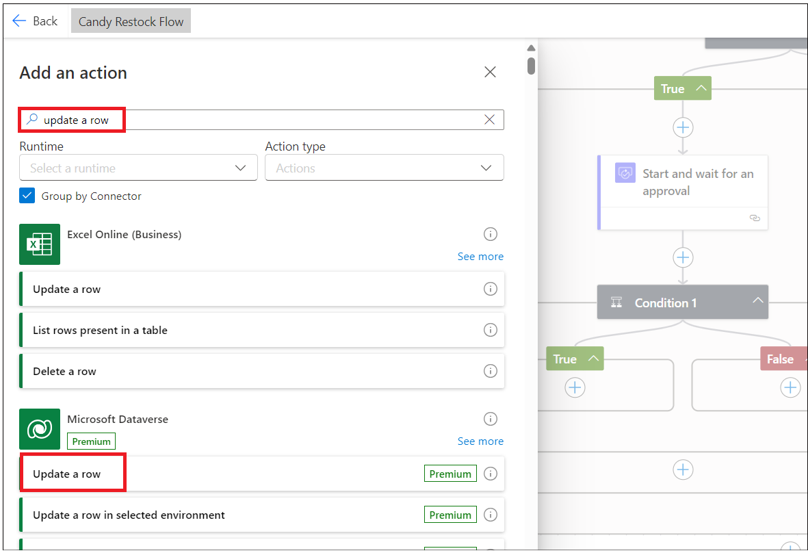

# 實驗 2 - 構建庫存管理應用程序

**目標：** 本實驗的目標是指導參與者使用 Microsoft Power Apps 和 Copilot
創建功能性庫存管理應用程序。參與者將學習使用 Power Automate 設置他們的
Dataverse 環境、設計應用程序屏幕、管理數據以及自動化庫存補貨工作流程。

**預計時間：** 40 分鐘

## 練習 1：構建庫存管理應用程序

### 任務 1：驗證您的 Dataverse 環境

1.  打開瀏覽器並轉到
    **+++https://admin.powerplatform.microsoft.com+++**。使用您的 Office
    365 管理員帳戶登錄。

2.  選擇 **Environment** 在左側導航欄中。**Developer environment**
    應該已為您創建，如下圖所示。（使用管理員帳戶提供 Microsoft Power App
    for Developer
    許可證後，系統會自動創建此環境。每個管理員賬戶的環境名稱都不同。

- 

3.  使用相同的開發人員環境執行此實驗室的所有練習。

> **注意**：本實驗使用 **Dev one**
> 開發人員環境。不同用戶的環境名稱可能不同。請確保選擇您的開發人員環境。

### 任務 2：使用 Copilot 創建庫存管理應用程序。

1.  打開瀏覽器並轉到 **+++https://make.powerapps.com+++** 使用 Office
    365 管理員租戶帳戶登錄。

2.  單擊右上角的環境，然後選擇 **您的開發人員** 環境（Dev One
    是本實驗指南中使用的開發人員環境）

- 

3.  輸入以下提示，然後單擊 **Enter** 按鈕。

- +++**build a candy inventory management app**+++

  

4.  選擇“**Start with Copilot”**磁貼

- 

5.  輸入以下提示，然後單擊 **Generate** 在 Copilot 的幫助下創建表格

- +++**Candy Inventory management**+++

  

6.  Copilot 生成表，如下圖所示。

- 

7.  單擊 Candy 旁邊的三個點，然後單擊 **View data。**

- 

8.  Candy 表中的數據應包含下圖所示的數據。

- 

9.  單擊 **Supplier –\> View data** 並瀏覽數據，然後關閉視圖窗口。

- 

10. 使用您的工作/個人工作電子郵件 ID 更新其中一個供應商電子郵件 ID

- 

11. 單擊 **Order – \> View data**

- 

12. Ener below 提示符，然後單擊
    Enter。此列用於在數量低於再訂購點時進行通知。

- +++**Add reorder point column to Candy table**+++

  

13. 添加 type為 Number 的 candyInStock 列。如果 Quantity
    小於再訂購點，則 Quantity 列將自動添加 candyInStock。

- +++**Add** candyInStock\*\* column to Candy table with sample stock
  count\*\*+++

  

14. 該表已更新為再訂購點列和 Candy in Stock 列

- 

15. 點擊 **Save and open app** 按鈕

- 

16. 在 **Done working？** 窗口中，單擊 **Save and open app**
    並等待應用程序創建。

- 

  

17. 跳過歡迎窗口。

- 

18. 應用程序已創建，應如下圖所示。

- 

19. 單擊**Save**按鈕並輸入名稱 **MSCandy Inventory management
    app**，然後單擊保 Save 按鈕。

- 

  

20. 探索應用程序。單擊 **Tree view** 中的 **Candy screen**
    。您可以將屏幕的標簽更新為 **Candy Inventory management**

- 

21. 瀏覽 Supplier 屏幕並根據您的要求進行更新。

- 

### 任務 3：創建糖果質量屏幕

1.  單擊 **New Screen** 並選擇 **Blank** 模板。

- 

2.  選擇新屏幕並右鍵單擊 **Rename**

- 

3.  將屏幕命名為 +++**Candy quality screen**+++

- 

4.  單擊 屏幕區域，然後選擇 **Create a new table （preview）**

- 

5.  單擊 **New table –\> Add columns and data。**

- 

6.  單擊 **New column -\> Edit column。**

- 

7.  輸入 Display name 作為 **Candy ID** ，然後單擊 **Update** 按鈕。

- 

8.  單擊 New column 並輸入以下詳細信息，然後單擊 **Save** 。

    - **Display Name:** Candy Name

    - **Data Type:** Choice

    - **Required:** Yes.

    - **Choices:** add below choices

      - Chocolate Bar

      - Gummy Bears

      - Jellybeans

      - Lollipop

      - Sour Patch Kids

- 

9.  單擊 New Column 並添加包含以下詳細信息的列，然後單擊 **Save** 。

    - **Display Name:** Candy Quality
    - **Data type:** Choice
    - **Required:** Yes
    - **Choice:** labels
      - Defective
      - Nondefective

- 

> **注意：** 您可以根據應用程序要求添加更多列。

10. 編輯表名並使用 **+++Candy Quality check+++** 進行更新。
    

11. 單擊 **Save and exit -\> Save and exit**。 

12. 您將導航回 Power Apps 應用頁面。選擇新添加的屏幕，然後單擊 Insert
    並選擇 **Edit form** ，如下圖所示。 

13. 單擊容器，然後選擇數據源表作為 **+++Candy Qualities table+++**。
    

14. 您應該會看到如下圖所示的表單。 

15. 將表格調整到頁面中間。單擊 **Insert-\> Text label。**
    

16. 調整文本標簽並輸入文本：**+++Candy Quality check+++**
    並更新文本樣式。 

17. 選擇 **Form**。點擊 **Insert** 並選擇 **Button**。
    

18. 拖動提交按鈕並將其放在容器的中間。選擇按鈕並將 **properties**
    文本更改為 **Submit** ，如下圖所示。 

19. 選擇 **Submit** 按鈕，然後選擇 **OnSelect** 函數並輸入以下函數。

> **備註：** 公式中的 Form4 應替換為您的表單名稱
> SubmitForm（Form4）;NewForm（Form4） 的

20. 選擇容器，在 properties 下，選擇 **Default** 模式 到 **New**。
    

21. 單擊 **Save** ，然後單擊預覽 **Preview app** 按鈕，如下圖所示。
    

22. 輸入 Candy 詳細信息，然後單擊 Submit 按鈕。 

23. 切換回 Dataverse 環境中的 Candy 質量表，您應該會看到上面添加的記錄。
    

24. 關閉預覽窗口。

## 練習 2：創建 Power Automate 流以補充庫存。

### 任務 1：創建 Power Platform 流以觸發補貨電子郵件

1.  切換回 Power Automate 選項卡，然後單擊 **My flows -\> New flow
    -cloud flow。** 

2.  將流名稱輸入為：**+++Candy Restock Flow+++**。搜索 **+++When a
    row+++** ，選擇 Dataverse 的 **When a row is added or modified**
    作，然後單擊**Create**。 

3.  選擇作並設置以下參數。

    - 更改類型; Added or Modified
    - 表名稱: Candies
    - 範圍: Organization 

4.  在“when a row is added, modified or deleted”
    在作後添加作**。**

5.  搜索 **Condition** 並選擇 **Control’s Condition**作。
    

6.  單擊 Chosen value 並選擇 Choose from previous step dynamic action。
    

7.  搜索 **+++Quantity+++** 列並選擇它。 

8.  選擇**一個小於** （condition） 的條件**，**然後單擊 Enter data from
    previous action （輸入來自上一個作的數據）。
    

9.  搜索 **+++Reorder points+++** 列並選擇它。 

10. **在 True condition** 下 Add an action。

11. 選擇 **+++Approvals+++**作。 

12. 選擇 **+++Start and wait for an Approvals+++**。
    

13. 選擇 Approval Type as：**+++Approve/Reject – First to
    Respond+++**。輸入 標題 為：**+++ Approve to Restock+++** - 然後單擊
    動態 按鈕以選擇上一步中的數據。 

14. 搜索 **Candy Name+++** 並選擇它**。** 

15. 輸入以下詳細信息。

- Assigned to: Your work email id.

      Details:

      Hi Sir,  

      is out of stock - for customers to place an order. Please approve to
      restock.  

      Thanks

> **注意：** 您可以根據需要自定義詳細信息部分。

16. 在**approval**作後**Add an action**。 

17. 搜索 +++**condition**+++ 並選擇 **Control – Condition。**
    

18. 單擊 Choose value，然後從 Start 中選擇 **Outcome** 並等待 Approval
    作。 

19. 選擇條件 **is equal to** ，然後輸入值 **Approve**。
    

20. 在 True condition 下，**Add an action**。 

21. 搜索 **Update Row** 並從 **Microsoft Dataverse** 部分中
    選擇它。

22. 選擇您的 **Candy** 表，然後單擊 **Row Id**，選擇 Dynamic action。
    

23. 從表中搜索唯一標識符列並選擇它。 

24. 單擊 **Advanced Parameters** 下拉列表，然後選擇 **Quantity** 列。
    

25. 輸入以下函數 （在應用程序中鍵入） 並折疊作。

> > **注意：** 以下函數不適合您，因為您的列架構名稱可能不同。轉到 table
> > –\> column 並複製 schema name。

- +++add(triggerBody()?\[‘cr8a3_Quantity’\],triggerBody()?\[‘cr8a3_CandyInStock’\])+++

  

26. 單擊 **Save** 按鈕以保存 Power Automate 流。
    

### 任務 2：測試補貨流

1.  切換回 **PowerApps** 選項卡，單擊 左側樹視圖中的 Candy
    screen，然後選擇 **play**。

> > **注：** 您可以更新屏幕的 Title

- 

2.  選擇 Candy 並單擊 **Edit**。 

3.  輸入 **Quantity** 值 **小於再訂購點** 並 **commit** 更改。
    

4.  切換回 Power Automate 流選項卡，然後單 My flows -\> Your flow。
    

5.  Flow 正在運行並處於狀態。 

6.  打開一個新選項卡，轉到 **+++https://outlook.com+++**，然後使用
    Office 365 管理員帳戶登錄。您應該已經收到了一封需要補貨的電子郵件。
    **Approve** 並 **submit**。 

- 

7.  流程現在成功了。 

- 

8.  切換回PowerApps並檢查上述產品數量。它應該已經更新（當它小於再訂購點時，有庫存的糖果 +
    數量） 

### 結論：

在本實驗結束時，參與者將能夠驗證他們的 Dataverse 環境，利用 Copilot
構建庫存管理應用程序，設計帶有自定義字段的糖果質量檢查屏幕，並實施 Power
Automate流以根據庫存水平觸發補貨請求。此外，他們還將獲得測試和驗證自動化工作流程的技能，以確保在審批流程後準確更新庫存。這種結構化方法將使參與者能夠有效地利用
Power Apps 和 Power Automate
的功能，從而提高他們在應用開發和流程自動化方面的技能。
