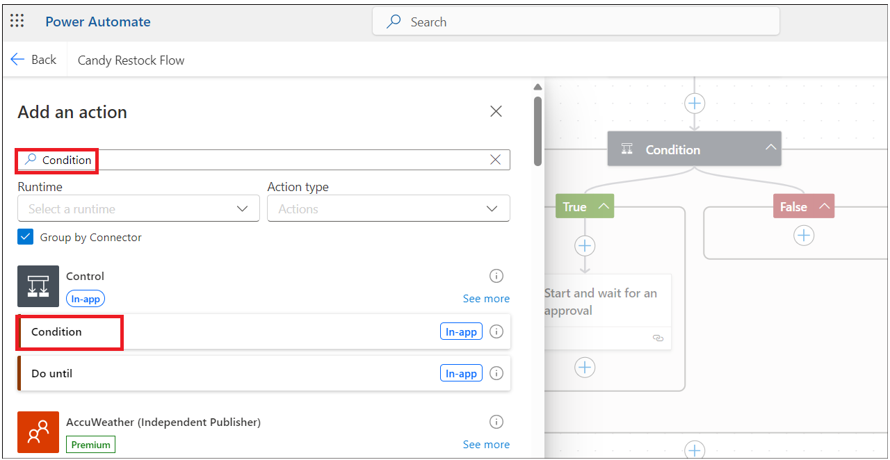
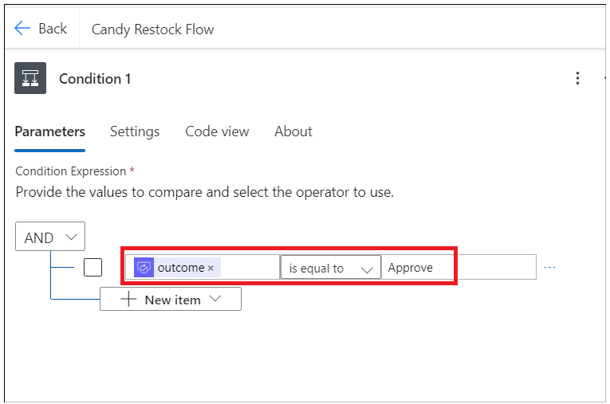
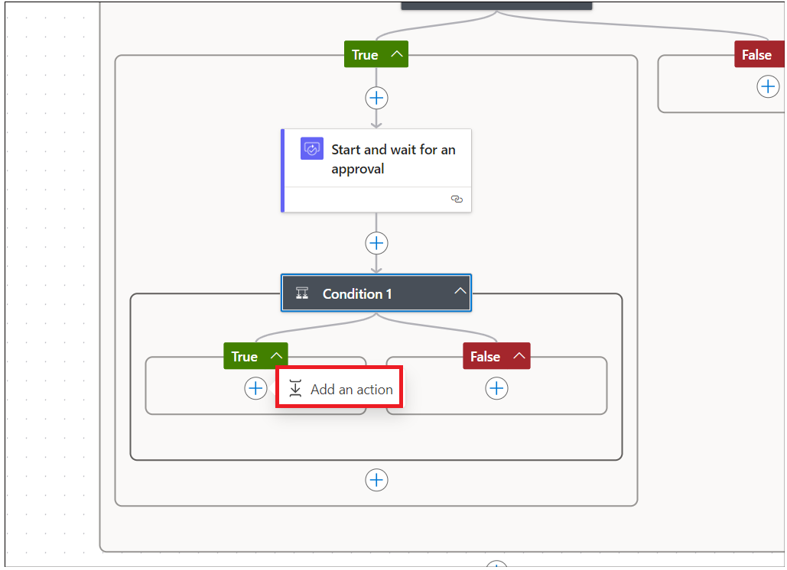

Laboratorio 2 – Cree un Inventory Management App

**Objetivo:** El objetivo de este laboratorio es guiarle para crear un
inventory management application funcional mediante Microsoft Power Apps
y Copilot. Los participantes aprenderán a establecer su Dataverse
environment, diseñar pantallas de aplicaciones screens, gestionar datos,
y automatizar el inventory restocking workflows con Power Automate.

**Duración estimada:** 40 minutos

Ejercicio 1: Construya el Inventory Management App

Tarea 1: Verificar su Dataverse environment

1.  Abra un navegador y vaya a +++\*\*. Inicie sesión con su cuenta de
    office 365 admin.

2.  Seleccione **Environments** en la navegación izquierda. Se debe
    haber creado el **Developer environment** para usted como se ve en
    la imagen. (Se crea este entorno de forma automática apenas
    proporciona la licencia de Microsoft Power App for Developer con su
    admin account. El nombre del entorno será diferente para cada admin
    account.)

> 

3.  Use el mismo same developer environment para ejecutar todos los
    ejercicios de este laboratorio.

**Ojo**: Se usa el **Dev one** developer environment en este
laboratorio. El nombre del entorno puede variar para diferentes
usuarios. Asegúrese de seleccionar su developer environment.

Tarea 2: Cree inventory management app mediante Copilot.

1.  Abra un navegador y vaya a +++\*\* Inicie sesión con su office 365
    admin tenant account.

2.  Haga clic en el environment en la esquina superior derecha y
    seleccione su **developer** environment (Dev one es el developer
    environment usado en este lab guide)

> 

3.  Introduzca el siguiente prompt y haga clic en el botón **Enter**.

> +++**build a candy inventory management app**+++
>
> 

4.  Seleccione el **Start with Copilot** tile

> 

5.  Introduzca el siguiene prompt y haga clic en **Generate** para crear
    una tabla con la ayuda de Copilot

> +++**Candy Inventory management**+++
>
> 

6.  Copilot genera las tablas como se ve en la imagen.

> 

7.  Haga clic en tres puntos junto a Candy y luego haga clic en **View
    data.**

> 

8.  Los datos en la tabla Candy debe tener los datos como se ve en la
    imagen.

> 

9.  Haga clic en **Supplier --\> View data** y explore los datos y luego
    cierre el view window.

> 

10. Actualice uno de los Supplier email ids con su work/personal working
    email id

> 

11. Haga clic en **Order --\> View data**

> 

12. Introduzca el siguiente prompt en el text box y haga clic en Enter.
    Se requiere esta columna para notificar cuando la cantidad se baja
    del reorder point.

> +++**Add reorder point column to Candy table**+++
>
> 

13. Agregue la columna candyInStock con el type como Number. Si Quantity
    es menos que los reorder points, entonces el Quantity column
    agregará automáticamente con candyInStock.

> +++**Add candyInStock column to Candy table with sample stock
> count**+++
>
> 

14. Se ha actualizado la tabla con el reorder point column y Candy in
    Stock column 

> 

15. Haga clic en el botón **Save and open app**

> 

16. En la ventana **Done working?**, haga clic en **Save and open
    app** y espere a que se crea la aplicación.

> 
>
> 

17. Salte la ventana welcome.

> 

18. Se crea la aplicación y se ve algo así.

> 

19. Haga clic en el botón **save** e introduzca el name **MSCandy
    Inventory management app**, y haga clic en el botón **Save**.

> 
>
> 

20. Explore la aplicación. Haga clic en el **the Candy screen** desde
    Tree view. Puede actualizar el label de la pantalla a **Candy
    Inventory management**

> 

21. Explore el Supplier screen y actualice según sus necesidades.

> 

Tarea 3: Cree candy quality Screen

1.  Haga clic en **New Screen** y seleccione **Blank** template.

> 

2.  Seleccione la nueva pantalla y haga clic derecho, seleccione
    **Rename**

> 

3.  Renombre la pantalla como +++**Candy quality screen**+++

> 

4.  Haga clic en el área Screen y seleccione **Create a new
    table(preview)**

> 

5.  Haga clic en **New table --\> Add columns and data.**

> 

6.  Haga clic en **New column -\> Edit column.**

> 

7.  Introduzca el Display name como **Candy ID** y haga clic en el
    botón **Update**.

> 

8.  Haga clic en New column e introduzca los siguientes detalles y haga
    clic en **Save**.

    - **Display Name:** Candy Name

    - **Data Type:** Choice

    - **Required:** Yes.

    - **Choices:** agregue los siguientes choices

      - Chocolate Bar

      - Gummy Bears

      - Jellybeans

      - Lollipop

      - Sour Patch Kids

> 

9.  Haga clic en New Column y agregue una columna con los siguientes
    detalles y haga clic en **Save**.

    - **Display Name:** Candy Quality

    - **Data type:** Choice

    - **Required:** Yes

    - **Choice:** labels

      - Defective

      - Nondefective

> 

**Ojo:** Puede agregar más columnas según las necesidades de su
aplicación.

10. Edite el nombre de la tabla y actualice como +++**Candy Quality
    check**+++. 

11. Haga clic en **Save and exit -\> Save and
    exit**. 

12. Volverá a la página Power Apps app. Seleccione el screen recién
    agregado y haga clic en Insert y seleccione **Edit form** como se ve
    aquí image. 

13. Haga clic en el container y seleccione el data source table como
    +++**Candy Qualities table**+++. 

14. Debería ver el form así. 

> 

15. Ajuste la tabla en la mitad de la página. Haga clic en **Insert-\>
    Text label.** 

16. Ajuste el text label e introduzca el text como: +++**Candy Quality
    check**+++ y actualice los estilos de text. 

17. Seleccione el **Form**. Haga clic en **Insert** y
    seleccione **Button**. 

18. Arrastre el botón submit y déjelo en la mitad del container.
    Seleccione el botón y cambie el **properties** text
    a **Submit** como se ve aquí. 

19. Seleccione el botón **Submit** y seleccione la
    función **OnSelect** e introduzca la siguiente function.

**Ojo:** Se debe reemplazar el Form4 en el formula con su form name
SubmitForm(Form4);NewForm(Form4).

20. Seleccione el container, en properties, seleccione **Default** mode
    a **New**. 

21. Haga clic en **Save** y haga clic en **Preview app** como se ve
    aquí. 

22. Introduzca los detalles de Candy y haga clic en el botón
    Submit. 

23. Vuelva a Candy quality table en Dataverse environment y debería ver
    el record agregado above. 

24. Cierre la ventana preview.

Ejercicio 2: Cree un Power Automate flow para reponer el inventario.

Tarea 1: Cree un Power platform flow para activar el restock email

1.  Vuelva a Power Automate y haga clic en **My flows** -\> **New flow
    -\Automated cloud flow.** 

2.  Introduzca el flow name como: +++**Candy Restock Flow**+++. Busque
    +++**When a row**+++ y seleccione el action **When a row is added or
    modified** de Dataverse y haga clic
    en **Create**. 

3.  Seleccione el action y establezca los siguientes parámetros.

    - Change Type; Added or Modified

    - Table Nam: Candies

    - Scope: Organization 

4.  Agregue un action después de action **“when a row is added, modified
    or deleted”.** 

5.  Busque **Condition** y seleccione **Condition** action **de
    Control**. 

6.  Haga clic en Choose value y seleccione choose from previous step
    dynamic action. 

7.  Busque +++**Quantity**+++ column y
    selecciónelo. 

8.  Seleccione un condition que es **is less than** y haga clic en Enter
    data from previous action. 

9.  Busque +++**Reorder points**+++ column y
    selecciónelo. 

10. **Add an action** en **True** condition. 

11. Seleccione +++**Approvals**+++ action. 

12. Seleccione+++**Start and wait for an Approvals**+++
    . 

13. Seleccione Approval Type como: +++**Approve/Reject – First to
    Respond**+++. Introduzca Title como: +++**Approve to Restock**+++ -
    y haga clic en el botón Dynamic para seleccionar datos del paso
    anterior. 

14. Busque **Candy Name**+++ y selecciónelo. 

15. Introduzca los siguientes detalles below details.

> `Assigned to: Your work email id.`  
>   
> `Details:`  
>   
> `Hi Sir,  `  
>   
> `is out of stock - for customers to place an order. Please approve to`  
> `restock.  `  
>   
> `Thanks`

**Ojo:** puede personalizar la sección details según sus necesidades.

16. **Add an action** después
    de **approval** action. 

17. Busque +++**condition**+++ y seleccione **Control –
    Condition**. 

18. Haga clic en Choose value y seleccione **Outcome** desde Start y
    espere un Approval action. 

19. Seleccione la condición como **is equal to** e introduzca el valor
    como **Approve**. 

20. En **True** condition, **add an action**. 

21. Busque **Update Row** y selecciónelo desde la sección **Microsoft
    Dataverse**. 

22. Seleccione su tabla **Candy** y haga clic en **Row Id** seleccione
    Dynamic action. 

23. Busque un unique identifier column desde su tabla y
    selecciónelo. 

24. Haga clic en **Advanced Parameters** drop down y
    seleccione **Quantity** column. 

25. Introduzca la siguiente function (tecle en su app) y minimice el
    action.

> **Ojo:** Esta función no funciona para usted como su column schema
> name puede ser diferente. Vaya a table --\> column y copie el schema
> name.
>
> +++add(triggerBody()?\['cr8a3_Quantity'\],triggerBody()?\['cr8a3_CandyInStock'\])+++
>
> 

26. Haga clic en el botón **Save** para guardar el Power Automate
    flow. 

Tarea 2: Pruebe el restock flow

1.  Cambie a **PowerApps** y haga clic en la pantalla **Candy** desde el
    Tree view y seleccione **play**.

> **Ojo:** Puede actualizar el Title del screen
>
> 

2.  Seleccione el Candy y haga clic en
    **Edit**. 

3.  Introduzca el **Quantity** value **less than reorder
    points** y **commit** changes. 

4.  Vuelva a Power Automate flow y haga clic en My flows -\> Your
    flow. 

5.  Se ejecuta el Flow y está en condition. 

6.  Abra una nueva pestaña y vaya a +++\*\* e inicie sesión con su
    office 365 admin account. Debería haber recin¡bido un email to
    restock. **Apruebe** y haga **submit**. 

> 

7.  El flow tiene éxito. 

> 

8.  Vuelva a PowerApps y averigüe el product quantity. Se debería haber
    actualizado (Candy in stock+ Quantity when its less than reorder
    point) 

Conclusión:

Al final de este laboratorio, los participantes podrán verificar su
entorno de Dataverse, crear una aplicación de gestión de inventario
utilizando Copilot, diseñar un Candy Quality Check screen con campos
personalizados e implementar flujos de Power Automate para desencadenar
solicitudes de reabastecimiento en función de los niveles de inventario.
Además, adquirirán habilidades para probar y validar flujos de trabajo
automatizados para garantizar actualizaciones de inventario precisas
después de los procesos de aprobación. Este enfoque estructurado
permitirá a los participantes aprovechar de manera efectiva las
capacidades de Power Apps y Power Automate, mejorando sus habilidades en
el desarrollo de aplicaciones y la automatización de procesos.
