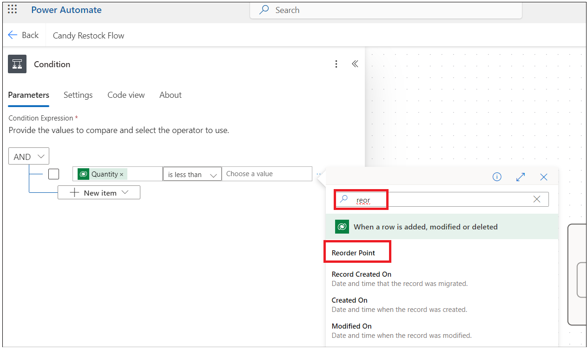
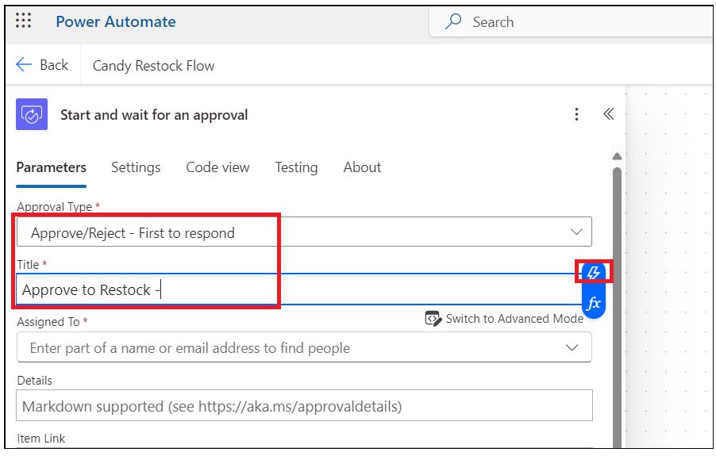
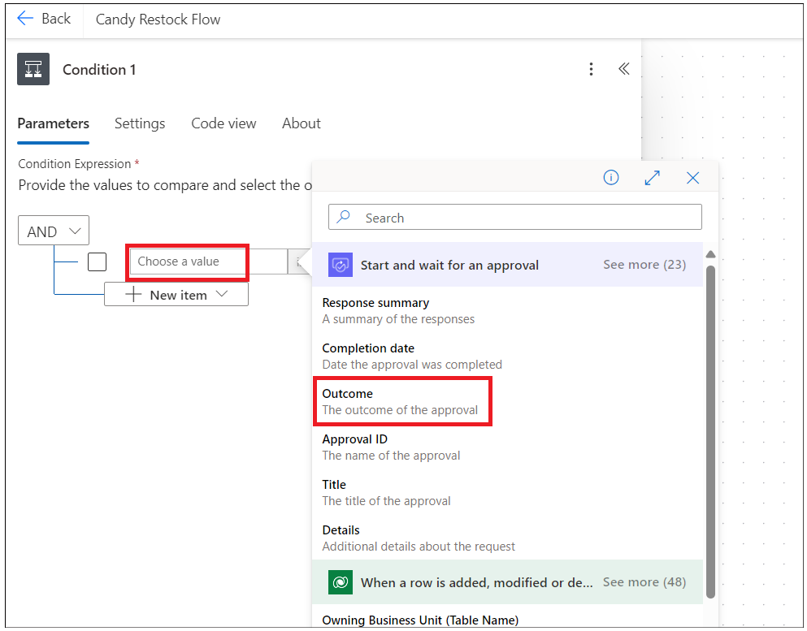
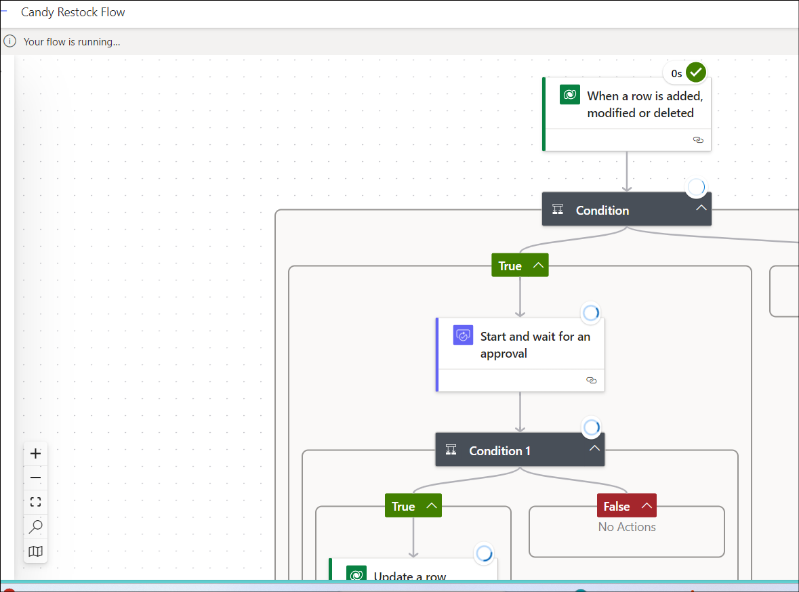

# Laboratório 2 – Criar um Aplicativo de Gerenciamento de Estoque

**Objetivo:** O objetivo deste laboratório é orientar os participantes
na criação de um aplicativo de gerenciamento de estoque funcional usando
o Microsoft Power Apps e o Copilot. Os participantes aprenderão a
configurar seu ambiente do Dataverse, projetar telas de aplicativos,
gerenciar dados e automatizar fluxos de trabalho de reabastecimento de
estoque com o Power Automate.

**Tempo estimado:** 40 min

## Exercício 1: Criar aplicativo de Gerenciamento de Estoque

### Tarefa 1: Verificando seu ambiente do Dataverse

1.  Abra um navegador e vá para
    **+++https://admin.powerplatform.microsoft.com+++**. Entre com sua
    conta de administrador do Office 365.

2.  Selecione **Environments** no menu de navegação à esquerda. O
    **Developer environment** deve ter sido criado para você, conforme
    mostrado na imagem abaixo. (Este ambiente é criado automaticamente
    assim que você fornece a licença Microsoft Power App for Developer
    usando suas contas de administrador. O nome do ambiente será
    diferente para cada conta de administrador).

- 

3.  Use o mesmo ambiente de desenvolvedor para executar todos os
    exercícios deste laboratório.

> **Observação**: **o Dev one** developer environment é usado neste
> laboratório. O nome do ambiente pode ser diferente para usuários
> diferentes. Certifique-se de selecionar seu ambiente de desenvolvedor.

### Tarefa 2: Criar aplicativo de gerenciamento de estoque usando o Copilot.

1.  Abra um navegador e vá para +++**https://make.powerapps.com**+++ e
    faça login com a conta de locatário de administrador do Office 365.

2.  Clique no environment no canto superior direito e selecione seu
    **developer environment** (Dev one é um developer environment usado
    neste guia de laboratório)

- 

3.  Digite o prompt abaixo e clique no botão **Enter**.

- +++**build a candy inventory management app**+++

  

4.  Selecione o bloco **Start with Copilot.**

- 

5.  Digite o prompt abaixo e clique em **Generate** para criar a tabela
    com a ajuda do Copilot

- +++**Candy Inventory management**+++

  

6.  O Copilot gera as tabelas conforme mostrado na imagem abaixo.

- 

7.  Clique nos três pontos ao lado de Candy e clique em **View data.**

- 

8.  Os dados na tabela Candy devem ter dados como mostrado na imagem
    abaixo.

- 

9.  Clique em **Supplier –\> View data** e explore os dados e feche a
    janela de exibição.

- 

10. Atualize uma das IDs de e-mail do fornecedor com sua ID de e-mail de
    trabalho pessoal/profissional

- 

11. Clique em **Order –\> View data**

- 

12. Digite abaixo o prompt na caixa de texto e clique em Enter. Essa
    coluna é necessária para notificar quando a quantidade ficou abaixo
    do ponto de reabastecimento.

- +++**Add reorder point column to Candy table**+++

  

13. Adicione a coluna candyInStock com o tipo Number. Se a Quantity for
    menor que o reorder points, então a coluna Quantity será
    automaticamente somada com candyInStock.

- +++**Add** candyInStock\*\* column to Candy table with sample stock
  count\*\*+++

  

14. A tabela foi atualizada com a coluna reorder point e a coluna Candy
    in Stock

- 

15. Clique no botão **Save and open app**

- 

16. Na janela **Done working?**, clique em **Save and open app** e
    aguarde o aplicativo ser criado.

- 

  

17. Ignore a janela de Welcome.

- 

18. O aplicativo é criado e deve se parecer com a imagem abaixo.

- 

19. Clique no botão **save** e digite o nome **MSCandy Inventory
    management app**, depois clique no botão **Save**.

- 

  

20. Explore o app. Clique na **screen** **Candy** no Tree view. Você
    pode atualizar o rótulo da tela para **Candy Inventory management**.

- 

21. Explore o Supplier screen e atualize atualize conforme suas
    necessidades.

- 

### Tarefa 3: Crie a tela candy quality Screen

1.  Clique em **New Screen** e selecione **Modelo Blank**.

- 

2.  Selecione New screem e clique com o botão direito do mouse em
    **Rename**

- 

3.  Nomeie a screem como +++**Candy quality screen**+++

- 

4.  Clique na área da Screen e selecione **Create a new table
    (preview).**

- 

5.  Clique em **New table –\> Add columns and data.**

- 

6.  Clique em **New column -\> Edit column.**

- 

7.  Digite o Display name como **Candy ID** e clique no botão
    **Update**.

- 

8.  Clique em New column e insira os detalhes abaixo e, em seguida,
    clique em **Save**.

    - **Display Name:** Candy Name

    - **Data Type:** Choice

    - **Required:** Yes.

    - **Choices:** adicione as opções abaixo

      - Chocolate Bar

      - Gummy Bears

      - Jellybeans

      - Lollipop

      - Sour Patch Kids

- 

9.  Clique em New column e insira os detalhes abaixo e, em seguida,
    clique em **Save**.

    - **Display Name:** Candy Quality
    - **Data type:** Choice
    - **Required:** Yes
    - **Choice:** labels
      - Defective
      - Nondefective

- 

> **Observação:** você pode adicionar mais colunas de acordo com os
> requisitos do seu aplicativo.

10. Edite o nome da tabela e atualize com +++**Candy Quality check**+++.
    

11. Clique em **Save and exit -\> Save and exit**.
    

12. Você navegará de volta para a página do aplicativo Power Apps.
    Selecione a tela recém-adicionada e clique em Insert e selecione
    **Edit form** conforme mostrado na imagem abaixo.
    

13. Clique no contêiner e selecione a tabela de fonte de dados como
    +++**Candy Qualities table**+++. 

14. Você deve ver o formulário como a imagem abaixo.
    

15. Ajuste a tabela para o meio da página. Clique em **Insert-\> Text
    label.** 

16. Ajuste o rótulo do texto e insira o texto como: +++**Candy Quality
    check**+++ e atualize os estilos de texto. 

17. Selecione o **Form**. Clique em **Insert** e selecione **Button**.
    

18. Arraste o botão **Submit** e posicione-o no centro do contêiner.
    Selecione o botão e altere a propriedade **Text** para **Submit**,
    conforme mostrado na imagem abaixo. 

19. Selecione o botão **Submit**, depois selecione a função **OnSelect**
    e insira a função abaixo.

> **Observação:** Form4 na fórmula deve ser substituído pelo nome do seu
> formulário SubmitForm(Form4); NewForm(Form4).

20. Selecione o container e, em Properties, defina a opção **Default
    mode** como **New**.. 

21. Clique em **Save** e, em seguida, clique no botão **Preview app,**
    conforme mostrado na imagem abaixo.

22. Insira os detalhes de Candy e clique no botão Submit.
    

23. Volte para a tabela Candy quality no ambiente do Dataverse e você
    verá o registro adicionado acima. 

24. Feche a janela de pré-visualização.

## Exercício 2: Criar um fluxo do Power Automate para reabastecer o estoque.

### Tarefa 1: Criar um fluxo no Power Platform para acionar o envio de e-mail de reposição de estoque

1.  Volte para a guia Power Automate e clique em **My flows** -\> **New
    flow -cloud flow.** 

2.  Insira o flow name como: +++**Candy Restock Flow**+++. Pesquise por
    +++**When a row**+++ e selecione a ação **When a row is added or
    modified…** e clique em **Create**. 

3.  Selecione a ação e defina os parâmetros abaixo.

    - Change Type: Added or Modified
    - Table Nam: Candies
    - Scope: Organization 

4.  Add an action após a ação **“when a row is added, modified or
    deleted”.** 

5.  Pesquise por **Condition** e selecione a action Condition em
    **Control**.

6.  Clique em Chose value e selecione a ação dinâmica selecionada na
    etapa anterior. 

7.  Pesquise a coluna +++**Quantity**+++ e selecione-a.
    

8.  Selecione uma condição **is less than** e clique em Insira os dados
    da ação anterior. 

9.  Procure a coluna +++**Reorder points**+++ e selecione-a.
    

10. **Add an action** em **True** condition. 

11. Selecione ação +++**Approvals**+++.

12. Selecione +++**Start and wait for an Approvals**+++ .
    

13. Selecione Approval Type como: +++**Approve/Reject – First to
    Respond**+++. Digite Title como: +++**Approve to Restock**+++ - e
    clique no botão Dinâmico para selecionar os dados da etapa
    anterior.

14. Procure por **Candy Name**+++ e selecione-a.
    

15. Insira os detalhes abaixo.

- Assigned to: Your work email id.

      Details:

      Hi Sir,  

      is out of stock - for customers to place an order. Please approve to
      restock.  

      Thanks

> **Observação:** você pode personalizar a seção details conforme suas
> necessidades.

16. **Add an action** após a ação de **aprovação**.
    

17. Procure por +++**condition**+++ e selecione **Control – Condition**.
    

18. Clique em Choose a value e selecione **Outcome** em Start and wait
    for an Approval action. 

19. Selecione a condição **is equal to** e insira o valor como
    **Approve**. 

20. Na condition **True**, **add an action**. 

21. Pesquise por **Update Row** e selecione essa opção na seção
    **Microsoft Dataverse**. 

22. Selecione sua tabela **Candy** e, em **Row Id**, clique e selecione
    a Ação dinâmica. 

23. Na sua tabela, procure a coluna que representa o unique identifier e
    selecione-a. 

24. Clique no menu suspenso **Advanced Parameters** e selecione a coluna
    **Quantity**. 

25. Insira a função abaixo (diretamente no seu app) e depois minimize a
    ação.

- > **Observação:** A função abaixo pode não funcionar para você, pois o
  > nome do esquema da sua coluna pode ser diferente.

  +++add(triggerBody()?\[‘cr8a3_Quantity’\],triggerBody()?\[‘cr8a3_CandyInStock’\])+++

  

26. Clique no botão **Save** para salvar o fluxo do Power Automate.
    

### Tarefa 2: Testar o fluxo de reposição

1.  Volte para a guia **PowerApps**, clique na tela **Candy** no Tree
    view à esquerda e selecione **play**.

- > **Observação:** Você pode atualizar o título da tela

  

2.  Selecione Candy e clique em **Edit**. 

3.  Insira um valor de **Quantity** menor que os **reorder points** e
    **confirme** as alterações. 

4.  Volte para a guia de fluxo do Power Automate e clique em My flows
    -\> Your flow. 

5.  O fluxo está em execução e está em condition.
    

6.  Abra uma nova guia e vá para +++**https://outlook.com**+++ e faça
    login com sua conta de administrador do Office 365. Você deverá ter
    recebido um e-mail para reabastecer. Clique em **Approve** e
    **submit**. 

- 

7.  Agora o fluxo está funcionando corretamente.
    

- 

8.  Volte para o PowerApps e verifique a quantidade do produto acima.
    Ela deve ter sido atualizada (Candy in stock+ Quantity quando
    estiver abaixo do reorder point) 

### Conclusão:

Ao final deste laboratório, os participantes serão capazes de verificar
seu ambiente Dataverse, criar um aplicativo de gerenciamento de estoque
utilizando o Copilot, projetar uma tela de verificação de qualidade de
doces com campos personalizados e implementar fluxos do Power Automate
para acionar solicitações de reabastecimento com base nos níveis de
estoque. Além disso, eles adquirirão habilidades em testar e validar
fluxos de trabalho automatizados para garantir atualizações precisas do
estoque após os processos de aprovação. Essa abordagem estruturada
capacitará os participantes a aproveitar efetivamente os recursos do
Power Apps e do Power Automate, aprimorando suas habilidades em
desenvolvimento de aplicativos e automação de processos.
