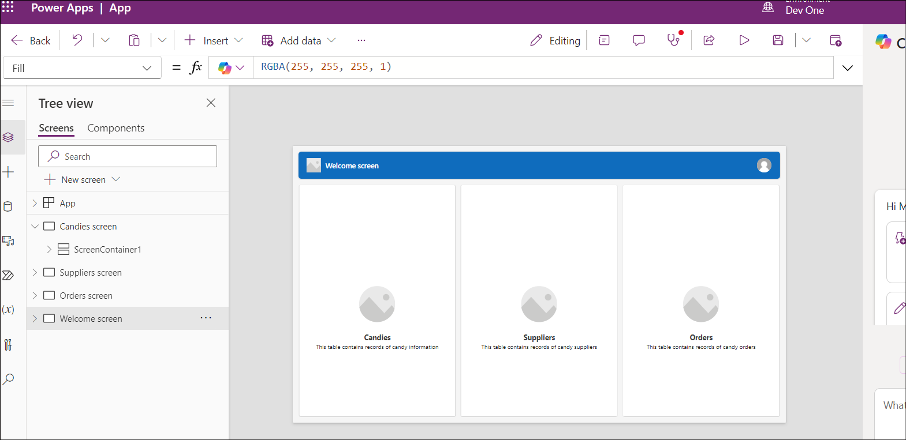
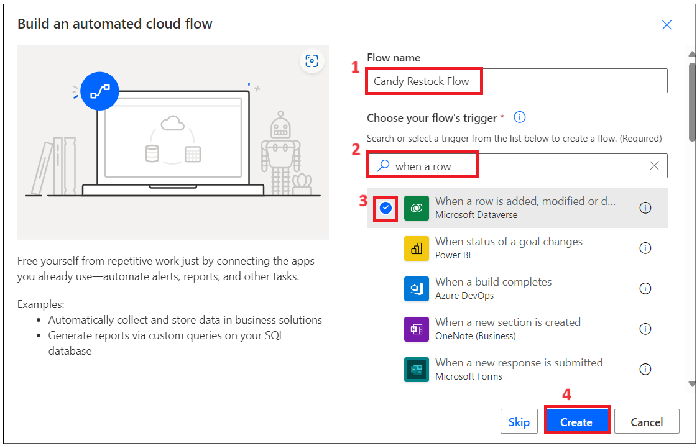
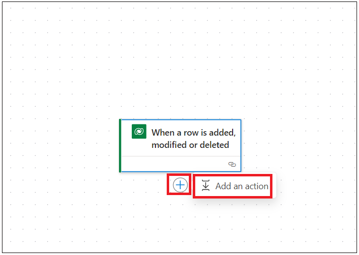

# Lab 2 - Creare un' Inventory Management App

**Obiettivo:** l'obiettivo di questo lab è guidare i partecipanti
attraverso la creazione di un'applicazione funzionale per la gestione
dell'inventario utilizzando Microsoft Power Apps e Copilot. I
partecipanti impareranno a configurare il proprio ambiente Common Data
Service, progettare schermate dell'app, gestire i dati e automatizzare i
flussi di lavoro di rifornimento dell'inventario con Power Automate.

**Tempo stimato:** 40 min

## Esercizio 1: Creare un' Inventory Management App

### Attività 1: Verifica dell'ambiente Dataverse

1.  Aprire un browser e vai a
    +++**https://admin.powerplatform.microsoft.com**+++. Accedere con
    l'account amministratore di Office 365.

2.  Selezionare **Environments** nel menu di navigazione a sinistra.
    **Developer environment** dovrebbe essere stato creato
    automaticamente, come illustrato nell'immagine seguente. Questo
    ambiente viene creato automaticamente non appena fornisci la licenza
    di Microsoft Power App for Developer utilizzando i tuoi account
    amministratore. Il nome dell'ambiente sarà diverso per ogni account
    amministratore.

- 

3.  Utilizzare lo stesso ambiente di sviluppo per eseguire tutti gli
    esercizi di questo laboratorio.

> **Nota**: in questo laboratorio viene utilizzato l'ambiente di
> sviluppo **Dev one**. Il nome dell'ambiente può essere diverso per
> utenti diversi. Assicurati di selezionare l'ambiente di sviluppo.

### Attività 2: Creare un' inventory management app utilizzando Copilot. 

1.  Aprire un browser e passare a +++**https://make.powerapps.com**+++
    Accedere con l'account tenant amministratore di Office 365.

2.  Fare clic sull'ambiente nell'angolo in alto a destra e selezionare
    **your developer** (Dev one è un ambiente di sviluppo utilizzato in
    questa guida di laboratorio)

- 

3.  Immettere il prompt sottostante e fare clic sul pulsante **Enter**.

- +++**build a candy inventory management app**+++

  

4.  Selezionare il riquadro **Start with Copilot**

- 

5.  Immettere il prompt sottostante e fare clic su **Generate** per
    creare una tabella con l'aiuto di Copilot

- +++**Candy Inventory management**+++

  

6.  Copilot genera le tabelle come mostrato nell'immagine seguente.

- 

7.  Fare clic su tre punti accanto a Candy e quindi fare clic su **View
    data.**

- 

8.  I dati nella tabella Candy dovrebbero avere i dati mostrati
    nell'immagine seguente.

- 

9.  Fare clic su **Supplier –\> View data** ed esplorare i dati, quindi
    chiudere la finestra di visualizzazione.

- 

10. Aggiorna uno degli ID e-mail del fornitore con il tuo ID e-mail di
    lavoro/personale

- 

11. Cliccare su **Order –\> View data**

- 

12. Entrare il prompt sotto nella casella di testo e fare clic su
    **Enter**. Questa colonna è necessaria per notificare quando la
    quantità è scesa al di sotto del punto di riordino.

- +++**Add reorder point column to Candy table**+++

  

13. Aggiungere la colonna candyInStock con il tipo come Number. Se la
    quantità è inferiore ai punti di riordino, la colonna Quantità
    automatizzerà l'aggiunta con candyInStock.

- +++**Add** candyInStock\*\* column to Candy table with sample stock
  count\*\*+++

  

14. La tabella è stata aggiornata con la colonna dei punti di riordino e
    la colonna Candy in magazzino

- 

15. Fare clic sul pulsante **Save and open app**

- 

16. Sulla finestra **Done working?**, cliccare su **Save and open app**
    e attendere che l'app venga creata.

- 

  

17. Saltare la finestra di benvenuto.

- 

18. L'app viene creata e dovrebbe assomigliare all'immagine qui sotto.

- 

19. Fare clic sul pulsante **Save** e inserire il nome **MSCandy
    Inventory management app**, quindi fare clic sul pulsante **Save**.

- 

  

20. Esplorare l'app. Fare clic su **Candy screen** dalla vista ad
    albero. È possibile aggiornare l'etichetta dello schermo alla
    **Candy Inventory management**

- 

21. Esplorare la schermata Supplier e aggiornare secondo le tue
    esigenze.

- 

### Attività 3: Creare un candy quality Screen

1.  Fare clic su **New Screen** e selezionare **Blank** template.

- 

2.  Selezionare la nuova schermata e fare clic con il pulsante destro
    del mouse su **Rename**

- 

3.  Assegnare un nome allo schermo +++**Candy quality screen**+++

- 

4.  Fare clic sull'area Schermo e selezionare **Create a new
    table(preview)**

- 

4.  Fare clic su **New table –\> Add columns and data.**

- 

5.  Fare clic su **New column -\> Edit column.**

- 

6.  Inserire il nome visualizzato come **Candy ID**, quindi fare clic
    sul pulsante **Update**.

- 

7.  Cliccare su Nuova colonna e inserire i dettagli sottostanti e poi
    cliccare su **Save**.

    - **Display Name:** Candy Name

    - **Data Type:** Choice

    - **Required:** Yes.

    - **Choices:** add below choices

      - Chocolate Bar

      - Gummy Bears

      - Jellybeans

      - Lollipop

      - Sour Patch Kids

- 

8.  Fare clic su New Column e aggiungere una colonna con i dettagli
    sottostanti, quindi fare clic su **Save**.

    - **Display Name:** Candy Quality
    - **Data type:** Choice
    - **Required:** Yes
    - **Choice:** labels
      - Defective
      - Nondefective

- 

> **Nota:** puoi aggiungere altre colonne in base ai requisiti dell'app.

10. Modificare il nome della tabella e aggiornala con +++**Candy Quality
    check**+++. 

11. Fare clic su **Save and exit -\> Save and exit**.
    

12. Tornerai alla pagina dell'app Power Apps. Selezionare la schermata
    appena aggiunta e fare clic su Insert e selezionare **Edit form**
    come mostrato nell'immagine sottostante. 

13. Fare clic sul contenitore e selezionare la tabella dell'origine dati
    come +++**Candy Qualities table**+++. 

14. Dovresti vedere il modulo come nell'immagine sottostante.
    

15. Regolare la tabella al centro della pagina. Fare clic su **Insert-\>
    Text label.** 

16. Regolare l'etichetta del testo e inserire il testo come: +++**Candy
    Quality check**+++ e aggiorna gli stili del testo.
    

17. Selezionare il **Form**. Fare clic su **Insert** e selezionare
    **Button**. 

18. Trascinare il pulsante di invio e posizionalo al centro del
    contenitore. Seleziona il pulsante e modifica il testo delle
    **properties** in **Submit** come mostrato nell'immagine
    sottostante. 

19. Selezionare il pulsante **Submit** e selezionare la funzione
    **OnSelect** e immettere la funzione seguente.

> **Nota:** Form4 nella formula deve essere sostituito con il nome del
> modulo SubmitForm(Form4); NewForm(Form4).

20. Selezionare il contenitore, in properties, selezionare Modalità
    **Default** su **New**. 

21. Fare clic su **Save,** quindi fare clic sul pulsante **Preview app**
    come mostrato nell'immagine sottostante. 

22. Inserire i dettagli di Candy e quindi fare clic sul pulsante
    **Submit**. 

23. Tornare alla tabella della qualità di Candy nell'ambiente Dataverse
    e dovresti vedere il record aggiunto sopra. 

24. Chiudere la finestra di anteprima.

## Esercizio 2: Creare un flusso di Power Automate per rifornire l'inventario.

### Attività 1: Creare un flusso di Power Platform per attivare l'e-mail di rifornimento

1.  Torna alla scheda Power Automate e fare clic su **My flows** -\>
    **New flow -cloud flow.** 

2.  Inserire il nome del flusso come: +++**Candy Restock Flow**+++.
    Cercare +++ **When a row**+++ è e selezionare l'azione **When a row
    is added or modified** di Common Data Service, quindi fare clic su
    **Create**. 

3.  Selezionare l'azione e imposta i parametri sottostanti.

    - Change Type; Added or Modified
    - Table Nam: Candies

    &nbsp;

    - Scope: Organization 

4.  Aggiungere un'azione dopo un'azione **“when a row is added, modified
    or deleted”.** 

5.  Cercare **Condition** e selezionare l'azione **Control’s
    Condition**. 

6.  Fare clic su Chose value e selezionare scegli dall'azione dinamica
    del passaggio precedente. 

7.  Cercare la colonna +++**Quantity**+++ e selezionala.
    

8.  Selezionare una condizione **is less than** e fare clic su ‘Enter
    data from previous action’. 

9.  Cercare la colonna +++**Reorder points**+++ e selezionala.
    

10. **Aggiungere un'azione** in condition **True**.
    

11. Selezionare l'azione +++**Approvals**+++. 

12. Selezionare +++**Start and wait for an Approvals**+++ .
    

13. Selezionare Approval Type come: +++**Approve/Reject – First to
    Respond**+++. Inserire il titolo come: +++**Approve to
    Restock**+++ - e fare clic sul pulsante Dinamico per selezionare i
    dati del passaggio precedente. 

14. Cercare **Candy Name+++** e selezionalo**.**
    

15. Inserire i dettagli qui sotto.

- Assegnato a: il tuo ID e-mail di lavoro.

      Assigned to: Your work email id.

      Details:

      Hi Sir,  

      is out of stock - for customers to place an order. Please approve to
      restock.  

      Thanks

> **Nota:** Puoi personalizzare la sezione dei dettagli in base alle tue
> esigenze.

16. **Aggiungere un'azione** dopo l'azione **approval**.
    

17. Cercare +++**condition**+++ e selezionare **Control – Condition**.
    

18. Fare clic su Choose value e selezionare **Outcome** da Inizio e
    attendere un'azione di approvazione. 

19. Selezionare la condizione **is equal to** e immettere il valore
    **Approve**. 

20. In condition **True,** **add an action**. 

21. Cercare **Update Row** e selezionala dalla sezione **Microsoft
    Dataverse**. 

22. Selezionare la tua tabella **Candy** e fare clic su **Row Id**,
    selezionare l'azione Dynamic. 

23. Cercare una colonna di identificatore univoco dalla tabella e
    selezionala. 

24. Fare clic sul menu a discesa **Advanced Parameters** e selezionare
    la colonna **Quantity**. 

25. Inserire la funzione sottostante (digiti nella tua app) e comprimi
    l'azione.

- > **Nota:** la funzione seguente non funziona per te poiché il nome
  > dello schema della colonna potrebbe essere diverso. Vai alla colonna
  > \> tabella e copia il nome dello schema.

  +++add(triggerBody()?\[‘cr8a3_Quantity’\],triggerBody()?\[‘cr8a3_CandyInStock’\])+++

  

26. Fare clic sul pulsante **Salva** per salvare il flusso di Power
    Automate. 

### Attività 2: Testare il flusso di rifornimento

1.  Tornare alla scheda **PowerApps** e fare clic sulla schermata
    **Candy** dalla vista ad albero a sinistra e selezionare **Play**.

- > **Nota:** è possibile aggiornare il titolo della schermata

  

2.  Selezionare la Candy e fare clic su **Edit**.
    

3.  Immettere il valore **Quantity**, **less than reorder points** e
    **confermare** le modifiche. 

4.  Tornare alla scheda Power Automate flow e fare clic su My flows -\>
    Your flow. 

5.  Il flusso è in esecuzione ed è in condizione.
    

6.  Aprire una nuova scheda e vai a +++**https://outlook.com**+++ e
    accedi con il tuo account amministratore di Office 365. Dovresti
    aver ricevuto un'e-mail per rifornire. **Approve** e **submit**.
    

- 

7.  Il flusso ha avuto successo ora. 

- 

8.  Tornare a PowerApps e controlla la quantità di prodotti sopra
    indicata. Dovrebbe essere stato aggiornato (caramelle in magazzino +
    quantità quando è inferiore al punto di riordino)
    

### Conclusione:

Al termine di questo laboratorio, i partecipanti saranno in grado di
verificare il proprio ambiente Dataverse, creare un'app di gestione
dell'inventario utilizzando Copilot, progettare una schermata di
controllo della qualità delle caramelle con campi personalizzati e
implementare i flussi Power Automate per attivare le richieste di
rifornimento in base ai livelli di inventario. Inoltre, acquisiranno
competenze nel testare e convalidare flussi di lavoro automatizzati per
garantire aggiornamenti accurati dell'inventario dopo i processi di
approvazione. Questo approccio strutturato consentirà ai partecipanti di
sfruttare in modo efficace le funzionalità di Power Apps e Power
Automate, migliorando le proprie competenze nello sviluppo di app e
nell'automazione dei processi.
