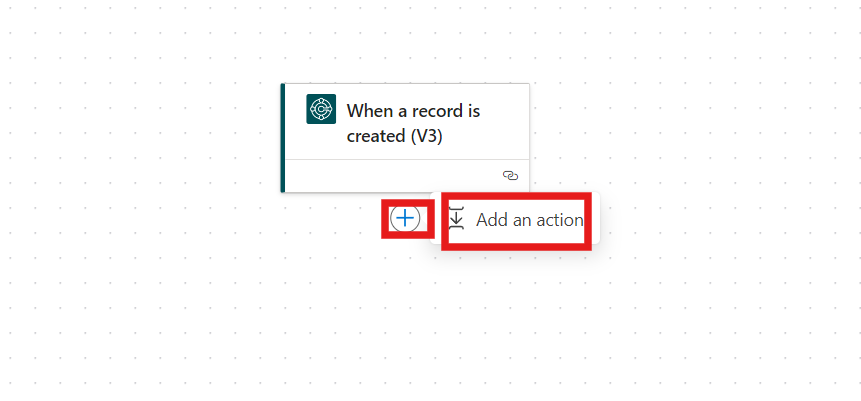
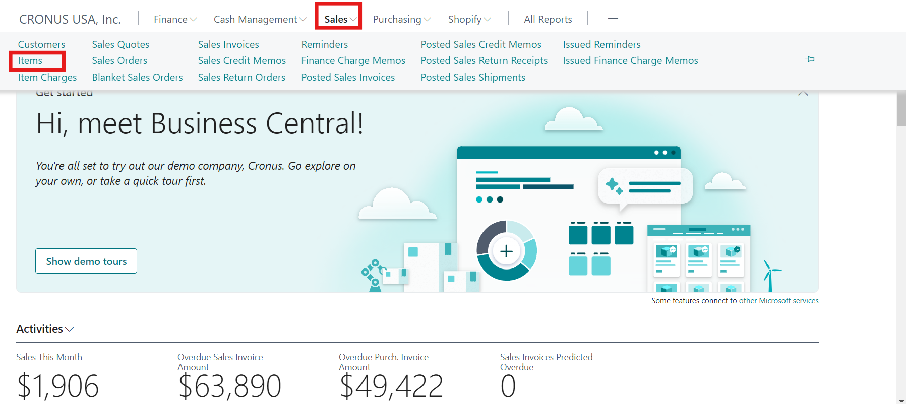
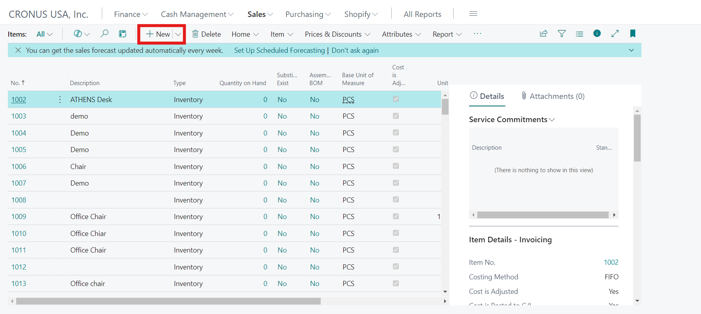

Laboratorio 3 – Construya un Automated Flow para notificar al gerente
cuando se crea un nuevo elemento en Dynamics 365 Business Central

**Objetivo:** En este laboratorio, los participantes aprenderán a crear
un automated flow en Power Automate que manda un email notification
cuando se crea un nuevo elemento en Microsoft Dynamics 365 Business
Central. Al seguir un proceso estructurado, los participantes se
familiarizarán con los triggering flows en función de los datos de
Business Central, recopilando información del elemento pertinente,
insertando conditional logic, y ejecutando acciones para mandar alertas
email. Esta experiencia práctiva le habilitará a aprovechar Power
Automate para mejorar los procesos y notificaciones empresariales.

**Duración estimada:** 15 minutos

Tarea 1: Regístrese en Microsoft Dynamic 365 Business Central

1.  Navegue a
    +++\*\*[*https://www.microsoft.com/en-us/dynamics-365/products/business-central\*\*+++*](https://www.microsoft.com/en-us/dynamics-365/products/business-central**+++) y
    haga clic en **Try for Free.**

> 

2.  Introduzca su Office 365 tenant ID y haga clic en **Next**.

> 

3.  Luego, haga clic en **Sign in** e introduzca las credenciales.

> 

4.  Seleccione **United states** como country or region, introduzca
    su **phone number** y seleccione **Get started**.

> 

5.  Haga clic en **Get started** para acceder al Business Central.

> 

6.  Seleccione el botón **Skip Survey** para continuar.

> 

7.  Se le dirigirá a la página de inicio de Dynamics 365 Business
    Central.

> 

Tarea 2: Inicie Power Automate

1.  Abra una nueva pestaña junto a Dynamic 365 business central y
    navegue a
    +++\*\*[*https://make.powerautomate.com/\*\*+++*](https://make.powerautomate.com/**+++) en
    su navegador.

> 

2.  Si le pide, introduzca el **Microsoft 365 tenant id** en el campo
    relevante y haga clic en el botón **Next**.

> 

3.  Introduzca el **password** en el campo relevante y haga clic
    en **Sign in.**

> 

4.  Desde la barra de navegación superior, seleccione el
    environment **Dev One.**

> 

5.  Haga clic en **+Create** en el menú izquierdo.

> 

6.  Seleccione el **Automated cloud flow** tile.

> 

Tarea 3: Cree el Trigger en función de los datos de Business Central

1.  En el cuadro **Flow name**, introduzca +++**Email notification for
    new furniture**+++.

> 

2.  En **Choose your flow's trigger search bar**, introduzca **business
    central**. Baje para ver los triggers y seleccione el trigger **When
    a record is created (V3)**.

3.  Haga clic en **Create**.

> 

4.  Introduzca los detalles del trigger:

    1.  **Environment name**: introduzca +++**PRODUCTION**+++.

    2.  **Company name**: Seleccione **CRONUS USA, Inc.** desde la
        lista.

    3.  **Table name**: Seleccione **items**.

> 

Tarea 4: Recopile datos desde Business Central

1.  Haga clic en el botón **+** add y seleccione **Add an action**.

> 

2.  En la pantalla **Add an action**, tecle +++**Dynamics 365 Business
    Central**+++ en el search box y elija la acción **Get record (V3)**.

> 

3.  Introduzca la siguiente información:

    1.  **Environment**: +++**PRODUCTION**+++.

    2.  **Company name**: Seleccione **CRONUS USA, Inc.**.

    3.  **Table name**: Seleccione **items**.

    4.  **Row id**: Seleccione el **Row Id** token desde Dynamic
        content.

> 

Tarea 5: Cree el Condition

1.  Haga clic en el botón **+** debajo de Get record y seleccione **Add
    an action**.

> 

2.  En el **Add an action** search bar, introduzca **Control**. Elija
    el **Condition** action.

> 

3.  Establezca el condition:

    1.  En el primer **Choose a value**, seleccione el **Item Category
        Code** token desde Dynamic content.

    2.  Mantenga la opción **is equal to**.

    3.  En el segundo **Choose a value**, introduzca
        +++**FURNITURE**+++.

> 

Tarea 6: Cree un Action en función del Condition

1.  En la ventana de condition **If yes or True**, haga clic en **Add an
    action**.

> 

2.  Busque +++**office 365 outlook**+++ en la ventana Add an action y
    haga clic en see more. En el office 365 outlook trigger
    seleccione **Send an Email (V2).**

> 
>
> 

3.  Introduzca los detalles del email:

    1.  **To**: Introduzca ‘Admin’ y seleccione **Mod Admin** desde la
        sugerencia, o sea, Office 365 tenant email Id, lo que está
        usando en este laboratorio.

    2.  **Subject**: Introduzca +++**New furniture released**+++.

    3.  **Body**:

        1.  Agregue el texto **New** **furniture**.

        2.  Agregue el token **Number** desde Dynamic content.

        3.  Agregue el token **displayName** desde Dynamic content.

        4.  Agregue el texto +++**has just released.**+++

> 

4.  Haga clic en **Save** para finalizar su flow.

> 

Tarea 7: Pruebe el Flow

1.  Desde la barra superior, haga clic en el botón **Test**.

> 

2.  Seleccione el **Manual** Process y haga clic en **Test**.

> 

3.  Vuelva al **Business Central website** y desde la barra superior,
    vaya a **Sales** 🡪 **Items**.

> 

4.  Haga clic en el botón **+ New**

> 

5.  Seleccione **ITEM**, y haga clic en **OK**.

> 

6.  En el campo Item Category Code, seleccione **FURNITURE** y en el
    campo Description, escriba **Office Chair.**

> 

7.  Haga clic en el botón **Save**.

> 

8.  En el Power Automate portal, haga clic en **App launcher** en la
    esquina superior izquierda. Seleccione **Outlook** y puede ver que
    se ha recibido la respuesta automatizada en el **email** de MOD
    Admin.

> 

Conclusión:

A finales de este laboratorio, los participantes habrán creado un
automated email notification flow en Power Automate para nuevos
elementos en Business Central. Habrán obtenido una experiencia práctica
en configurar triggers, actions, y conditions, los que son habilidades
necesarias para automatizar los workflows. Los participantes también
comprenderán cómo recopilar y manipular datos de Business Central de
manera effectiva, habilitándole a agilizar y mejorar la productividad en
sus organizaciones. Este conocimiento funciona como una base para
explorar más las capacidades de Power Automate para automatizar varios
procesos empresariales.
