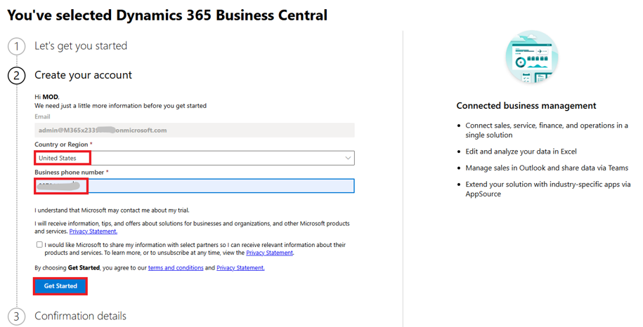
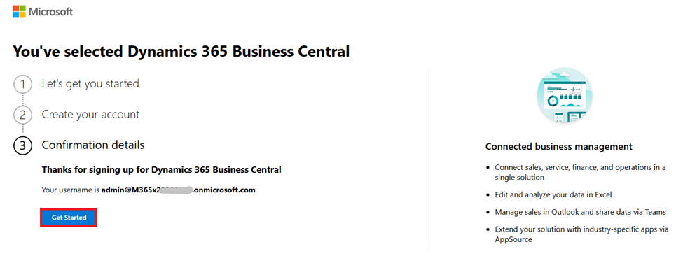
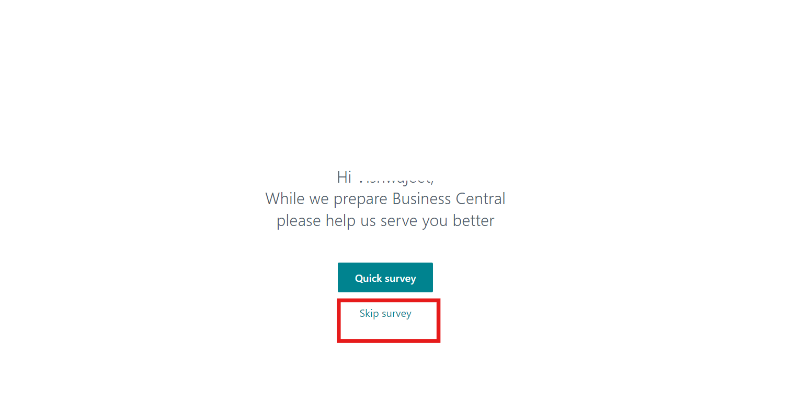
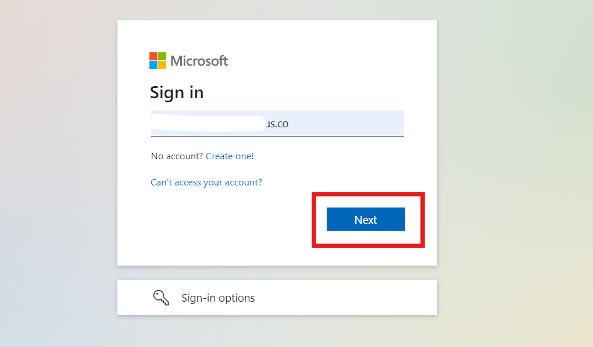
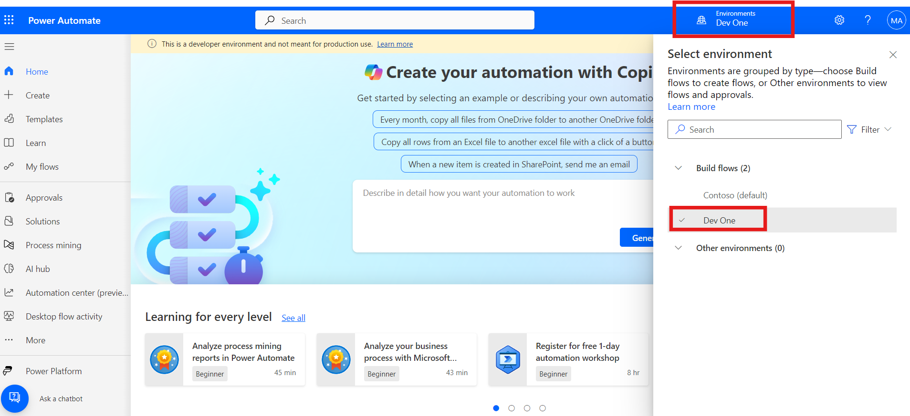
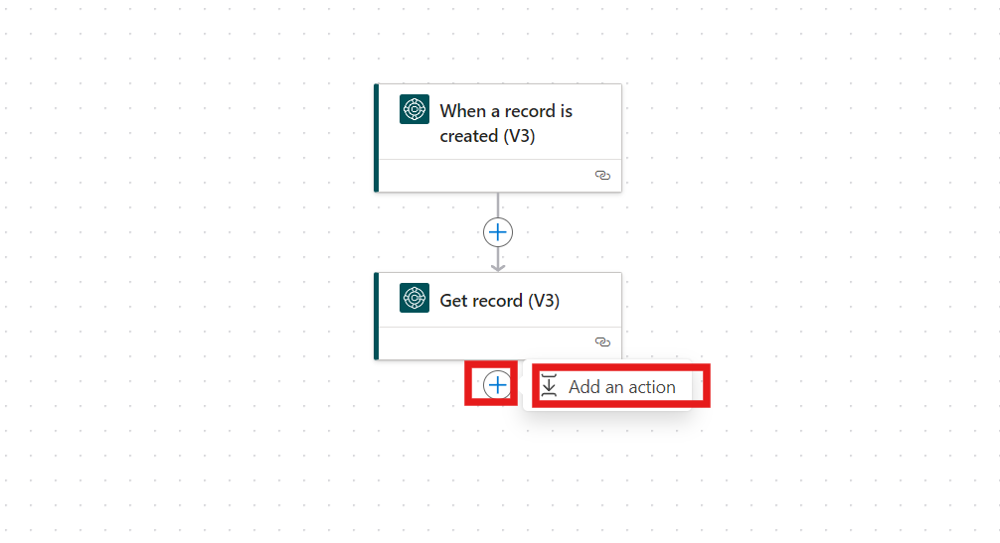
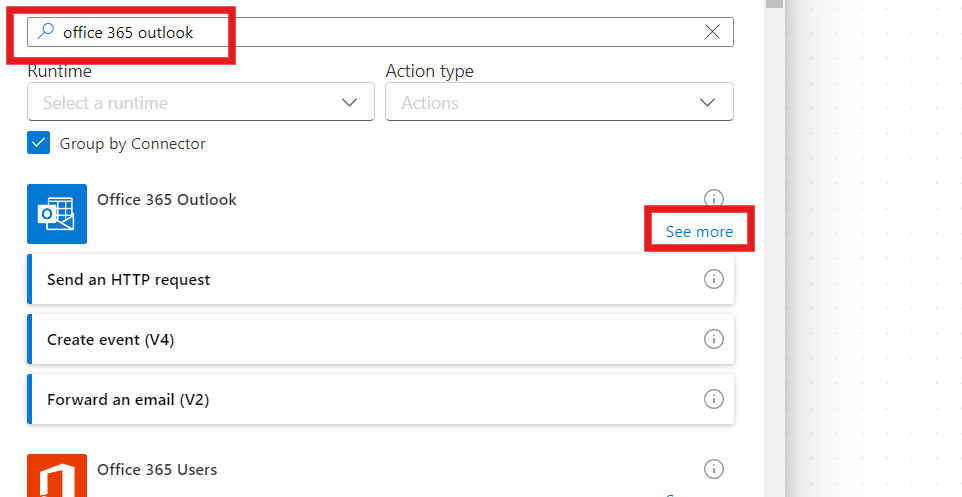
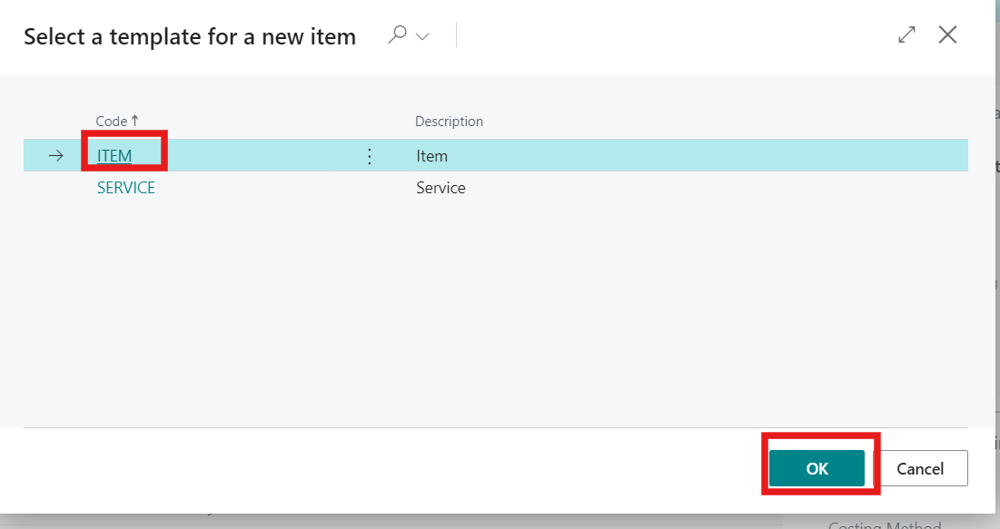
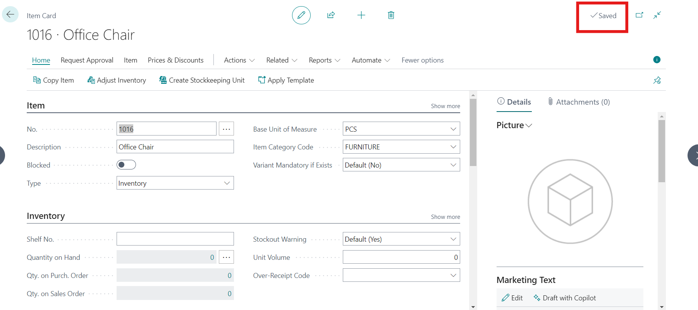

**ラボ３‐Dynamics 365 Business Central
で新しいアイテムが作成されたときにマネージャーに通知する自動フローを構築する**

**目的：**このラボでは、Microsoft Dynamics 365 Business Central
で新しいアイテムが作成されるたびにメール通知を送信する自動フローを Power
Automate
で作成する方法を学習します。構造化されたプロセスに従うことで、参加者は
Business Central
データに基づいてフローをトリガーし、関連するアイテム情報を収集し、条件付きロジックを適用し、メールアラートを送信するアクションを実行する方法を習得します。このハンズオン体験を通じて、参加者は
Power Automate
を活用してビジネスプロセスと通知を強化できるようになります。

**所要時間：** 15分

**タスク１：Microsoft Dynamic 365 Business Central にサインアップする**

1.  +++\*\*
    [*https://www.microsoft.com/en-us/dynamics-365/products/business-central\*\*+++*に移動し](https://www.microsoft.com/en-us/dynamics-365/products/business-central**+++)、**Try
    for Free**をクリックします。

> 

2.  Office 365 tenant IDを入力し、**Next**をクリックします。

> 

3.  次に、**Sign in**をクリックして資格情報を入力します。

> 

4.  国または地域として**United states**を選択し、**phone
    number**を入力してから**Get started**を選択します。

> 

5.  次に、**Get started**をクリックしてBusiness Central
    にアクセスします。

> 

6.  **Skip Survey**ボタンを選択してください。

> 

7.  Dynamics 365 Business Central のホームページに移動されます。

> 

**タスク２：Power Automateを起動する**

1.  Dynamic 365 business central
    の横に新しいタブを開き、ブラウザで+++\*\*
    +++\*\*[*https://make.powerautomate.com/\*\*+++*](https://make.powerautomate.com/**+++)に移動します。

> 

2.  求められたら、該当するフィールドに**Microsoft 365 tenant
    id**を入力し、**Next**ボタンをクリックします。

> 

3.  該当するフィールドに**password**を入力し、**Sign
    in**をクリックします。

> 

4.  上部のナビゲーション バーから、環境**Dev One**を選択します。

> 

5.  **+Create**をクリック 左側のメニューにあります。

> 

6.  **Automated cloud flow**を選択します。

> 

**タスク３：Business Central データに基づいてトリガーを作成する**

1.  **Flow name**ボックスに、+++**Email notification for new
    furniture**+++と入力します。

> 

2.  **Choose your flow's trigger search bar**に**business
    central**と入力します。下にスクロールしてトリガーを表示し、**When a
    record is created (V3)**トリガーを選択します。

3.  **Create**をクリックします。

> 

4.  トリガーの詳細を入力します：

    1.  **Environment name**: +++ **PRODUCTION** +++ と入力します。

    2.  **Company name：**リストから**CRONUS USA, Inc.**を選択します。

    3.  **Table name**: **items**を選択します。

> 

**タスク４：Business Central からデータを収集する**

1.  **+button**をクリックし、**Add an action**を選択します。

> 

2.  **Add an action**ウィンドウの検索ボックスに+++ **Dynamics 365
    Business Central +++**と入力し、**Get record
    (V3)**アクションを選択します。

> 

3.  次の情報を入力してください。

    1.  **Environment**：+++**PRODUCTION**+++

    2.  **Company name：CRONUS USA, Inc.**を選択します。

    3.  **Table name**：**items**を選択します。

    4.  **Row id**：Dynamic contentから**Row Id**トークンを選択します。

> 

**タスク５：条件を設定する**

1.  **+ button**をクリックし、**Add an action**を選択します。

> 

2.  **Add an
    action**検索バーに**Control**と入力します。**Condition**アクションを選択します。

> 

3.  条件を設定します:

    1.  最初の**Choose a value**ボックスで、動的コンテンツから**Item
        Category Code**トークンを選択します。

    2.  **is equal to**オプションにします。

    3.  2 番目の**Choose a value**ボックスに、+++ **FURNITURE**
        +++と入力します。

> 

**タスク６：条件に基づいてアクションを作成する**

1.  **If yes or True**ウィンドウで、**Add an action**をクリックします。

> 

2.  アクションの追加ウィンドウで**+++office 365 outlook
    +++**を検索し、詳細を表示をクリックします。Office 365 Outlook
    トリガーで、**Send an Email (V2)**を選択します。

> 
>
> 

3.  メールの詳細を入力してください:

    1.  **To**: 「Admin」と入力し、提案から **Mod
        Admin**を選択します、このラボで使用している Office 365
        テナントの電子メール ID。

    2.  **Subject**: Enter +++**New furniture released**+++

    3.  **Body**:

        1.  テキストの**New** **furniture**を追加。

        2.  動的コンテンツからトークン**Number**を追加します。

        3.  動的コンテンツからトークン**displayName**を追加します。

        4.  +++**has just released**.+++のテキストを追加します**。**

> 

4.  **Save**をクリックしてフローを確定します。

> 

**タスク７：フローをテストする**

1.  上部のバーから、**Test**ボタンをクリックします。

> 

2.  **Manual**プロセスを選択し、**Test**をクリックします。

> 

3.  **Business Central
    website**に戻り、上部のバーから**Sales** 🡪 **Items**に移動します。

> 

4.  **+ New button**ボタンをクリックします。

> 

5.  **ITEM**を選択し、**OK**をクリックします。

> 

6.  商品カテゴリコードフィールドで**FURNITURE**を選択し、説明フィールドに**Office
    Chair**と入力します。

> 

7.  **Save**ボタンをクリックします。

> 

8.  Power Automate ポータルで、左上にある**App
    launcher**をクリックします。**Outlook**を選択すると、MOD
    管理者が指定したメールアドレスに自動応答が届いていることがわかります。

> 

**結論：**

このラボの終了時には、参加者はBusiness
Centralの新規アイテムに関する自動メール通知フローをPower
Automateで作成できるようになります。ワークフローの自動化に不可欠なトリガー、アクション、条件の設定に関する実践的な経験を積むことができます。また、Business
Centralからデータを効果的に収集・操作する方法を理解し、それぞれの組織におけるコミュニケーションを効率化し、生産性を向上させることができます。この知識は、様々なビジネスプロセスの自動化におけるPower
Automateの機能をさらに探求するための基盤となります。
