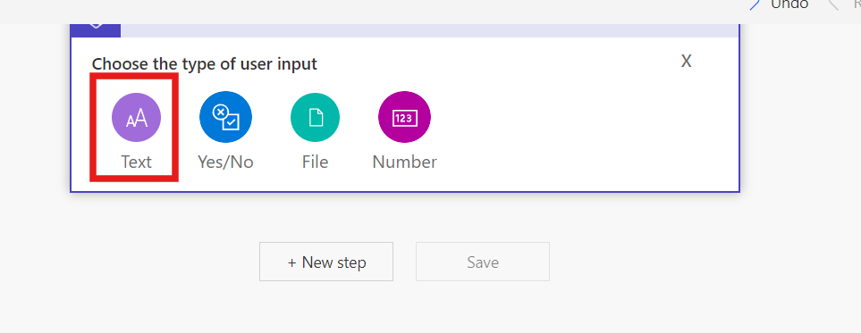
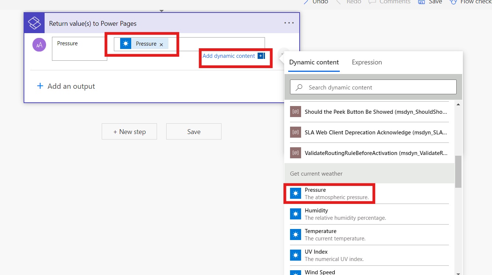

# Lab 04 - Power Create an automated flow to invoke an MSN weather app to display the current weather details on the page of your site​

**Objective:** The objective of this lab is to guide participants
through the process of integrating a Power Automate cloud flow with a
Power Pages site. Participants will learn how to create a Power Page
website using templates, set up a cloud flow to fetch current weather
data from the MSN Weather service, and build a custom webpage that
displays this weather information. By the end of the lab, participants
will gain hands-on experience with Power Pages and Power Automate,
enabling them to create dynamic and interactive web applications that
respond to user input.

**Estimated** **Time:** 25 mins

# Task 1: Sign In and Create Power Page Website

1.  Navigate to
    <https://www.microsoft.com/en-us/power-platform/products/power-pages>'
    and at the top right corner click on the **Sign In.**

    

2.  Sign in with **Microsoft 365 tenant credentials**.

    

    

3.  Select the **environment Dev One** form the top bar.

    

4.  Select **Start with a template** to create a website with template.

    

5.  Select **Choose a template** and create a website.

    

6.  Enter the site name as **contoso** in the respected field and click
    on **Done** button to create the website.

    

# Task 2: Create cloud flow

1.  Navigate to power pages Home page and click on the **Edit** button
    in the website.

    

2.  Flow the left navigation bar select the Setup, and then select
    **Cloud flow.**

    

3.  Select **+ Create** new flow from the top bar.

    

4.  Seach power pages in the search bar, then scroll down and select
    **When Power Pages call a flow trigger.**

    

5.  Select **+ Add an input**.

    

6.  Choose **Text**.

    

7.  Add a name as **Location** and click on + New step.

    

8.  Search for **MSN Weather**.

9.  Select the **Get current weather** action.

    

10. Focus cursor on **Location** input text
    Select **Location** parameter under **When Power Pages calls a
    flow** from dynamic content.

    

11. Select **+ New step**, Search for Power Pages, Select **Return
    value(s) to Power Pages** action.

    

12. Select **+ Add** and output, **Select Text**, Enter **Pressure** as
    the title.

    

13. In Pressure value to respond section, choose dynamic
    content **Pressure**.

    

14. Repeat to create the following output steps using text type:

    1.  Humidity

    2.  Temperature

    3.  UV index

    4.  Wind speed

    5.  Location

    6.  Visibility Distance

    7.  Latitude

    8.  Longitude

    9.  Temperature Units

    10. Pressure Units

    11. Speed Units

    12. Distance Units

    13. Conditions

    

15. Name the flow **Get current weather.**

    

16. Select **Save**, and close the flow section

    

17. Navigate to cloud flow and click on the Get Current weather, select
    **Add to site.**

    

18. Select **+ Add roles** under Roles, Select **Anonymous Users** role,
    Select **Add**.

    

19. Click on the **Save** button.

    

20. **Copy** the **URL**.

    

**Note:** This is the unique URL used to connect to the associated cloud
flow. You'll use this URL later to call the current weather flow.

# Task 3: Create a page to display MSN weather data

1.  Select Pages workspace, Select **+ Page.**

    

2.  Name the Page **" Todays_weather_report"** and then click on the
    **Add** button.

    

3.  Select **Edit code** to open Visual Studio Code and then click on
    **open visual studio code.**

    

4.  **Paste** this code:

    ```
    \<style\>

    div.weatherdetail {

    border: 1px solid \#F3F2F1;

    border-radius: 12px;

    box-shadow: 0px 1.2px 3.6px rgba(0, 0, 0, 0.1), 0px 6.4px 14.4px rgba(0,
    0, 0, 0.13);

    padding: 24px;

    }

    .weather label {

    font-family: 'Nunito';

    font-style: normal;

    font-weight: 600;

    font-size: 18px;

    color: \#323130;

    }

    .weather button {

    font-family: 'Segoe UI';

    padding: 8px 16px;

    font-size: 16px;

    background-color: \#6219D9;

    color: white;

    border: none;

    border-radius: 4px;

    cursor: pointer;

    outline: none;

    }

    div.weather {

    display: flex;

    flex-direction: column;

    align-items: flex-start;

    padding: 100px;

    gap: 36px;

    width: 840px;

    }

    span.temperature {

    font-family: Segoe UI;

    font-size: 96px;

    font-style: normal;

    font-weight: 600;

    color: \#6219d9;

    }

    span.weatherinfov1 {

    font-family: Segoe UI;

    font-size: 28px;

    font-style: normal;

    font-weight: 400;

    color: \#201f1e;

    }

    span.weatherinfov2 {

    font-family: Segoe UI;

    font-size: 24px;

    font-style: normal;

    font-weight: 600;

    color: \#a19f9d;

    }

    \</style\>

    \<div class="row sectionBlockLayout text-left" style="display: flex;
    flex-wrap: wrap; margin: 0px; min-height: auto; padding: 8px;"\>

    \<div class="container" style="display: flex; flex-wrap: wrap;"\>

    \<div class="col-md-12 columnBlockLayout weather" style="flex-grow: 1;
    display: flex; flex-direction: column; min-width: 310px; word-break:
    break-word; padding: 0 180px; margin: 60px 0px;"\>

    \<h1\>What's the weather?\</h1\>

    \<form id="cityForm"\>

    \<label for="locationInput"\>Enter a location to find out\</label\>

    \<br\>

    \<input type="text" style="width: 840px; border: 1px solid \#D2D0CE;"
    id="locationInput" required /\>

    \<p\>

    \<p\>

    \<button type="submit"\>Submit\</button\>

    \</p\>

    \</form\>

    \<div id="weatherdetail" class="weatherdetail" style="display:
    none;width: 840px"\>

    \<div\>

    \<div\>

    \<span class="temperature" id="temperature"\ \</span\>

    \<span class="weatherinfov1" id="temperature_units"\>\</span\>

    \</div\>

    \<div\>

    \<span class="weatherinfov1" style="font-size: 36px;" id="location"\>
    \</span\>

    \<br\>

    \<span class="weatherinfov1" style="font-size: 24px;"
    id="cordinates"\>\</span\>

    \<p\>

    \</div\>

    \</div\>

    \<div style="display: flex;"\>

    \<div style="flex: 1;"\>

    \<span class="weatherinfov2"\>Wind: \</span\>

    \<span class="weatherinfov1" id="windspeed"\>\</span\>

    \<span class="weatherinfov1" id="speed_units"\ \</span\>

    \</div\>

    \<div style="flex: 1;"\>

    \<span class="weatherinfov2"\>Visibility: \</span\>

    \<span class="weatherinfov1" id="visibility"\>\</span\>

    \<span class="weatherinfov1" id="distance_units"\>\</span\>

    \</div\>

    \</div\>

    \<div style="display: flex;"\>

    \<div style="flex: 1;"\>

    \<span class="weatherinfov2"\>UV Index: \</span\>

    \<span class="weatherinfov1" id="uv"\>\</span\>

    \</div\>

    \<div style="flex: 1;"\>

    \<span class="weatherinfov2"\>Conditions: \</span\>

    \<span class="weatherinfov1" id="condition"\>\</span\>

    \</div\>

    \</div\>

    \</div\>

    \</div\>

    \</div\>

    \</div\>

    \<script\>

    document.getElementById("cityForm").addEventListener("submit", function
    (event) {

    event.preventDefault(); // Prevent form submission

    var weatherDiv = document.getElementById("weatherdetail");

    weatherDiv.style.display = "none";

    var location = document.getElementById("locationInput").value;

    var \_url = "\<Cloud flow URL\>";

    var data = {};

    data\["Location"\] = location;

    var payload = {};

    payload.eventData = JSON.stringify(data);

    shell

    .ajaxSafePost({

    type: "POST",

    url: \_url,

    data: payload

    })

    .done(function (response) {

    const result = JSON.parse(response);

    document.getElementById("temperature").innerHTML =
    result\["temperature"\];

    document.getElementById("windspeed").innerHTML = result\["wind_speed"\];

    document.getElementById("visibility").innerHTML =
    result\["visibility_distance"\];

    document.getElementById("uv").innerHTML = result\["uv_index"\];

    document.getElementById("location").innerHTML = result\["location"\];

    document.getElementById("condition").innerHTML = result\["conditions"\];

    document.getElementById("temperature_units").innerHTML =
    result\["temperature_units"\];

    document.getElementById("speed_units").innerHTML =
    result\["speed_units"\];

    document.getElementById("distance_units").innerHTML =
    result\["distance_units"\];

    document.getElementById("cordinates").innerHTML =
    parseFloat(result\["latitude"\]).toFixed(2) + ', ' +
    parseFloat(result\["longitude"\]).toFixed(2);

    weatherDiv.style.display = "block";

    })

    .fail(function () {

    alert("failed");

    });

    });

    \</script\>

    ```

    

5.  **Replace** the **URL** with the one you copied in the previous
    step.

    

6.  **Save** the code by selecting CTRL + S.

7.  Select **Sync** in design studio.

    

# Task 4: Test the flow integration

To test the flow integration functionality:

1.  Select **Preview** to open the site.

2.  Enter a postal code or city in **Location** text box.

3.  Select the **Submit** button.

    

**Conclusion**: In this lab, participants successfully integrated Power
Automate with a Power Pages site, enhancing their skills in website
creation, cloud flow development, and web page customization. They
learned to design a user-friendly interface that retrieves and displays
dynamic weather data using Power Automate. By testing the flow
integration, participants also developed troubleshooting skills,
empowering them to create interactive applications within the Power
Platform effectively.
