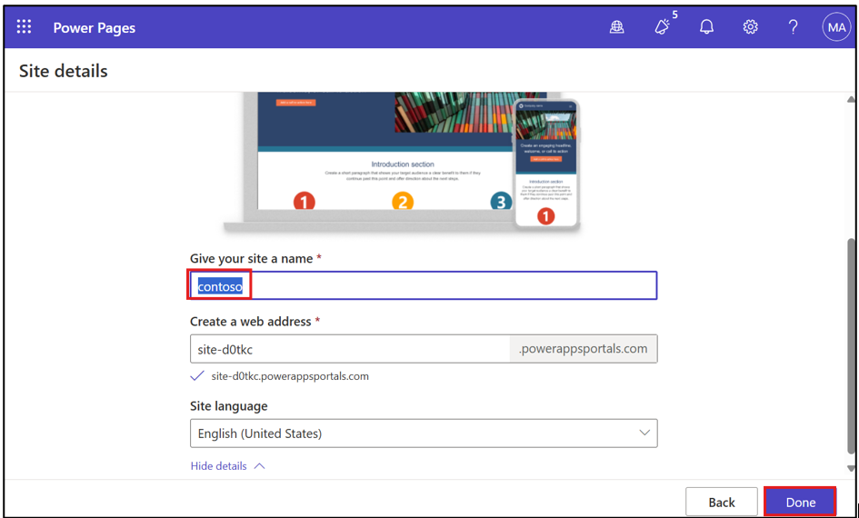
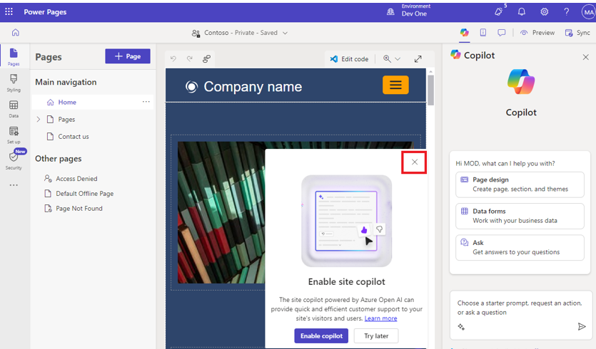
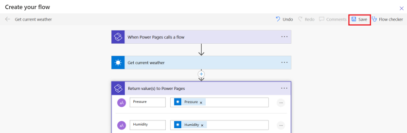
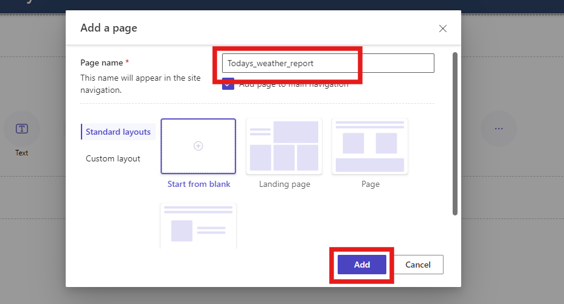

# Laboratório 4 - Crie um Fluxo Automatizado para Acionar o Aplicativo MSN Weather e Exibir Detalhes do Clima Atual na Página do Seu Site

**Objetivo:** O objetivo deste laboratório é orientar os participantes
pelo processo de integração de um fluxo de nuvem no Power Automate a um
site do Power Pages. Os participantes aprenderão a criar um site no
Power Page usando modelos, configurar um fluxo de nuvem para buscar
dados meteorológicos atuais do serviço MSN Weather e criar uma página da
Web personalizada que exiba essas informações meteorológicas. Ao final
do laboratório, os participantes ganharão experiência prática com o
Power Pages e o Power Automate, permitindo que eles criem aplicativos
Web dinâmicos e interativos que respondem à entrada do usuário.

**Tempo estimado:** 25 minutos

### Tarefa 1: Acessar e criar o site do Power Page

1.  Vá para o Power Pages usando
    +++**https://make.powerpages.microsoft.com/**+++.

2.  Certifique-se se você está no ambiente do desenvolvedor – **Dev
    One** e clique em **Get Started**.

- 

3.  Selecione **Skip** na página **Tell us a little about yourself**.

- 

4.  Em **Create a site**, desça e selecione **Start with a template**.

- 

5.  Clique em **Starter layout 1**.

- 

6.  Na página **Starter Layout 1**, selecione **Choose this template**.

- 

7.  Insira o nome do site como +++**contoso**+++ no campo respectivo e
    clique no botão **Done** para criar o site.

- 

### Tarefa 2: Criar fluxo na nuvem

1.  Você pode ver que está navegando para o seu site. Se você vir um
    pop-up sobre **Introducing Copilot in Power Pages**, selecione
    **Next** até chegar à última etapa e selecione **Done**.

- 

  **Observação:** você pode fechar o pop-up **Enable site Copilot**.

2.  Na barra de navegação esquerda, selecione Set up, e, em seguida,
    selecione **Cloud Flow.**

- 

3.  Selecione **+ Create new flow** na barra superior.

- 

4.  Selecione Power Pages na barra de pesquisa, role para baixo e
    selecione **When Power Pages call a flow trigger.**

- 

5.  Selecione **+ Add an input**.

- 

6.  Escolha **Text**.

- 

7.  Adicione um nome como **Location** e clique em + New step.

- 

8.  Pesquise +++**MSN Weather**+++.

9.  Selecione a ação **Get current weather**.

> 

10. Posicione o cursor no campo de texto **Location input**. Selecione o
    parâmetro **Location** em **When Power Pages calls a flow** dentro
    do conteúdo dinâmico.

> 

11. Selecione **+ New step**, pesquise por Power Pages, e selecione a
    ação **Return value(s) to Power Pages**.

> 

12. Selecione **+ Add an output**, escolha **Text** e digite
    +++**Pressure**+++ como título.

> 

13. Na seção Pressure value to respond, escolha o conteúdo dinâmico
    **Pressure**.

> 

14. Repita para criar as seguintes etapas de saída usando o tipo de
    texto:

    1.  +++Humidity+++

    2.  +++Temperature+++

    3.  +++UV index+++

    4.  +++Wind speed+++

    5.  +++Location+++

    6.  +++Visibility Distance+++

    7.  +++Latitude+++

    8.  +++Longitude+++

    9.  +++Temperature Units+++

    10. +++Pressure Units+++

    11. +++Speed Units+++

    12. +++Distance Units+++

    13. +++Conditions+++

> 

15. Nomeie o fluxo +++**Get current weather**+++.

> 

16. Selecione **Save** e feche a seção de fluxo

> 

17. Selecione **+ Add roles** em Roles, escolha o papel **Anonymous
    Users**, e clique em **Add**.

> 

18. Clique no botão **Save**.

> 

19. **Copie** a **URL**.

> 

- **Observação:** essa é a URL exclusiva usada para se conectar ao fluxo
  de nuvem associado. Você usará essa URL posteriormente para chamar o
  fluxo meteorológico atual.

### Tarefa 3: Criar uma página para exibir dados meteorológicos do MSN

1.  Selecione Pages no workspace, depois selecione **+ Page.**

> 

2.  Se **Describe a page to create it** for exibida, selecione **Other
    ways to add a page**.

> 

3.  Nomeie a página **+++Todays_weather_report+++** e, em seguida,
    clique no botão **Add**.

4.  Selecione **Edit code** para abrir o Visual Studio Code e, em
    seguida, clique em **Open Visual Studio Code.**

> 
>
> **Observação:** Se aparecer um pop-up dizendo 'The extension ‘Power
> Platform Tools’ wants to sign in using Microsoft’, selecione
> **Allow**.
>
> 

5.  **Cole** este código:

> 
>
>     

>         

>             

>                 <h1>What's the weather?</h1>
>                 <form id="cityForm">
>                     <label for="locationInput">Enter a location to find out</label>
>                      
>                     <input type="text" style="width: 840px; border: 1px solid #D2D0CE;" id="locationInput" required />
>                     

>                     

>                         <button type="submit">Submit</button>
>                     

>                 </form>
>                 

>                     

>                         

>                              
>                             
>                         

>                         

>                              
>                              
>                             
>                             

>                         

>                     

>                     

>                         

>                             Wind: 
>                             
>                              
>                         

>                         

>                             Visibility: 
>                             
>                             
>                         

>                     

>                     

>                         

>                             UV Index: 
>                             
>                         

>                         

>                             Conditions: 
>                             
>                         

>                     

>                 

>             

>         

>     

>
>     
>
> 

6.  **Substitua** a **URL** pela qual você copiou na etapa anterior.

> 

7.  **Salve** o código selecionando CTRL + S.

8.  Volte ao portal do Power Pages e selecione **Sync** no design
    studio.

> 

### Tarefa 4: Testar a integração de fluxo

Para testar a funcionalidade de integração de fluxo:

1.  Selecione **Preview** \> **Desktop** para abrir o site.

> 

2.  Insira um CEP ou cidade na caixa de texto **Location,** por exemplo,
    **Seattle**.

3.  Selecione o botão **Submit**.

> 

### Conclusão:

Neste laboratório, os participantes integraram com sucesso o Power
Automate a um site Power Pages, aprimorando suas habilidades na criação
de sites, desenvolvimento de fluxo de nuvem e personalização de páginas
da Web. Eles aprenderam a projetar uma interface amigável que recupera e
exibe dados meteorológicos dinâmicos usando o Power Automate. Ao testar
a integração do fluxo, os participantes também desenvolveram habilidades
de solução de problemas, capacitando-os a criar aplicativos interativos
no Power Platform de forma eficaz.
