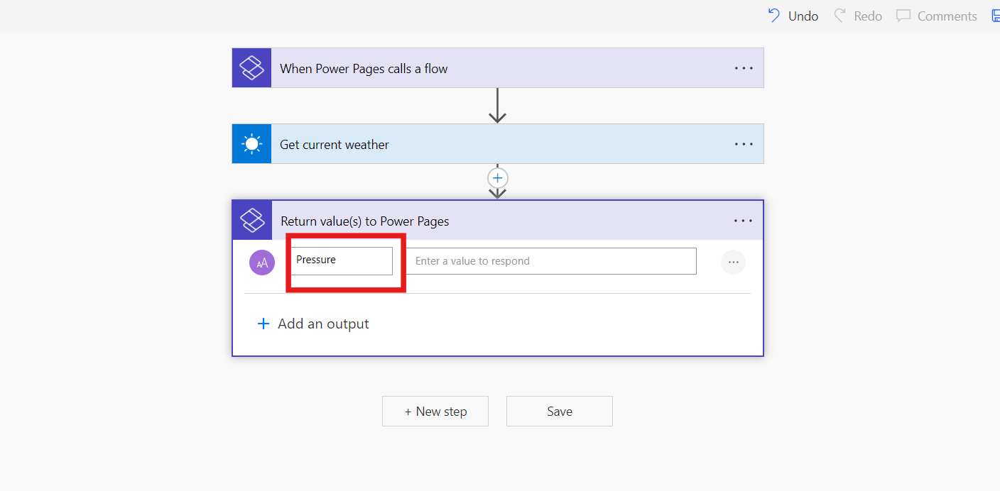

# Lab 4: Erstellen eines automatisierten Flows zum Aufrufen der MSN-Weather-App und Anzeigen aktueller Wetterdetails auf der Websiteseite

**Ziel:** Das Ziel dieses Labs besteht darin, die Teilnehmer durch den
Prozess der Integration eines Power Automate-Cloudflows mit einer Power
Pages-Website zu führen. Die Teilnehmer lernen, wie sie mithilfe von
Vorlagen eine Power Page-Website erstellen, einen Cloud-Flow einrichten,
um aktuelle Wetterdaten vom MSN-Wetterdienst abzurufen, und eine
benutzerdefinierte Webseite erstellen, auf der diese Wetterinformationen
angezeigt werden. Am Ende des Labs sammeln die Teilnehmer praktische
Erfahrungen mit Power Pages und Power Automate, die es ihnen
ermöglichen, dynamische und interaktive Webanwendungen zu erstellen, die
auf Benutzereingaben reagieren.

**Geschätzte Zeit:** 25 Minuten

### Aufgabe 1: Anmelden und Erstellen einer Power Page-Website

1.  Wechseln Sie mit +++**https://make.powerpages.microsoft.com/**+++ zu
    Power Pages.

2.  Stellen Sie sicher, dass Sie sich in der Entwicklerumgebung – **Dev
    One** befinden, und klicken Sie dann auf **Get started**.

- 

3.  Wählen Sie auf der Seite **Tell us about yourself** die Option
    **Skip** aus.

- 

4.  Scrollen Sie auf der Seite **Create a site** nach unten, und wählen
    Sie **Start with a template** aus.

- 

5.  Klicken Sie auf **Starter-Layout 1**.

- 

6.  Wählen Sie auf der Seite **Stater-Layout 1** die Option **Choose
    this template** aus.

- 

7.  Geben Sie den Websitenamen als +++**contoso**+++ in das
    entsprechende Feld ein, und klicken Sie auf die Schaltfläche
    **Done**, um die Website zu erstellen.

- 

### Aufgabe 2: Erstellen eines Cloud-Flows

1.  Sie können sehen, dass Sie zu Ihrer Website navigiert werden. Wenn
    Sie ein Popup-Fenster zur **Introducing Copilot in Power Pages**
    sehen, wählen Sie **Next** aus, bis Sie zum letzten Schritt kommen
    und **Done** auswählen können.

- 

  **Hinweis:** Sie können das Popup-Fenster von **Enable site copilot**
  schließen.

2.  Fließen Sie in der linken Navigationsleiste, wählen Sie Setup und
    dann **Cloud-Flow** aus.

- 

3.  Wählen Sie in der oberen Leiste + **Create** **new flow** aus.

- 

4.  Suchen Sie Power Pages in der Suchleiste, scrollen Sie dann nach
    unten, und wählen Sie **When Power Pages call a flow trigger** aus.

- 

5.  Wählen Sie **+ Add an input** aus.

- 

6.  Wählen Sie **Text**.

- 

7.  Fügen Sie einen Namen als **Location** hinzu und klicken Sie auf +
    **New step**.

- 

8.  Suchen Sie nach +++**MSN Weather**+++.

9.  Wählen Sie die Aktion **Get current weather** aus.

- 

10. Platzieren Sie den Cursor im Texteingabefeld “**Location**” und
    wählen Sie den Parameter “**Location**” unter “**When Power Pages
    calls a flow**” im dynamischen Inhalt aus.

- 

11. Wählen Sie **+ New step** aus, suchen Sie nach Power Pages, wählen
    Sie **Return value(s) to Power Pages**-Aktion aus.

- 

12. Wählen Sie **+ Add** und Output, **wählen Sie Text**, geben Sie +++
    **Pressure** +++ als Titel ein.

- 

13. Wählen Sie im Abschnitt “Pressure value to respond” die Option
    dynamic content **Pressure** aus.

- 

14. Wiederholen Sie diesen Vorgang, um die folgenden Ausgabeschritte mit
    dem Texttyp zu erstellen:

    1.  +++Humidity+++

    2.  +++Temperature+++

    3.  +++UV index+++

    4.  +++Wind speed+++

    5.  +++Location+++

    6.  +++Visibility Distance+++

    7.  +++Latitude+++

    8.  +++Longitude+++

    9.  +++Temperature Units+++

    10. +++Pressure Units+++

    11. +++Speed Units+++

    12. +++Distance Units+++

    13. +++Conditions+++

- 

15. Nennen Sie den Flow +++ **Get current weather** +++.

- 

16. Wählen Sie **Save** aus, und schließen Sie den Flow-Abschnitt

- 

17. Wählen Sie unter Roles die Option **+ Add roles** aus, wählen Sie
    die Rolle **Anonymous Users** aus, wählen Sie **Add** aus.

- 

18. Klicken Sie auf die Schaltfläche **Save**.

- 

19. **Kopieren Sie** die **URL.**

- 

  **Hinweis:** Dies ist die eindeutige URL, die für die Verbindung mit
  dem zugehörigen Cloud-Flow verwendet wird. Sie verwenden diese URL
  später, um den aktuellen Wetterflow aufzurufen.

### Aufgabe 3: Erstellen einer Seite zum Anzeigen von MSN-Wetterdaten

1.  Wählen Sie Arbeitsbereich "Pages" aus, und wählen Sie **"+ Page"**
    aus.

- 

2.  Wenn das Fenster **" Describe a page to create it** " angezeigt
    wird, wählen Sie "**Other ways to add a page**" aus.

- 

3.  Benennen Sie die Seite +++**Todays_weather_report**+++ und klicken
    Sie dann auf die Schaltfläche **Add**.

4.  Wählen Sie **Edit code** aus, um Visual Studio Code zu öffnen, und
    klicken Sie dann auf **Open Visual Studio Code.**

- 

  **Hinweis:** Wenn ein Popup-Fenster mit der Meldung " The extension
  ‘Power Platform Tools’ wants to sign in using Microsoft " angezeigt
  wird, wählen Sie **Allow** aus.

  

5.  **Fügen Sie** diesen Code ein:

-   

      

          

              

                  <h1>What's the weather?</h1>
                  <form id="cityForm">
                      <label for="locationInput">Enter a location to find out</label>
                       
                      <input type="text" style="width: 840px; border: 1px solid #D2D0CE;" id="locationInput" required />
                      

                      

                          <button type="submit">Submit</button>
                      

                  </form>
                  

                      

                          

                               
                              
                          

                          

                               
                               
                              
                              

                          

                      

                      

                          

                              Wind: 
                              
                               
                          

                          

                              Visibility: 
                              
                              
                          

                      

                      

                          

                              UV Index: 
                              
                          

                          

                              Conditions: 
                              
                          

                      

                  

              

          

      

      

  

6.  **Ersetzen Sie** die **URL** durch die URL, die Sie im vorherigen
    Schritt kopiert haben.

- 

7.  **Speichern Sie** den Code, indem Sie CTRL+S auswählen.

8.  Kehren Sie zum Power Pages-Portal zurück, und wählen Sie in Design
    Studio “**Sync**” aus.

- 

### Aufgabe 4: Testen der Flow-Integration

So testen Sie die Flow-Integrationsfunktionalität:

1.  Wählen Sie **Preview** \> **Desktop** aus, um die Website zu öffnen.

- 

2.  Geben Sie eine Postleitzahl oder einen Ort in das Textfeld
    **Location** ein, z. B**. Seattle**.

3.  Wählen Sie die Schaltfläche **Submit** aus.

- 

### Schlussfolgerung:

In diesem Lab haben die Teilnehmer Power Automate erfolgreich in eine
Power Pages-Website integriert und so ihre Fähigkeiten in den Bereichen
Website-Erstellung, Cloud-Flow-Entwicklung und Webseitenanpassung
verbessert. Sie lernten, eine benutzerfreundliche Oberfläche zu
entwerfen, die mithilfe von Power Automate dynamische Wetterdaten abruft
und anzeigt. Durch das Testen der Flow-Integration entwickelten die
Teilnehmer auch Fähigkeiten zur Fehlerbehebung, die sie in die Lage
versetzten, interaktive Anwendungen innerhalb der Power Platform
effektiv zu erstellen.
