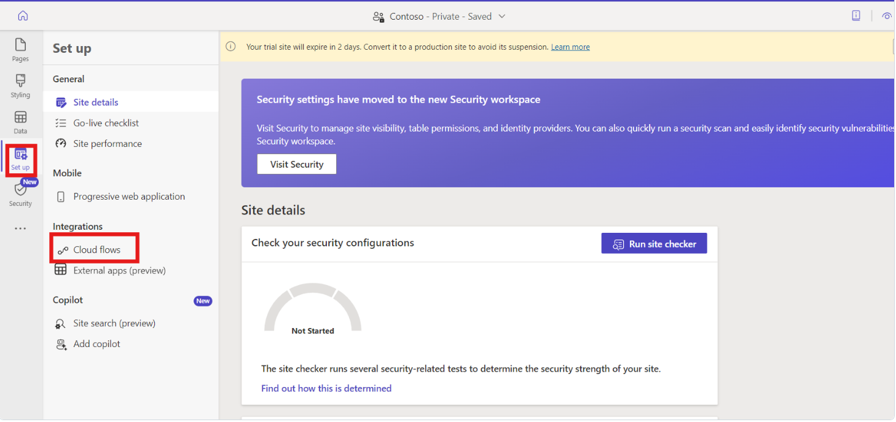

# 實驗 4 - 創建一個自動化流程來調用 MSN Weather 應用程序並在站點頁面上顯示當前天氣詳細信息

**目標：** 本實驗室的目標是指導參與者完成將 Power Automate 雲端流與
Power Pages 站點集成的過程。參與者將學習如何使用模板創建 Power Page
網站，設置雲端流以從
MSN天氣服務獲取當前天氣數據，並構建顯示此天氣信息的自定義網頁。在實驗結束時，參與者將獲得
Power Pages 和 Power Automate
的實踐經驗，使他們能夠創建響應用戶輸入的動態和交互式 Web 應用程序。

**預計時間：** 25 分鐘

### 任務 1：登錄並創建 Power Page 網站

1.  使用 **+++https://make.powerpages.microsoft.com/+++** 轉到 Power
    Pages。

2.  確保您位於開發人員環境 – **Dev One** 中，然後單擊 **Get started**。

- 

3.  選擇 **Skip** 在 **Tell us about yourself** 頁面。

- 

4.  在 **Create a site** 頁面上，向下滾動並選擇 **Start with a
    template** 。

- 

5.  單擊 **Starter layout 1**。

- 

6.  在 **Stater layout 1** 頁面上，選擇 **Choose this template**。

- 

7.  在尊重字段中輸入站點名稱 **+++contoso+++**，然後單擊 **Done**
    按鈕創建網站。

- 

### 任務 2：創建雲端流

1.  您可以看到，您已導航到您的網站。如果您看到有關**Introducing Copilot
    in Power
    Pages**，請選擇**Next**，直到您到達最後一步，然後選擇**Done**。

- 

> **注意：** 您可以關閉 **Enable site copilot** 彈出窗口。

2.  流向左導航欄，選擇 設置，然後選擇 **Cloud flow。**

- 

3.  從頂部欄中選擇 **+ Create new**流。

- 

4.  在搜索欄中搜索 Power Pages，然後向下滾動並選擇 **When Power Pages
    call a flow trigger。**

- 

5.  選擇 **+ Add an input**。

- 

6.  選擇 **Text**。

- 

7.  添加名稱作為 **Location** ，然後單擊 + 新建步驟。

- 

8.  搜索 **+++MSN Weather+++**。

9.  選擇 **Get current weather**作。

- 

10. 將光標聚焦在 **Location**輸入文本 選擇 **Location** 參數 當 **When
    Power Pages calls a flow **。

- 

11. 選擇 **+ New step**，搜索 Power Pages，選擇將 **Return value(s) to
    Power Pages**作。

- 

12. 選擇 **+ Add**和輸出， **選擇文本**，輸入 **+++Pressure+++**
    作為標題。

- 

13. 在 Pressure value to respond 部分中，選擇動態內容 **Pressure**。

- 

14. 重複作以使用文本類型創建以下輸出步驟:

    1.  +++Humidity+++

    2.  +++Temperature+++

    3.  +++UV index+++

    4.  +++Wind speed+++

    5.  +++Location+++

    6.  +++Visibility Distance+++

    7.  +++Latitude+++

    8.  +++Longitude+++

    9.  +++Temperature Units+++

    10. +++Pressure Units+++

    11. +++Speed Units+++

    12. +++Distance Units+++

    13. +++Conditions+++

- 

15. 將流命名為 **+++Get current weather+++**。

- 

16. 選擇 **Save** ，然後關閉 flow 部分

- 

17. 在 **“Roles”** 下選擇 “+ **Add roles** ”，選擇 **“ Anonymous
    Users”**，然後選擇 **“ Add**”。

- 

18. 點擊 **Save** 按鈕。

- 

19. **複製** **URL**。

- 

> **注意：** 這是用於連接到關聯 Cloud Flow 的唯一 URL。稍後將使用此 URL
> 調用當前天氣流。

### 任務 3：創建頁面以顯示 MSN 天氣數據

1.  選擇 Pages workspace，選擇 **+ Page。**

- 

2.  如果 **Describe a page to create it** 窗口，然後選擇 **Other ways to
    add a page。**

- 

3.  將頁面命名為 **+++Todays_weather_report+++**，然後單擊 **Add**
    按鈕。

4.  選擇 **Edit code** 以打開 Visual Studio Code，然後單擊 **Open Visual
    Studio Code。**

- 

5.  **注意：** 如果彈出窗口顯示“擴展'Power Platform Tools'想要使用
    Microsoft 登錄”，請選擇 **“Allow**”。

- 

6.  **粘貼** 此代碼:

-   

      

          

              

                  <h1>What's the weather?</h1>
                  <form id="cityForm">
                      <label for="locationInput">Enter a location to find out</label>
                       
                      <input type="text" style="width: 840px; border: 1px solid #D2D0CE;" id="locationInput" required />
                      

                      

                          <button type="submit">Submit</button>
                      

                  </form>
                  

                      

                          

                               
                              
                          

                          

                               
                               
                              
                              

                          

                      

                      

                          

                              Wind: 
                              
                               
                          

                          

                              Visibility: 
                              
                              
                          

                      

                      

                          

                              UV Index: 
                              
                          

                          

                              Conditions: 
                              
                          

                      

                  

              

          

      

      

  

7.  將 **URL** **替換**為您在上一步中複製的 URL。

- 

8.  通過選擇 CTRL + S **保存**代碼。

9.  返回 Power Pages 門戶，然後選擇在 Design Studio 中**Sync**。

- 

### 任務 4：測試流集成

要測試 Flow 集成功能，請執行以下作：

1.  選擇 **Preview** \> **Desktop** 以打開站點。

- 

2.  在 **Location** 文本框中輸入郵政編碼或城市 ，例如 **Seattle**。

3.  選擇 **Submit** 按鈕。

- 

### 結論：

在此實驗室中，參與者成功地將 Power Automate 與 Power Pages
站點集成，增強了他們在網站創建、雲端流開發和網頁自定義方面的技能。他們學會了設計一個用戶友好的界面，該界面使用
Power Automate
檢索和顯示動態天氣數據。通過測試流集成，參與者還培養了故障排除技能，使他們能夠有效地在
Power Platform 中創建交互式應用程序。
