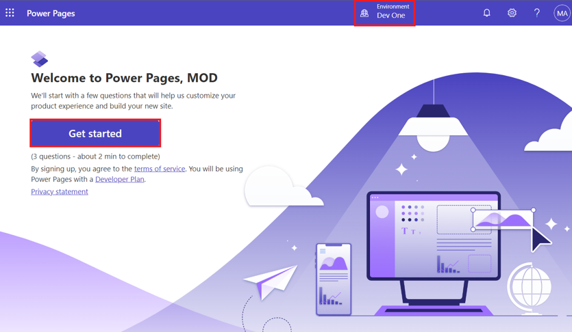
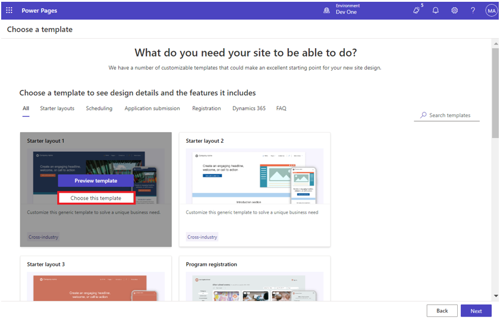
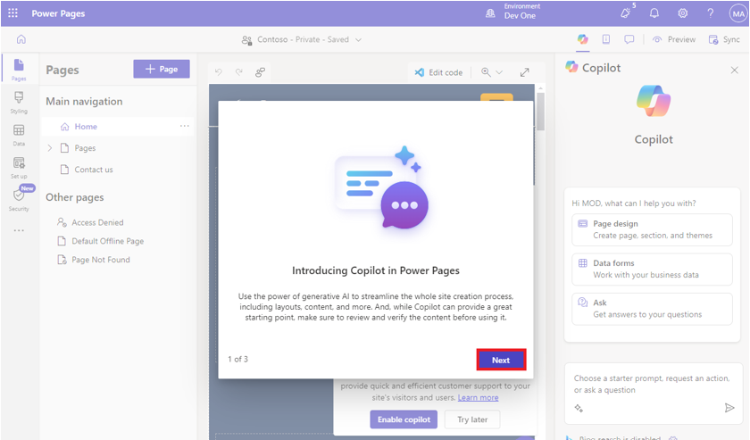
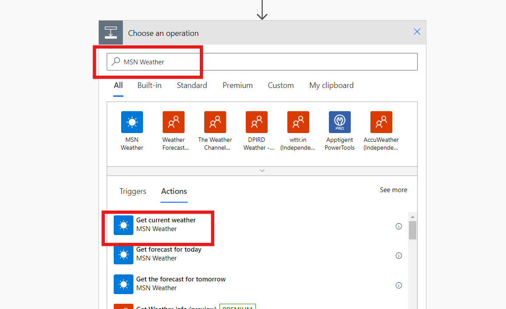
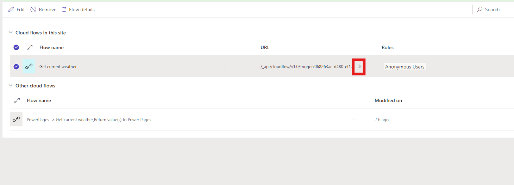
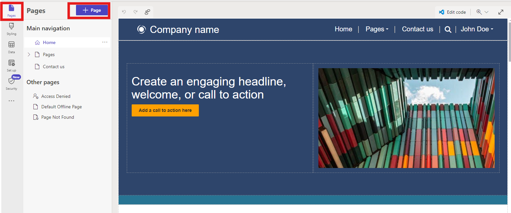
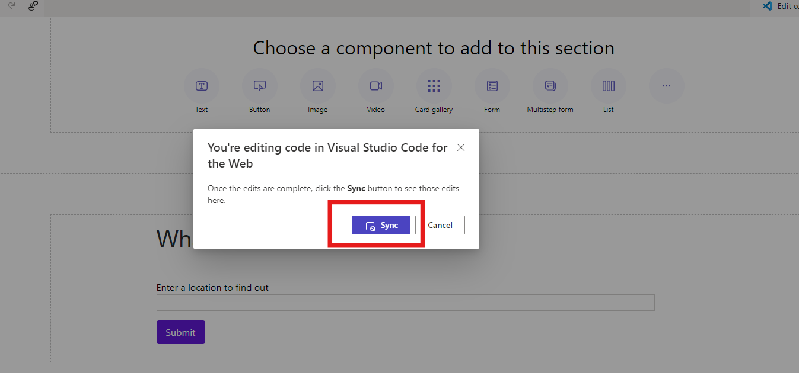
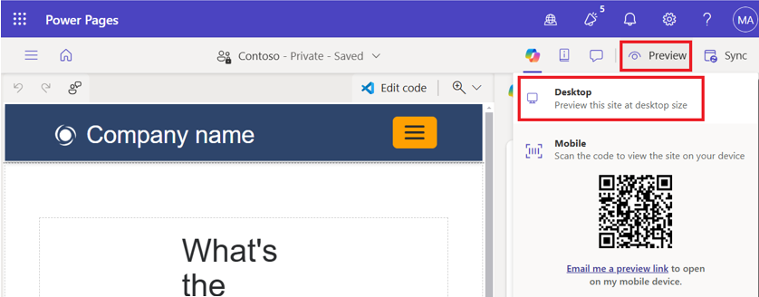

**ラボ４：MSN Weatherアプリを起動してサイト
ページに現在の天気の詳細を表示する自動フローを作成する**

**目的：**このラボの目的は、Power Automateクラウドフローを Power Pages
サイトと統合するプロセスを参加者に指導することです。参加者は、テンプレートを使用して
Power Pages ウェブサイトを作成する方法、MSN Weather
サービスから最新の気象データを取得するクラウドフローを設定する方法、そしてこの気象情報を表示するカスタムウェブページを構築する方法を学習します。ラボの最後には、参加者は
Power Pages と Power Automate
の実践的な操作を習得し、ユーザー入力に応答する動的でインタラクティブなウェブアプリケーションを作成できるようになります。

**予測時間:** 25分

**タスク 1: サインインして Power Page ウェブサイトを作成する**

1.  [*https://make.powerpages.microsoft.com/\*\*\*+++*](https://make.powerpages.microsoft.com/**+++)を使用して
    Power Pagesにアクセスします。

2.  開発環境**Dev One**にいることを確認し、**Get
    started**をクリックします。

> 

3.  **Tell us about yourself**ページで**Skip**を選択します。

> 

4.  **Create a site**ページで下にスクロールし、**Start with a
    template**を選択します。

> 

5.  **Starter layout 1**をクリックします。

> 

6.  **Stater layout 1**ページで、**Choose this template**を選択します。

> 

7.  該当するフィールドにサイト名として +++ **contoso +++**
    を入力し、**Done** ボタンをクリックして Web サイトを作成します。

> 

**タスク２：クラウドフローを作成する**

1.  ご覧のとおり、サイトに移動しました。**Introducing Copilot in Power
    Pages**が表示された場合は、**Next**を選択し、最後のステップまで進み、**Done**を選択してください。

> 
>
> **注: Enable site copilot**のポップアップを閉じることができます。

2.  フローの左側のナビゲーション バーでセットアップを選択し、**Cloud
    flow**を選択します。

> 

3.  上部のバーから新しいフローの**+ Create**を選択します。

> 

4.  検索バーで Power Pages を検索し、下にスクロールして、**When Power
    Pages 　 call a flow trigger**を選択します。

> 

5.  **+ Add an input**を選択します。

> 

6.  **Text**を選択します。

> 

7.  名前に**Location**を追加し、+ New stepをクリックします。

> 

8.  +++**MSN Weather**+++を検索します。

9.  **Get current weather**アクションを選択します。

> 

10. カーソルをLocationの入力テキストにフォーカスし、\[Power Pages
    が動的コンテンツからフローを呼び出すとき\] の下の \[Location\]
    パラメータを選択します。

> 

11. \+ New step を選択し、Power Pages を検索して、Power Pages
    アクションに値を返すを選択します。

> 

12. **+ Add**を選択して出力し、**Select Text**、タイトルとして+++
    **Pressure +++** と入力します。

> 

13. 応答する圧力値セクションで、動的コンテンツ**Pressure**を選択します。

> 

14. テキスト タイプを使用して次の出力手順を繰り返し作成します：

    1.  +++Humidity+++

    2.  +++Temperature+++

    3.  +++UV index+++

    4.  +++Wind speed+++

    5.  +++Location+++

    6.  +++Visibility Distance+++

    7.  +++Latitude+++

    8.  +++Longitude+++

    9.  +++Temperature Units+++

    10. +++Pressure Units+++

    11. +++Speed Units+++

    12. +++Distance Units+++

    13. +++Conditions+++

> 

15. フローに名前を付けます+++**Get current weather**+++。

> 

16. **Save**を選択し、フローセクションを閉じます。

> 

17. **Rolesの下に+ Add roles**を選択して、**Anonymous
    Users**ロールを選択し、**Add**を選択します。

> 

18. **　Save**ボタンをクリックします。

> 

19. URLを**Copyします**。

> 
>
> **注:**これは、関連するクラウドフローに接続するための一意のURLです。このURLは、後で現在の気象フローを呼び出す際に使用します。

**タスク３：MSN天気データを表示するページを作成する**

1.  Pagesワークスペースを選択し、**+ Page**を選択します。

> 

2.  **Describe a page to create
    it**ウィンドウが表示された場合は、**Other ways to add a
    page**を選択します。

> 

3.  **ページに +++Todays_weather_report+++ という名前を付け、Add
    ボタンをクリックします**。

> 

4.  \[Edit code\] を選択して Visual Studio Code を開き、\[Open visual
    studio code\] をクリックします。

> 
>
> **注意:** 「The extension ‘Power Platform Tools’ wants to sign in
> using
> Microsoft」というポップアップが表示された場合は、**Allow**を選択します。
>
> 

5.  次のコードを**Paste**します:

> \<style\>
>
> div.weatherdetail {
>
> border: 1px solid \#F3F2F1;
>
> border-radius: 12px;
>
> box-shadow: 0px 1.2px 3.6px rgba(0, 0, 0, 0.1), 0px 6.4px 14.4px
> rgba(0, 0, 0, 0.13);
>
> padding: 24px;
>
> }
>
> .weather label {
>
> font-family: 'Nunito';
>
> font-style: normal;
>
> font-weight: 600;
>
> font-size: 18px;
>
> color: \#323130;
>
> }
>
> .weather button {
>
> font-family: 'Segoe UI';
>
> padding: 8px 16px;
>
> font-size: 16px;
>
> background-color: \#6219D9;
>
> color: white;
>
> border: none;
>
> border-radius: 4px;
>
> cursor: pointer;
>
> outline: none;
>
> }
>
> div.weather {
>
> display: flex;
>
> flex-direction: column;
>
> align-items: flex-start;
>
> padding: 100px;
>
> gap: 36px;
>
> width: 840px;
>
> }
>
> span.temperature {
>
> font-family: Segoe UI;
>
> font-size: 96px;
>
> font-style: normal;
>
> font-weight: 600;
>
> color: \#6219d9;
>
> }
>
> span.weatherinfov1 {
>
> font-family: Segoe UI;
>
> font-size: 28px;
>
> font-style: normal;
>
> font-weight: 400;
>
> color: \#201f1e;
>
> }
>
> span.weatherinfov2 {
>
> font-family: Segoe UI;
>
> font-size: 24px;
>
> font-style: normal;
>
> font-weight: 600;
>
> color: \#a19f9d;
>
> }
>
> \</style\>
>
> \
 flex-wrap: wrap; margin: 0px; min-height: auto; padding: 8px;"\>
>
> \

>
> \
 display: flex; flex-direction: column; min-width: 310px; word-break:
> break-word; padding: 0 180px; margin: 60px 0px;"\>
>
> \<h1\>What's the weather?\</h1\>
>
> \<form id="cityForm"\>
>
> \<label for="locationInput"\>Enter a location to find out\</label\>
>
> \<br\>
>
> \<input type="text" style="width: 840px; border: 1px solid \#D2D0CE;"
> id="locationInput" required /\>
>
> \<p\>
>
> \<p\>
>
> \<button type="submit"\>Submit\</button\>
>
> \</p\>
>
> \</form\>
>
> \
 none;width: 840px"\>
>
> \<div\>
>
> \<div\>
>
> \ \</span\>
>
> \\</span\>
>
> \</div\>
>
> \<div\>
>
> \
> \</span\>
>
> \<br\>
>
> \ id="cordinates"\>\</span\>
>
> \<p\>
>
> \</div\>
>
> \</div\>
>
> \

>
> \

>
> \Wind: \</span\>
>
> \\</span\>
>
> \ \</span\>
>
> \</div\>
>
> \

>
> \Visibility: \</span\>
>
> \\</span\>
>
> \\</span\>
>
> \</div\>
>
> \</div\>
>
> \

>
> \

>
> \UV Index: \</span\>
>
> \\</span\>
>
> \</div\>
>
> \

>
> \Conditions: \</span\>
>
> \\</span\>
>
> \</div\>
>
> \</div\>
>
> \</div\>
>
> \</div\>
>
> \</div\>
>
> \</div\>
>
> \<script\>
>
> document.getElementById("cityForm").addEventListener("submit",
> function (event) {
>
> event.preventDefault(); // Prevent form submission
>
> var weatherDiv = document.getElementById("weatherdetail");
>
> weatherDiv.style.display = "none";
>
> var location = document.getElementById("locationInput").value;
>
> var \_url = "\<Cloud flow URL\>";
>
> var data = {};
>
> data\["Location"\] = location;
>
> var payload = {};
>
> payload.eventData = JSON.stringify(data);
>
> shell
>
> .ajaxSafePost({
>
> type: "POST",
>
> url: \_url,
>
> data: payload
>
> })
>
> .done(function (response) {
>
> const result = JSON.parse(response);
>
> document.getElementById("temperature").innerHTML =
> result\["temperature"\];
>
> document.getElementById("windspeed").innerHTML =
> result\["wind_speed"\];
>
> document.getElementById("visibility").innerHTML =
> result\["visibility_distance"\];
>
> document.getElementById("uv").innerHTML = result\["uv_index"\];
>
> document.getElementById("location").innerHTML = result\["location"\];
>
> document.getElementById("condition").innerHTML =
> result\["conditions"\];
>
> document.getElementById("temperature_units").innerHTML =
> result\["temperature_units"\];
>
> document.getElementById("speed_units").innerHTML =
> result\["speed_units"\];
>
> document.getElementById("distance_units").innerHTML =
> result\["distance_units"\];
>
> document.getElementById("cordinates").innerHTML =
> parseFloat(result\["latitude"\]).toFixed(2) + ', ' +
> parseFloat(result\["longitude"\]).toFixed(2);
>
> weatherDiv.style.display = "block";
>
> })
>
> .fail(function () {
>
> alert("failed");
>
> });
>
> });
>
> \</script\>
>
> 

6.  **URL**を前の手順でコピーした URL に**Replace**します。

> 

7.  CTRL + S を選択してコードを**Save**します**。**

8.  Power Pages ポータルに戻り、デザイン
    スタジオで**Sync**を選択します。

> 

**タスク４：フローの統合をテストする**

フロー統合機能をテストするには:

1.  **Preview** \> **Desktop**を選択してサイトを開きます。

> 

2.  **Location**テキストボックスに郵便番号または都市を入力します。例えば
    **Seattle**。

3.  **Submit**ボタンを選択します。

> 

**結論：**

このラボでは、参加者はPower AutomateとPower
Pagesサイトを統合することに成功し、ウェブサイト作成、クラウドフローの開発、そしてウェブページのカスタマイズに関するスキルを向上させました。Power
Automateを使用して動的な気象データを取得・表示するユーザーフレンドリーなインターフェースの設計方法も習得しました。フロー統合のテストを通して、参加者はトラブルシューティングスキルも習得し、Power
Platform内でインタラクティブなアプリケーションを効果的に作成できるようになりました。
