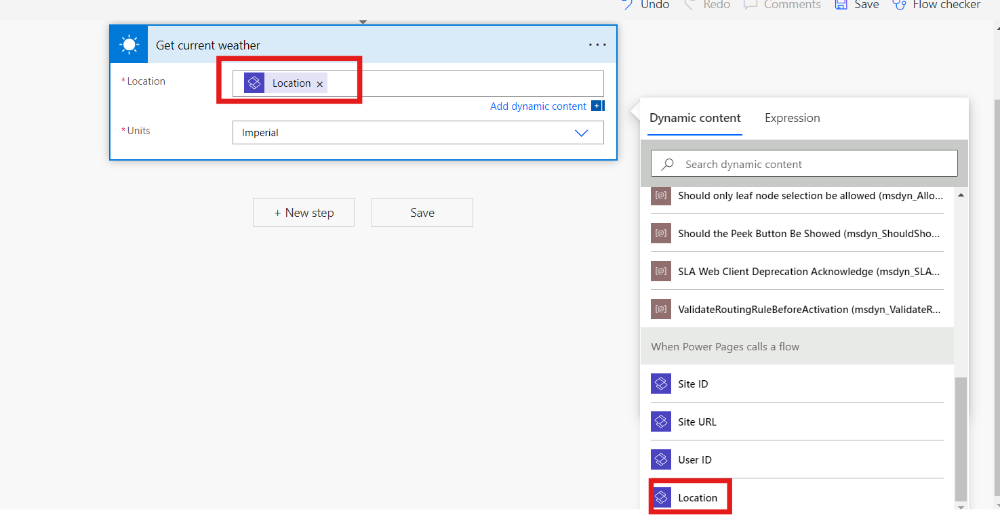
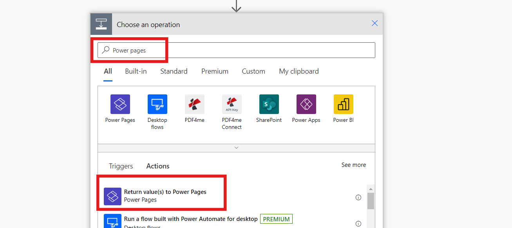
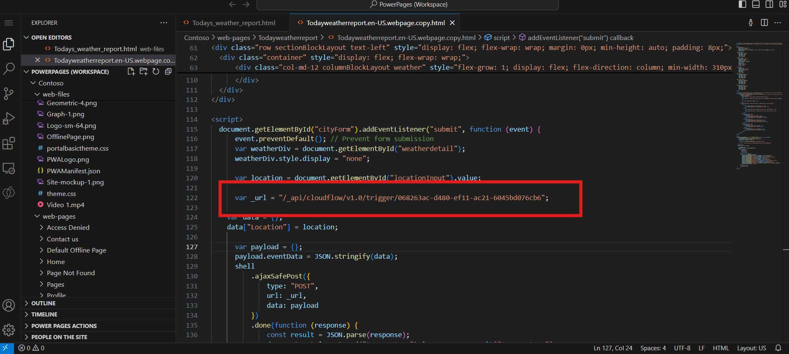

Laboratorio 4 - Cree un Automated Flow para invocar MSN Weather App y
mostrar los detalles meteorológicos en su sitio

**Objetivo:** El objetivo de este laboratorio es guiar a los
participantes en el proceso de integrar un Power Automate cloud flow con
un sitio Power Pages. Los participantes aprenderán a crear un Power Page
website con templates, configurar un cloud flow para buscar datos
meteorológicos actuales desde el servicio MSN Weather y construir un
webpage personalizado que muestra estos datos del tiempo. A finales de
este laboratorio, los participantes obtendrán una experiencia práctica
con Power Pages y Power Automate, habilitándolesen crear aplicaciones
web dinámicos e interactivos que responden a user input.

**Duración estimada:** 25 minutos

Tarea 1: inicie sesión y cree Power Page Website

1.  Vaya a Power Pages en
    +++\*\*[*https://make.powerpages.microsoft.com/\*\*+++*](https://make.powerpages.microsoft.com/**+++).

2.  Asegúrese que está en Developer environment – **Dev One** y haga
    clic en **Get started**.

> 

3.  Seleccione **Skip** en la página **Tell us about yourself**.

> 

4.  En la página **Create a site**, baje y seleccione **Start with a
    template**.

> 

5.  Haga clic en **Starter layout 1**.

> 

6.  En la página **Stater layout 1**, seleccione **Choose this
    template**.

> 

7.  Introduzca el site name como +++**contoso**+++ en el campo relevante
    y haga clic en el botón **Done** para crear el website.

> 

Tarea 2: Cree cloud flow

1.  Puede ver que se le lleva a su site. Si ve un pop up
    de **Introducing Copilot in Power Pages**, seleccione **Next** hasta
    que llegue al último paso y seleccione **Done**.

> 
>
> **Ojo:** Puede cerrar el popup de **Enable site copilot**.

2.  En la barra de navegación izquierda, seleccione Setup, y luego
    seleccione **Cloud flow.**

> 

3.  Seleccione **+ Create** new flow desde la barra superior.

> 

4.  Busque power pages en el search bar, baje y seleccione **When Power
    Pages call a flow trigger.**

> 

5.  Seleccione **+ Add an input**.

> 

6.  Elija **Text**.

> 

7.  Agregue un nombre como **Location** y haga clic en + New step.

> 

8.  Busque +++**MSN Weather**+++.

9.  Seleccione el **Get current weather** action.

> 

10. Enfoque el cursor en **Location** input text
    Seleccione **Location** parameter en **When Power Pages calls a
    flow** desde dynamic content.

> 

11. Seleccione **+ New step**, busque Power Pages, Seleccione
    el **Return value(s) to Power Pages** action.

> 

12. Seleccione **+ Add** an output, Seleccione **Text**, introduzca
    +++**Pressure**+++ como el title.

> 

13. En la sección Pressure value to respond, elija el dynamic
    content **Pressure**.

> 

14. Repita lo mismo para crear los siguientes pasos mediante text type:

    1.  +++Humidity+++

    2.  +++Temperature+++

    3.  +++UV index+++

    4.  +++Wind speed+++

    5.  +++Location+++

    6.  +++Visibility Distance+++

    7.  +++Latitude+++

    8.  +++Longitude+++

    9.  +++Temperature Units+++

    10. +++Pressure Units+++

    11. +++Speed Units+++

    12. +++Distance Units+++

    13. +++Conditions+++

> 

15. Nombre el flow +++**Get current weather**+++.

> 

16. Seleccione **Save**, y cierre el flow section

> 

17. Seleccione **+ Add roles** en Roles, Seleccione **Anonymous
    Users** role, Seleccione **Add**.

> 

18. Haga clic en el botón **Save**.

> 

19. **Copie** el **URL**.

> 
>
> **Ojo:** Este es el URL único que se usa para conectar al cloud flow
> asociado. Va a usar este URL más tarde para llamar al current weather
> flow.

Tarea 3: Cree una página para mostrar MSN weather data

1.  Seleccione Pages workspace, Seleccione **+ Page.**

> 

2.  Si aparece la ventana **Describe a page to create it**, seleccione
    **Other ways to add a page**.

> 

3.  Nombre la página como +++**Todays_weather_report**+++ y haga clic en
    el botón **Add**.

> 

4.  Seleccione **Edit code** para abrir Visual Studio Code y haga clic
    en **open visual studio code.**

> 
>
> **Ojo:** Si aparece un pop up diciendo ‘The extension ‘Power Platform
> Tools’ wants to sign in using Microsoft’ seleccione **Allow**.
>
> 

5.  **Pegue** este código:

> ``  
>   
> `
`  
> `    
`  
> `        
`  
> `            <h1>What's the weather?</h1>`  
> `            <form id="cityForm">`  
> `                <label for="locationInput">Enter a location to find out</label>`  
> `                 `  
> `                <input type="text" style="width: 840px; border: 1px solid #D2D0CE;" id="locationInput" required />`  
> `                
`  
> `                
`  
> `                    <button type="submit">Submit</button>`  
> `                
`  
> `            </form>`  
> `            
`  
> `                
`  
> `                    
`  
> `                         `  
> `                        `  
> `                    
`  
> `                    
`  
> `                         `  
> `                         `  
> `                        `  
> `                        
`  
> `                    
`  
> `                
`  
> `                
`  
> `                    
`  
> `                        Wind: `  
> `                        `  
> `                         `  
> `                    
`  
> `                    
`  
> `                        Visibility: `  
> `                        `  
> `                        `  
> `                    
`  
> `                
`  
> `                
`  
> `                    
`  
> `                        UV Index: `  
> `                        `  
> `                    
`  
> `                    
`  
> `                        Conditions: `  
> `                        `  
> `                    
`  
> `                
`  
> `            
`  
> `        
`  
> `    
`  
> `
`  
>   
> ``
>
> 

6.  **Reemplace** el **URL** con el que copió anteriormente.

> 

7.  **Guarde** el code al seleccionar CTRL + S.

8.  Vuelva al Power Pages portal y seleccione **Sync** en design studio.

> 

Tarea 4: Pruebe el flow integration

Para probar el flow integration functionality:

1.  Seleccione **Preview** \> **Desktop** para abrir el site.

> 

2.  Introduzca un código postal o ciudad en el cuadro de texto
    **Location** por ejemplo **Seattle**.

3.  Seleccione el botón **Submit**.

> 

Conclusión:

En este laboratorio, los participantes integran Power Automate con un
Power Pages site, mejorando sus habilidades en la creación del website,
cloud flow development, y la personalización del webpage. Han aprendido
a diseñar una interfaz fácil que recupera y muestra datos meteorológicos
dinámicos mediante Power Automate. Al probar el flow integration, los
participantes también dessarrollan habilidades de troubleshooting,
habilitándoles a crear aplicaciones interactivas dentro de Power
Platform.
