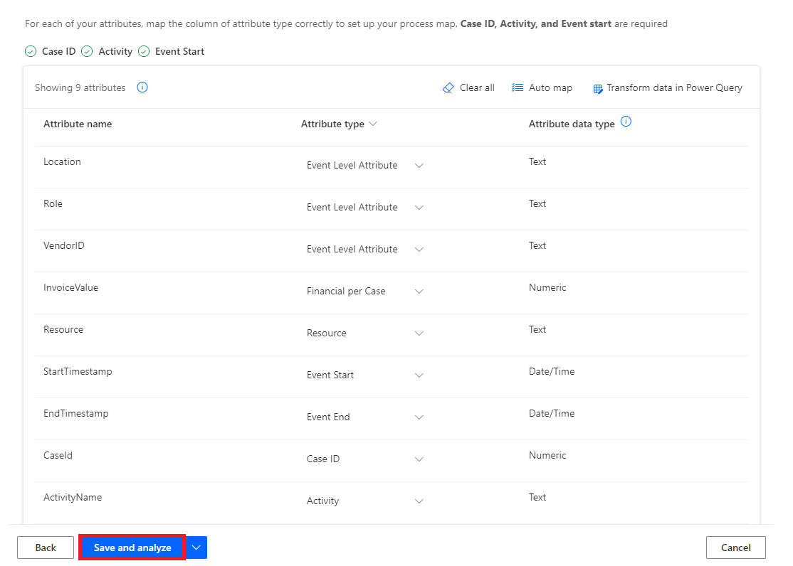
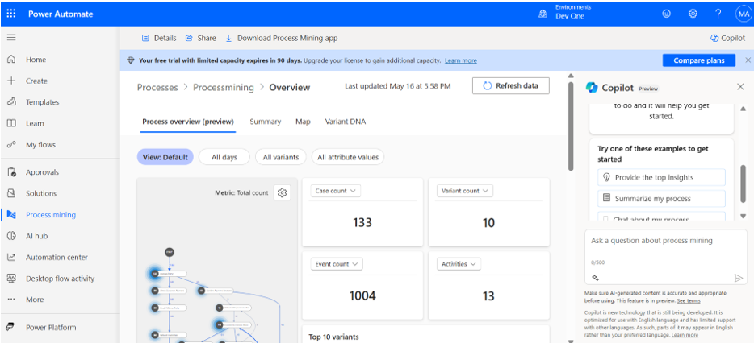

# **實驗 5 - 創建和分析應付帳款退款流程**

**目標：** 本實驗的目標是使用 Power Automate Process Mining
功能創建和分析應付帳款退款流程。參與者將學習從 CSV
文件導入數據、創建新流程以及利用 Process Mining
桌面應用程序分析關鍵績效指標 （KPI）
和其他指標，以深入瞭解應付帳款退款流程的效率和性能。

**預計時間：** 30 分鐘

### 任務 1：創建流程

1.  轉到**+++https://make.powerautomate.com/+++**。如果系統提示，請使用您的
    Office 365 租戶憑據登錄。選擇 **United States**
    作為國家/地區，然後選擇 **Get started**。

- 

2.  選擇您的環境 – **Dev One**。

- 

3.  在左側的導航窗格中，選擇 **More** 🡪 **Process mining**。

- 

4.  在 **Create new process** 部分中，選擇 **Start here**。

- 

5.  在  **Create a new process** 屏幕中，輸入流程名稱 –
    **+++Processmining+++**，然後選擇  **Import data**，選擇 **Data
    flow**，然後選擇 **Continue**。（可選）輸入流程的描述。

- 

6.  如果系統要求您**choose where to export**，請從 **Choose your
    destination** 下拉列表中選擇 **PowerBi Embedded** ，然後選擇
    **Continue 。**

- 

### 任務 2：導入數據

1.  在 **Choose a data source** 屏幕中，選擇 **Text/CSV。**

- 

2.  在 **Connection settings** 標題下，選擇 **Upload file
    （Preview）**。

- 

3.  選擇 **Browse**。

- 

4.  查找並選擇 **SampleData_AP_Refunds_Financial_EventLog.csv**。位置：
    **C：Files**

5.  選擇 **“Open**”。

- 

6.  如果系統要求您進行身份驗證，請選擇 **Sign in （登錄**）
    並按照提示作。（將彈出窗口阻止程序配置為允許。

- 

7.  選擇 **Next**。

- 

8.  預覽文件數據，然後選擇 **Next**。

- 

9.  當您看到允許您轉換數據的 Power Query 時，請選擇 **Next**。

- 

10. 根據需要將樣本數據中的 **Attribute Name** 與 **Attribute Type** 匹配
    。

- 

11. 在此示例中，您將更改的數據屬性為
    **InvoiceValue**、**Resource**、**StartTimestamp**、**EndTimestamp**、**CaseId**
    和 **ActivityName**，如下所示。

- **InvoiceValue** – Financial per case (first event)

  **Resource** – Resourse

  **StartTimestamp** – Event Start

  **EndTimestamp** – Event End

  **CaseId** – Case ID

  **ActivityName** - Activity

  

12. **完成**後，屬性映射應如以下屏幕截圖所示。

- 

13. 選擇 **Save and analyze**。分析可能需要幾分鐘才能運行。

- 

14. **分析流程完成後**，您將看到一個流程圖和一個控制面板，其中包含有關您的流程的其他見解。在控制面板上，您可以查看許多有助於您**分析流程的指標。**

- 

### 任務 3：分析流程

讓我們來看看 KPI 之外的流程分析。我們將使用 Power Automate Process
Mining 桌面應用程序，您可以在其中編輯和分析在 Process Mining
功能中創建的流程。

1.  從頂部欄中，單擊 **Download process Mining app**。

- 

2.  雙擊 Downloads 中的 **PowerAutomateProcessMining** App
    安裝程序文件。

- 

3.  單擊 **Install**。

- 

4.  安裝Processmining應用程序後，該應用程序會自動啟動，如果沒有，請手動啟動應用程序。啟動應用程序後，選擇
    **English** 作為語言，然後單擊 **Next Step**。

- 

5.  選中如圖所示的所有**複選框**，然後單擊 **Next**。

- 

6.  然後點擊 **Apply and mine** 按鈕。

- 

7.  然後選擇 **Use** 按鈕，它將導航到登錄窗口。

- 

8.  輸入您的管理員租戶 ID，然後單擊 **Sign In** 按鈕。

- 

9.  然後輸入您的管理員租戶密碼並單擊 **Sign in**。

- 

10. 如果出現“保持登錄所有應用程序”的彈出窗口，然後選擇 **“No, sign in to
    this app only**”。

- 

11. 在 Power Automate Process Mining 應用工具欄上，從右上角選擇環境 –
    **Dev One** 。

- 

12. 在 Power Automate （Processmining）
    中搜索您使用流程挖掘功能創建的流程。

13. 選擇 **Default** 以顯示默認視圖。您已準備好使用 Process Mining
    桌面應用程序的高級功能。

- 

14. > 注意：如果它顯示與**“Model size is too large for your PC
    > configuration”**相關的消息，並提供“是”和“否”選項以供執行，請選擇**“Yes**”。

- 

15. 在 **Customize** 面板 工具欄上，選擇
    **Frequency**（第一個圖標），然後在 **Metric 下拉菜單**中選擇 **Case
    count**。

- 

> > 流程圖顯示流程的案例數，這些案例包含在每個節點指定的活動。

16. 在Customize 面板上，選擇
    Performance（時鐘圖標），然後從下拉菜單中選擇 **Mean duration**。

- 

> > 請注意，與其他步驟相比，**Refund with special voucher**
> > 步驟的平均持續時間較長。

- 

17. 在 **Customize** 面板上，選擇**Finance**（紙圖標），然後從 量度
    下拉菜單中選擇 **Mean **。

- 

> > 請注意，相同的 **Refund with Special Voucher** 步驟僅涉及 631.11 USD
> > 的發票金額，不到大多數其他步驟的一半。

- 

18. 選擇 **Save**。

- 

### 結論：

在本實驗中，參與者使用 Power Automate Process Mining
功能創建並分析了應付帳款退款流程。通過導入 CSV
數據，他們構建了詳細的流程圖和儀錶板，使他們能夠檢查關鍵績效指標 （KPI）
和流程指標。通過 Power Automate Process Mining
桌面應用程序，參與者進行了更深入的分析，確定了特定步驟中的效率低下問題，例如持續時間長和發票價值較低。該實驗室演示了
Process Mining 如何幫助組織優化財務工作流程、提高效率並簡化應付帳款作。
