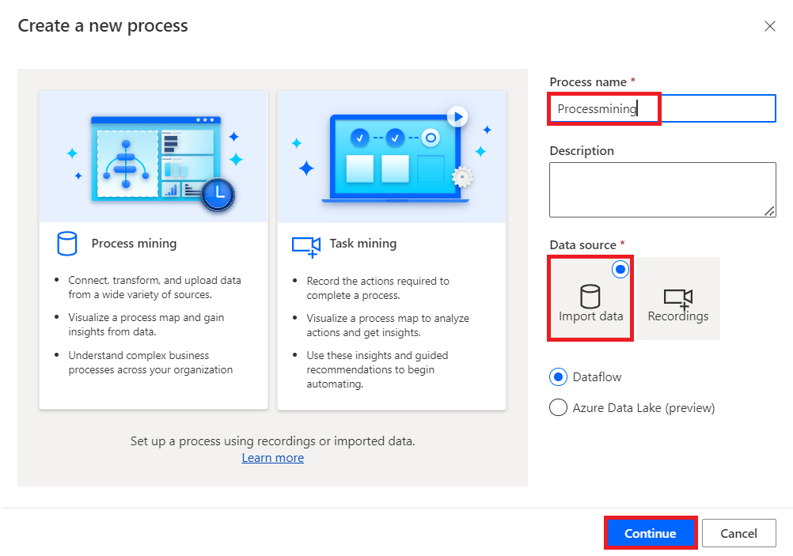

# **Lab 5 - Erstellen und Analysieren des Prozesses für die Rückerstattung der Kreditorenbuchhaltung**

**Ziel:** Das Ziel dieses Labs besteht darin, einen Prozess für die
Rückerstattung von Kreditoren mithilfe der Power Automate Process
Mining-Funktionen zu erstellen und zu analysieren. Die Teilnehmer
lernen, Daten aus einer CSV-Datei zu importieren, einen neuen Prozess zu
erstellen und die Process Mining-Desktop-App zu nutzen, um Key
Performance Indicators (KPIs) und andere Metriken zu analysieren und
Einblicke in die Effizienz und Leistung des Prozesses der
Kreditorenrückerstattung zu erhalten.

**Geschätzte Zeit:** 30 Minuten

### Aufgabe 1: Erstellen eines Prozesses

1.  Gehen Sie zu +++**https://make.powerautomate.com/**+++. Wenn Sie
    dazu aufgefordert werden, melden Sie sich mit Ihren Office
    365-Tenantanmeldeinformationen an. Wählen Sie **United States** als
    Land/Region aus, und wählen Sie dann **Get started** aus.

- 

2.  Wählen Sie Ihre Umgebung aus – **Dev One**.

- 

3.  Wählen Sie im Navigationsbereich auf der linken Seite **More** 🡪
    **Process Mining** aus.

- 

4.  Wählen Sie im Abschnitt **Create new process** die Option **Start
    here** aus.

- 

5.  Geben Sie im Bildschirm **Create a new process** einen Prozessnamen
    ein – +++**Processmining**+++, und wählen Sie dann **Import data**,
    **Data flow** und dann **Continue** aus. (Optional) Geben Sie eine
    Beschreibung für Ihren Prozess ein.

- 

6.  Wenn Sie aufgefordert werden, **auszuwählen, wohin exportiert werden
    soll**, wählen Sie in der Dropdownliste **“Choose your
    destination”** die Option **PowerBi embedded** aus, und wählen Sie
    dann **Continue** aus.

- 

### Aufgabe 2: Importieren von Daten

1.  Wählen Sie im Bildschirm **Choose a data source** die Option
    **Text/CSV** aus.

- 

2.  Wählen Sie unter der Überschrift **Connection settings** die Option
    **Upload file (Preview)** aus.

- 

3.  Wählen Sie **Browse** aus.

- 

4.  Suchen Sie **SampleData_AP_Refunds_Financial_EventLog.csv**, und
    wählen Sie es aus. Speicherort: **C:Files**

5.  Wählen Sie **Open** aus.

- 

6.  Wenn Sie aufgefordert werden, sich zu authentifizieren, wählen Sie
    **Sign in** aus, und folgen Sie den Prompts. (Konfigurieren Sie den
    Pop-up-Blocker so, dass er zugelassen wird.)

- 

7.  Wählen Sie **Next** aus.

- 

8.  Zeigen Sie eine Vorschau der Dateidaten an, und wählen Sie **Next**
    aus.

- 

9.  Wenn die Power-Query angezeigt wird, mit der Sie Ihre Daten
    transformieren können, wählen Sie **Next** aus.

- 

10. Ordnen Sie den **Attribute Name** aus den Beispieldaten dem
    entsprechenden **Attribute Type** zu.

- 

11. In diesem Beispiel ändern Sie die Datenattribute **InvoiceValue**,
    **Resource**, **StartTimestamp**, **EndTimestamp**, **CaseId** und
    **ActivityName** wie folgt.

- **InvoiceValue** – Finanzen pro Fall (erstes Ereignis)

  **Ressource** – Resource

  **StartTimestamp** – Event Start

  **EndTimestamp** – Event End

  **CaseId** – Case ID

  **ActivityName** - Activity

  

12. Wenn Sie **fertig sind**, sollte die Attributzuordnung wie im
    folgenden Screenshot aussehen.

- 

13. Wählen Sie **Save and analyze** aus. Die Ausführung der Analyse kann
    einige Minuten dauern.

- 

14. Wenn der **Analyseprozess abgeschlossen ist**, sehen Sie eine
    Prozesslandkarte und ein Dashboard mit weiteren Erkenntnissen zu
    Ihrem Prozess. Auf dem Dashboard können Sie viele Metriken anzeigen,
    die Ihnen bei der **Analyse Ihres Prozesses** helfen.

- 

### Aufgabe 3: Analysieren eines Prozesses

Lassen Sie uns die Analyse unseres Prozesses über KPIs hinaus führen.
Wir verwenden die Power Automate Process Mining-Desktop-App, in der Sie
Ihre in der Process Mining-Funktion erstellten Prozesse bearbeiten und
analysieren können.

1.  Klicken Sie in der oberen Leiste auf die **Download process Mining
    app**.

- 

2.  Doppelklicken Sie auf die App Installer-Datei
    **PowerAutomateProcessMining** unter Downloads.

- 

3.  Klicken Sie auf **Install**.

- 

4.  Nach der Installation der Processmining-App wird die App automatisch
    gestartet, wenn nicht, starten Sie die App bitte manuell. Wählen Sie
    nach dem Start der App **English** als Sprache aus und klicken Sie
    auf **Next Step**.

- 

5.  Aktivieren Sie alle **Kontrollkästchen,** wie im Bild gezeigt, und
    klicken Sie auf **Next**.

- 

6.  Klicken Sie dann auf die Schaltfläche **Apply and mine**.

- 

7.  Wählen Sie dann die Schaltfläche **Use** , um zum Anmeldefenster zu
    navigieren.

- 

8.  Geben Sie Ihre Admin-Tenant-ID ein, und klicken Sie auf die
    Schaltfläche **Sign In**.

- 

9.  Geben Sie dann Ihr Admin-Tenantpasswort ein und klicken Sie auf
    **Sign in**.

- 

10. Wenn ein Popup-Fenster mit der Meldung " Stay signed in to all your
    apps " angezeigt wird, wählen Sie **No, sign in to this app only**.

- 

11. Wählen Sie auf der Symbolleiste der Power Automate Process
    Mining-App oben rechts die Umgebung – **Dev One** aus.

- 

12. Suchen Sie nach dem Prozess, den Sie mit der Process Mining-Funktion
    in Power Automate (**ProcessMining**) erstellt haben.

13. Wählen Sie **Default** aus, um die Standardansicht anzuzeigen. Sie
    sind bereit, die erweiterten Funktionen der Process
    Mining-Desktop-App zu nutzen.

- 

  > Hinweis: Wenn eine Meldung angezeigt wird, die sich auf **Model size
  > is too large for your PC configuration** bezieht, und die Optionen
  > Ja und Nein für die Ausführung angeben, wählen Sie **Yes** aus.

  

14. Wählen Sie in der Symbolleiste des Bedienfelds "**Customize**" die
    Option **"Frequency**" (das erste Symbol) und dann im Dropdown-Menü
    **"Metric**" die Option "**Case count**" aus.

- 

  > Die Prozesszuordnung zeigt die Anzahl der Fälle des Prozesses an,
  > die die an jedem Knoten angegebene Aktivität enthalten.

15. Wählen Sie im Bereich **Customize** die Option **Performance**
    (Uhrsymbol) aus, und wählen Sie dann im Dropdown-Menü die Option
    **Mean duration** aus.

- 

  > Beachten Sie, dass der Schritt **Refund with special voucher** im
  > Vergleich zu anderen Schritten eine lange mittlere Dauer hat.

  

16. Wählen Sie im Bereich **"Customize**" die Option **"Finance**" (das
    Blatt Papiersymbol) aus, und wählen Sie dann im Dropdown-Menü
    "**Metric**" die Option **"Mean**" aus.

- 

  > Beachten Sie, dass derselbe Schritt **" Refund with Special Voucher
  > "** nur einen Rechnungswert von 631,11 USD umfasst, was weniger als
  > der Hälfte der meisten anderen Schritte entspricht.

  

17. Wählen Sie **Save** aus.

- 

### Schlussfolgerung:

In diesem Lab erstellten und analysierten die Teilnehmer einen Prozess
für die Rückerstattung von Kreditorenkonten mithilfe der Power Automate
Process Mining-Funktionen. Durch den Import von CSV-Daten erstellten sie
eine detaillierte Prozesslandkarte und ein Dashboard, mit denen sie Key
Performance Indicators (KPIs) und Prozessmetriken untersuchen konnten.
Über die Power Automate Process Mining-Desktop-App führten die
Teilnehmer eine tiefergehende Analyse durch und identifizierten
Ineffizienzen wie lange Laufzeiten und niedrigere Rechnungswerte in
bestimmten Schritten. In diesem Lab wurde gezeigt, wie Process Mining
Unternehmen dabei helfen kann, Finanzabläufe zu optimieren, die
Effizienz zu verbessern und die Kreditorenbuchhaltung zu
rationalisieren.
