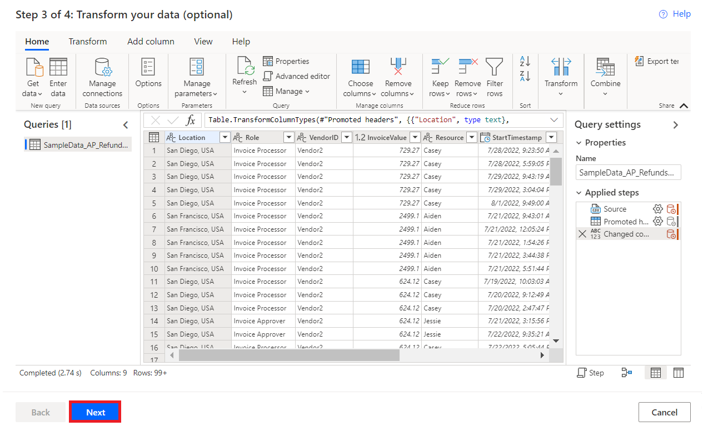
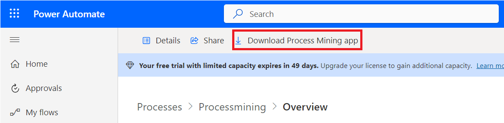
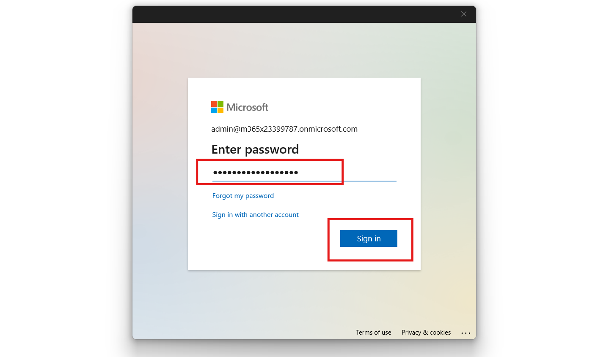

# **实验 5 - 创建和分析应付账款退款流程**

**目标：** 本实验的目标是使用 Power Automate Process Mining
功能创建和分析应付账款退款流程。参与者将学习从 CSV
文件导入数据、创建新流程以及利用 Process Mining
桌面应用程序分析关键绩效指标 （KPI）
和其他指标，以深入了解应付账款退款流程的效率和性能。

**预计时间：** 30 分钟

### 任务 1：创建流程

1.  转到**+++https://make.powerautomate.com/+++**。如果系统提示，请使用您的
    Office 365 租户凭据登录。选择 **United States**
    作为国家/地区，然后选择 **Get started**。

- 

2.  选择您的环境 – **Dev One**。

- 

3.  在左侧的导航窗格中，选择 **More** 🡪 **Process mining**。

- 

4.  在 **Create new process** 部分中，选择 **Start here**。

- 

5.  在  **Create a new process** 屏幕中，输入流程名称 –
    **+++Processmining+++**，然后选择  **Import data**，选择 **Data
    flow**，然后选择 **Continue**。（可选）输入流程的描述。

- 

6.  如果系统要求您**choose where to export**，请从 **Choose your
    destination** 下拉列表中选择 **PowerBi Embedded** ，然后选择
    **Continue 。**

- 

### 任务 2：导入数据

1.  在 **Choose a data source** 屏幕中，选择 **Text/CSV。**

- 

2.  在 **Connection settings** 标题下，选择 **Upload file
    （Preview）**。

- 

3.  选择 **Browse**。

- 

4.  查找并选择 **SampleData_AP_Refunds_Financial_EventLog.csv**。位置：
    **C：Files**

5.  选择 **“Open**”。

- 

6.  如果系统要求您进行身份验证，请选择 **Sign in （登录**）
    并按照提示作。（将弹出窗口阻止程序配置为允许。

- 

7.  选择 **Next**。

- 

8.  预览文件数据，然后选择 **Next**。

- 

9.  当您看到允许您转换数据的 Power Query 时，请选择 **Next**。

- 

10. 根据需要将样本数据中的 **Attribute Name** 与 **Attribute Type** 匹配
    。

- 

11. 在此示例中，您将更改的数据属性为
    **InvoiceValue**、**Resource**、**StartTimestamp**、**EndTimestamp**、**CaseId**
    和 **ActivityName**，如下所示。

- **InvoiceValue** – Financial per case (first event)

  **Resource** – Resourse

  **StartTimestamp** – Event Start

  **EndTimestamp** – Event End

  **CaseId** – Case ID

  **ActivityName** - Activity

  

12. **完成**后，属性映射应如以下屏幕截图所示。

- 

13. 选择 **Save and analyze**。分析可能需要几分钟才能运行。

- 

14. **分析流程完成后**，您将看到一个流程图和一个控制面板，其中包含有关您的流程的其他见解。在控制面板上，您可以查看许多有助于您**分析流程的指标。**

- 

### 任务 3：分析流程

让我们来看看 KPI 之外的流程分析。我们将使用 Power Automate Process
Mining 桌面应用程序，您可以在其中编辑和分析在 Process Mining
功能中创建的流程。

1.  从顶部栏中，单击 **Download process Mining app**。

- 

2.  双击 Downloads 中的 **PowerAutomateProcessMining** App
    安装程序文件。

- 

3.  单击 **Install**。

- 

4.  安装Processmining应用程序后，该应用程序会自动启动，如果没有，请手动启动应用程序。启动应用程序后，选择
    **English** 作为语言，然后单击 **Next Step**。

- 

5.  选中如图所示的所有**复选框**，然后单击 **Next**。

- 

6.  然后点击 **Apply and mine** 按钮。

- 

7.  然后选择 **Use** 按钮，它将导航到登录窗口。

- 

8.  输入您的管理员租户 ID，然后单击 **Sign In** 按钮。

- 

9.  然后输入您的管理员租户密码并单击 **Sign in**。

- 

10. 如果出现“保持登录所有应用程序”的弹出窗口，然后选择 **“No, sign in to
    this app only**”。

- 

11. 在 Power Automate Process Mining 应用工具栏上，从右上角选择环境 –
    **Dev One** 。

- 

12. 在 Power Automate （Processmining）
    中搜索您使用流程挖掘功能创建的流程。

13. 选择 **Default** 以显示默认视图。您已准备好使用 Process Mining
    桌面应用程序的高级功能。

- 

14. > 注意：如果它显示与**“Model size is too large for your PC
    > configuration”**相关的消息，并提供“是”和“否”选项以供执行，请选择**“Yes**”。

- 

15. 在 **Customize** 面板 工具栏上，选择
    **Frequency**（第一个图标），然后在 **Metric 下拉菜单**中选择 **Case
    count**。

- 

> > 流程图显示流程的案例数，这些案例包含在每个节点指定的活动。

16. 在Customize 面板上，选择
    Performance（时钟图标），然后从下拉菜单中选择 **Mean duration**。

- 

> > 请注意，与其他步骤相比，**Refund with special voucher**
> > 步骤的平均持续时间较长。

- 

17. 在 **Customize** 面板上，选择**Finance**（纸图标），然后从 量度
    下拉菜单中选择 **Mean **。

- 

> > 请注意，相同的 **Refund with Special Voucher** 步骤仅涉及 631.11 USD
> > 的发票金额，不到大多数其他步骤的一半。

- 

18. 选择 **Save**。

- 

### 结论：

在本实验中，参与者使用 Power Automate Process Mining
功能创建并分析了应付账款退款流程。通过导入 CSV
数据，他们构建了详细的流程图和仪表板，使他们能够检查关键绩效指标 （KPI）
和流程指标。通过 Power Automate Process Mining
桌面应用程序，参与者进行了更深入的分析，确定了特定步骤中的效率低下问题，例如持续时间长和发票价值较低。该实验室演示了
Process Mining 如何帮助组织优化财务工作流程、提高效率并简化应付账款作。
