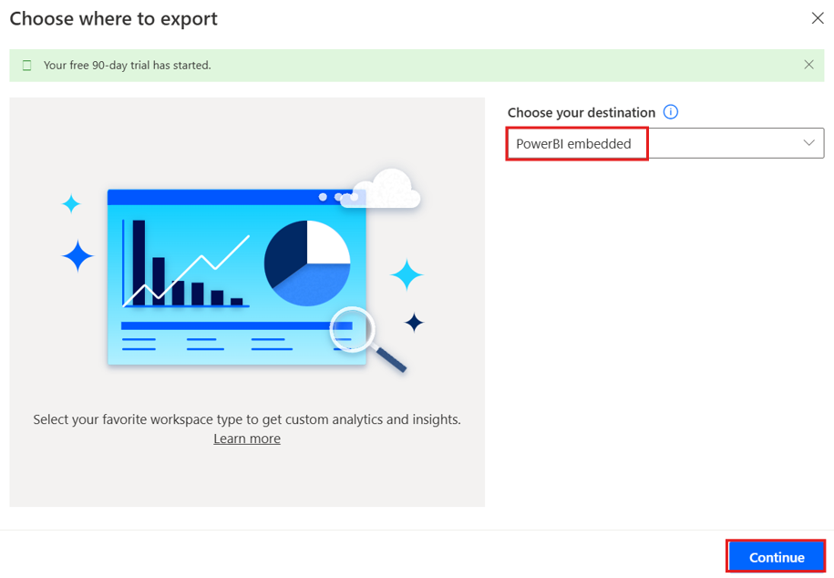
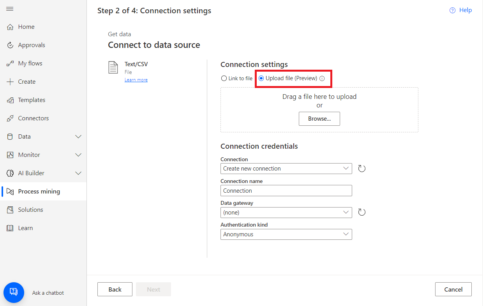
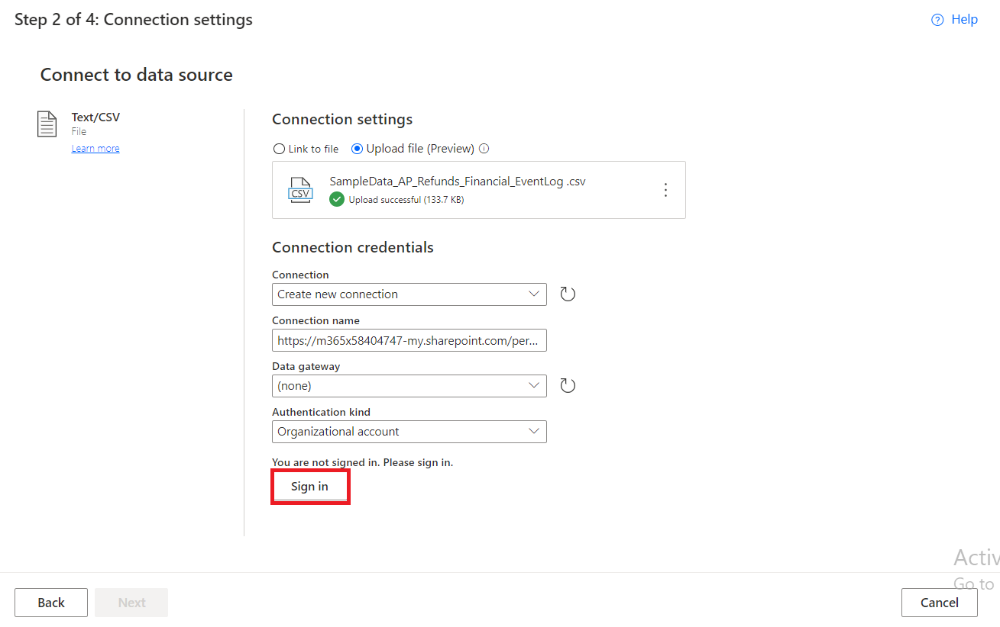
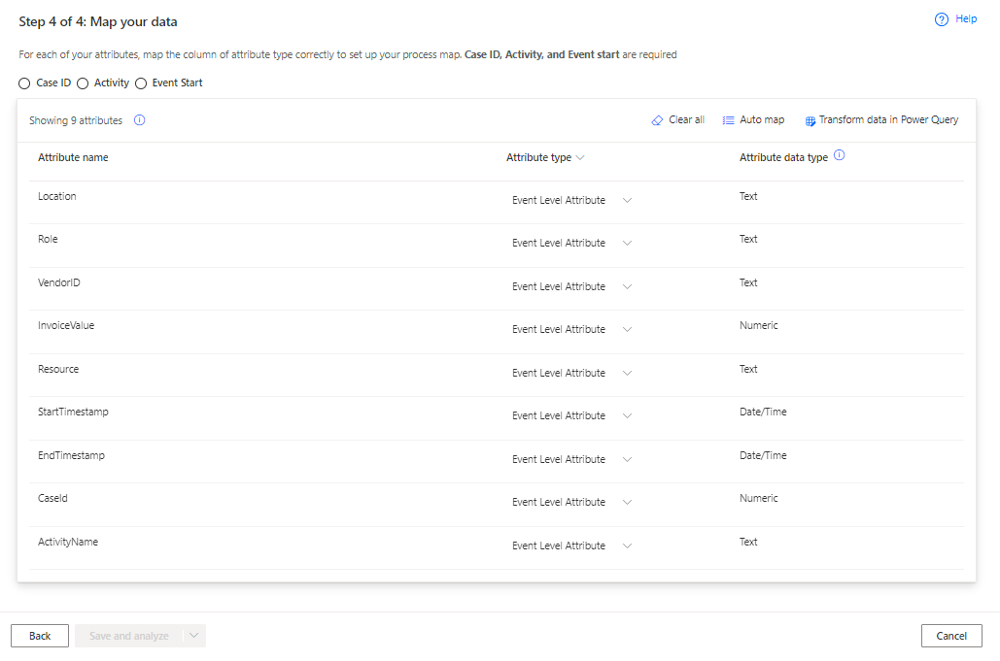

**Laboratorio 5 – Crear y analizar el Accounts Payable Refund Process**

**Objetivo:** El objetivo de este laboratorio es crear y analizar el
accounts payable refund process mediante las capacidades Power Automate
Process Mining. Los participantes aprenderán a importar datos desde un
CSV file, crear un nuevo proceso y utilizar la aplicación de desktop de
Process Mining para analizar los key performance indicators (KPIs) y
otras métricas para obtener insights en la eficacia y rendimiento del
accounts payable refund process.

**Duración estimada:** 30 minutos

**Tarea 1: Cree un proceso**

1.  Vaya a
    +++\*\*[*https://make.powerautomate.com/\*\*+++*](https://make.powerautomate.com/**+++).
    Si le pide, inicie sesión con sus Office 365 tenant credentials.
    Seleccione **United States** como country/region y seleccione **Get
    started**.

> 

2.  Seleccione su environment – **Dev One**.

> 

3.  En el panel de navegación izquierdo, seleccione **More** 🡪 **Process
    mining**.

> 

4.  En la sección **Create new process**, seleccione **Start here**.

> 

5.  En la pantalla **Create a new process**, introduzca un process name
    – +++**Processmining**+++, y seleccione **Import data**,
    seleccione **Data flow** y seleccione **Continue**. (opcional)
    Introduzca una descripción para su proceso.

> 

6.  Si le pide **choose where to export,** seleccione **PowerBi
    embedded** desde el menú **Choose your destination** y seleccione
    **Continue**.

> 

Tarea 2: Importe los datos

1.  En la pantalla **Choose a data source**, seleccione **Text/CSV**.

> 

2.  En el **Connection settings** heading, seleccione **Upload file
    (Preview)**.

> 

3.  Seleccione **Browse**.

> 

4.  Busque y
    seleccione **SampleData_AP_Refunds_Financial_EventLog.csv**.
    Location: **C:\Lab Files**

5.  Seleccione **Open**.

> 

6.  Si se le pide autenticar, seleccione **Sign in** y siga los prompts.
    (Configure Pop-up blocker para permitir)

> 

7.  Seleccione **Next**.

> 

8.  Previsualice el file data y seleccione **Next**.

> 

9.  Cuando ve el power query, lo que le permite transformar sus datos,
    seleccione **Next**.

> 

10. Empareje el **Attribute Name** desde los datos de muestra
    al **Attribute Type** como appropriate.

> 

11. En este sample, los data attributes que cambiará
    son **InvoiceValue**, **Resource**, **StartTimestamp**, **EndTimestamp**, **CaseId**,
    y **ActivityName** así.

> **InvoiceValue** – Financial per case (first event)
>
> **Resource** – Resourse
>
> **StartTimestamp** – Event Start
>
> **EndTimestamp** – Event End
>
> **CaseId** – Case ID
>
> **ActivityName** - Activity
>
> 

12. Cuando **termine**, el attribute mapping debe aparecer así.

> 

13. Seleccione **Save and analyze**. El análisis puede llevar unos
    minutos para ejecutar.

> 

14. Cuando el **analysis process está completo**, verá un process map y
    un dashboard con otros insights sobre su proceso. En el dashboard,
    puede visualizar muchas métricas que le ayudará a **analizar su
    proceso.**

> 

Tarea 3: Analizar un proceso

Llevamos nuestro análisis más allá de los KPIs. Usaremos el Power
Automate Process Mining desktop app, donde puede editar y analizar sus
procesos creados en el process mining capability.

1.  Desde la barra superior, haga clic en el **Download process Mining
    app**.

> 

2.  Haga doble clic en **PowerAutomateProcessMining** App installer file
    en Downloads.

> 

3.  Haga clic en **Install**.

> 

4.  Después de instalar Processmining app, se inicia la aplicación
    automáticamente, si no, por favor inicie la aplicación manualmente.
    Después de iniciar la aplicación, seleccione **English** como
    language y haga clic en **Next Step**.

> 

5.  Seleccione todas las **casillas** como se ve en la imagen y haga
    clic en **Next**.

> 

6.  A continuación, haga clic en el botón **Apply and mine**.

> 

7.  Seleccione el botón **Use**, se navegará a la ventana login.

> 

8.  Introduzca su admin tenant Id y haga clic en el botón **Sign In**.

> 

9.  Introduzca su admin tenant password y haga clic en **Sign in**.

> 

10. Si aparece un pop up diciendo ‘Stay signed in to all your apps’,
    seleccione **No, sign in to this app only**.

> 

11. En el Power Automate Process Mining app toolbar, seleccione el
    environment – **Dev** **One** desde la esquina superior derecha.

> 

12. Busque el proceso que ha creado con el process mining capability en
    Power Automate (**Processmining**).

13. Seleccione **Default** para mostrar el default view. Está listo para
    usar las capacidades avanzadas del Process Mining desktop app.

> 
>
> Ojo: Si muestra un mensaje relacionado con **Model size is too large
> for your PC configuration** y da las opciones Yes y No para la
> ejecución, seleccione **Yes**.
>
> 

14. En el **Customize** panel toolbar, seleccione **Frequency** (el
    primer ícono), y seleccione **Case count** en el
    dropdown **Metric**.

> 
>
> El process map muestra el número de casos del proceso que incluye la
> actividad especificada en cada node.

15. En el panel **Customize**, seleccione el **Performance** (ícono de
    reloj), y seleccione **Mean duration** desde el dropdown.

> 
>
> Note que el paso **Refund with special voucher** tiene un long mean
> duration en comparación con otros pasos.
>
> 

16. En el panel **Customize**, seleccione **Finance** (el ícono de
    papel), y seleccione **Mean** desde el dropdown **Metric**.

> 
>
> Note que el mismo paso **Refund with Special Voucher** incluye solo
> $631.11 en invoice value, lo que es menos de la mitad de otros pasos.
>
> 

17. Seleccione **Save**.

> 

Conclusión:

En este laboratorio, los participantes crearon y analizaron un payable
refund process mediante las capacidades Power Automate Process Mining.
Al importar el CSV data, construyeron un process map detallado y
dashboard, permitiéndole a examinar key performance indicators (KPIs) y
process metrics. A través del Power Automate Process Mining desktop app,
los participantes realizaron un análisis más profundo, identificando las
ineficiencias como duraciones largas e invoice values más bajos en pasos
específicos. Este laboratorio demostró cómo el Process Mining puede
ayudar a las organizaciones a optimizar los workflows financieros,
mejorar eficiencias, y agilizar las operaciones de accounts payable.
