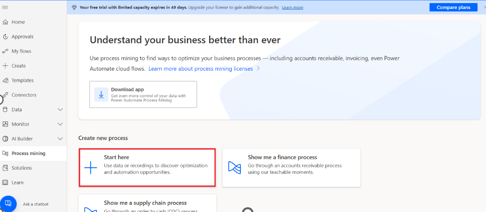
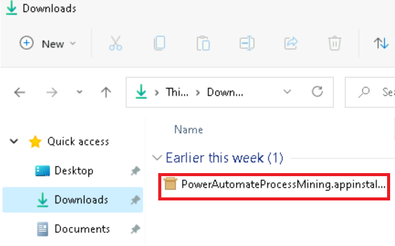
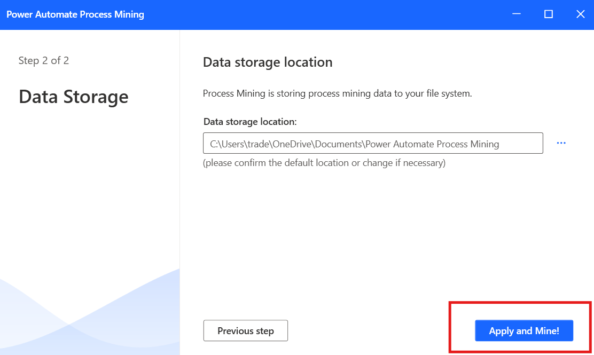

**ラボ 5 - 買掛金返金プロセスの作成と分析**

**目標:** このラボの目的は、Power Automate Process Mining
機能を使用して買掛金の払い戻しプロセスを作成および分析することです。参加者は、CSVファイルからデータをインポートし、新しいプロセスを作成し、Process
Miningデスクトップアプリを使用して主要業績評価指標(KPI)やその他の指標を分析し、買掛金の払い戻しプロセスの効率とパフォーマンスに関する洞察を得る方法を学びます。

**所要時間:** 30 分

タスク 1: プロセスの作成

1.  +++https://make.powerautomate.com/+++に移動します。求められた場合は、Office
    365 テナントの資格情報でサインインします。 **国/地域として**
    \[**United States**\] を選択し、 \[**Get started\] を選択します**。

- 

2.  環境 ( **Dev One**) を選択します。

- 

3.  左側のナビゲーション ウィンドウで、**More** ＞**Process
    mining**.**を選択します**。

- 

4.  \[**Create new process\]** セクションで、\[**Start here\]**
    を選択します。

- 

5.  新しい**Create a new process** 画面で、プロセス名 –
    +++**Processmining**+++ を入力し、**Import data**を選択し、**Data
    flow**を選択して**から、Continue**
    を選択します。(オプション)プロセスの説明を入力します。

- 

6.  **エクスポートする場所を選択**するように求められた場合は、\[**Choose
    your destination**\] ドロップダウン**から** \[**PowerBi embedded\]
    を選択し** 、\[**Continue\]** を選択します。

- 

タスク 2: データのインポート

1.  \[**Choose a data source** **\]** 画面で、\[**Text/CSV\]
    を選択します**。

- 

2.  \[**Connection settings** **\]** 見出しの下で 、\[**Upload file
    (Preview)\]** を選択します。

- 

3.  \[**Browse**\] を選択します。

- 

4.  \[SampleData_AP_Refunds_Financial_EventLog.csv**\]
    を見つけて選択します**。場所: **C:Files**

5.  \[Open\] **を選択します**。

- 

6.  認証を求められた場合は、\[**Sign in**\]
    を選択し、画面の指示に従います。(ポップアップブロッカーを許可するように設定します。

- 

7.  \[**Next\] を選択します**。

- 

8.  ファイル データをプレビューし、**Next** を選択します。

- 

9.  データを変換できる Power Query が表示されたら、**Next**
    を選択します。

- 

10. 必要に応じて、サンプル・データの**「Attribute
    Name** **」を**「**Attribute Type** 」と一致させます 。

- 

11. このサンプルでは、次のように、変更するデータ属性は
    **InvoiceValue**、**Resource**、**StartTimestamp**、**EndTimestamp**、**CaseId**、**ActivityName**
    です。

- **InvoiceValue** – Financial per case (first event)

  **Resource** – Resourse

  **StartTimestamp** – Event Start

  **EndTimestamp** – Event End

  **CaseId** – Case ID

  **ActivityName** - Activity

  

12. 完了する**と**、属性マッピングは次のスクリーンショットのようになります。

- 

13. \[**Save and analyze\]**
    を選択します。解析の実行には数分かかる場合があります。

- 

14. **分析プロセスが完了すると**、プロセス
    マップとダッシュボードが表示され、プロセスに関するその他の分析情報が表示されます。ダッシュボードでは、プロセスの分析に役立つ多くのメトリクスを表示できます
    **。**

- 

タスク 3: プロセスの分析

KPIを超えたプロセスの分析を見てみましょう。ここでは、Power Automate
Process Mining デスクトップ アプリを使用して、プロセス
マイニング機能で作成されたプロセスを編集および分析できます。

1.  上部のバーから、\[**Download process
    Mining\]アプリをクリックします**。

- 

2.  \[Downloads\]で**PowerAutomateProcessMining**アプリのインストーラーファイルをダブルクリックします。

- 

3.  \[**Install**\]**をクリックします**。

- 

4.  Processminingアプリをインストールすると、アプリが自動的に起動しますので、そうでない場合は手動でアプリを起動してください。アプリを起動したら、
    言語として**English**を選択し、\[**Next Step**\]をクリックします。

- 

5.  画像に示すようにすべての**チェックボックスを選択し、\[Next
    Step\]をクリックします**。

- 

6.  次に、\[**Apply and mine\]**ボタンをクリックします。

- 

7.  次に、\[ **Use**
    \]ボタンを選択すると、ログインウィンドウに移動します。

- 

8.  管理者テナント ID を入力し、\[**Sign In\]** ボタンをクリックします。

- 

9.  次に、管理者テナントのパスワードを入力し、\[**Sign
    In**\]をクリックします。

- 

10. 「Stay signed in to all your
    apps」というポップアップが表示された場合は、\[**No, sign in to this
    app only**\] を選択します。

- 

11. Power Automate Process Mining アプリのツールバーで、右上の環境 (
    **Dev One** ) を選択します。

- 

12. Power Automate (Processmining) のプロセス
    マイニング機能を使用して作成したプロセスを検索します。

13. \[**Default**\] を選択して
    、デフォルトのビューを表示します。これで、Process
    Miningデスクトップアプリの高度な機能を使用する準備が整いました。

- 

  注:「**Model size is too large for your PC
  configuration」**に関連するメッセージが表示され
  、実行のオプションが\[Yes\]と\[No\]の場合は、\[Yes\]を選択します。

  

14. **\[Customize**\] パネルのツールバーで、\[**Frequency**\]
    (最初のアイコン) を選択し**、\[Metric**\] **ドロップダウン
    メニューの** \[**Case count** \] を選択します。

- 

  プロセス・マップには、各ノードで指定されたアクティビティーを含むプロセスのケース数が表示されます。

15. **\[Customize\]** パネルで、\[**Performance**\] (時計アイコン)
    を選択し、 ドロップダウン メニューから \[**Mean duration** f\]
    を選択します。

- 

  **Refund with special
  voucher** のステップは**、**他のステップと比較して平均期間が長いことに注意してください。

  

16. **\[Customize\]** パネルで、\[**Finance**\] (紙のアイコン)
    を選択し**、\[Metric**\] ドロップダウン メニューから \[**Mean**\]
    を選択します。

- 

  同じ**Refund with Special Voucher** のステップでは、請求額が $631.11
  しかなく、これは他のほとんどのステップの半分未満であることに注意してください。

  

17. \[**Save**\] を選択します。

- 

結論：

このラボでは、参加者は Power Automate Process Mining
機能を使用して、買掛金の払戻プロセスを作成および分析しました。CSV
データをインポートすることで、詳細なプロセス
マップとダッシュボードを構築し、主要業績評価指標 (KPI) とプロセス
メトリックを調べることができました。Power Automate Process Mining
デスクトップ
アプリを通じて、参加者はより詳細な分析を行い、特定のステップでの長期滞在や請求額の低さなどの非効率性を特定しました。このラボでは、Process
Miningが組織の財務ワークフローの最適化、効率の向上、買掛金業務の合理化にどのように役立つかを実証しました。
