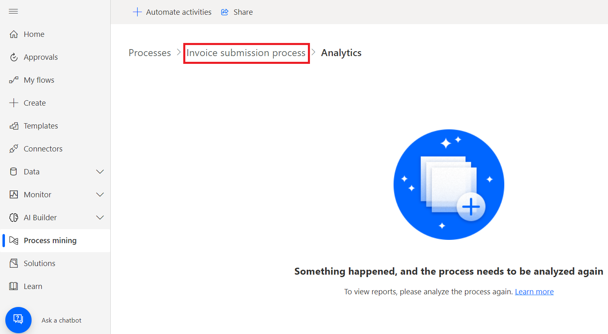

# Lab 6 - Utilizzo della funzionalità di Task Mining per analizzare il processo di Order Fulfillment

**Obiettivo:** Il laboratorio si concentra sull'utilizzo delle
funzionalità di task mining di Power Automate per analizzare e
ottimizzare il processo di evasione degli ordini. I partecipanti
impareranno come importare una soluzione contenente registrazioni di
esempio, esplorare le funzionalità di task mining ed eseguire analisi
dei processi per identificare i colli di bottiglia. Inoltre, il
laboratorio copre l'automazione delle fasi del processo e l'utilizzo
dell'analisi per ottenere informazioni dettagliate sull'efficienza del
processo.

**Tempo stimato:** 30 minuti

### Attività 1: Preparati per il task mining 

1.  **Sign in** a Power Automate usando
    +++**https://make.powerautomate.com/**+++ con le credenziali del
    tenant di Office 365.

2.  Selezionare il tuo ambiente: **Dev One**.

- 

### Attività 2: Importare una soluzione

1.  Nel riquadro di spostamento a sinistra selezionare **Solutions** e
    quindi nella barra degli strumenti in alto selezionare **Import
    solution**.

- 

2.  Selezionare **Browse**.

- 

3.  Selezionare il file **Processmining.zip** da C:Files e aprilo.

- 

4.  Selezionare **Next**.

- 

5.  Selezionare **Import** e attendere l'importazione della soluzione.

- 

### Attività 3: Visualizzare registrazioni di esempio

1.  Dopo aver importato correttamente il file .zip, nel riquadro di
    spostamento a sinistra selezionare **Process mining,** quindi
    selezionare **Invoice submission process**.

- 

2.  Se accedi alla scheda Analytics, tornare indietro di un passo.
    Tornare al **Invoice submission process** selezionandolo dai
    breadcrumb nella parte superiore della pagina.

- 

3.  Puoi vedere alcune delle registrazioni esistenti in **Recordings**.

- 

4.  Per essere sicuro di visualizzare l'intero elenco delle
    registrazioni esistenti, selezionare **See all**.

### Attività 4: Esplorare le funzionalità

Vedrai le seguenti funzionalità:

- **New recording**: Crea una nuova registrazione.

- **Analytics**: Visualizza la mappa dei processi e gli approfondimenti

- **Analyze**: Analizzare un processo.

- **Create activity names**: Crea nomi di attività per il tuo processo.

- **Delete process**: Elimina il processo.

&nbsp;

- 

### Attività 5: Analizzare un processo

Quando si analizza un processo, la funzionalità di process mining
analizza le registrazioni esistenti per identificare eventuali colli di
bottiglia all'interno del processo aziendale.

1.  Selezionare **Analyze**.

- > **Nota:** il completamento dell'analisi richiederà alcuni minuti.
  > Durante questo processo, viene visualizzato un messaggio di stato
  > sotto il pulsante **New recording**.

  

2.  Se si verifica un errore durante la fase di analisi, selezionare
    **Analyze** per attivare nuovamente questa azione.

3.  Al termine, **Process analysis status** cambia in **Analyzed**.
    Selezionare **Analytics**  per visualizzare la mappa dei processi e
    le informazioni dettagliate.

- 

  > **Nota:** il completamento di questo passaggio potrebbe richiedere
  > un paio di minuti dopo l'esecuzione dell'analisi.

### Attività 6: Layout di pagina di Analytics

In questa sezione viene illustrato cosa è possibile fare nella schermata
**Analytics**.

**Legend:**

1.  **Automate activities**: Per semplificare il processo di
    automazione, puoi utilizzare la funzione **Automate activities**.
    Questa funzionalità rileva se l'utente ha eseguito azioni
    utilizzando un'applicazione in cui sono disponibili azioni Power
    Automate, ad esempio Microsoft Outlook o Excel. Dopo aver
    selezionato **Automate activities**, viene generata una bozza di
    processo Power Automate contenente le azioni pertinenti. L'utente
    può quindi modificare e personalizzare il processo di bozza per
    creare il processo automatizzato finale.

2.  **Legend**: Informazioni aggiuntive sul report, che aiutano a
    comprendere meglio le visualizzazioni e i dati presentati.

3.  **Process**: Informazioni approfondite sul processo analizzato, tra
    cui la mappa del processo, l'analisi del tempo per ogni variante e
    ogni autore della registrazione.

4.  **Application**: Informazioni sulle app utilizzate nelle
    registrazioni. Ciò include quali app sono state utilizzate dagli
    autori, con quale frequenza sono state utilizzate e quali sono state
    le transizioni tra di esse. Questo report illustra quali connettori
    devono essere utilizzati quando si implementa l'automazione per il
    processo e dove utilizzare potenzialmente i flussi desktop, poiché
    non esiste alcun connettore esistente.

### Attività 7: Relazioni tra i passaggi del processo aziendale

Vengono visualizzate le varie fasi del processo aziendale e le relative
durate. Questi passaggi includono:

- Scarica l'allegato della fattura da e-mail (48 secondi)

- Apri l'elenco delle fatture Excel (11,5 secondi)

- Apri fattura da OneDrive (21 secondi)

- Inserisci i dettagli della fattura (53,6 secondi)

- Salva e invia (9 secondi)

- Notifica al team l'invio (26,67 secondi)

&nbsp;

- 

### Attività 8: Visualizzare i dati di analisi

1.  Guardare i principali dati di analisi. Il tempo medio di
    elaborazione è di 1,47 minuti su cinque registrazioni.

- 

2.  Analizza altri dashboard di metriche basate sul tempo.

- > **Activity by average time in sec**: Si noti che **Enter invoice
  > details** e **Download invoice** richiedono più tempo.

  

  > **Recording by average time in min**: Si noti che alcune persone
  > (**Preston Morales** e **Shakti Menon**) impiegano più tempo di
  > altre.

  

3.  Selezionare la scheda **Application** per visualizzare i dettagli
    sulle applicazioni utilizzate.

- Il caricamento dei report potrebbe richiedere un po' di tempo.

  - Fornendo informazioni sulle applicazioni utilizzate in un processo
    aziendale, sulla loro frequenza di utilizzo e sulla quantità di
    tempo trascorso su ciascuna applicazione, questo report è
    fondamentale per ottenere informazioni dettagliate sul processo.

  - Ad esempio, il dashboard mostra che un'app di fatturazione legacy,
    Outlook ed Excel contribuiscono in modo significativo al tempo
    impiegato e alle azioni delle applicazioni.

  - Prenditi del tempo per familiarizzare con i diversi rapporti.

  

4.  Torna alla mappa dei processi selezionando **Process**.

5.  Dai un'occhiata alla funzione delle attività automatizzate. Dalla
    mappa dei processi, è possibile vedere che la funzionalità di
    process mining ha evidenziato diverse attività come potenziali
    candidati per l'automazione basata sulle applicazioni.

6.  Iniziare a creare un flusso per l'automazione selezionando
    **Automate activities**  nella parte superiore.

- 

  Nel browser viene visualizzata una scheda che mostra la finestra di
  progettazione del flusso. Le azioni consigliate che corrispondono alle
  attività della mappa dei processi vengono visualizzate automaticamente
  nel pannello di destra. Ad esempio, vengono suggeriti diversi
  connettori e-mail da utilizzare per automatizzare l'attività
  **Download invoice attachment from email**.

  

### Conclusione:

In questo laboratorio, i partecipanti hanno utilizzato le funzionalità
di task mining di Power Automate per analizzare e ottimizzare il
processo di evasione degli ordini. Importando una soluzione
precostituita con registrazioni di esempio, hanno esplorato le
funzionalità chiave del task mining, tra cui l'analisi dei processi,
l'identificazione dei colli di bottiglia e la generazione di
raccomandazioni per l'automazione. I partecipanti hanno appreso come
valutare l'efficienza dei processi attraverso analisi dettagliate del
tempo impiegato in varie attività e applicazioni. Il laboratorio ha
evidenziato come il task mining possa semplificare i processi aziendali
identificando le opportunità di automazione, migliorando in ultima
analisi l'efficienza operativa e riducendo i carichi di lavoro manuali
nel processo di evasione degli ordini.
