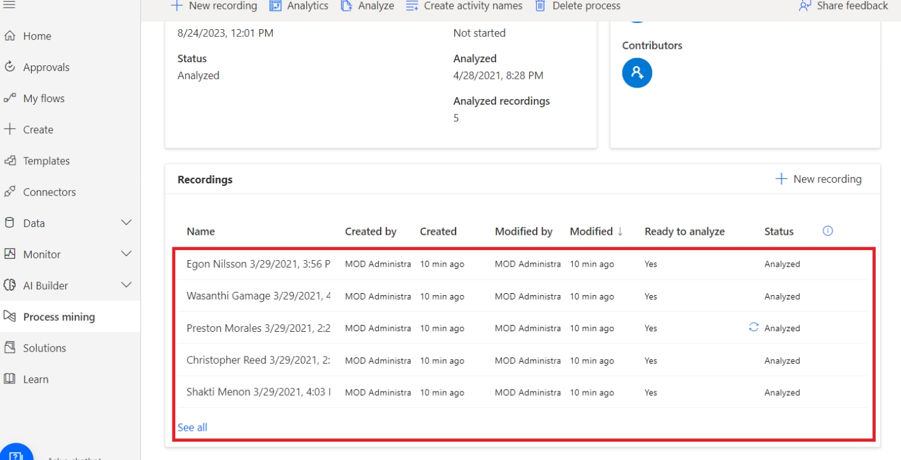

# 实验 6 - 使用 Task Mining 功能分析订单履行流程

**目标：** 该实验室侧重于利用 Power Automate
任务挖掘功能来分析和优化订单履行流程。参与者将学习如何导入包含样本记录的解决方案，探索任务挖掘功能，并执行流程分析以识别瓶颈。此外，该实验室还涵盖了自动化流程步骤和使用分析来深入了解流程效率。

**预计时间：** 30 分钟

### 任务 1：为任务mining做好准备

1.  使用 **+++https://make.powerautomate.com/+++** 和 Offic**登录**e 365
    租户凭据到 Power Automate。

2.  选择您的环境 – **Dev One**。

- 

### 任务 2：导入解决方案

1.  在左侧的导航窗格中，选择 **“Solutions**”，然后在顶部的工具栏中，选择
    **“Import solution**”。

- 

2.  选择 **Browse**。

- 

3.  从 C：Files 中选择 **Processmining.zip** 文件并打开它。

- 

4.  选择 **Next**。

- 

5.  选择 **Import** 并等待解决方案导入。

- 

### 任务 3：查看样本记录

1.  成功导入 .zip 文件后，在左侧的导航窗格中，选择 **Process
    mining**，然后选择 **Invoice submission process**。

- 

2.  如果您导航到 分析 选项卡，然后后退一步。 从页面顶部的痕迹导航中选择
    **Invoice submission** 流程，返回 Invoice submission。

- 

3.  您可以在 **Recordings** 下看到一些现有的录制文件。

- 

4.  要确保您看到现有录制文件的完整列表，请选择 **See all**。

### 任务 4：探索功能

您将看到以下功能:

- **New recording**: 创建新录制文件。

- **Analytics**: 查看流程图和见解

- **Analyze**: 分析流程。

- **Create activity names**: 为您的流程创建活动名称。

- **Delete process**: 删除您的进程。

&nbsp;

- 

### 任务 5：分析流程

当您分析流程时，流程挖掘功能会分析现有记录，以识别业务流程中的任何瓶颈。

1.  选择 **Analyze**。

> > **注意：**分析需要几分钟才能完成。在此过程中，New **recording**
> > 按钮下会显示一条状态消息。

- 

2.  如果您在分析阶段遇到错误，请选择 **Analyze** 以再次触发此作。

3.  完成后，您会看到 **Process analysis status** 更改为
    **Analyzed**。选择 **Analytics** 以查看流程图和见解。

- 

> > **注意：** 执行分析后，此步骤可能需要几分钟才能完成。

### 任务 6：Analytics 页面布局

本节介绍您可以在 **Analytics** 屏幕上执行的作。

**传说：**

1.  **自动化活动**：要简化自动化流程，您可以使用 **自动化活动**
    功能。此功能检测用户是否使用具有 Power Automate作的应用程序（如
    Microsoft Outlook 或 Excel）执行作。选择 **Automate
    activities **后，将生成包含相关作的草稿 Power Automate
    流程。然后，用户可以修改和自定义草稿流程以创建最终的自动化流程。

2.  **图例**：有关报表的其他信息，帮助他们更好地了解所显示的可视化效果和数据。

3.  **流程**：有关所分析流程的深入信息，包括流程图、每个变体和每个记录作者的时间分析。

4.  **应用程序**：有关录制文件中使用的应用程序的信息。这包括作者使用的应用程序、使用频率以及它们之间的过渡。此报表说明在为流程实施自动化时应使用哪些连接器，以及可能在何处使用桌面流，因为没有现有连接器。

### 任务 7：业务流程步骤关系

您将看到业务流程中的各个步骤及其相关的持续时间。这些步骤包括:

- 通过电子邮件下载发票附件（48 秒）

- 打开 Excel 发票列表（11.5 秒）

- 从 OneDrive 打开发票（21 秒）

- 输入发票详细信息（53.6 秒）

- 保存并提交 （9 秒）

- 通知团队提交（26.67 秒）

&nbsp;

- 

### 任务 8：查看分析数据

1.  查看排名靠前的分析数据。平均处理时间为 5 次录制中的 1.47 分钟。

- 

2.  分析其他基于时间的指标控制面板。

- > **Activity by average time in sec：**请注意**，“Enter invoice
  > details** **”和“Download invoice”**花费的时间最多。

  

> > **Recording by average time in min**: 请注意，有些人（**Preston
> > Morales** 和 **Shakti Menon**）花费的时间比其他人多。

- 

3.  选择 **Application** 选项卡可查看有关使用了哪些应用程序的详细信息。

- 加载报告可能需要一段时间。

  - 通过提供有关业务流程中使用的应用程序、它们的使用频率以及在每个应用程序上花费的时间的信息，该报告对于深入了解流程至关重要。

  - 例如，仪表板显示旧版发票应用程序、Outlook 和 Excel
    对应用程序花费的时间和作有重大影响。

  - 花点时间熟悉不同的报告。

  

4.  通过选择 Process。

5.  查看自动化活动功能。从流程图中，您可以看到流程挖掘功能突出显示了几个活动，这些活动是基于应用程序的自动化的潜在候选者。

6.  通过选择顶部的 Automate activities 开始创建自动化流程。

- 

> 此时将在浏览器中打开一个选项卡，并显示流设计器。与流程图中的活动匹配的建议作会自动显示在右侧面板上。例如，建议您使用多个电子邮件连接器，以便自动执行
> **Download invoice attachment from email** 活动。

- 

### 结论：

在本实验中，参与者利用 Power Automate
任务挖掘功能来分析和优化订单履行流程。通过导入带有样本记录的预构建解决方案，他们探索了任务挖掘的关键功能，包括流程分析、识别瓶颈和生成自动化建议。参与者学习了如何通过对各种任务和应用程序所花费的时间进行详细分析来评估流程效率。该实验室强调了任务挖掘如何通过识别自动化机会来简化业务流程，最终提高运营效率并减少订单履行过程中的手动工作量。
