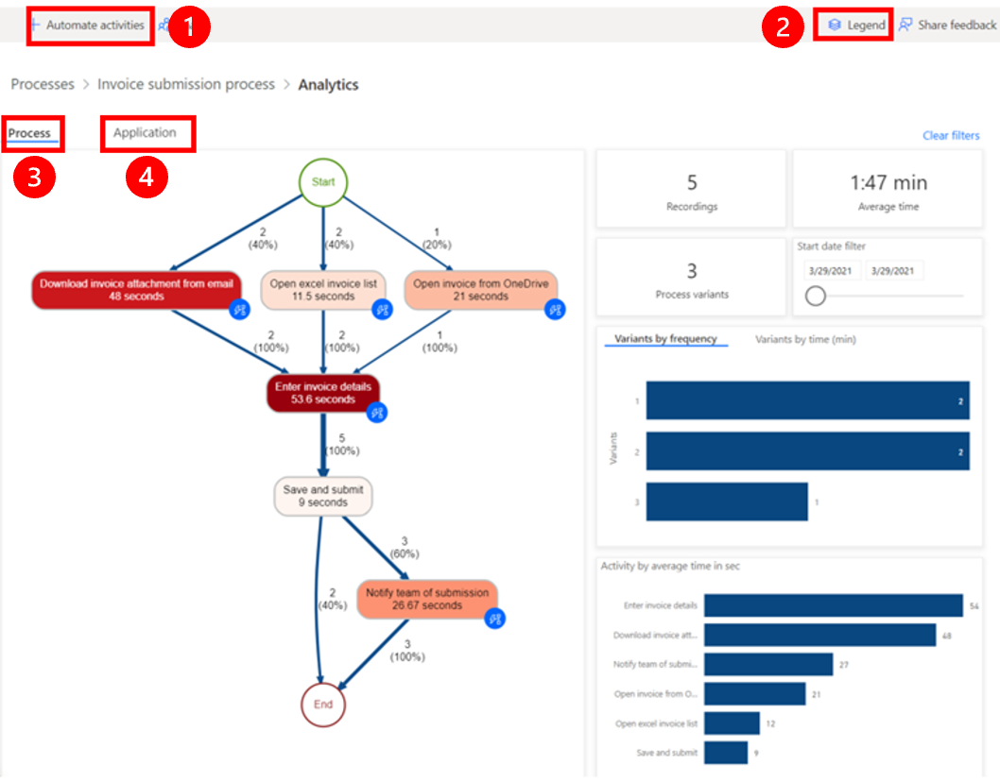
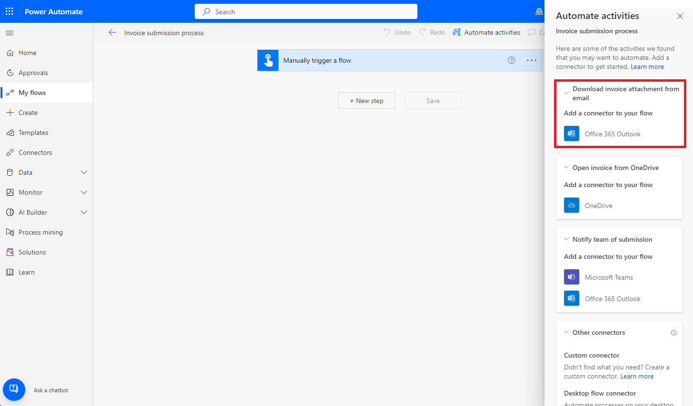

# 實驗 6 - 使用 Task Mining 功能分析訂單履行流程

**目標：** 該實驗室側重于利用 Power Automate
任務挖掘功能來分析和優化訂單履行流程。參與者將學習如何導入包含樣本記錄的解決方案，探索任務挖掘功能，並執行流程分析以識別瓶頸。此外，該實驗室還涵蓋了自動化流程步驟和使用分析來深入瞭解流程效率。

**預計時間：** 30 分鐘

### 任務 1：為任務mining做好準備

1.  使用 **+++https://make.powerautomate.com/+++** 和 Offic**登錄**e 365
    租戶憑據到 Power Automate。

2.  選擇您的環境 – **Dev One**。

- 

### 任務 2：導入解決方案

1.  在左側的導航窗格中，選擇 **“Solutions**”，然後在頂部的工具欄中，選擇
    **“Import solution**”。

- 

2.  選擇 **Browse**。

- 

3.  從 C：Files 中選擇 **Processmining.zip** 文件並打開它。

- 

4.  選擇 **Next**。

- 

5.  選擇 **Import** 並等待解決方案導入。

- 

### 任務 3：查看樣本記錄

1.  成功導入 .zip 文件後，在左側的導航窗格中，選擇 **Process
    mining**，然後選擇 **Invoice submission process**。

- 

2.  如果您導航到 分析 選項卡，然後後退一步。 從頁面頂部的痕跡導航中選擇
    **Invoice submission** 流程，返回 Invoice submission。

- 

3.  您可以在 **Recordings** 下看到一些現有的錄製文件。

- 

4.  要確保您看到現有錄製文件的完整列表，請選擇 **See all**。

### 任務 4：探索功能

您將看到以下功能:

- **New recording**: 創建新錄製文件。

- **Analytics**: 查看流程圖和見解

- **Analyze**: 分析流程。

- **Create activity names**: 為您的流程創建活動名稱。

- **Delete process**: 刪除您的進程。

&nbsp;

- 

### 任務 5：分析流程

當您分析流程時，流程挖掘功能會分析現有記錄，以識別業務流程中的任何瓶頸。

1.  選擇 **Analyze**。

> > **注意：**分析需要幾分鐘才能完成。在此過程中，New **recording**
> > 按鈕下會顯示一條狀態消息。

- 

2.  如果您在分析階段遇到錯誤，請選擇 **Analyze** 以再次觸發此作。

3.  完成後，您會看到 **Process analysis status** 更改為
    **Analyzed**。選擇 **Analytics** 以查看流程圖和見解。

- 

> > **注意：** 執行分析後，此步驟可能需要幾分鐘才能完成。

### 任務 6：Analytics 頁面佈局

本節介紹您可以在 **Analytics** 屏幕上執行的作。

**傳說：**

1.  **自動化活動**：要簡化自動化流程，您可以使用 **自動化活動**
    功能。此功能檢測用戶是否使用具有 Power Automate作的應用程序（如
    Microsoft Outlook 或 Excel）執行作。選擇 **Automate
    activities **後，將生成包含相關作的草稿 Power Automate
    流程。然後，用戶可以修改和自定義草稿流程以創建最終的自動化流程。

2.  **圖例**：有關報表的其他信息，幫助他們更好地瞭解所顯示的可視化效果和數據。

3.  **流程**：有關所分析流程的深入信息，包括流程圖、每個變體和每個記錄作者的時間分析。

4.  **應用程序**：有關錄製文件中使用的應用程序的信息。這包括作者使用的應用程序、使用頻率以及它們之間的過渡。此報表說明在為流程實施自動化時應使用哪些連接器，以及可能在何處使用桌面流，因為沒有現有連接器。

### 任務 7：業務流程步驟關係

您將看到業務流程中的各個步驟及其相關的持續時間。這些步驟包括:

- 通過電子郵件下載發票附件（48 秒）

- 打開 Excel 發票列表（11.5 秒）

- 從 OneDrive 打開發票（21 秒）

- 輸入發票詳細信息（53.6 秒）

- 保存並提交 （9 秒）

- 通知團隊提交（26.67 秒）

&nbsp;

- 

### 任務 8：查看分析數據

1.  查看排名靠前的分析數據。平均處理時間為 5 次錄製中的 1.47 分鐘。

- 

2.  分析其他基於時間的指標控制面板。

- > **Activity by average time in sec：**請注意**，“Enter invoice
  > details** **”和“Download invoice”**花費的時間最多。

  

> > **Recording by average time in min**: 請注意，有些人（**Preston
> > Morales** 和 **Shakti Menon**）花費的時間比其他人多。

- 

3.  選擇 **Application** 選項卡可查看有關使用了哪些應用程序的詳細信息。

- 加載報告可能需要一段時間。

  - 通過提供有關業務流程中使用的應用程序、它們的使用頻率以及在每個應用程序上花費的時間的信息，該報告對於深入瞭解流程至關重要。

  - 例如，儀錶板顯示舊版發票應用程序、Outlook 和 Excel
    對應用程序花費的時間和作有重大影響。

  - 花點時間熟悉不同的報告。

  

4.  通過選擇 Process。

5.  查看自動化活動功能。從流程圖中，您可以看到流程挖掘功能突出顯示了幾個活動，這些活動是基於應用程序的自動化的潛在候選者。

6.  通過選擇頂部的 Automate activities 開始創建自動化流程。

- 

> 此時將在瀏覽器中打開一個選項卡，並顯示流設計器。與流程圖中的活動匹配的建議作會自動顯示在右側面板上。例如，建議您使用多個電子郵件連接器，以便自動執行
> **Download invoice attachment from email** 活動。

- 

### 結論：

在本實驗中，參與者利用 Power Automate
任務挖掘功能來分析和優化訂單履行流程。通過導入帶有樣本記錄的預構建解決方案，他們探索了任務挖掘的關鍵功能，包括流程分析、識別瓶頸和生成自動化建議。參與者學習了如何通過對各種任務和應用程序所花費的時間進行詳細分析來評估流程效率。該實驗室強調了任務挖掘如何通過識別自動化機會來簡化業務流程，最終提高運營效率並減少訂單履行過程中的手動工作量。
