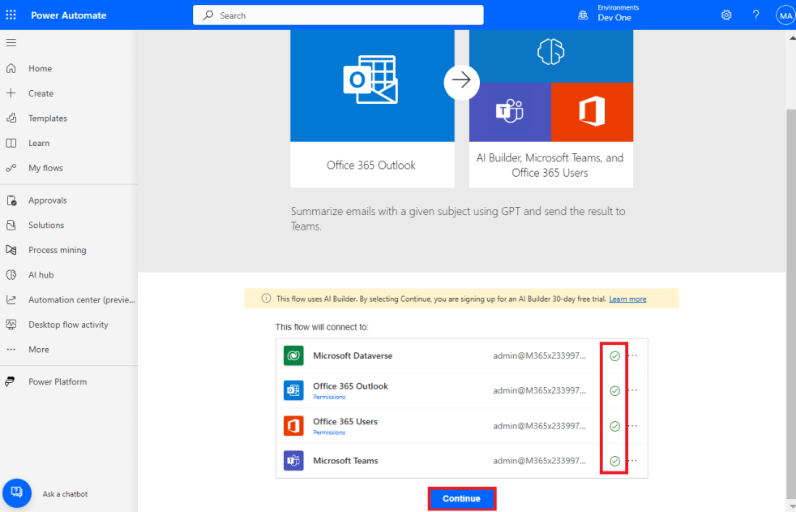
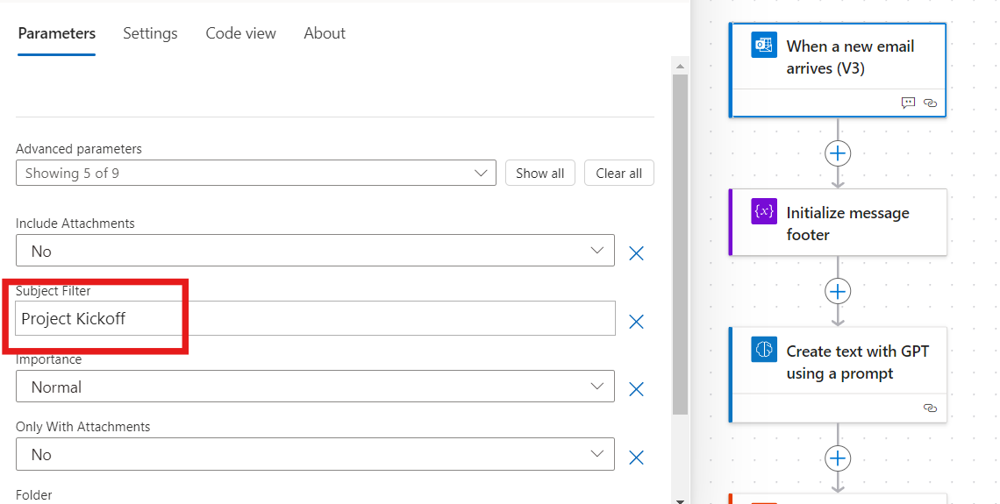
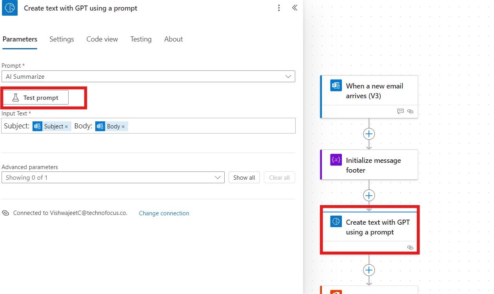
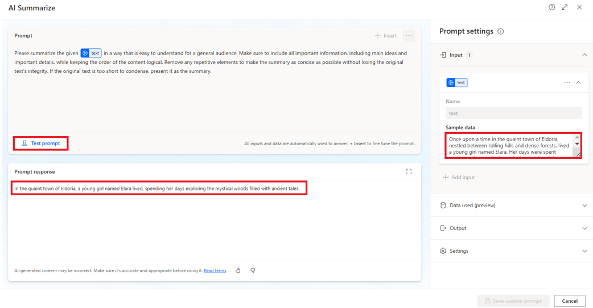
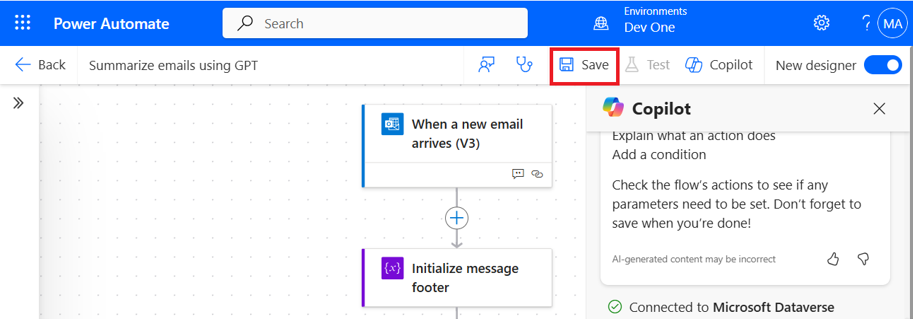
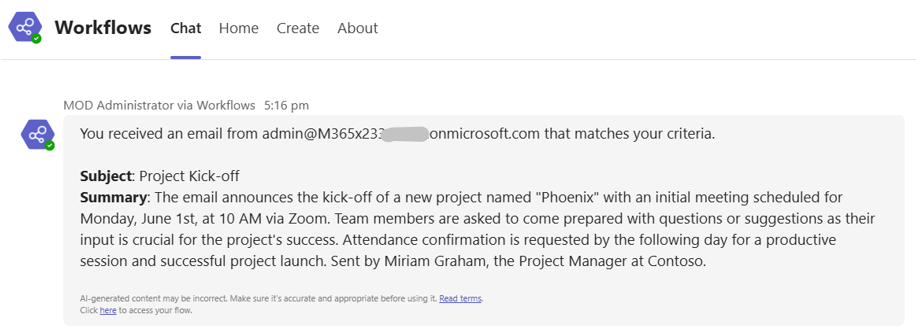

**ラボ07－言語に基づいてヘルプデスクのリクエストを異なるメールボックスにルーティングするフローを作成する。**

**目的：**このラボの目的は、言語検出に基づいてヘルプデスクのリクエストを異なるメールボックスにルーティングするPower
Automateフローを作成するプロセスを参加者に指導することです。このフローはGPT機能と統合されており、受信メールを要約し、特定のトリガーに基づいてルーティングプロセスを自動化することで、組織内のコミュニケーションワークフローを効率化します。

**所要時間：** 15分

**タスク１：言語に基づいてヘルプデスクのリクエストを異なるメールボックスにルーティングするフローを作成する。**

1.  **office 365 admin tenant
    account**を使用して+++\*\*[*https://make.powerautomate.com/using\*\*+++*](https://make.powerautomate.com/using**+++) にサインインします。

2.  左側ナビゲーションペインからTemplates
    を選択して、上部の検索ボックスに+++ **Summarize emails using GPT
    +++**を入力し、表示されるフローを選択します。

> 

3.  次に、テンプレートには、このフローで使用される接続が表示されます。接続の横に緑色のチェックマークが付いていない場合は、接続の横にある「Sign
    in」を選択して接続を修正し、**Continue**を選択してください。

> 

4.  **When a new email arrives
    (V3)**のトリガーを選択します**。**プロパティパネルが左側から開き、件名フィルターパラメータを更新するように促すメッセージが表示されます。現在、**Subject
    filter**はAI Builderです。

5.  件名フィルターを**Project Kick-off**に更新します。

> 

6.  左側に**Create text with a GPT using a
    prompt**アクションを選択すると、プロパティパネルが開きます。プロパティパネルの「プロンプト」フィールドには**AI
    Summarize**と表示されます。

7.  **Test prompt**を選択してプロンプト設定を開きます。

> 

8.  テンプレートにはGPTが使用する定義済みのプロンプトが含まれていますが、このウィンドウで新しいプロンプトを更新してテストすることができます。プロンプトを更新するには、次の手順に従ってください。

9.  **Input**セクションにサンプルデータを入力します。プロンプトセクションの下部にある**Test
    prompt**を選択します。プロンプト応答セクションで応答を確認できます。

> +++ Once upon a time in the quaint town of Eldoria, nestled between
> rolling hills and dense forests, lived a young girl named Elara. Her
> days were spent exploring the mystical woods that bordered the town,
> and whispers of ancient tales filled her imagination.+++
>
> 

10. この演習では、プロンプト設定を開いたときのままにしておきます。

11. 右上隅でフローを**Save**します。これでフローを実行できます。

注意: 次の警告が表示された場合は無視してください:「Create text with GPT
using a
prompt」アクションには、その後にコンテンツ承認アクションがありません。

**タスク２：フローをテストする**

1.  MOD 管理者のテナント ID または自分のメール ID から MOD
    管理者のテナント ID に、件名を**Project
    Kick-off**とし、本文に次の内容を含むメールを送信します。

> Dear Team,
>
> I hope this email finds you well. We are excited to announce the
>
> kick-off of our new project, "Phoenix". The initial meeting is
> scheduled
>
> for Monday, June 1st, at 10 AM via Zoom. Please come prepared with any
>
> questions or suggestions. Your input is vital for the project's
> success.
>
> Kindly confirm your attendance by the end of the day tomorrow. Looking
>
> forward to a productive session and a successful project launch.
>
> Best regards,
>
> Miriam Graham
>
> Project Manager
>
> Contoso

2.  Teams
    でメールの概要を記載したメッセージが届きます。右下には、フローに移動するためのリンクがあります。

> 

3.  このユニットはGPTを使用して受信メールを要約します。AI検出情報は不正確な場合があります。GPTからの情報は必ずご確認ください。

**結論：**

このラボでは、参加者はPower
Automateフローを作成し、言語検出に基づいてメールをルーティングし、GPTを使用してコンテンツを要約することで、ヘルプデスクへの問い合わせを効率化しました。メールワークフローに自動化を統合することで、言語トリガーに基づいて複数のチームや部門間のコミュニケーションを効率的に管理する方法を実証しました。また、Power
Automate内でGPTを使用して生産性を向上させ、手作業による仕分け作業を削減する方法も示しました。このソリューションは、組織のワークフロー効率を向上させ、ヘルプデスクへの問い合わせへの応答時間を短縮するのに役立ちます。
