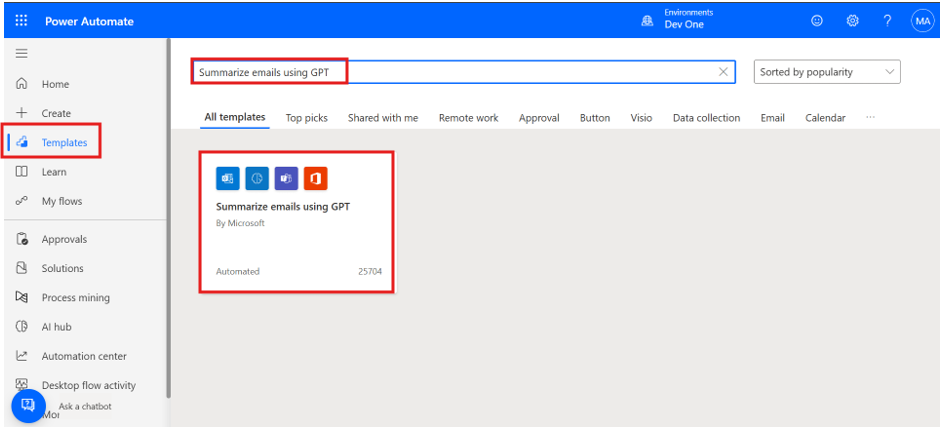

# 实验 07 - 创建一个流，以根据语言将帮助台请求路由到不同的邮箱

**目标：** 本实验的目标是指导参与者完成创建 Power Automate
流的过程，该流根据语言检测将技术支持请求路由到不同的邮箱。该流程与 GPT
功能集成，以汇总传入的电子邮件并根据特定触发器自动执行路由流程，从而帮助简化组织内的通信工作流程。

**预计时间：** 15 分钟

### 任务 1：创建流以根据语言将支持请求路由到不同的邮箱

1.  登录到 **+++https://make.powerautomate.com/using+++** office 365
    admin tenant 帐户。

2.  从 左侧导航窗格中选择 **Templates**，在顶部的搜索框中输入
    **+++Summarize emails using GPT+++**，然后在出现时选择流。

- 

3.  接下来，该模板将向您显示此流程中将使用哪些连接。如果他们旁边没有绿色复选标记，请选择连接旁边的“登录”来修复连接，然后选择
    **“Continue**”。

- 

4.  选择触发器，when a new email arrives (V3)**。**
    属性面板将从左侧打开，并带有更新“主题过滤器”参数的注释。目前，Subject
    Filter为 AI Builder。

5.  将主题筛选器更新为 **Project Kick-off**。

- 

6.  选择 **Create text with a GPT using a prompt**
    作，以便在左侧打开属性面板。在属性面板中，Prompt 字段显示 **AI
    Summarize**。

7.  选择 **Test prompt** 以打开 Prompt 设置。

- 

8.  该模板具有 GPT
    将使用的预定义提示，但您可以在此窗口中更新和测试新提示。按照下一步作更新提示。

9.  要测试提示，请在 **Input** 部分中输入给定的示例数据。然后选择 Prompt
    部分底部的 **Test prompt**。您可以在 Prompt response
    部分下看到响应。

- +++Once upon a time in the quaint town of Eldoria, nestled between
  rolling hills and dense forests, lived a young girl named Elara. Her
  days were spent exploring the mystical woods that bordered the town,
  and whispers of ancient tales filled her imagination.+++

  

10. 在本练习中，我们将保持打开 Prompt Settings 时的所有内容。

11. 将流**保存**在 右上角。现在我们可以运行流。

> 注意：如果您看到给定的警告，请忽略：“Create text with GPT using a
> prompt”作后没有内容审批作。

### 任务 2：测试流

1.  从 MOD 管理员的租户 ID 或您的电子邮件 ID 向 MOD 管理员的租户 ID
    发送电子邮件，主题为 **Project Kick-off**
    ，电子邮件正文中应包含以下内容：

- Dear Team,

      I hope this email finds you well. We are excited to announce the
      kick-off of our new project, "Phoenix". The initial meeting is scheduled
      for Monday, June 1st, at 10 AM via Zoom. Please come prepared with any
      questions or suggestions. Your input is vital for the project's success.

      Kindly confirm your attendance by the end of the day tomorrow. Looking
      forward to a productive session and a successful project launch.

      Best regards,

      Miriam Graham

      Project Manager

      Contoso

2.  您将在Teams中收到一条消息，其中包含电子邮件的摘要。在右下角，您可以找到一个链接以转到您的流。

- 

3.  本单元使用 GPT 来汇总传入的电子邮件。AI
    检测信息可能不准确。始终确保验证来自 GPT 的信息。

### 结论：

在本实验中，参与者成功创建了一个 Power Automate
流，通过基于语言检测路由电子邮件并使用 GPT
总结内容来简化帮助台请求。通过将自动化集成到电子邮件工作流程中，该实验室演示了如何根据语言触发器有效地管理多个团队或部门之间的通信。该练习还展示了如何在
Power Automate 中使用 GPT
来提高生产力并减少手动排序。此解决方案可帮助组织提高工作流程效率并缩短帮助台查询的响应时间。
