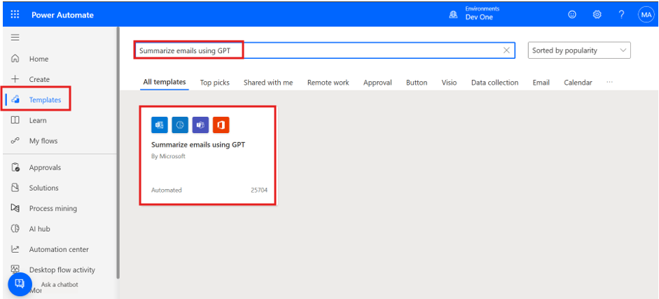

Laboratorio 07 - Cree un Flow para redirigir los Helpdesk Requests a
diferentes Mailboxes basado en el idioma

**Objetivo:** El objetivo de este laboratorio es guiar a los
participantes en el proceso de crear un Power Automate flow que redirige
los helpdesk requests a diferentes mailboxes basado en language
detection. El flow integra con las capacidades GPT para resumir los
emails entrantes y automatizar el routing process en función de triggers
específicos, ayudando a agilizar los communication workflows dentro de
la organización.

**Duración estimada:** 15 minutos

Tarea 1: Cree un flow para redirigir los Helpdesk requests a diferentes
mailboxes basado en el idioma

1.  Inicie sesión en
    +++\*\*[*https://make.powerautomate.com/using\*\*+++*](https://make.powerautomate.com/using**+++) **office
    365 admin tenant account**.

2.  Seleccione **Templates** desde el panel izquierdo,
    tecle +++**Summarize emails using GPT**+++ en el search box en la
    parte superior y seleccione el flow cuando aparece.

> 

3.  A continuación, el template le muestra cuáles conexiones será usados
    en este flow. Si no tienen un signo de verificación a su lado,
    arregle la conexión al seleccionar 'Sign in' junto a la conexión y
    seleccione **Continue**.

> 

4.  Seleccione el trigger, **when a new email arrives (V3).** Se abre el
    panel properties desde la parte izquierda con una nota para
    actualizar el Subject Filter parameter. De momento, el **Subject
    filter** es AI Builder.

5.  Actualice el subject filter a **Project Kick-off**.

> 

6.  Seleccione el **Create text with a GPT using a prompt** action para
    el properties panel para que abra en la parte izquierda. En el
    properties panel, el Prompt field muestra **AI Summarize**.

7.  Seleccione **Test prompt** para abrir los Prompt settings.

> 

8.  El template tiene un prompt predefinido que el GPT usará, pero puede
    actualizar y probar un nuevo prompt en esta ventana. Siga el
    siguiente paso para actualizar el prompt.

9.  Para probar un prompt, introduzca el siguiente sample data en la
    sección **Input**. Luego seleccione **Test prompt** en la parte
    inferior de la sección Prompt. Puede ver la respuesta en el Prompt
    response section.

> +++Once upon a time in the quaint town of Eldoria, nestled between
> rolling hills and dense forests, lived a young girl named Elara. Her
> days were spent exploring the mystical woods that bordered the town,
> and whispers of ancient tales filled her imagination.+++
>
> 

10. Para este ejercicio, dejaremos todo como es cuando abrimos los
    Prompt Settings.

11. **Guarde** el flow en la esquina superior derecha. Ahora podemos ver
    el flow.

Ojo: Ignore su ve esta alerta: The 'Create text with GPT using a prompt'
action doesn't have a content approval action after it.

**Tarea 2: Pruebe el flow**

1.  Mande un email desde el tenant id del MOD Admin o su propio email id
    a tenant id del MOD Admin con el subject **Project Kick-off** y
    continuando en el body del email:

> Dear Team,
>
>     I hope this email finds you well. We are excited to announce the
>     kick-off of our new project, "Phoenix". The initial meeting is scheduled
>     for Monday, June 1st, at 10 AM via Zoom. Please come prepared with any
>     questions or suggestions. Your input is vital for the project's success.
>
>     Kindly confirm your attendance by the end of the day tomorrow. Looking
>     forward to a productive session and a successful project launch.
>
>     Best regards,
>
>     Miriam Graham
>
>     Project Manager
>
>     Contoso

2.  Recibirá un mensaje en Teams con el resumen del email. En la esquina
    inferior deecha, puede encontrar un enlace para ir a su flow.

> 

3.  Este unit usa un GPT para resumir los emails entrantes. AI detection
    information puede ser incorrecto. Asegúrese siempre de verificar la
    información del GPT.

Conclusión:

En este laboratorio, los participantes crearon con éxito un flujo de
Power Automate para agilizar las helpdesk requests mediante el
enrutamiento de emails en función de la detección de idioma y el uso de
GPT para resumir el contenido. Al integrar la automatización en el flujo
de trabajo del email, el laboratorio demostró cómo gestionar de forma
eficiente la comunicación entre varios equipos o departamentos en
función de los triggers del idioma. El ejercicio también mostró cómo
usar GPT dentro de Power Automate para mejorar la productividad y
reducir la clasificación manual. Esta solución ayuda a las
organizaciones a mejorar la eficiencia del flujo de trabajo y reducir el
tiempo de respuesta a las consultas del servicio de asistencia técnica.
