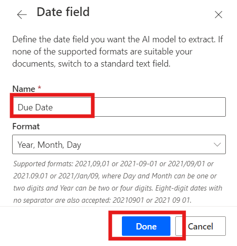
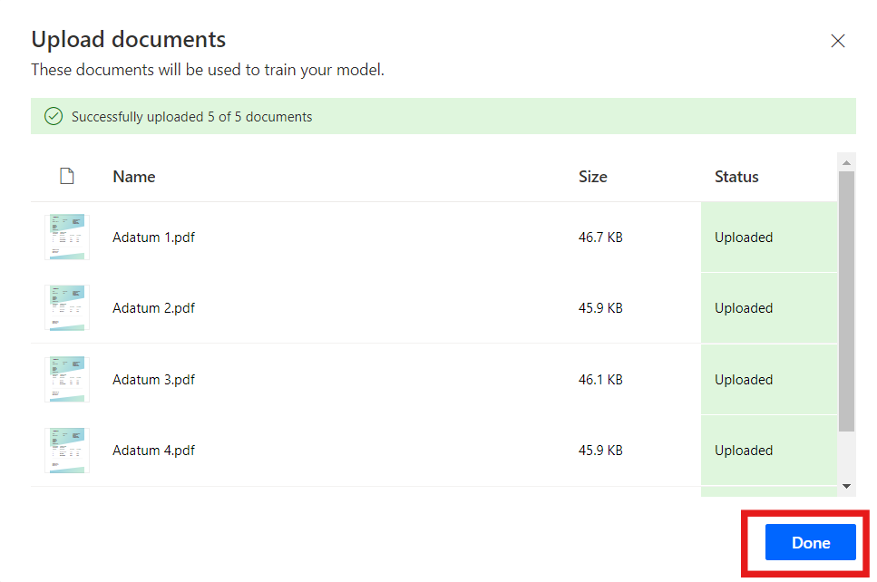
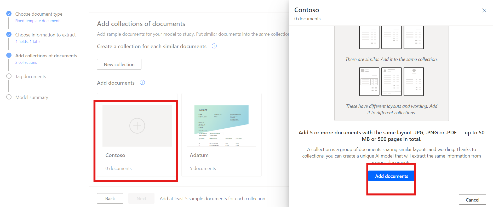
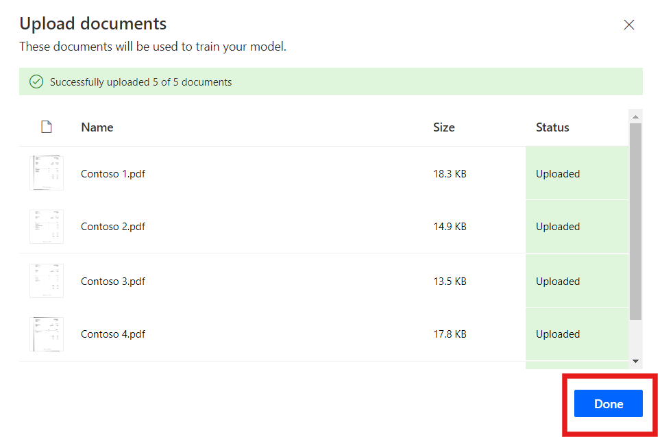
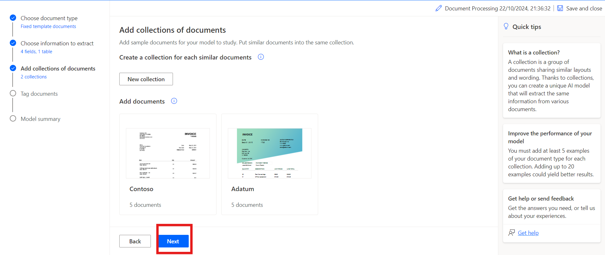
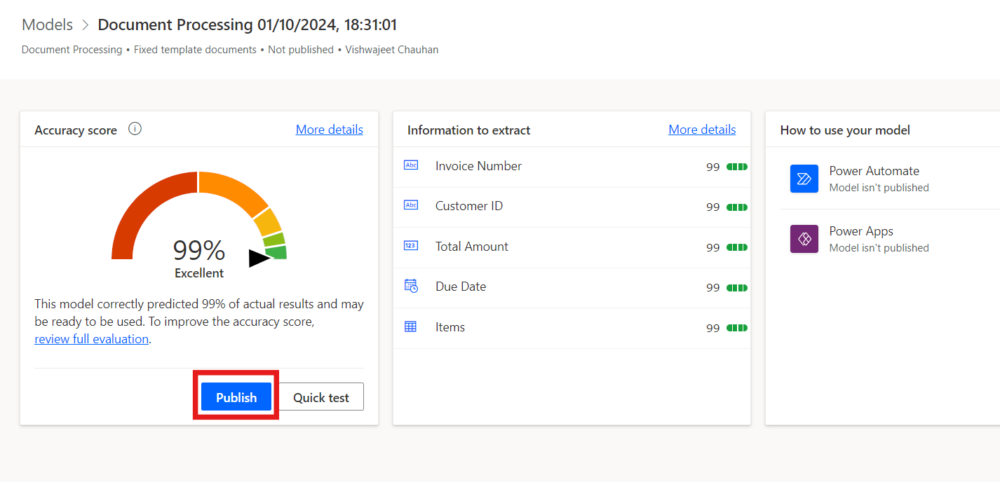
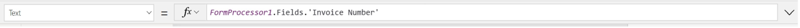
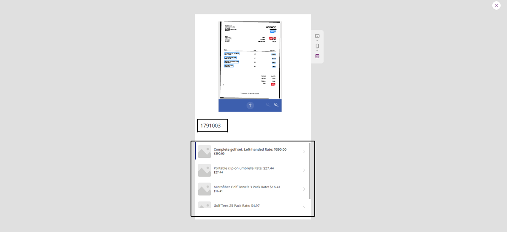

Laboratorio 8 – Procese documentos personalizados con AI builder

**Objetivo:** El objetivo de este laboratorio es guiar a los
participantes en crear su primer modelo AI con AI Builder en Power
Automate. Se le entrenará el modelo para extraer imformación
personalizada como números de invoice, IDs de clientes, importes
totales, fechas límites desde documentos como invoices. Los
participantes aprenderán a acceder a AI Builder, elegir tipos de
documentos, definir campos para extraer, subir documentos para el
entrenamiento y, por fin, integrar el trained model con Power Automate y
Power Apps.

**Duración estimada:** 45 minutos

Ejercicio 1: Cree su primer modelo

Tarea 1: Inicie sesión en AI Builder

1.  Navegue a power automate en
    +++\*\*[*https://make.powerautomate.com/\*\*+++*](https://make.powerautomate.com/**+++) y
    si le pide, inicie sesión en su office 365 admin tenant account.

2.  Seleccione el environment **Dev one** desde la barra superior.

> 

3.  Navegue al panel izquierdo y seleccione **AI Hub**, y haga clic
    en **AI Models.** Si no ve AI Hub, haga clic en **More** para
    localizarlo.

> 

4.  Elija la opción **Extract custom information from documents**.

> 

5.  Baje y haga clic en **Create custom model** para continuar.

> 

Tarea 2: Elija el tipo de documento

1.  Cuando elija el document type, tiene tres opciones:

    - **Fixed template documents:** Esta opción es ideal cuando, para un
      diseño determinado, los campos, tablas, casillas de verificación y
      otros elementos se pueden encontrar en lugares similares. Puede
      enseñar a este modelo a extraer datos de documentos estructurados
      que tienen diferentes diseños. Este modelo tiene un tiempo de
      entrenamiento rápido.

    - **General documents:** Esta opción es ideal para cualquier tipo de
      documento, especialmente cuando no hay una estructura establecida
      o cuando el formato es complejo. Puede enseñar a este modelo a
      extraer datos de documentos estructurados o no estructurados que
      tienen diferentes diseños. Este modelo es potente pero tiene un
      largo tiempo de entrenamiento.

    - **Invoices:** Invoice documents son standard account payable
      forms. Este tipo de modelo viene con campos estándar, y puede
      enseñar a este modelo a extraer datos personalizados adicionales o
      actualizar los datos estándar.

2.  Seleccione Fixed template documents y haga clic en **Next**.

> 

Tarea 3: Elija la información para extraer

Define los campos y las tablas que quiere que extraiga el modelo.
Extraeremos los siguientes campos:

- Invoice number

- Customer ID

- Total amount

- Due date

1.  Haga clic en **+** **Add** y seleccione el campo Text, y haga clic
    en **Next**.

> 
>
> 

2.  Introduzca el text field name como +++**Invoice Number**+++ y
    seleccione **Done**. Repita este paso para **Customer** **ID**.

> 

3.  Haga clic en **+ Add** y seleccione +++**Number field**+++, y haga
    clic en Next.

> 
>
> 

4.  Introduzca el number field name como +++**Total amount**+++ y
    seleccione **Done**.

> 

5.  Haga clic en **+ Add** y seleccione Date field (preview).

> 
>
> 

6.  Introduzzca el date field name como **Due Date** y
    seleccione **Done**.

> 

7.  Para extraer los detalles de la tabla del invoice, crearemos una
    tabla llamada Items con columnas Description y Item total. Para
    hacerlo, haga clic en**+ Add** y seleccione **Table**.

> 

8.  Seleccione **Table** y haga clic en **Next**.

> 

9.  Define el table name como **Items**.

10. Seleccione Column1 y renómbrelo como Description, y haga clic en
    Confirm.

11. Haga clic en **+ New column**, introduzca el column name como Item
    total, y seleccione Add. Por fin, haga clic en **Done**.

> 

12. Haga clic en **Next** para continuar con el siguiente paso en su
    modelo.

> 

Tarea 4: Define los collections y suba los documentos

Define los collections y suba documentos. Un collection agrupa los
documentos con el mismo layout. Cree un collection para cada layout
único que su modelo debe procesar. Ya que hay dos invoice providers
mediante dos diferentes templates, crearemos dos collections.

1.  Haga clic en **New collection** y renombre el primer collection
    a **Adatum**.

2.  Agregue otro **New collection** y renómbrelo **Contoso**.

> 

3.  Haga clic en el Adatum y luego haga clic en Add document. Seleccione
    My device, para **Adatum**, suba cinco documentos que son
    disponibles en la carpeta **C:\Lab Files\AI Builder Document
    Processing Sample Data\Invoices\Adatum\Train**.

> 
>
> 

4.  Haga clic en **Upload 5 document** y haga clic en **Done**.

> 
>
> 

5.  Haga clic en Contoso y luego en Add document. seleccione My device,
    para **Contoso**, suba los cinco documentos desde la
    carpeta **C:\Lab Files\AI Builder Document Processing Sample
    Data/Contoso /Train**.

> 
>
> 

6.  Haga clic en **Upload 5 document** y luego haga clic en **Done**.

> 
>
> 

7.  Después de subir los sample documents a cada collection,
    seleccione **Next** para continuar.

> 

Tarea 5: Etiquete los documentos

Empiece a enseñar su AI model a extraer los campos y tablas al etiquetar
los sample documents que ha subido. Como etiqueta los campos en cada
documento, aparece un check sobre aquel documento, y desaparece el punto
rojo en la esquina superior.

1.  Seleccione el **Contoso** collection desde el panel derecho para
    empezar a etiquetar.

> 

2.  **Tag Fields:**

- Comience etiquetando campos como **Invoice Number,** **Due date, and
  Total amount.**

- Dibuje un rectángulo alrededor de cada campo del documento y, a
  continuación, seleccione el nombre de campo correspondiente.

- Cambie el tamaño de su selección si es necesario. Al pasar el cursor
  sobre las palabras, se mostrarán cuadros de color azul claro, que
  indican dónde puede dibujar rectángulos.

> 
>
> 
>
> 

3.  Field o Table No en el documento:

- Si no está un campo o tabla, como el Customer ID en el Contoso
  collection, seleccione los tres puntos **(…)** junto al campo en el
  panel derecho y elija **Not available in the document**.

> 

4.  Tag Tables:

    - Dibuje un rectángulo alrededor de la tabla que desea etiquetar y
      seleccione el nombre de la tabla.

    - Dibuje filas haciendo clic con el botón izquierdo entre los
      separadores de filas.

    - Dibuje columnas pulsando Ctrl + clic izquierdo (o ⌘ clic izquierdo
      en macOS).

    - Asigne los headers al seleccionar la columna de header y mapearlo
      a la que quiere.

    - Si ha etiquetado el header de la tabla, seleccione Ignore first
      row para impedir que sea extraido como contenido.

> 
>
> 
>
> 

5.  Etiquete los cinco documentos con el mismo proceso. Una vez que ha
    etiquetado un documento, siga al siguiente con las flechas de
    navegación en la esquina superior derecha del document preview.

> 

6.  Now select the **Adatum** Collection.

> 

7.  **Tag Fields:**

    - Empiece a etiquetar los campos como **Invoice Number, Customer ID
      y Total amount.**

    - Dibuje un rectángulo alrededor de cada campo del documento y, a
      continuación, seleccione el nombre de campo correspondiente.

    - Cambie el tamaño de su selección si es necesario. Al pasar el
      cursor sobre las palabras, se mostrarán cuadros de color azul
      claro, que indican dónde puede dibujar rectángulos.

> 
>
> 
>
> 

8.  Vaya a la opción **Due Date** y seleccione **Not available in
    collection.**

> 

9.  Tag Tables:

    - Dibuje un rectángulo alrededor de la tabla que desea etiquetar y
      seleccione el nombre de la tabla.

    - Dibuje filas haciendo clic con el botón izquierdo entre row
      separators.

    - Dibuje columnas pulsando Ctrl + clic izquierdo (o ⌘ clic izquierdo
      en macOS).

    - Asigne los headers seleccionando la columna de header y
      asignándola a la deseada.

    - Si ha etiquetado el encabezado de la tabla, seleccione Omitir la
      primera fila para impedir que se extraiga como contenido.

> 
>
> 
>
> 
>
> 

10. Etiquete los cinco documentos con el mismo proceso. Una vez que
    hayas etiquetado un documento, pasa al siguiente usando las flechas
    de navegación en la parte superior derecha del document preview.

Tarea 6: Model summary y train

1.  Seleccoine el botón **Next** en la parte inferior de la pantalla.

> 

2.  Revise el **Model summary**. En Information to extract verá que el
    Customer ID y Due Date aparecieron en solo cinco ejempolos
    de **10**, mientras todo el resto apareció solo en 10 ejemplos.

3.  Si todo parece aceptable, seleccione **Train**.

> 

Ejercicio 2: Use su modelo

Tarea 1: Prueba rápida

1.  Una vez completado el entrenamiento, puede ver detalles importantes
    sobre el modelo recién entrenado en una página details.

> 

2.  Para ver su modelo en acción, seleccione **Quick test**.

> 

3.  Arrastre y suelte o cargue una imagen desde su dispositivo para
    probarla. A partir de los datos de ejemplo anteriores, utilice los
    archivos de las carpetas Test que no usábamos para entrenar (o desde
    AI Builder Document processing Sample Data\Adatum\Test o AI Builder
    Document processing Sample Data\Contoso\Test).

4.  Ahora puede ver los campos detectados que eligió y los confidence
    scores asociadas para recuperar los campos individuales en
    comparación con el modelo entrenado.

> 

Tarea 2: Publique su modelo

1.  Su modelo no se puede usar hasta que lo publique. Si está satisfecho
    con su modelo, seleccione **Publish** para hacerlo disponible para
    su uso.

> 

Tarea 3: Use su modelo en Power Apps

Ahora que su modelo está publicado, puede usar su Document processing
model en un canvas app. Hay un componente especial disponible para que
lo agregue que analiza cualquier imagen y extrae el texto en función de
su modo de procesamiento de documentos entrenado.

1.  Desde
    \<[*https://make.powerautomate.com/*](https://make.powerautomate.com/),
    seleccione **AI Hub**, y seleccione su modelo en Recently Created.

> 

2.  Seleccione **Use model**.

> 

3.  Seleccione **Build intelligent apps** para empezar la experiencia de
    la creación de canvas app.

> 

4.  Dentro de su canvas app, se añade un **Form processor
    component** automáticamente y se vincula a su Document processing
    model publicado.

> **Ojo:** si quiere añadir más modelos IA a la aplicación, seleccione
> Insert y luego seleccione Form processor para añadir Form processor
> component. A continuación, seleccione el AI model property desde el
> panel derecho de properties. Aparece una lista de modelos IA para
> seleccionar. Aparecen solo os modelos publicados en la lista dropdown.
>
> 

5.  A continuación, seleccionamos los campos para mostrar desde el
    invoice. Seleccione **Insert** y agregue un **Label** component.

6.  Con el label seleccionado, asegúrese de que está seleccionado
    el **Text** property en la esquina superior izquierda. En el formula
    bar, escriba FormProcessor1.Fields. Este código también le da acceso
    a las otras propiedades del modelo. Para este ejercicio, elegimos
    Invoice Number. El resultado se parece a esta imagen.

> 
>
> **Note:** Notice how 'Invoice Number' is in single quotes in the
> previous image. This is because when the Invoice Number column was
> created, the column name was created with a space in between the
> words. If your columns weren't created with spaces, you don't need the
> single quotes and your code may look like this image instead.
>
> 

7.  A continuación, agreguemos un gallery para que podamos ver los datos
    de los elementos del invoice. Seleccione **Insert** y
    luego **Vertical Gallery**.

8.  En el Items property del gallery,
    escriba: FormProcessor1.Tables.Items

> 

9.  Seleccione **Play** en la esquina superior derecha del Power Apps
    studio para previsualizar la aplicación.

10. Seleccione **Analyze** y luego seleccione la imagen que usó para la
    prueba rápida anteriormente.

> 

11. Un preview del documento muestra el **Invoice Number** y los
    elementos del invoice.

> 

Conclusión:

A finales de este laboratorio, los participantes habrán construido y
entrenado con éxito un modelo de IA personalizado capaz de extraer
campos de datos específicos de los documentos. Habrán probado el modelo
con datos del mundo real, lo habrán integrado en flujos de trabajo
automatizados dentro de Power Automate y lo habrán usado dentro de una
aplicación de lienzo en Power Apps. Este laboratorio demuestra cómo se
pueden utilizar los modelos de IA para automatizar el procesamiento de
documentos y agilizar las tareas empresariales, proporcionar experiencia
práctica en aprovechar AI Builder para intelligent automation.
