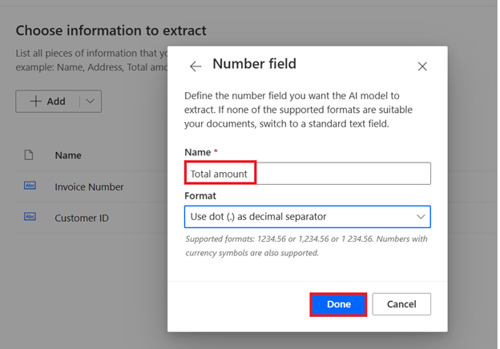
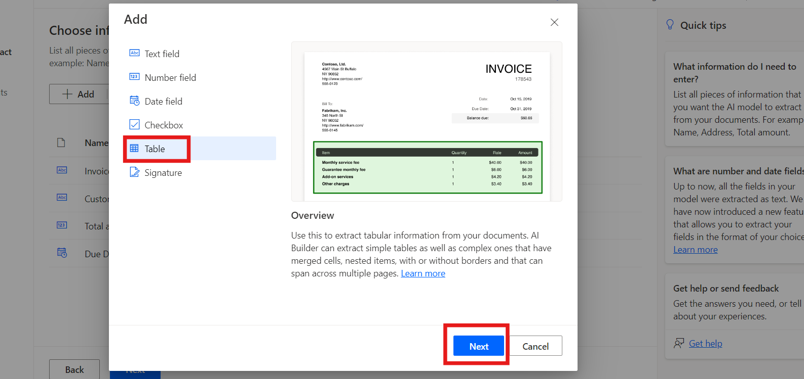
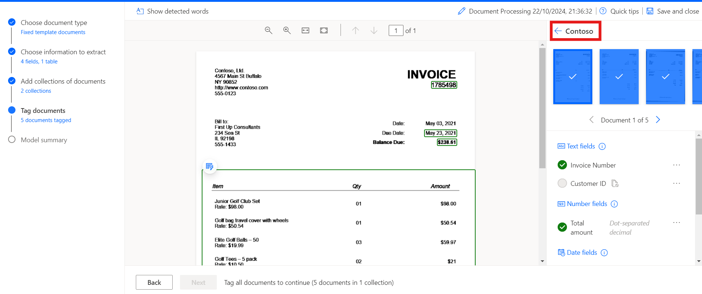
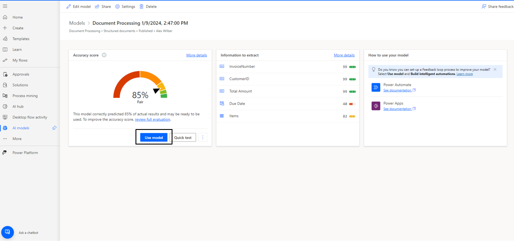

# Laboratório 8 - Processar documentos personalizados com o AI Builder

**Objetivo**: o objetivo deste laboratório é orientar os participantes
na criação de seu primeiro modelo de AI usando o AI Builder no Power
Automate. O modelo será treinado para extrair informações
personalizadas, como números de faturas, IDs de clientes, valores totais
e datas de vencimento, de documentos como faturas. Os participantes
aprenderão como fazer login no AI Builder, escolher tipos de documentos,
definir campos para extração, carregar documentos para treinamento e,
finalmente, integrar o modelo treinado ao Power Automate e ao Power
Apps.

**Tempo estimado:** 45 minutos

## Exercício 1: Crie seu primeiro modelo

### Tarefa 1: Faça login no AI Builder

1.  Navegue até o Power Automate com a ajuda de
    +++**https://make.powerautomate.com/**+++ faça login usando a conta
    de administrador locatário do Office 365.

2.  Selecione o ambiente **Dev one** na barra superior.

- 

3.  Navegue até o painel esquerdo e selecione **AI Hub**, depois clique
    em **AI Models**. Se não visualizar **AI Hub**, clique em **More**
    para localizá-lo.

- 

4.  Escolha a opção **Extract custom information from documents**.

- 

5.  Role para baixo e clique em **Create custom model** para continuar.

- 

### Tarefa 2: Escolher o tipo de documento

1.  Ao escolher o tipo de documento, você tem três opções:

    - **Fixed template documents:** esta opção é ideal quando, para um
      determinado layout, os campos, tabelas, caixas de seleção e outros
      itens podem ser encontrados em locais similares. Você pode treinar
      este modelo para extrair dados de documentos estruturados que
      tenham layouts diferentes. Este modelo possui um tempo de
      treinamento rápido.

    - **General documents:** esta opção é ideal para qualquer tipo de
      documento, especialmente quando não há uma estrutura definida ou
      quando o formato é complexo. Você pode treinar este modelo para
      extrair dados de documentos estruturados ou não estruturados que
      tenham layouts diferentes. Este modelo é poderoso, porém possui um
      tempo de treinamento longo.

    - **Invoices:** documentos de fatura são formulários padrão de
      contas a pagar. Este tipo de modelo já vem com campos padrão, e
      você pode treinar este modelo para extrair dados personalizados
      adicionais ou atualizar os dados padrão.

2.  Selecione Fixed template documents e clique em **Next**.

- 

### Tarefa 3: Escolha as informações a serem extraídas

Defina os campos e tabelas que você quer que seu modelo extraia. Vamos
extrair os seguintes campos:

- Invoice number
- Customer ID
- Total amount
- Due date

1.  lique em **+ Add** e selecione Text field, depois clique em
    **Next**.

- 

  

2.  Digite o nome do text field como +++**Invoice Number**+++ e
    selecione **Done**. Repita este passo para **Customer** **ID**.

- 

3.  Clique em **+ Add** e selecione **+++Number field+++**, depois
    clique em Next.

- 

  

4.  Digite o nome do number field como +++**Total amount**+++ e
    selecione **Done**.

- 

5.  Clique em **+ Add** e selecione Date field (preview).

- 

  

6.  Digite o nome do date field como **Due Date** e selecione **Done**.

- 

7.  Para extrair os detalhes da tabela invoice, vamos criar uma tabela
    chamada Items com as colunas Description e Item total. Para isso,
    clique em **+ Add** e selecione **Table**.

- 

8.  Selecione **Table** e clique **Next**.

- 

9.  Defina o nome da tabela como **Items**.

10. Selecione Column1 e renomeie para Description, depois clique em
    Confirm.

11. Clique em **+ New column**, digite o nome da coluna como Item total,
    selecione Add e, por fim, clique em **Done**.

- 

12. Clique em **Next** para prosseguir para a próxima etapa no seu
    modelo.

- 

### Tarefa 4: Definir collections e enviar documentos

Defina collections e envie documentos. Uma collection agrupa documentos
com o mesmo layout. Crie uma collection para cada layout único que seu
modelo precisa processar. Como existem dois fornecedores de invoice
usando templates diferentes, vamos criar duas collections.

1.  Clique em **New collection** e renomeie a primeira collection para
    **Adatum**.

2.  Adicione outra **New collection** e nomeie como **Contoso**.

- 

3.  Clique em Adatum e depois clique em Add document. Então selecione My
    device. Para **Adatum**, envie os cinco documentos que estão
    disponíveis na pasta \*\*C:FilesBuilder Document Processing Sample
    Data\*.

- 

  

4.  Clique em **Upload 5 documents** e depois clique em **Done**.

- 

  

5.  Clique em Contoso e depois em Add document. Em seguida, selecione My
    device. Para **Contoso**, faça o upload dos cinco documentos da
    pasta **C:Files Builder Document Processing Sample Data/Contoso
    /Train**.

- 

  

6.  Clique em **Upload 5 document** e depois clique em **Done**.

- 

  

7.  Após fazer o upload dos documentos de exemplo para cada coleção,
    selecione **Next** para continuar.

- 

### Tarefa 5: Rotular documentos

Comece a ensinar ao seu modelo de AI como extrair os campos e tabelas,
rotulando os documentos de amostra que você carregou. À medida que você
rotula os campos esperados em cada documento, uma marca de verificação
aparecerá sobre esse documento e o ponto vermelho no canto superior
desaparecerá.

1.  Selecione a coleção **Contoso** no painel direito para começar a
    rotular.

- 

2.  **Campos de rotulagem:**

- Comece rotulando campos como **Invoice Number,** **Due date, and Total
  amount.**

- Desenhe um retângulo ao redor de cada campo no documento e selecione o
  nome do campo correspondente.

- Redimensione sua seleção, se necessário. Ao passar o mouse sobre as
  palavras, serão exibidas caixas azuis claras, indicando onde você pode
  desenhar retângulos.

&nbsp;

- 

  

  

3.  Campo ou tabela não presente no documento:

- Se um campo ou tabela não estiver presente, como o ID do cliente na
  coleção Contoso, selecione os três pontos (...) ao lado do campo no
  painel direito e escolha **Not available in the document**.

&nbsp;

- 

4.  Tabelas de rótulos:

    - Desenhe um retângulo ao redor da tabela que deseja marcar e
      selecione o nome da tabela.

    - Desenhe linhas clicando com o botão esquerdo do mouse entre os
      separadores de linha.

    - Desenhe colunas pressionando Ctrl + clique com o botão esquerdo do
      mouse (ou ⌘ clique com o botão esquerdo do mouse no macOS).

    - Atribua os cabeçalhos selecionando a coluna do cabeçalho e
      mapeando-a para a desejada.

    - Se você rotulou o cabeçalho da tabela, selecione Ignorar primeira
      linha para evitar que ele seja extraído como conteúdo.

- 

  

  

5.  Rotule todos os cinco documentos com o mesmo processo. Depois de
    rotular um documento, passe para o próximo usando as setas de
    navegação no canto superior direito da visualização do documento.

- 

6.  Agora selecione **Adatum** Collection.

- 

7.  **Campos de rotulagem:**

    - Comece rotulando campos como **Invoice Number, Customer ID and
      Total amount.**

    - Desenhe um retângulo ao redor de cada campo no documento e
      selecione o nome do campo correspondente.

    - Redimensione sua seleção, se necessário. Ao passar o mouse sobre
      as palavras, serão exibidas caixas azuis claras, indicando onde
      você pode desenhar retângulos.

- 

  

  

8.  Vá até a opção **Due Date** e selecione **Not available in
    collection.**

- 

9.  Tabelas de rótulos:

    - Desenhe um retângulo ao redor da tabela que deseja marcar e
      selecione o nome da tabela.

    - Desenhe linhas clicando com o botão esquerdo do mouse entre os
      separadores de linha.

    - Desenhe colunas pressionando Ctrl + clique com o botão esquerdo do
      mouse (ou ⌘ clique com o botão esquerdo do mouse no macOS).

    - Atribua os cabeçalhos selecionando a coluna do cabeçalho e
      mapeando-a para a desejada.

    &nbsp;

    - Se você rotulou o cabeçalho da tabela, selecione Ignorar primeira
      linha para evitar que ele seja extraído como conteúdo.

- 

  

  

  

10. Marque todos os cinco documentos com o mesmo processo. Depois de
    marcar um documento, passe para o próximo usando as setas de
    navegação no canto superior direito da visualização do documento.

### Tarefa 6: Resumo do modelo e treinamento

1.  Selecione o botão **Next** na parte inferior da tela.

- 

2.  Revise o **Model summary**. Em Information to extract, você verá que
    Customer ID e Due Date apareceram apenas em cinco exemplos de um
    total de **10**, enquanto os demais campos apareceram em todos os 10
    exemplos.

3.  Se tudo estiver correto, selecione **Train**.

- 

## Exercise 2: Use your model

### Tarefa 1: Teste rápido

1.  Depois que seu modelo concluir o treinamento, você poderá visualizar
    detalhes importantes sobre o modelo recém-treinado em uma página de
    detalhes.

- 

2.  Para ver seu modelo em ação, selecione **Quick test**.

- 

3.  Arraste e solte ou carregue uma imagem do seu dispositivo para
    testar. A partir dos dados de amostra anteriores, use os arquivos
    das pastas Teste que não usamos para treinamento (seja dos Dados de
    amostra de processamento de documentos do AI Builder ou dos Dados de
    amostra de processamento de documentos do AI Builder).

4.  Agora você pode visualizar os campos detectados que escolheu e as
    pontuações de confiança associadas para recuperar os campos
    individuais em comparação com o modelo treinado.

- 

### Tarefa 2: Publicar seu modelo

1.  Seu modelo não pode ser usado até que você o publique. Se estiver
    satisfeito com seu modelo, selecione **Publish** para
    disponibilizá-lo para uso.

- 

### Tarefa 3: Use seu modelo no Power Apps

Agora que seu modelo está publicado, você pode usar seu modelo de
processamento de documentos em um aplicativo canvas. Um componente
especial está disponível para você adicionar, que analisa qualquer
imagem e extrai o texto com base no seu modo de processamento de
documentos treinado.

1.  No  \<https://make.powerautomate.com/, selecione **AI Hub**, e
    selecione seu modelo em Recently Created.

- 

2.  Selecione **Use model**.

- 

3.  Selecione **Build intelligent apps** para iniciar a criação do
    aplicativo no canvas.

- 

4.  Dentro do seu aplicativo canvas, um **componente Form processor** é
    adicionado automaticamente e vinculado ao seu modelo de Document
    processing publicado.

- > **Observação:** Se você quiser adicionar modelos de AI adicionais ao
  > aplicativo, selecione Insert e depois Form processor para adicionar
  > um novo componente Form processor. Em seguida, selecione a property
  > AI model no painel de propriedades à direita. Uma lista com os
  > modelos de AI disponíveis será exibida para seleção. Somente os
  > modelos publicados aparecerão na lista suspensa.

  

5.  Em seguida, vamos selecionar qual campo da fatura será exibido.  
    Selecione **Insert** e depois adicione um componente **Label**.

6.  Com o Label selecionado, verifique se a propriedade **Text** está
    selecionada no canto superior esquerdo. Na barra de fórmulas,
    escreva FormProcessor1.Fields. Esse código dá acesso às outras
    propriedades do modelo. Para este exercício, escolhemos Invoice
    Number. O resultado ficará semelhante à imagem exibida.

- 

  > **Observação:** note que ‘Invoice Number’ está entre aspas simples
  > na imagem anterior. Isso acontece porque, ao criar a coluna Invoice
  > Number, o nome foi criado com um espaço entre as palavras. Se as
  > suas colunas não tiverem espaços, você não precisa usar aspas
  > simples, e seu código pode se parecer com o da outra imagem.

  

7.  Agora, vamos adicionar uma galeria para visualizar os dados dos
    itens da fatura.  
    Selecione **Insert** e depois **Vertical Gallery**.

8.  Na propriedade Items da galeria,
    escreva: FormProcessor1.Tables.Items

- 

9.  Selecione **Play** no canto superior direito do estúdio do Power
    Apps para visualizar uma prévia do aplicativo.

10. Selecione **Analyze** e, em seguida, selecione a imagem que você
    usou no teste rápido anteriormente.

- 

11. Uma pré-visualização do seu documento exibirá o **Invoice Number** e
    os itens da fatura.

- 

### Conclusão:

Ao final deste laboratório, os participantes terão criado e treinado com
sucesso um modelo de AI personalizado capaz de extrair campos de dados
específicos de documentos. Eles terão testado o modelo com dados do
mundo real, integrado-o a fluxos de trabalho automatizados no Power
Automate e usado-o em um aplicativo canvas no Power Apps. Este
laboratório demonstra como os modelos de AI podem ser usados para
automatizar o processamento de documentos e otimizar tarefas comerciais,
proporcionando experiência prática no uso do AI Builder para automação
inteligente.

.
