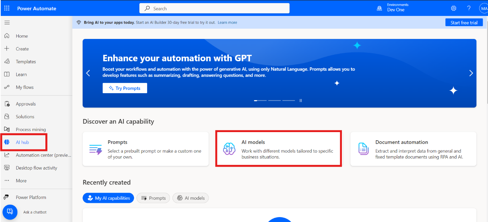
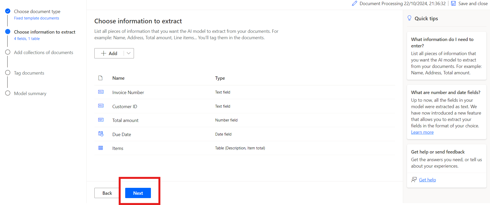
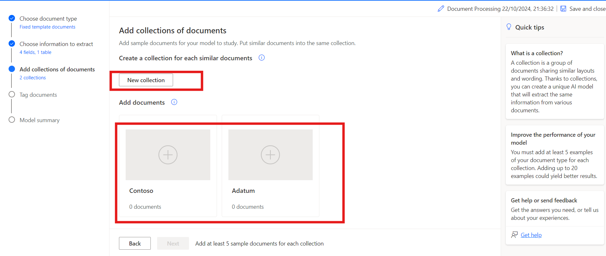
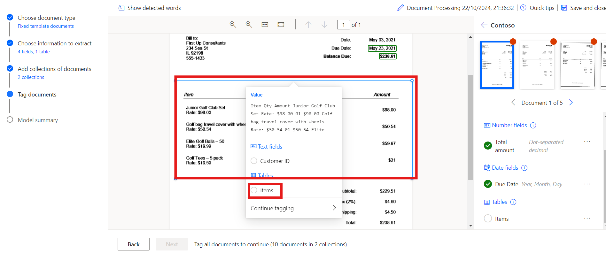
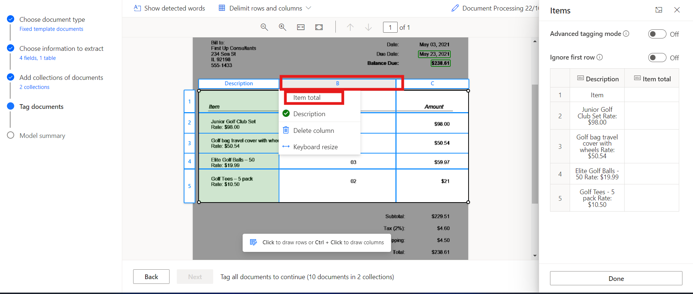
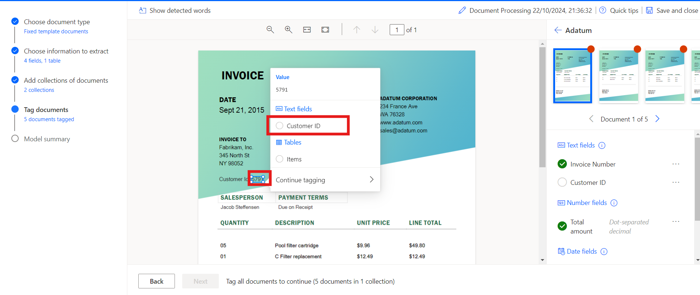

# 實驗 8 - 使用 AI Builder 處理自定義文檔

**目標：** 本實驗室的目標是指導參與者使用 Power Automate 中的 AI Builder
創建他們的第一個 AI
模型。該模型將經過訓練，可以從發票等文檔中提取自定義信息，例如發票編號、客戶
ID、總金額和到期日期。參與者將學習如何登錄 AI
Builder、選擇文檔類型、定義要提取的字段、上傳文檔進行培訓，最後將經過訓練的模型與
Power Automate 和 Power Apps 集成。

**預計時間：** 45 分鐘

## 練習 1：創建您的第一個模型

### 任務 1：登錄到 AI Builder

1.  在 **+++https://make.powerautomate.com/+++** 的幫助下導航到 Power
    Automate，如果出現提示，請使用 Office 365 管理員租戶帳戶登錄。

2.  從頂部欄中選擇環境 **Dev one**。

- 

3.  導航到左側窗格並選擇 **AI Hub**，然後單擊 **AI Models。**
    如果您沒有看到 AI Hub，請單擊 **More** 以找到它。

- 

4.  選擇 **Extract custom information from documents** 選項。

- 

5.  向下滾動並單擊 **Create custom model** 繼續。

- 

### 任務 2：選擇文檔類型

1.  選擇文檔類型時，您有三個選項:

    - **固定模板文檔：**
      對於給定佈局，字段、表格、複選框和其他項目可以在類似位置找到，則此選項是理想的選擇。您可以教此模型從具有不同佈局的結構化文檔中提取數據。此模型的訓練時間較短。

    - **常規文檔：**
      此選項非常適合任何類型的文檔，尤其是在沒有固定結構或格式複雜時。您可以教此模型從具有不同佈局的結構化或非結構化文檔中提取數據。這個模型很強大，但訓練時間很長。

    - **發票：**
      發票單據是標準的應付帳款格式。此模型類型帶有標準字段，您可以教此模型提取其他自定義數據或更新標準數據。

&nbsp;

1.  選擇 Fixed template documents，然後單擊 **Next**。

- 

### 任務 3：選擇要提取的信息

定義您希望模型提取的字段和表。我們將提取以下字段:

- 發票編號
- 客戶 ID
- 總量
- 期限

1.  單擊 **+ Add** 並選擇 文本字段，然後單擊 **Next**。

- 

  

2.  將文本字段名稱輸入為 **+++Invoice Number+++**，然後選擇 完成。對
    **Customer ID** 重複此步驟。

- 

3.  單擊 **+ Add** 並選擇 **+++ Number field+++**，然後單擊 Next。

- 

  

4.  將數字字段名稱輸入為 **+++Total amount+++**，然後選擇 **Done。**

- 

5.  單擊 **+ Add** ，然後選擇 日期字段（預覽）。

- 

  

6.  將日期字段名稱輸入為 **Due Date**，然後選擇 **Done**。

- 

7.  要從發票中提取表詳細信息，我們將創建一個名為 Items 的表，其中包含
    Description 和 Item total 列。為此，請單擊 **+ Add** 並選擇
    **Table**。

- 

8.  選擇 **Table** 並單擊 **Next**。

- 

9.  將表名稱定義為 **Items**。

10. 選擇 Column1 並將其重命名為 Description，然後單擊 Confirm。

11. 單擊 **+ New column**，輸入列名稱作為 Item total，然後選擇
    添加。最後，點擊 **Done**。

- 

12. 單擊 **Next** 繼續執行模型中的下一步。

- 

### 任務 4：定義集合並上傳文檔

定義集合並上傳文檔。集合對具有相同佈局的文檔進行分組。為模型需要處理的每個唯一佈局創建一個集合。由於有兩個發票提供商使用不同的模板，因此我們將創建兩個產品系列。

1.  單擊 **New collection** 並將第一個集合重命名為 **Adatum**。

2.  添加另一個 **New collection** 並將其命名為 **Contoso**。

- 

3.  單擊 **Adatum**，然後單擊 Add document。然後選擇 我的設備，對於
    Adatum，上傳 \*\*C：FilesBuilder Document Processing Sample Data\*
    文件夾中可用的五個文檔。

- 

  

4.  單擊 **Upload 5 document**，然後單擊 **Done**。

- 

  

5.  單擊 Contoso，然後單擊 Add document。然後選擇“我的設備，對於
    **Contoso**”，從 **C：Files Builder Document Processing Sample
    Data/Contoso /Train** 文件夾中上傳五個文檔.

- 

  

6.  單擊 **Upload 5 document**，然後單擊 **Done**。

- 

  

7.  將示例文檔上傳到每個集合後，選擇 **Next** 繼續。

- 

### 任務 5：標記文檔

通過標記您上傳的示例文檔，開始教您的 AI
模型如何提取字段和表。當您在每個文檔中標記預期字段時，該文檔上將出現一個複選標記，並且右上角的紅點將消失。

1.  從右側面板中選擇 **Contoso** 集合以開始標記。

- 

2.  **標記字段:**

- 首先標記 **Invoice Number、Due date 和 Total amount** 等字段**。**

- 在文檔中的每個字段周圍繪製一個矩形，然後選擇相應的字段名稱。

- 如果需要，請調整所選內容的大小。將鼠標懸停在單詞上將顯示淺藍色框，指示您可以繪製矩形的位置。

&nbsp;

- 

  

  

3.  域或表不在文檔中:

- 如果字段或表不存在，例如 Contoso 集合中的客戶 ID，請選擇省略號
  **（...）** ，然後選擇 **Not available in the document**。

&nbsp;

- 

4.  標記表:

    - 在要標記的表周圍繪製一個矩形，然後選擇表名稱。

    - 通過在行分隔符之間單擊鼠標左鍵來繪製行。

    - 按 Ctrl + 左鍵單擊（或在 macOS 上按 ⌘ 左鍵單擊）繪製列。

    - 通過選擇標題列並將其映射到所需的標題列來分配標題。

    - 如果您已標記表的標題，請選擇 Ignore first row
      以防止將其提取為內容。

- 

  

  

5.  使用相同的過程標記所有 5
    個文檔。標記文檔後，使用文檔預覽右上角的導航箭頭移動到下一個文檔。

- 

6.  現在選擇 **Adatum** 收集。

- 

7.  **標記字段:**

    - 首先標記 **Invoice Number、Customer ID 和 Total amount 等字段。**

    - 在文檔中的每個字段周圍繪製一個矩形，然後選擇相應的字段名稱。

    - 如果需要，請調整所選內容的大小。將鼠標懸停在單詞上將顯示淺藍色框，指示您可以繪製矩形的位置。

- 

  

  

8.  轉到 **Due Date** 選項，然後選擇 **Not available in collection**。

- 

9.  標記表:

    - 在要標記的表周圍繪製一個矩形，然後選擇表名稱。

    - 通過在行分隔符之間單擊鼠標左鍵來繪製行。

    - 按 Ctrl + 左鍵單擊（或在 macOS 上按 ⌘ 左鍵單擊）繪製列。

    - 通過選擇標題列並將其映射到所需的標題列來分配標題。

    - 如果您已標記表的標題，請選擇 Ignore first row
      以防止將其提取為內容。

- 

  

  

  

10. 使用相同的過程標記所有5個文檔。標記文檔後，使用文檔預覽右上角的導航箭頭移動到下一個文檔。

### 任務 6：模型摘要和訓練

1.  選擇 屏幕底部的 Next 按鈕。

- 

2.  查看 **Model summary**。在 Information to extract 下，您將看到
    Customer ID 和 Due Date 只出現在 **10** 個示例中的 5
    個中，而其他所有內容都出現在所有 10 個示例中。

3.  如果一切看起來都可以接受，請選擇 **Train** 。

- 

## 練習 2：使用模型

### 任務 1：快速測試

1.  模型完成訓練後，您可以在詳細信息頁面上查看有關新訓練模型的重要詳細信息。

- 

2.  要查看您的模型運行情況，請選擇 **Quick test**。

- 

3.  從您的設備拖放或上傳圖像以進行測試。在前面的示例數據中，使用我們未用於訓練的
    Test 文件夾中的文件（來自 AI Builder 文檔處理示例數據或 AI Builder
    文檔處理示例數據）。

4.  現在，您可以查看您選擇的檢測到的字段，以及用於檢索與經過訓練的模型相比的各個字段的相關置信度分數。

- 

### 任務 2：發佈模型

1.  在發佈模型之前，無法使用該模型。如果您對模型感到滿意，請選擇
    **Publish** 以使其可供使用。

- 

### 任務 3：在 Power Apps 中使用模型

現在，您的模型已發佈，您可以在畫布應用中使用 Document processing
模型。您可以添加一個特殊組件，該組件可分析任何圖像並根據您訓練的
Document processing 模式提取文本。

1.  從\<https://make.powerautomate.com/ 中，選擇 **AI Hub**，然後在
    Recently Created 下選擇您的模型。

- 

2.  選擇 **Use model**。

- 

3.  選擇 **Build intelligent apps **開始畫布應用創建體驗。

- 

4.  在您的畫布應用程序中，**Form processor
    component **會自動添加並鏈接到您發佈的文檔處理模型。

> > **注意：** 如果要向應用程序添加其他 AI 模型，請選擇 Insert，然後選擇
> > Form processor 以添加表單處理器組件。接下來，從右側屬性面板中選擇 AI
> > model 屬性。此時將顯示 AI
> > 模型列表以供選擇。下拉列表中僅顯示已發佈的模型。

- 

5.  接下來，我們從發票中選擇要顯示的字段。選擇 **Insert** ，然後添加
    **Label** 組件。

6.  選擇標簽後，確保在 左上角選擇 **Text** 屬性。在編輯欄中，寫入
    FormProcessor1.Fields。此代碼還允許您訪問模型中的其他屬性。在本練習中，我們選擇
    Invoice Number（發票編號）。結果看起來與此圖像類似。

- 

> > **注意：** 請注意上圖中 'Invoice Number'
> > 的單引號形式。這是因為在創建 Invoice Number
> > 列時，創建的列名稱在單詞之間有一個空格。如果您的列不是使用空格創建的，則不需要單引號，您的代碼可能類似於此圖像。

- 

7.  接下來，我們添加一個庫，以便我們可以查看發票項目中的數據。選擇
    **Insert** **，**然後選擇 **Vertical Gallery**。

8.  在庫的 Items 屬性中，寫入：FormProcessor1.Tables.Items

- 

9.  選擇 Power Apps Studio 右上角的 **Play** 預覽應用。

10. 選擇 **Analyze**，然後選擇您之前用於快速測試的圖像。

- 

11. 文檔預覽顯示 **Invoice Number** 和發票中的項目。

- 

### 結論：

在本實驗結束時，參與者將成功構建和訓練一個能夠從文檔中提取特定數據字段的自定義
AI 模型。他們將使用真實數據測試模型，將其集成到 Power Automate
中的自動化工作流中，並在 Power Apps
中的畫布應用程序中使用它。本實驗演示了如何使用 AI
模型來自動化文檔處理和簡化業務任務，提供了利用 AI Builder
實現智能自動化的實踐經驗。
