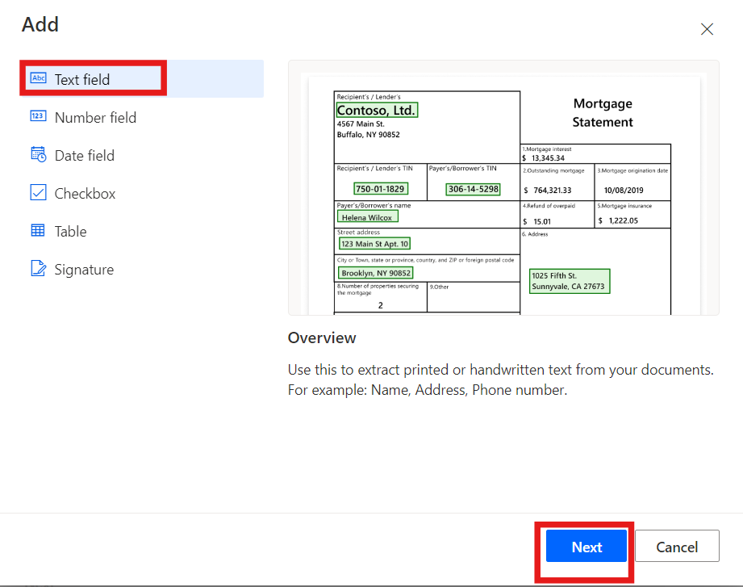
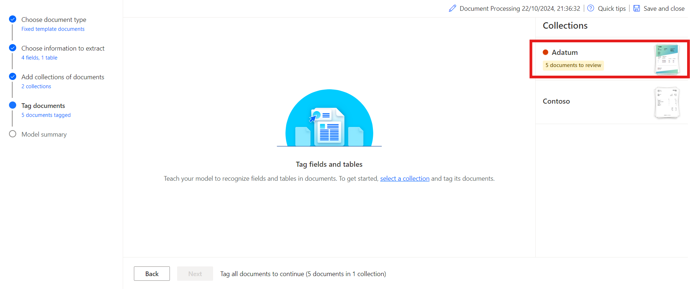
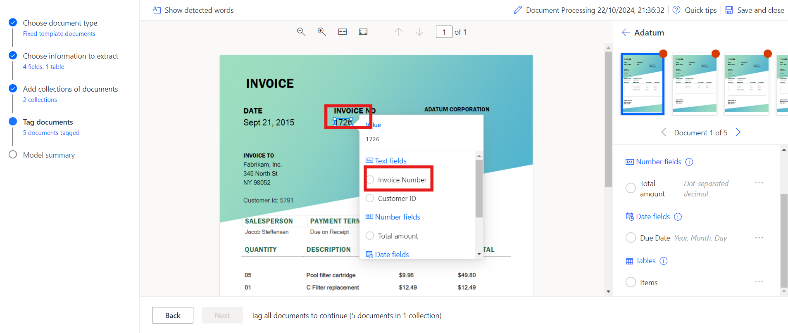
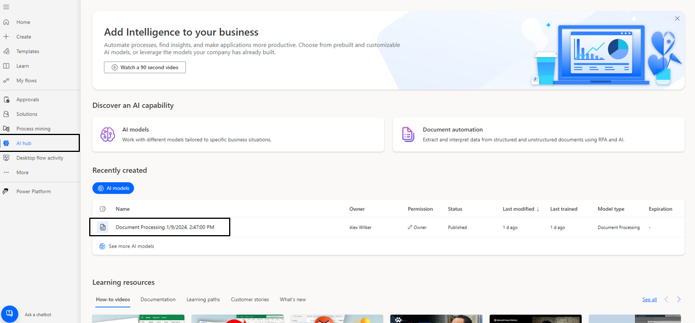

# Lab 8 – Verarbeiten von benutzerdefinierten Dokumenten mit dem AI-Builder

**Ziel:** Das Ziel dieses Labs besteht darin, die Teilnehmer durch die
Erstellung ihres ersten AI-Modells mit AI Builder in Power Automate zu
führen. Das Modell wird trainiert, um benutzerdefinierte Informationen
wie Rechnungsnummern, Kunden-IDs, Gesamtbeträge und Fälligkeitsdaten aus
Dokumenten wie Rechnungen zu extrahieren. Die Teilnehmer lernen, wie sie
sich bei AI Builder anmelden, Dokumenttypen auswählen, zu extrahierende
Felder definieren, Dokumente für das Training hochladen und schließlich
das trainierte Modell mit Power Automate und Power Apps integrieren.

**Geschätzte Zeit:** 45 Minuten

## Übung 1: Erstellen des ersten Modells

### Aufgabe 1: Anmelden bei AI Builder

1.  Navigieren Sie mit Hilfe von
    +++**https://make.powerautomate.com**/+++ zu Power Automate, und
    melden Sie sich bei Aufforderung mit dem Office
    365-Administratortenantkonto an.

2.  Wählen Sie in der oberen Leiste die Umgebung **Dev one** aus.

- 

3.  Navigieren Sie zum linken Fensterbereich, wählen Sie **AI Hub** aus
    und klicken Sie dann auf **AI Models.** Wenn AI Hub nicht angezeigt
    wird, klicken Sie auf **More,** um ihn zu suchen.

- 

4.  Wählen Sie die Option **Extract custom information from documents**.

- 

5.  Scrollen Sie nach unten und klicken Sie auf **Create custom model**,
    um fortzufahren.

- 

### Aufgabe 2: Auswählen des Dokumenttyps

1.  Bei der Wahl des Dokumenttyps haben Sie drei Möglichkeiten:

    - **Fixed template documents:** Diese Option ist ideal, wenn für ein
      bestimmtes Layout die Felder, Tabellen, Kontrollkästchen und
      andere Elemente an ähnlichen Stellen zu finden sind. Sie können
      diesem Modell beibringen, Daten aus strukturierten Dokumenten mit
      unterschiedlichen Layouts zu extrahieren. Dieses Modell hat eine
      schnelle Einarbeitungszeit.

    - **General documents:** Diese Option ist ideal für jede Art von
      Dokumenten, insbesondere wenn es keine festgelegte Struktur gibt
      oder wenn das Format komplex ist. Sie können diesem Modell
      beibringen, Daten aus strukturierten oder unstrukturierten
      Dokumenten mit unterschiedlichen Layouts zu extrahieren. Dieses
      Modell ist leistungsstark, hatte aber eine lange Trainingszeit.

    - **Invoices:** Rechnungsdokumente sind Standardformulare für die
      Kreditorenbuchhaltung. Dieser Modelltyp wird mit Standardfeldern
      geliefert, und Sie können diesem Modell beibringen, zusätzliche
      benutzerdefinierte Daten zu extrahieren oder die Standarddaten zu
      aktualisieren.

2.  Wählen Sie **Fixed template documents** aus und klicken Sie auf
    **Next.**

- 

### Aufgabe 3: Auswählen der zu extrahierenden Informationen

Definieren Sie die Felder und Tabellen, die das Modell extrahieren soll.
Wir extrahieren die folgenden Felder:

- Rechnungsnummer
- Kundennummer
- Gesamtbetrag
- Fälligkeitsdatum

1.  Klicken Sie auf **+ Add**, wählen Sie Textfeld aus und klicken Sie
    dann auf **Next**.

- 

  

2.  Geben Sie den Namen des Textfelds als **+++Invoice Number+++** ein
    und wählen Sie **Done**. Wiederholen Sie diesen Schritt für
    **Customer ID**.

- 

3.  Klicken Sie auf **+ Add** , wählen Sie **+++Number field+++** aus
    und klicken Sie dann auf **Next**.

- 

  

4.  Geben Sie den Namen des Zahlenfeldes als **+++Total amount+++** ein
    und wählen Sie **Done**.

- 

5.  Klicken Sie auf **+ Add** und wählen Sie **Date field (preview)**
    aus.

- 

  

6.  Geben Sie den Namen des Datumsfelds als **Due Date** ein, und wählen
    Sie **Done** aus.

- 

7.  Um Tabellendetails aus der Rechnung zu extrahieren, erstellen wir
    eine Tabelle mit dem Namen "Items" mit den Spalten "Description" und
    "Item total". Klicken Sie dazu auf **+ Add** und wählen Sie
    **Table**.

- 

8.  Wählen Sie **Table** aus und klicken Sie auf **Next**.

- 

9.  Definieren Sie den Tabellennamen als **Items**.

10. Wählen Sie Spalte1 aus, benennen Sie sie in **Description** um und
    klicken Sie dann auf **Confirm**.

11. Klicken Sie auf **+ New column**, geben Sie den Spaltennamen als
    „Item total“ein und wählen Sie dann **Add** aus. Klicken Sie
    abschließend auf **Done**.

- 

12. Klicken Sie auf **Next** , um mit dem nächsten Schritt in Ihrem
    Modell fortzufahren.

- 

### Aufgabe 4: Definieren von Sammlungen und Hochladen von Dokumenten

Definieren Sie Sammlungen und laden Sie Dokumente hoch. Eine Sammlung
gruppiert Dokumente mit demselben Layout. Erstellen Sie eine Sammlung
für jedes einzelne Layout, das Ihr Modell verarbeiten muss. Da es zwei
Rechnungsanbieter gibt, die unterschiedliche Vorlagen verwenden,
erstellen wir zwei Sammlungen.

1.  Klicken Sie auf **New collection,** und benennen Sie die erste
    Sammlung in **Adatum** um.

2.  Fügen Sie eine weitere **New collection** hinzu, und nennen Sie sie
    **Contoso**.

- 

3.  Klicken Sie auf das Adatum und dann auf das **Add document**. Wählen
    Sie dann **My device**, Für **Adatum** laden Sie die fünf Dokumente
    hoch, die im Ordner \*\*C:FilesBuilder Document Processing Sample
    Data\* verfügbar sind.

- 

  

4.  Klicken Sie auf das **Upload 5 document** und dann auf **Done**.

- 

  

5.  Klicken Sie auf Contoso und dann auf **Add document**. Wählen Sie
    dann My device Für **Contoso** laden Sie die fünf Dokumente aus dem
    Ordner **C:Files Builder Document Processing Sample Data/Contoso
    /Train** hoch.

- 

  

6.  Klicken Sie auf das **Upload 5 document** und dann auf **Done**.

- 

  

7.  Nachdem Sie die Beispieldokumente in jede Sammlung hochgeladen
    haben, wählen Sie **Next** aus, um fortzufahren.

- 

### Aufgabe 5: Markieren von Dokumenten

Beginnen Sie damit, Ihrem AI-Modell beizubringen, wie es die Felder und
Tabellen extrahiert, indem Sie die hochgeladenen Beispieldokumente mit
Tags versehen. Wenn Sie die erwarteten Felder in jedem Dokument mit Tags
versehen, wird ein Häkchen über diesem Dokument angezeigt, und der rote
Punkt in der oberen Ecke verschwindet.

1.  Wählen Sie im rechten Bereich die **Contoso-**Sammlung aus, um mit
    dem Tagging zu beginnen.

- 

2.  **Tag-Felder:**

- Beginnen Sie damit, Felder wie **Invoice Number, Due date** und
  **Total amount** zu markieren.

- Zeichnen Sie ein Rechteck um jedes Feld im Dokument und wählen Sie
  dann den entsprechenden Feldnamen aus.

- Ändern Sie bei Bedarf die Größe Ihrer Auswahl. Wenn Sie den Mauszeiger
  über Wörter bewegen, werden hellblaue Felder angezeigt, die anzeigen,
  wo Sie Rechtecke zeichnen können.

&nbsp;

- 

  

  

3.  Feld oder Tabelle nicht im Dokument:

- Wenn ein Feld oder keine Tabelle vorhanden ist, z. B. die Kunden-ID in
  der Contoso-Sammlung, wählen Sie die Auslassungspunkte **(...)** neben
  dem Feld im rechten Bereich und wählen Sie **Not available in the
  document** aus.

&nbsp;

- 

4.  Tag-Tabellen:

    - Zeichnen Sie ein Rechteck um die Tabelle, die Sie mit Tags
      versehen möchten, und wählen Sie den Tabellennamen aus.

    - Zeichnen Sie Zeilen, indem Sie mit der linken Maustaste zwischen
      den Zeilentrennlinien klicken.

    - Zeichne Spalten, indem du Ctrl + Linksklick (oder ⌘ Linksklick
      unter macOS) drückst.

    - Weisen Sie die Überschriften zu, indem Sie die Überschriftenspalte
      auswählen und der gewünschten Spalte zuordnen.

    - Wenn Sie die Kopfzeile der Tabelle mit Tags versehen haben, wählen
      Sie “Erste Zeile ignorieren”aus, um zu verhindern, dass sie als
      Inhalt extrahiert wird.

- 

  

  

5.  Markieren Sie alle fünf Dokumente mit demselben Prozess. Nachdem Sie
    ein Dokument mit Tags versehen haben, wechseln Sie mit den
    Navigationspfeilen oben rechts in der Dokumentvorschau zum nächsten.

- 

6.  Wählen Sie nun die **Adatum**-Sammlung aus.

- 

7.  **Tag-Felder:**

    - Beginnen Sie damit, Felder wie **Invoice Number, Customer ID** und
      **Total amount** zu markieren.

    - Zeichnen Sie ein Rechteck um jedes Feld im Dokument und wählen Sie
      dann den entsprechenden Feldnamen aus.

    - Ändern Sie bei Bedarf die Größe Ihrer Auswahl. Wenn Sie den
      Mauszeiger über Wörter bewegen, werden hellblaue Felder angezeigt,
      die anzeigen, wo Sie Rechtecke zeichnen können.

- 

  

  

8.  Gehen Sie zur Option **Due Date** und wählen Sie **Not available in
    collection** aus.

- 

9.  Tag-Tabellen:

    - Zeichnen Sie ein Rechteck um die Tabelle, die Sie mit Tags
      versehen möchten, und wählen Sie den Tabellennamen aus.

    - Zeichnen Sie Zeilen, indem Sie mit der linken Maustaste zwischen
      den Zeilentrennlinien klicken.

    - Zeichne Spalten, indem du Ctrl + Linksklick (oder ⌘ Linksklick
      unter macOS) drückst.

    - Weisen Sie die Überschriften zu, indem Sie die Überschriftenspalte
      auswählen und der gewünschten Spalte zuordnen.

    - Wenn Sie die Kopfzeile der Tabelle mit Tags versehen haben, wählen
      Sie “Erste Zeile ignorieren”aus, um zu verhindern, dass sie als
      Inhalt extrahiert wird.

- 

  

  

  

10. Markieren Sie alle fünf Dokumente mit demselben Prozess. Nachdem Sie
    ein Dokument mit Tags versehen haben, wechseln Sie mit den
    Navigationspfeilen oben rechts in der Dokumentvorschau zum nächsten.

### Aufgabe 6: Modellzusammenfassung und Training

1.  Wählen Sie die Schaltfläche **Next** am unteren Bildschirmrand aus.

- 

2.  Überprüfen Sie die **Model summary**. Unter Zu extrahierende
    Informationen sehen Sie, dass die Kunden-ID und das Fälligkeitsdatum
    nur in fünf von **10** Beispielen vorkamen, während alles andere in
    allen 10 Beispielen vorkam.

3.  Wenn alles in Ordnung aussieht, wählen Sie **Train** aus.

- 

## Übung 2: Verwenden des Modells

### Aufgabe 1: Schnelltest

1.  Nachdem das Modell das Training abgeschlossen hat, können Sie
    wichtige Details zu Ihrem neu trainierten Modell auf einer
    Detailseite anzeigen.

- 

2.  Um Ihr Modell in Aktion zu sehen, wählen Sie **Quick test** aus.

- 

3.  Ziehen Sie ein Bild per Drag & Drop oder laden Sie es von Ihrem
    Gerät hoch, um es zu testen. Verwenden Sie aus den vorherigen
    Beispieldaten die Dateien aus den Testordnern, die wir nicht für das
    Training verwendet haben (entweder aus AI Builder-Beispieldaten für
    die Dokumentverarbeitung oder aus AI Builder-Dokumentverarbeitung
    für Beispieldaten).

4.  Sie können nun die erkannten Felder, die Sie ausgewählt haben, und
    die zugehörigen Konfidenzbewertungen für das Abrufen der einzelnen
    Felder im Vergleich zum trainierten Modell anzeigen.

- 

### Aufgabe 2: Veröffentlichen des Modells

1.  Ihr Modell kann erst verwendet werden, wenn Sie es veröffentlichen.
    Wenn Sie mit Ihrem Modell zufrieden sind, wählen Sie **Publish**
    aus, um es zur Verwendung verfügbar zu machen.

- 

### Aufgabe 3: Verwenden Ihres Modells in Power Apps

Nachdem Ihr Modell veröffentlicht wurde, können Sie Ihr
Dokumentverarbeitungsmodell in einer Canvas-App verwenden. Es steht
Ihnen eine spezielle Komponente zur Verfügung, die jedes Bild analysiert
und den Text basierend auf Ihrem trainierten Dokumentverarbeitungsmodus
extrahiert.

1.  Gehen Sie zu **https://make.powerautomate.com/**, wählen Sie „**AI
    Hub**“ und anschließend Ihr Modell unter „**Recently created**“ aus.

- 

2.  Wählen Sie **Use model** aus.

- 

3.  Wählen Sie **Build intelligent apps** aus , um mit der Erstellung
    von Canvas-Apps zu beginnen.

- 

4.  In Ihrer Canvas-App wird automatisch eine **Form processor
    component** hinzugefügt und mit Ihrem veröffentlichten
    Dokumentverarbeitungsmodell verknüpft.

- > **Hinweis:** Wenn Sie der App zusätzliche AI-Modelle hinzufügen
  > möchten, wählen Sie Insert und dann Form processor aus, um eine
  > Formularprozessorkomponente hinzuzufügen. Wählen Sie als Nächstes
  > die Eigenschaft AI-Modell aus dem Eigenschaftenbereich auf der
  > rechten Seite aus. Eine Liste von AI-Modellen wird zur Auswahl
  > angezeigt. In der Dropdown-Liste werden nur veröffentlichte Modelle
  > angezeigt.

  

5.  Als nächstes wählen wir aus, welches Feld aus der Rechnung angezeigt
    werden soll. Wählen Sie **Insert** aus, und fügen Sie dann eine
    **Label-**Komponente hinzu .

6.  Wenn die Beschriftung ausgewählt ist, stellen Sie sicher, dass die
    **Text**-Eigenschaft in der oberen linken Ecke ausgewählt ist.
    Schreiben Sie in die Bearbeitungsleiste
    **FormProcessor1.Fields**. Mit diesem Code erhalten Sie auch Zugriff
    auf die anderen Eigenschaften des Modells. Für diese Übung wählen
    wir Rechnungsnummer. Das Ergebnis sieht ähnlich wie in diesem Bild
    aus.

- 

  > **Hinweis:** Beachten Sie, dass "Rechnungsnummer" in einfachen
  > Anführungszeichen in der vorherigen Abbildung steht. Dies liegt
  > daran, dass beim Erstellen der Spalte Rechnungsnummer der
  > Spaltenname mit einem Leerzeichen zwischen den Wörtern erstellt
  > wurde. Wenn Ihre Spalten nicht mit Leerzeichen erstellt wurden,
  > benötigen Sie die einfachen Anführungszeichen nicht, und Ihr Code
  > sieht stattdessen möglicherweise wie in diesem Bild aus.

  

7.  Als Nächstes fügen wir eine Galerie hinzu, damit wir die Daten aus
    den Positionen der Rechnung sehen können. Wählen Sie **Insert** und
    dann **Vertical Gallery** aus.

8.  Schreiben Sie in die Eigenschaft „Items“ der Galerie:
    FormProcessor1.Tables.Items

- 

9.  Wählen Sie oben rechts in Power Apps Studio die Option **Play** aus,
    um eine Vorschau der App anzuzeigen.

10. Wählen Sie **Analyze** aus, und wählen Sie dann das Bild aus, das
    Sie zuvor für den Schnelltest verwendet haben.

- 

11. Eine Vorschau Ihres Dokuments zeigt die **Invoice Number** und die
    Positionen aus der Rechnung an.

- 

### Schlussfolgerung:

Am Ende dieses Labs haben die Teilnehmer erfolgreich ein
benutzerdefiniertes AI-Modell erstellt und trainiert, das in der Lage
ist, bestimmte Datenfelder aus Dokumenten zu extrahieren. Sie haben das
Modell mit realen Daten getestet, es in automatisierte Workflows in
Power Automate integriert und in einer Canvas-App in Power Apps
verwendet. Dieses Lab zeigt, wie AI-Modelle zur Automatisierung der
Dokumentenverarbeitung und zur Rationalisierung von Geschäftsaufgaben
verwendet werden können, und bietet praktische Erfahrungen bei der
Nutzung von AI Builder für die intelligente Automatisierung.
