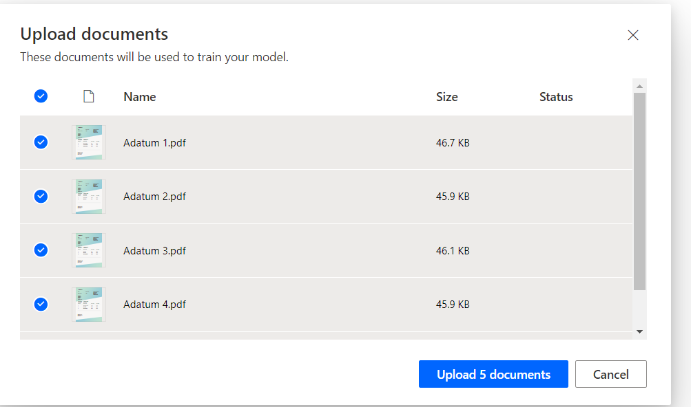
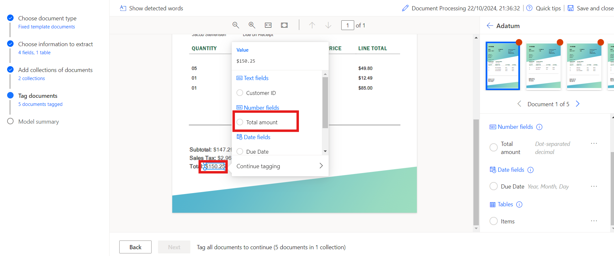

# Lab 8 - Elaborare documenti personalizzati con AI builder

**Obiettivo:** l'obiettivo di questo lab è guidare i partecipanti nella
creazione del loro primo modello di intelligenza artificiale utilizzando
AI Builder in Power Automate. Il modello verrà sottoposto a training per
estrarre informazioni personalizzate, ad esempio numeri di fattura, ID
cliente, importi totali e date di scadenza, da documenti come le
fatture. I partecipanti impareranno come accedere ad AI Builder,
scegliere i tipi di documento, definire i campi da estrarre, caricare i
documenti per il training e, infine, integrare il modello addestrato con
Power Automate e Power Apps.

**Tempo stimato:** 45 minuti

## Esercizio 1: Creare il primo modello

### Attività 1: Accedere ad AI Builder

1.  Passare a Power Automate con l'aiuto di
    +++**https://make.powerautomate.com/**+++ e, se richiesto, accedere
    utilizzando l'account tenant amministratore di Office 365.

2.  Selezionare l'ambiente **Dev one** dalla barra in alto.

- 

3.  Passare al riquadro di sinistra e selezionare **AI Hub**, quindi
    fare clic su **AI Models.** Se non vedi AI Hub, fare clic su
    **More** per individuarlo.

- 

4.  Scegli l **'opzione** Estrai informazioni personalizzate dai
    documenti.

- 

5.  Scorrere verso il basso e fare clic su **Create custom model** per
    procedere.

- 

### Attività 2: Scegliere il tipo di documento

1.  Quando si sceglie il tipo di documento, si hanno tre opzioni:

    - **Fixed template documents:** questa opzione è ideale quando, per
      un determinato formato, i campi, le tabelle, le caselle di
      controllo e altri elementi si trovano in posizioni simili. È
      possibile insegnare a questo modello a estrarre dati da documenti
      strutturati con layout diversi. Questo modello ha un tempo di
      formazione rapido.

    - **General documents:** questa opzione è ideale per qualsiasi tipo
      di documento, soprattutto quando non esiste una struttura
      prestabilita o quando il formato è complesso. È possibile
      insegnare a questo modello a estrarre dati da documenti
      strutturati o non strutturati con layout diversi. Questo modello è
      potente ma ha avuto un lungo tempo di addestramento.

    - **Invoices: i** documenti delle fatture sono moduli standard per
      la contabilità fornitori. Questo tipo di modello viene fornito con
      campi standard ed è possibile insegnare a questo modello a
      estrarre dati personalizzati aggiuntivi o aggiornare i dati
      standard.

2.  Selezionare Fixed template documents e fare clic su **Next**.

- 

### Attività 3: Scegliere le informazioni da estrarre

Definire i campi e le tabelle che si desidera estrarre dal modello.
Estrarremo i seguenti campi:

- Invoice number
- Customer ID
- Total amount
- Due date

1.  Fare clic su **+ Add** e selezionare **Text field**, quindi fare
    clic su **Next**.

- 

  

2.  Inserire il nome del campo di testo come +++**Invoice Number**+++ e
    selezionare **Done**. Ripetere questo passaggio per **Customer**
    **ID**.

- 

3.  Fare clic su **+ Add** e selezionare +++**Number field**+++, quindi
    fare clic su **Next**.

- 

  

4.  Inserire il nome del campo numerico come +++**Total amount**+++ e
    selezionare **Done**.

- 

5.  Fare clic su **+ Add** e selezionare Date field (anteprima).

- 

  

6.  Inserire il nome del Date field come **Due Date** e selezionare
    **Done**.

- 

7.  Per estrarre i dettagli della tabella dalla fattura, creeremo una
    tabella denominata Articoli con le colonne Descrizione e Totale
    articolo. A tale scopo, fare clic su **+ Add** e selezionare
    **Table**.

- 

8.  Selezionare **Table** e fare clic su **Next**.

- 

9.  Definire il nome della tabella come **Items**.

10. Selezionare Column1 e rinominala in Description, quindi fare clic su
    Confirm.

11. Fare clic su **+ New column**, inserire il nome della colonna come
    Item total, quindi seleziona Add. Infine, fare clic su **Done**.

- 

12. Fare clic su **Next** per procedere al passaggio successivo del
    modello.

- 

### Attività 4: Definire le raccolte e caricare i documenti

Definire le collezioni e caricare i documenti. Una raccolta raggruppa i
documenti con lo stesso layout. Crea una raccolta per ogni layout
univoco che il tuo modello deve elaborare. Poiché ci sono due fornitori
di fatture che utilizzano modelli diversi, creeremo due raccolte.

1.  Fare clic su **New collection** e rinominare la prima raccolta in
    **Adatum**.

2.  Aggiungere un'altra **New collection** e denominarla **Contoso**.

- 

3.  Fare clic su Adatum e quindi fare clic su Add document. Quindi
    selezionare My device, Per **Adatum**, carica i cinque documenti
    disponibili nella cartella \*\*C:FilesBuilder Document Processing
    Sample Data\*

- 

  

4.  Fare clic su **Upload 5 document** e quindi fare clic su **Done**.

- 

  

5.  Fare clic su Contoso e quindi su Add document. Selezionare quindi My
    device, Per **Contoso** caricare i cinque documenti dalla cartella
    **C:Files Builder Document Processing Sample Data/Contoso /Train**.

- 

  

6.  Fare clic su **Upload 5 document** e quindi fare clic su **Done**.

- 

  

7.  Dopo aver caricato i documenti di esempio in ogni raccolta,
    selezionare **Next** per continuare.

- 

### Attività 5: Contrassegnare i documenti

Inizia a insegnare al tuo modello di intelligenza artificiale come
estrarre i campi e le tabelle contrassegnando i documenti di esempio che
hai caricato. Quando si contrassegnano i campi previsti in ogni
documento, verrà visualizzato un segno di spunta su quel documento e il
punto rosso nell'angolo superiore scomparirà.

1.  Selezionare la raccolta **Contoso** dal pannello a destra per
    iniziare a taggare.

- 

2.  **Tag Fields:**

- Iniziare taggando campi come **Invoice Number,** **Due date, and Total
  amount.**

- Disegna un rettangolo attorno a ciascun campo del documento, quindi
  seleziona il nome del campo corrispondente.

- Se necessario, ridimensiona la selezione. Passando il mouse sopra le
  parole verranno visualizzate caselle azzurre, che indicano dove è
  possibile disegnare rettangoli.

&nbsp;

- 

  

  

3.  Campo o tabella non presente nel documento:

- Se un campo o una tabella non è presente, ad esempio l'ID cliente
  nella raccolta Contoso, selezionare i puntini di sospensione **(...)**
  accanto al campo nel pannello di destra e scegliere **Not available in
  the document**.

&nbsp;

- 

4.  Tag Tables:

    - Disegnare un rettangolo attorno alla tabella a cui vuoi applicare
      un tag e seleziona il nome della tabella.

    - Disegnare le righe facendo clic con il pulsante sinistro del mouse
      tra i separatori di riga.

    - Disegnare le colonne premendo Ctrl + clic sinistro (o ⌘ clic con
      il pulsante sinistro del mouse su macOS).

    - Assegnare le intestazioni selezionando la colonna
      dell'intestazione e mappandola a quella desiderata.

    - Se hai taggato l'intestazione della tabella, seleziona Ignora
      prima riga per evitare che venga estratta come contenuto.

- 

  

  

5.  Contrassegnare tutti e cinque i documenti con lo stesso processo.
    Dopo aver taggato un documento, passa a quello successivo
    utilizzando le frecce di navigazione in alto a destra nell'anteprima
    del documento.

- 

6.  A questo punto, selezionare la raccolta **Adatum**.

- 

7.  **Tag Fields:**

    - Inizia etichettando campi come **Invoice Number, Customer ID and
      Total amount.**

    - Disegnare un rettangolo attorno a ciascun campo del documento,
      quindi seleziona il nome del campo corrispondente.

    - Se necessario, ridimensiona la selezione. Passando il mouse sopra
      le parole verranno visualizzate caselle azzurre, che indicano dove
      è possibile disegnare rettangoli.

- 

  

  

8.  Vai all'opzione **Due Date** e selezionare **Not available in
    collection.**

- 

9.  Tag Tables:

    - Disegnare un rettangolo attorno alla tabella a cui vuoi applicare
      un tag e seleziona il nome della tabella.

    - Disegnare le righe facendo clic con il pulsante sinistro del mouse
      tra i separatori di riga.

    - Disegnare le colonne premendo Ctrl + clic sinistro (o ⌘ clic con
      il pulsante sinistro del mouse su macOS).

    - Assegnare le intestazioni selezionando la colonna
      dell'intestazione e mappandola a quella desiderata.

    - Se hai taggato l'intestazione della tabella, seleziona Ignora
      prima riga per evitare che venga estratta come contenuto.

- 

  

  

  

10. Contrassegnare tutti e cinque i documenti con lo stesso processo.
    Dopo aver taggato un documento, passa a quello successivo
    utilizzando le frecce di navigazione in alto a destra nell'anteprima
    del documento.

### Compito 6: Riepilogo del modello e addestramento

1.  Selezionare il pulsante **Next** nella parte inferiore dello
    schermo.

- 

2.  Esaminare il **Model summary**. In Informazioni da estrarre, vedrai
    che l'ID cliente e la data di scadenza sono apparsi solo in cinque
    esempi su **10**, mentre tutto il resto è apparso in tutti e 10 gli
    esempi.

3.  Se tutto sembra accettabile, selezionare **Train**.

- 

## Esercizio 2: Utilizzare il modello

### Attività 1: Test rapido

1.  Dopo che il modello ha completato il training, è possibile
    visualizzare dettagli importanti sul modello appena addestrato in
    una pagina dei dettagli.

- 

2.  Per vedere il modello in azione, selezionare **Quick test**.

- 

3.  Trascinare e rilasciare o caricare un'immagine dal tuo dispositivo
    per testarla. Dai dati di esempio precedenti, usa i file delle
    cartelle di test che non sono stati usati per il training (da AI
    Builder Document processing Sample Datao AI Builder Document
    processing Sample Data).

4.  È ora possibile visualizzare i campi rilevati scelti e i punteggi di
    attendibilità associati per il recupero dei singoli campi rispetto
    al modello sottoposto a training.

- 

### Attività 2: Pubblicare il modello

1.  Il modello non può essere utilizzato fino a quando non viene
    pubblicato. Se si è soddisfatti del modello, selezionare **Publish**
    per renderlo disponibile per l'uso.

- 

### Attività 3: Utilizzare il modello in Power Apps

Ora che il modello è stato pubblicato, è possibile usare il modello di
elaborazione dei documenti in un'app canvas. È disponibile un componente
speciale da aggiungere che analizza qualsiasi immagine ed estrae il
testo in base alla modalità di elaborazione del documento addestrata.

1.  Nella \<https://make.powerautomate.com/, selezionare **AI Hub** e
    selezionare il modello in Recently Created.

- 

2.  Selezionare **Usa model**.

- 

3.  Selezionare **Build intelligent apps** per iniziare l'esperienza di
    creazione dell'app canvas.

- 

4.  All'interno dell'app canvas, un **Form processor component** viene
    aggiunto automaticamente e collegato al modello di elaborazione dei
    documenti pubblicato.

- > **Nota:** Se desideri aggiungere altri modelli di intelligenza
  > artificiale all'app, seleziona Inserisci e quindi seleziona
  > Elaboratore di moduli per aggiungere un componente Elaboratore di
  > moduli. Quindi, seleziona la proprietà del modello di intelligenza
  > artificiale dal pannello delle proprietà a destra. Viene
  > visualizzato un elenco di modelli di intelligenza artificiale da
  > selezionare. Nell'elenco a discesa vengono visualizzati solo i
  > modelli pubblicati.

  

5.  Successivamente, selezioniamo quale campo della fattura
    visualizzare. Selezionare **Insert** e quindi aggiungere un
    componente **Label**.

6.  Con l'etichetta selezionata, assicurati che la proprietà
    **Text** sia selezionata nell'angolo in alto a sinistra. Nella barra
    della formula scrivere FormProcessor1.Fields. Questo codice consente
    di accedere anche alle altre proprietà del modello. Per questo
    esercizio, scegliamo il numero di fattura. Il risultato è simile a
    questa immagine.

- 

  > **Nota:** Si noti come " Invoice Number" sia tra virgolette singole
  > nell'immagine precedente. Ciò è dovuto al fatto che quando è stata
  > creata la colonna Numero fattura, il nome della colonna è stato
  > creato con uno spazio tra le parole. Se le colonne non sono state
  > create con gli spazi, non sono necessarie le virgolette singole e il
  > codice potrebbe assomigliare a questa immagine.

  

7.  Successivamente, aggiungiamo una galleria in modo da poter vedere i
    dati delle voci della fattura. Selezionare **Insert** e quindi
    **Vertical Gallery**.

8.  Nella Items property della raccolta, scrivere:
    FormProcessor1.Tables.Items

- 

9.  Selezionare **Play** in alto a destra in Power Apps Studio per
    visualizzare l'anteprima dell'app.

10. Selezionare **Analyze** e quindi selezionare l'immagine utilizzata
    in precedenza per il test rapido.

- 

11. Un'anteprima del documento mostra **Invoice Number** e gli elementi
    della fattura.

- 

### Conclusione:

Al termine di questo laboratorio, i partecipanti avranno costruito e
addestrato con successo un modello di intelligenza artificiale
personalizzato in grado di estrarre campi di dati specifici dai
documenti. Avranno testato il modello con dati reali, lo avranno
integrato in flussi di lavoro automatizzati all'interno di Power
Automate e lo avranno usato all'interno di un'app canvas in Power Apps.
Questo lab dimostra come i modelli di intelligenza artificiale possono
essere utilizzati per automatizzare l'elaborazione dei documenti e
semplificare le attività aziendali, fornendo esperienza pratica
nell'utilizzo di AI Builder per l'automazione intelligente.
