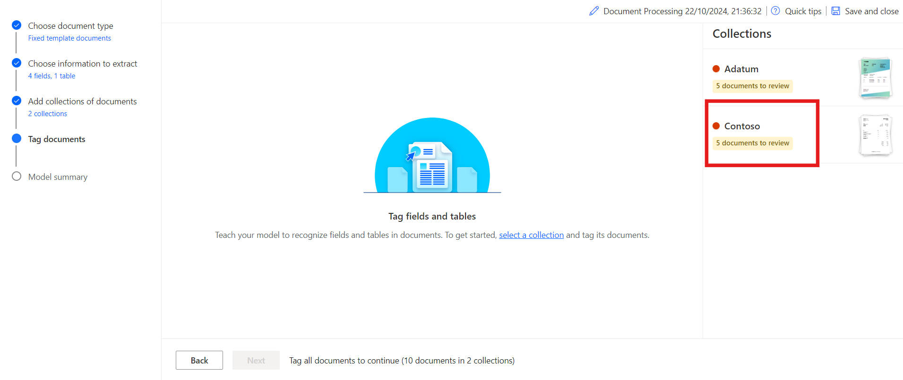
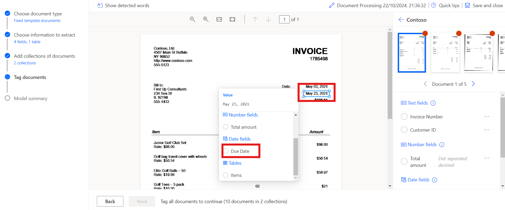
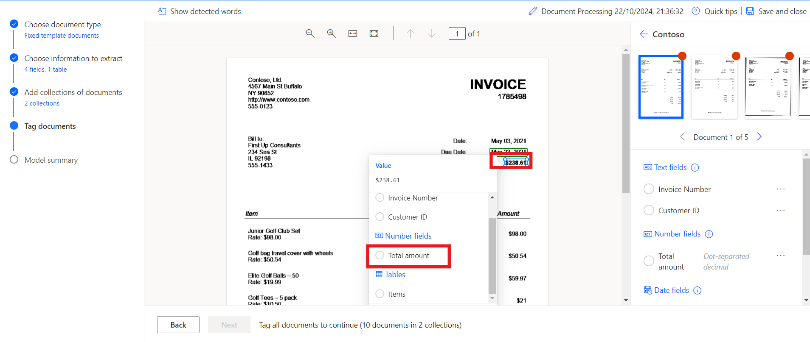
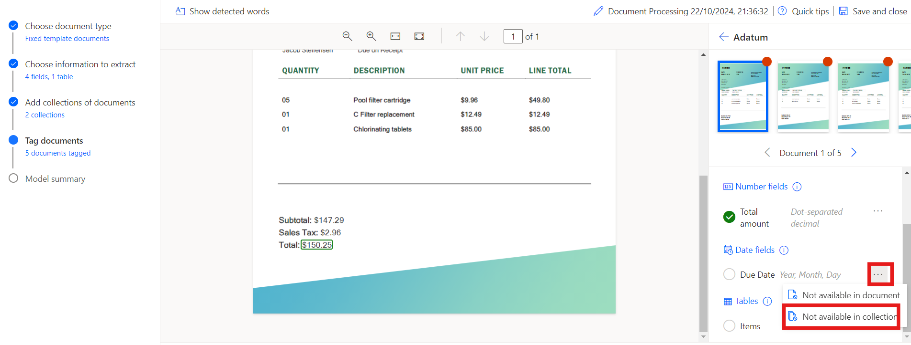
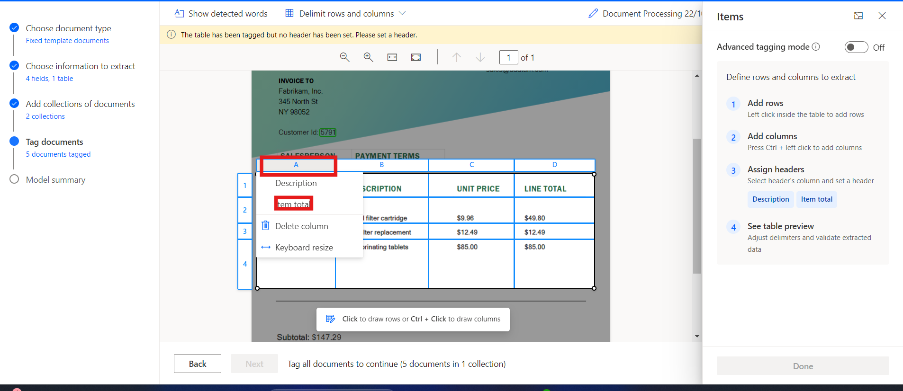
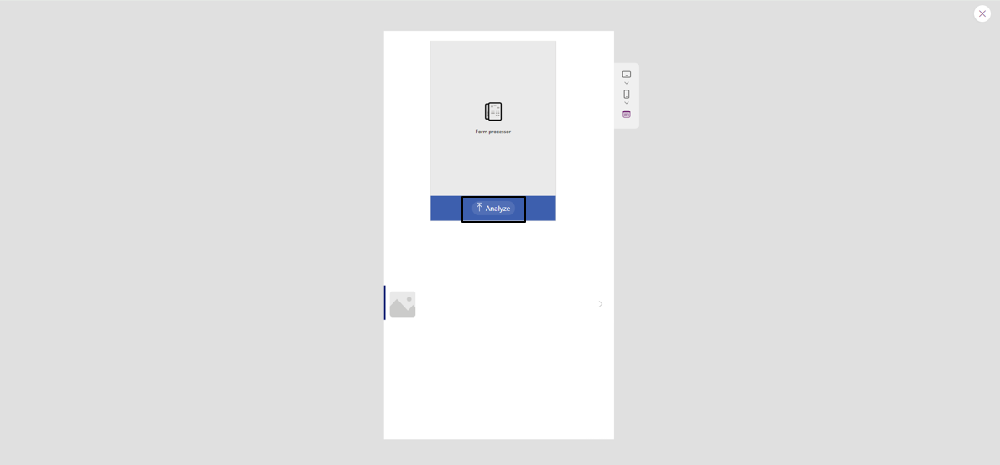

**ラボ８：AI ビルダーを使用してカスタム ドキュメントを処理する**

**目的：**このラボの目的は、Power Automate の AI Builder
を使用して、参加者が初めての AI
モデルを作成できるように支援することです。モデルは、請求書などのドキュメントから、請求書番号、顧客
ID、合計金額、支払期日などのカスタム情報を抽出できるようにトレーニングされます。参加者は、AI
Builder
へのサインイン方法、ドキュメントの種類の選択方法、抽出するフィールドの定義方法、トレーニング用ドキュメントのアップロード方法、そして最後に、トレーニング済みのモデルを
Power Automate および Power Apps に統合する方法を学習します。

**所要時間：** 45分

**演習１：最初のモデルを作成する**

**タスク１：AI Builder にサインインする**

1.  [*https://make.powerautomate.com/\*\*+++*](https://make.powerautomate.com/**+++)によりPower
    Automate に移動し、求められたら、office 365 admin tenant
    accountを使用してサインインします。

2.  上部のバーから環境**Dev one**を選択します。

> 

3.  左側のペインに移動し、**AI Hub**を選択して、**AI
    Models**をクリックします**。**AI
    Hubが表示されない場合は、**More**をクリックして見つけます。

> 

4.  **Extract custom information from
    documents**オプションを選択します。

> 

5.  下にスクロールして**Create custom model**をクリックして続行します。

> 

**タスク２：ドキュメントの種類を選択する**

1.  ドキュメント タイプを選択するときは、次の 3
    つのオプションがあります。

    - **Fixed template
      documents：**このオプションは、特定のレイアウトにおいて、フィールド、テーブル、チェックボックスなどの項目が似たような場所にある場合に最適です。このモデルに、異なるレイアウトを持つ構造化ドキュメントからデータを抽出させるように学習させることができます。このモデルの学習時間は短くなっています。

    - **General
      documents：**このオプションはあらゆる種類の文書、特に構造が定まっていない場合やフォーマットが複雑な場合に最適です。このモデルは、レイアウトの異なる構造化文書または非構造化文書からデータを抽出するように学習させることができます。このモデルは強力ですが、学習に長い時間がかかります。

    - **Invoices：**請求書は標準的な買掛金フォームです。このモデルタイプには標準フィールドが付属しており、追加のカスタムデータを抽出したり、標準データを更新したりするようにモデルを学習させることができます。

2.  固定テンプレートドキュメントを選択し、**Next**をクリックします。

> 

**タスク３：抽出する情報を選択する**

モデルで抽出するフィールドとテーブルを定義します。以下のフィールドを抽出します：

- Invoice number

- Customer ID

- Total amount

- Due date

1.  **+Add**をクリック テキスト
    フィールドを追加して選択し、**Next**をクリックします。

> 
>
> 

2.  テキストフィールド名を+++**Invoice
    Number**+++と入力し、**Done**を選択します。**Customer ID**についてもこの手順を繰り返します。

> 

3.  **+ Add**をクリックし、+++**Number
    field**+++を選択して、Nextをクリックします。

> 
>
> 

4.  数値フィールド名を+++**Total
    amount**+++と入力し、**Done**を選択します。

> 

5.  **+ Add**をクリックし、日付フィールド (プレビュー)を選択します。

> 
>
> 

6.  日付フィールド名に**Due Date**と入力し、**Done**を選択します。

> 

7.  請求書からテーブルの詳細を抽出するために、DescriptionとItem
    total列を持つ「Items」という名前のテーブルを作成します。**+
    Add**をクリックし、**Table**を選択します。

> 

8.  **Table**を選択し、**Next**をクリックします。

> 

9.  テーブル名を**Items**と定義します。

10. Column1
    を選択し、名前を「Description」に変更して、Confirmをクリックします。

11. **+ New column**をクリックし、列名に「Item total」と入力して、追加
    を選択します。最後に、**Done**をクリックします。

> 

12. **Next**をクリックして、モデルの次のステップに進みます。

> 

**タスク４：コレクションの定義とドキュメントのアップロードする**

コレクションを定義し、ドキュメントをアップロードします。コレクションは、同じレイアウトのドキュメントをグループ化します。モデルで処理する必要があるレイアウトごとにコレクションを作成します。異なるテンプレートを使用する請求書プロバイダーが2つあるため、コレクションを2つ作成します。

1.  **New
    collection**をクリックし、最初のコレクションの名前を**Adatum**に変更します。

2.  別の**New collection**を追加し、**Contoso**という名前を付けます。

> 

3.  Adatumをクリックし、Add documentをクリックします。**My
    device**をクリックして、**Adatum**のため\*\*C:FilesBuilder Document
    Processing Sample
    Data\*フォルダにある5つのドキュメントをアップロードします。

> 
>
> 

4.  **Upload 5 document**をクリックし、**Done**をクリックします。

> 
>
> 

5.  Contoso をクリックし、Add documentをクリックします。次にMy
    deviceを選択し、 **Contoso**の場合は、**C:Files Builder Document
    Processing Sample Data/Contoso
    /Train**フォルダーから5つのドキュメントをアップロードします。

> 
>
> 

6.  **Upload 5 document**をクリックし、**Done**をクリックします。

> 
>
> 

7.  各コレクションにサンプル
    ドキュメントをアップロードしたら、**Next**を選択して続行します。

> 

**タスク5: ドキュメントにタグを付ける**

アップロードしたサンプルドキュメントにタグを付けることで、AIモデルにフィールドとテーブルを抽出する方法を教え始めます。各ドキュメントで想定されるフィールドにタグを付けると、そのドキュメントにチェックマークが表示され、上隅の赤い点が消えます。

1.  タグ付けを開始するには、右側のパネルから**Contoso**コレクションを選択します。

> 

2.  **フィールにタグを付ける:**

- **Invoice Number, Due date, and Total
  amount**などのフィールドにタグを付けることから始めます。 

- ドキュメント内の各フィールドの周囲に四角形を描き、対応するフィールド名を選択します。

- 必要に応じて選択範囲のサイズを変更します。単語の上にマウスを移動すると、四角形を描画できる場所を示す水色のボックスが表示されます。

> 
>
> 
>
> 

3.  ドキュメント内にフィールドまたはテーブルがない場合:

- Contoso コレクションの顧客 ID
  のように、フィールドまたはテーブルが存在しない場合は、右側のパネルでフィールドの横にある省略記号**（...)**を選択し、**Not
  available in the document**を選択します。

> 

4.  タグテーブル:

    - タグ付けするテーブルの周囲に四角形を描き、テーブル名を選択します。

    - 行区切り線の間を左クリックして行を描画します。

    - Ctrl キーを押しながら左クリック (またはmacOS では⌘
      キーを押しながら左クリック) して列を描画します。

    - ヘッダー列を選択し、目的の列にマッピングすることで、ヘッダーを割り当てます。

    - テーブルのヘッダーにタグを付けた場合は、最初の行を無視と選択して、コンテンツとして抽出されないようにします。

> 
>
> 
>
> 

5.  5つのドキュメントすべてに同じ手順でタグを付けます。ドキュメントにタグを付けたら、ドキュメントプレビューの右上にあるナビゲーション矢印を使って次のドキュメントに移動できます。

> 

6.  次に、 **Adatum**コレクションを選択します。

> 

7.  **タグフィールド:**

    - **Invoice Number, Customer ID and Total
      amount**などのフィールドにタグを付けます。

    - ドキュメント内の各フィールドの周囲に四角形を描き、対応するフィールド名を選択します。

    - 必要に応じて選択範囲のサイズを変更します。単語の上にマウスを移動すると、四角形を描画できる場所を示す水色のボックスが表示されます。

> 
>
> 
>
> 

8.  **Due Date**オプションに移動して、**Not available in
    collection**を選択します。

> 

9.  タグテーブル:

    - タグ付けするテーブルの周囲に四角形を描き、テーブル名を選択します。

    - 行区切り線の間を左クリックして行を描画します。

    - Ctrlキーを押しながら左クリックして列を描画します
      (またはmacOSでは⌘キーを押しながら左クリック)。

    - ヘッダー列を選択し、目的の列にマッピングすることで、ヘッダーを割り当てます。

    - テーブルのヘッダーにタグを付けた場合は、Ignore first
      rowを選択して、コンテンツとして抽出されないようにします。

> 
>
> 
>
> 
>
> 

10. 5つのドキュメントすべてに同じ手順でタグを付けます。ドキュメントにタグを付けたら、ドキュメントプレビューの右上にあるナビゲーション矢印を使って次のドキュメントに移動できます。

**タスク６：モデルの要約とTrain**

1.  画面下部の**Next**ボタンを選択します。

> 

2.  **Model
    summary**を確認します。抽出する情報を見ると、顧客IDと期日は**10**例中5例にしか表示されていませんが、その他の情報は10例すべてに表示されています。

3.  すべてが問題なければ、**Train**を選択します。

> 

**演習２：モデルを使用する**

**タスク１：クイックテスト**

1.  モデルのトレーニングが完了すると、詳細ページで新しくトレーニングされたモデルに関する重要な詳細を表示できます。

> 

2.  モデルの動作を確認するには、**Quick test**を選択します。

> 

3.  テストする画像は、デバイスからドラッグ＆ドロップするかアップロードしてください。前回のサンプルデータから、トレーニングに使用しなかったテストフォルダー（AI
    Builder Document processing Sample DataまたはAI Builder Document
    processing Sample Data）のファイルを使用してください。

4.  これで、選択した検出されたフィールドと、トレーニング済みモデルと比較して個々のフィールドを取得するための関連する信頼スコアを表示できるようになりました。

> 

**タスク２：モデルを公開する**

1.  モデルは公開するまで使用できません。モデルに問題がなければ、
    **Publish**を選択して使用可能にしてください。

> 

**タスク 3: Power Apps でモデルを使用する**

モデルが公開されたので、キャンバスアプリでドキュメント処理モデルを使用できます。トレーニング済みのドキュメント処理モードに基づいて、任意の画像を分析し、テキストを抽出する特別なコンポーネントを追加できます。

1.  \<
    [*https://make.powerautomate.com/*から](https://make.powerautomate.com/)**AI
    Hub**を選択し、最近作成されたモデルを選択します。

> 

2.  **Use model**を選択します。

> 

3.  キャンバス アプリの作成エクスペリエンスを開始するには、**Build
    intelligent apps**を選択します。

> 

4.  キャンバス アプリ内で、**Form processor
    component**が自動的に追加され、公開されたドキュメント処理モデルにリンクされます。

> **注意：**アプリにAIモデルを追加する場合は、挿入を選択し、フォームプロセッサを選択してフォームプロセッサコンポーネントを追加します。次に、右側のプロパティパネルからAIモデルのプロパティを選択します。選択可能なAIモデルのリストが表示されます。ドロップダウンリストには公開済みのモデルのみが表示されます。
>
> 

5.  次に、請求書のどのフィールドを表示するかを選択します。**Insert**を選択し、**Label**コンポーネントを追加します。

6.  ラベルを選択した状態で、左上隅の**Text**プロパティが選択されていることを確認してください。数式バーにFormProcessor1.Fieldsと入力します。このコードにより、モデルの他のプロパティにもアクセスできるようになります。この演習では、請求書番号を選択します。結果は次の画像のようになります。

> 
>
> **注意:**前の画像では、「請求書番号」が一重引用符で囲まれていることにご注意ください。これは、請求書番号列の作成時に、列名が単語間にスペースを入れて作成されたためです。列名にスペースが入っていない場合は、一重引用符は不要で、コードは代わりにこの画像のように記述されます。
>
> 

7.  次に、請求書の項目のデータを表示できるようにギャラリーを追加します。**Insert**を選択し、**Vertical
    Gallery**を選択します。

8.  ギャラリーのItemsプロパティに、次のように記述します:
    FormProcessor1.Tables.Items

> 

9.  Power Apps
    スタジオの右上にある**Play**を選択して、アプリをプレビューします。

10. **Analyze**を選択し、以前にクイック
    テストに使用した画像を選択します。

> 

11. ドキュメントのプレビューには、**Invoice
    Number**と請求書の項目が表示されます。

> 

**結論：**

このラボの終了時には、ドキュメントから特定のデータフィールドを抽出できるカスタムAIモデルの構築とトレーニングを修了します。さらに、実際のデータでモデルをテストし、Power
Automate内の自動化ワークフローに統合し、Power
Appsのキャンバスアプリ内で使用できるようになります。このラボでは、AIモデルを使用してドキュメント処理を自動化し、ビジネスタスクを効率化する方法を示し、AI
Builderを活用したインテリジェントな自動化の実践的な体験を提供します。
