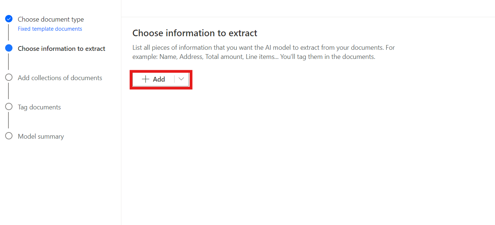
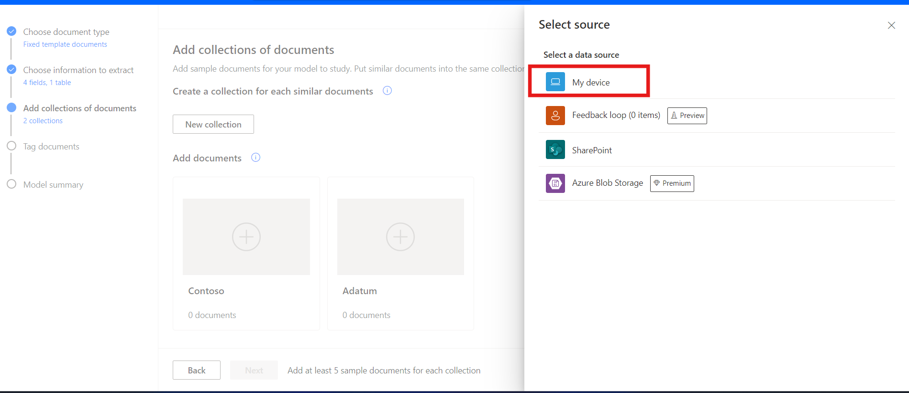
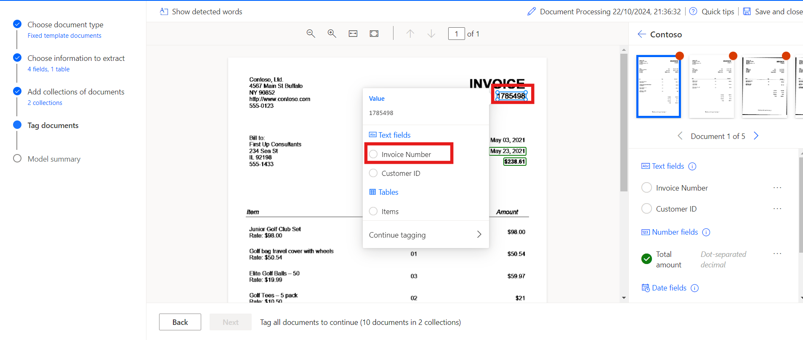
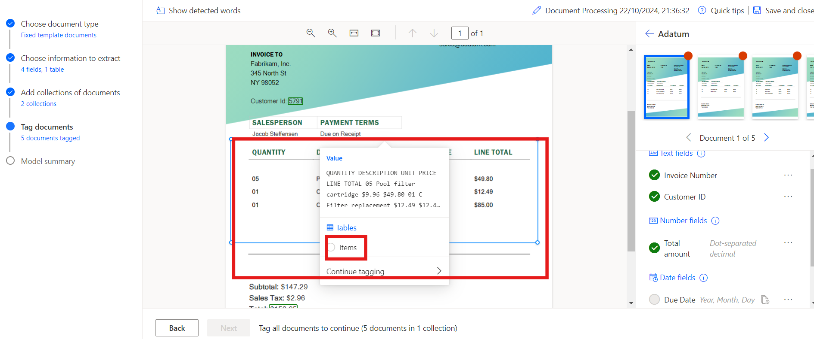

# Laboratoire 8 - Traitez des documents personnalisés avec l'IA Builder

**Objectif :** L'objectif de ce laboratoire est de guider les
participants dans la création de leur premier modèle d'IA à l'aide d’AI
Builder in Power Automate. Le modèle sera formé pour extraire des
informations personnalisées, telles que les numéros de facture, les ID
client, les montants totaux et les dates d'échéance, à partir de
documents tels que les factures. Les participants apprendront à se
connecter à AI Builder, à choisir les types de documents, à définir les
champs à extraire, à télécharger des documents pour l'entraînement et,
enfin, à intégrer le modèle formé à Power Automate et Power Apps.

**Temps estimé :** 45 minutes

## Exercice 1 : Créer votre premier modèle

### Tâche 1 : Se connecter à AI Builder

1.  Accédez à Power Automate à l'aide de
    +++**https://make.powerautomate.com/**+++ et, si vous y êtes invité,
    connectez-vous à l'aide du compte de office 365 admin tenant.

2.  Sélectionnez l'environnement **Dev one** dans la barre supérieure.

- 

3.  Naviguez vers le volet gauche et sélectionnez **AI Hub**, puis
    cliquez sur **AI Models.** Si vous ne voyez pas AI Hub, cliquez sur
    **more** pour le localiser.

- 

4.  Choisissez l'option **Extraire des informations personnalisées des
    documents** .

- 

5.  Faites défiler vers le bas et cliquez sur **Create custom model**
    pour continuer.

- 

### Tâche 2 : Choisir le type de document

1.  Lorsque vous choisissez le type de document, vous avez trois options
    :

    - **Documents de modèle fixe :** cette option est idéale lorsque,
      pour une mise en page donnée, les champs, les tables, les cases à
      cocher et d'autres éléments se trouvent à des endroits similaires.
      Vous pouvez apprendre à ce modèle à extraire des données de
      documents structurés qui ont des mises en page différentes. Ce
      modèle a un temps de formation rapide.

    - **Documents généraux :** Cette option est idéale pour tout type de
      documents, en particulier lorsqu'il n'y a pas de structure définie
      ou lorsque le format est complexe. Vous pouvez apprendre à ce
      modèle à extraire des données de documents structurés ou non
      structurés qui ont des mises en page différentes. Ce modèle est
      puissant mais a eu un long temps d'entraînement.

    - **Factures :** Les documents de facturation sont des formulaires
      standard de comptes fournisseurs. Ce type de modèle est livré avec
      des champs standard, et vous pouvez apprendre à ce modèle à
      extraire des données personnalisées supplémentaires ou à mettre à
      jour les données standard.

2.  Sélectionnez Documents de modèle fixe et cliquez sur **Next**.

- 

### Tâche 3 : Choisir les informations à extraire

Définissez les champs et les tables que votre modèle doit extraire. Nous
allons extraire les champs suivants :

- Numéro de facture
- ID du client
- Montant total
- Échéance

1.  Cliquez sur **+ Add** et sélectionnez Champ de texte, puis cliquez
    sur **Next**.

- 

  

2.  Entrez le nom du champ de texte comme +++ **Invoice Number** +++ et
    sélectionnez **Done**. Répétez cette étape pour **l'ID client**.

- 

3.  Cliquez sur **+ Add** et sélectionnez +++**Number field**+++, puis
    cliquez sur Suivant.

- 

  

4.  Entrez le nom du champ numérique sous la forme +++ **Total amount**
    +++ et sélectionnez **Done**.

- 

5.  Cliquez sur **+ Ajouter** et sélectionnez Champ Date (préversion).

- 

  

6.  Entrez le nom du champ de date comme **Date d'échéance** et
    sélectionnez **Done**.

- 

7.  Pour extraire les détails de la table de la facture, nous allons
    créer une table nommée Articles avec les colonnes Description et
    Total de l'article. Pour ce faire, cliquez sur **+ Add** et
    sélectionnez **Table**.

- 

8.  Sélectionnez **Table** et cliquez sur **Next**.

- 

9.  Définissez le nom de la table sur **Items**.

10. Sélectionnez Colonne1 et renommez-la en Description, puis cliquez
    sur Confirmer.

11. Cliquez sur **+ New column**,, entrez le nom de la colonne Total de
    l'élément, puis sélectionnez Ajouter. Enfin, cliquez sur **Done**.

- 

12. Cliquez sur **Next** pour passer à l'étape suivante de votre modèle.

- 

### Tâche 4 : Définir les collections et télécharger les documents

Définissez des collections et téléchargez des documents. Une collection
regroupe les documents ayant la même mise en page. Créez une collection
pour chaque mise en page unique que votre modèle doit traiter. Étant
donné qu'il existe deux fournisseurs de factures utilisant des modèles
différents, nous allons créer deux collections.

1.  Cliquez sur **New collection** et renommez la première collection en
    **Adatum**.

2.  Ajoutez une autre **New collection** et nommez-la **Contoso**.

- 

3.  Cliquez sur l'Adatum puis sur Ajouter un document. Sélectionnez
    ensuite Mon appareil, Pour **Adatum**, téléchargez les cinq
    documents qui sont disponibles dans le dossier \*\*C :FilesBuilder
    Document Processing Sample Data\*.

- 

  

4.  Cliquez sur le **Upload 5 document**, puis cliquez sur **Done**.

- 

  

5.  Cliquez sur Contoso, puis sur Ajouter un document. Sélectionnez
    ensuite Mon appareil, Pour **Contoso**, chargez les cinq documents à
    partir du dossier **C :Files Builder Document Processing Sample
    Data/Contoso /Train**.

- 

  

6.  Cliquez sur le **Upload 5 document**, puis cliquez sur **Done**.

- 

  

7.  Après avoir téléchargé les exemples de documents dans chaque
    collection, sélectionnez **Next** pour continuer.

- 

### Tâche 5 : Tag les documents

Commencez à apprendre à votre modèle d'IA à extraire les champs et les
tables en tagguant les exemples de documents que vous avez téléchargés.
Au fur et à mesure que vous marquez les champs attendus dans chaque
document, une coche apparaît sur ce document et le point rouge dans le
coin supérieur disparaît.

1.  Sélectionnez la collection **Contoso** dans le panneau de droite
    pour commencer le tagguer.

- 

2.  **Champs de tag :**

- Commencez par baliser des champs tels que **Numéro de facture, Date
  d'échéance et Montant total.**

- Dessinez un rectangle autour de chaque champ du document, puis
  sélectionnez le nom du champ correspondant.

- Redimensionnez votre sélection si nécessaire. En survolant les mots,
  des cases bleu clair s'affichent, indiquant où vous pouvez dessiner
  des rectangles.

&nbsp;

- 

  

  

3.  Champ ou table non inclus dans le document :

- Si un champ ou une table n'est pas présent, comme l'ID client dans la
  collection Contoso, sélectionnez les points de suspension **(...)** en
  regard du champ du panneau de droite et choisissez **Non disponible
  dans le document**.

&nbsp;

- 

4.  Tables de tag :

    - Tracez un rectangle autour de la table que vous souhaitez taguer
      et sélectionnez le nom de la table.

    - Dessinez des lignes en cliquant avec le bouton gauche de la souris
      entre les séparateurs de rangées.

    - Dessinez des colonnes en appuyant sur Ctrl + clic gauche (ou ⌘
      clic gauche sur macOS).

    - Attribuez les en-têtes en sélectionnant la colonne d'en-tête et en
      la mappant à celle de votre choix.

    - Si vous avez balisé l'en-tête du tableau, sélectionnez Ignorer la
      première ligne pour éviter qu'il ne soit extrait en tant que
      contenu.

- 

  

  

5.  Étiquetez les cinq documents avec le même processus. Une fois que
    vous avez taguer un document, passez au suivant à l'aide des flèches
    de navigation en haut à droite de l'aperçu du document.

- 

6.  Sélectionnez maintenant la collection **Adatum**.

- 

7.  **Champs de tag :**

    - Commencez en tagguant des champs tels que **le numéro de facture,
      l'ID client et le montant total.**

    - Dessinez un rectangle autour de chaque champ du document, puis
      sélectionnez le nom du champ correspondant.

    - Redimensionnez votre sélection si nécessaire. En survolant les
      mots, des cases bleu clair s'affichent, indiquant où vous pouvez
      dessiner des rectangles.

- 

  

  

8.  Allez à l' option **Date d'échéance** et sélectionnez **Non
    disponible en collection.**

- 

9.  Tables de balises :

    - Tracez un rectangle autour de la table que vous souhaitez taguer
      et sélectionnez le nom de la table.

    - Dessinez des lignes en cliquant avec le bouton gauche de la souris
      entre les séparateurs de rangées.

    - Dessinez des colonnes en appuyant sur Ctrl + clic gauche (ou ⌘
      clic gauche sur macOS).

    - Attribuez les en-têtes en sélectionnant la colonne d'en-tête et en
      la mappant à celle de votre choix.

    - Si vous avez tagué l'en-tête du tableau, sélectionnez Ignorer la
      première ligne pour éviter qu'il ne soit extrait en tant que
      contenu.

- 

  

  

  

10. Étiquetez les cinq documents avec le même processus. Une fois que
    vous avez tagué un document, passez au suivant à l'aide des flèches
    de navigation en haut à droite de l'aperçu du document.

### Tâche 6 : Résumé du modèle et entraînement

1.  Sélectionnez le bouton **Next** en bas de l'écran.

- 

2.  Consultez le **résumé du** **modèle**. Sous Informations à extraire,
    vous verrez que l'ID client et la date d'échéance n'apparaissent que
    dans cinq exemples sur **10**, alors que tout le reste apparaît dans
    les 10 exemples.

3.  Si tout semble acceptable, sélectionnez **Train**.

- 

## Exercice 2 : Utiliser votre modèle

### Tâche 1 : Test rapide

1.  Une fois que votre modèle a terminé l'entraînement, vous pouvez
    afficher des détails importants sur votre modèle nouvellement formé
    sur une page de détails.

- 

2.  Pour voir votre modèle en action, sélectionnez **Quick test** .

- 

3.  Faites glisser et déposez ou téléchargez une image depuis votre
    appareil pour la tester. À partir des exemples de données
    précédents, utilisez les fichiers des dossiers de test que nous
    n'avons pas utilisés pour l'entraînement (à partir de l'exemple de
    données de traitement de documents AI Builder ou de l'exemple de
    données de traitement de documents AI Builder).

4.  Vous pouvez désormais afficher les champs détectés que vous avez
    choisis et les scores de confiance associés pour la récupération des
    champs individuels par rapport au modèle formé.

- 

### Tâche 2 : Publier votre modèle

1.  Votre modèle ne peut pas être utilisé tant que vous ne l'avez pas
    publié. Si vous êtes satisfait de votre modèle, sélectionnez
    **Publish** pour le rendre disponible.

- 

### Tâche 3 : Utiliser votre modèle dans Power Apps

Maintenant que votre modèle est publié, vous pouvez l'utiliser dans une
application canvas. Vous pouvez ajouter un composant spécial qui analyse
n'importe quelle image et extrait le texte en fonction de votre mode de
traitement de document entraîné.

1.  Dans le \<https://make.powerautomate.com/, sélectionnez **AI Hub**,
    puis sélectionnez votre modèle sous Récemment créé.

- 

2.  Sélectionnez **Use model**.

- 

3.  Sélectionnez **Build intelligent apps**  pour commencer l'expérience
    de création d'applications canvas.

- 

4.  Dans votre application canvas, un **composant de processeur de
    formulaires** est automatiquement ajouté et lié à votre modèle de
    traitement de documents publié.

- > **Remarque :** Si vous souhaitez ajouter des modèles d'IA
  > supplémentaires à l'application, sélectionnez Insérer, puis
  > Processeur de formulaires pour ajouter un composant de processeur de
  > formulaires. Ensuite, sélectionnez la propriété du modèle IA dans le
  > panneau des propriétés de droite. Une liste de modèles d'IA semble
  > sélectionner. Seuls les modèles publiés apparaissent dans la liste
  > déroulante.

  

5.  Ensuite, nous sélectionnons le champ de la facture à afficher.
    Sélectionnez **Insérer**, puis ajoutez un composant **Label**.

6.  Une fois l'étiquette sélectionnée, assurez-vous que la propriété
    **Texte** est sélectionnée dans le coin supérieur gauche. Dans la
    barre de formules, écrivez FormProcessor1.Fields. Ce code vous donne
    également accès aux autres propriétés du modèle. Pour cet exercice,
    nous choisissons Numéro de facture. Le résultat ressemble à cette
    image.

- 

  > **Remarque :** Remarquez que « Numéro de facture » est entre
  > guillemets simples dans l'image précédente. En effet, lors de la
  > création de la colonne Numéro de facture, le nom de la colonne a été
  > créé avec un espace entre les mots. Si vos colonnes n'ont pas été
  > créées avec des espaces, vous n'avez pas besoin des guillemets
  > simples et votre code peut ressembler à cette image à la place.

  

7.  Ensuite, nous ajoutons une galerie afin de voir les données des
    éléments de la facture. Sélectionnez **Insérer**, puis **Galerie
    verticale**.

8.  Dans la propriété Items de la galerie, écrivez :
    FormProcessor1.Tables.Items

- 

9.  Sélectionnez **Play** en haut à droite du studio Power Apps pour
    afficher un aperçu de l'application.

10. Sélectionnez **Analyser**, puis sélectionnez l'image que vous avez
    utilisée pour effectuer un test rapide précédemment.

- 

11. Un aperçu de votre document affiche le **numéro de facture** et les
    éléments de la facture.

- 

### Conclusion:

À la fin de ce laboratoire, les participants auront réussi à créer et à
entraîner un modèle d'IA personnalisé capable d'extraire des champs de
données spécifiques à partir de documents. Ils auront testé le modèle
avec des données réelles, l'auront intégré dans des flux de travail
automatisés au sein de Power Automate et l'auront utilisé dans une
application canvas dans Power Apps. Ce laboratoire montre comment les
modèles d'IA peuvent être utilisés pour automatiser le traitement des
documents et rationaliser les tâches commerciales, en fournissant une
expérience pratique de l'utilisation d'AI Builder pour l'automatisation
intelligente.
