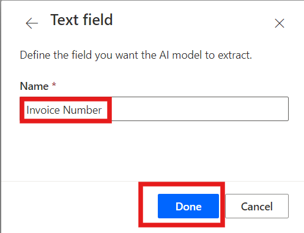
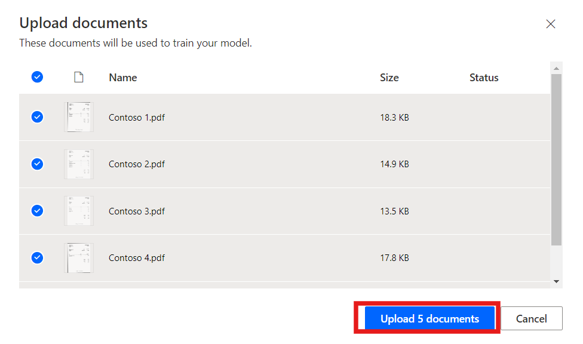
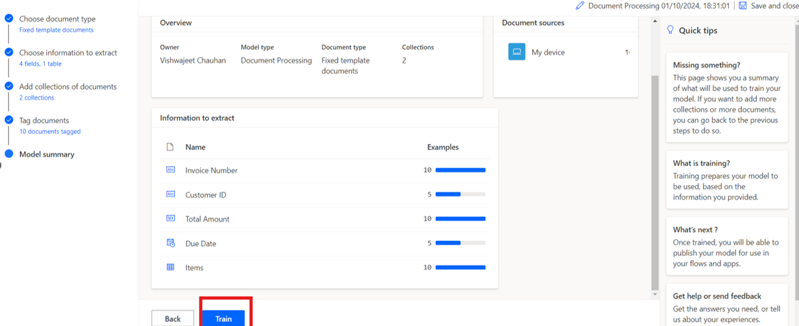

# 实验 8 - 使用 AI Builder 处理自定义文档

**目标：** 本实验室的目标是指导参与者使用 Power Automate 中的 AI Builder
创建他们的第一个 AI
模型。该模型将经过训练，可以从发票等文档中提取自定义信息，例如发票编号、客户
ID、总金额和到期日期。参与者将学习如何登录 AI
Builder、选择文档类型、定义要提取的字段、上传文档进行培训，最后将经过训练的模型与
Power Automate 和 Power Apps 集成。

**预计时间：** 45 分钟

## 练习 1：创建您的第一个模型

### 任务 1：登录到 AI Builder

1.  在 **+++https://make.powerautomate.com/+++** 的帮助下导航到 Power
    Automate，如果出现提示，请使用 Office 365 管理员租户帐户登录。

2.  从顶部栏中选择环境 **Dev one**。

- 

3.  导航到左侧窗格并选择 **AI Hub**，然后单击 **AI Models。**
    如果您没有看到 AI Hub，请单击 **More** 以找到它。

- 

4.  选择 **Extract custom information from documents** 选项。

- 

5.  向下滚动并单击 **Create custom model** 继续。

- 

### 任务 2：选择文档类型

1.  选择文档类型时，您有三个选项:

    - **固定模板文档：**
      对于给定布局，字段、表格、复选框和其他项目可以在类似位置找到，则此选项是理想的选择。您可以教此模型从具有不同布局的结构化文档中提取数据。此模型的训练时间较短。

    - **常规文档：**
      此选项非常适合任何类型的文档，尤其是在没有固定结构或格式复杂时。您可以教此模型从具有不同布局的结构化或非结构化文档中提取数据。这个模型很强大，但训练时间很长。

    - **发票：**
      发票单据是标准的应付账款格式。此模型类型带有标准字段，您可以教此模型提取其他自定义数据或更新标准数据。

&nbsp;

1.  选择 Fixed template documents，然后单击 **Next**。

- 

### 任务 3：选择要提取的信息

定义您希望模型提取的字段和表。我们将提取以下字段:

- 发票编号
- 客户 ID
- 总量
- 期限

1.  单击 **+ Add** 并选择 文本字段，然后单击 **Next**。

- 

  

2.  将文本字段名称输入为 **+++Invoice Number+++**，然后选择 完成。对
    **Customer ID** 重复此步骤。

- 

3.  单击 **+ Add** 并选择 **+++ Number field+++**，然后单击 Next。

- 

  

4.  将数字字段名称输入为 **+++Total amount+++**，然后选择 **Done。**

- 

5.  单击 **+ Add** ，然后选择 日期字段（预览）。

- 

  

6.  将日期字段名称输入为 **Due Date**，然后选择 **Done**。

- 

7.  要从发票中提取表详细信息，我们将创建一个名为 Items 的表，其中包含
    Description 和 Item total 列。为此，请单击 **+ Add** 并选择
    **Table**。

- 

8.  选择 **Table** 并单击 **Next**。

- 

9.  将表名称定义为 **Items**。

10. 选择 Column1 并将其重命名为 Description，然后单击 Confirm。

11. 单击 **+ New column**，输入列名称作为 Item total，然后选择
    添加。最后，点击 **Done**。

- 

12. 单击 **Next** 继续执行模型中的下一步。

- 

### 任务 4：定义集合并上传文档

定义集合并上传文档。集合对具有相同布局的文档进行分组。为模型需要处理的每个唯一布局创建一个集合。由于有两个发票提供商使用不同的模板，因此我们将创建两个产品系列。

1.  单击 **New collection** 并将第一个集合重命名为 **Adatum**。

2.  添加另一个 **New collection** 并将其命名为 **Contoso**。

- 

3.  单击 **Adatum**，然后单击 Add document。然后选择 我的设备，对于
    Adatum，上传 \*\*C：FilesBuilder Document Processing Sample Data\*
    文件夹中可用的五个文档。

- 

  

4.  单击 **Upload 5 document**，然后单击 **Done**。

- 

  

5.  单击 Contoso，然后单击 Add document。然后选择“我的设备，对于
    **Contoso**”，从 **C：Files Builder Document Processing Sample
    Data/Contoso /Train** 文件夹中上传五个文档.

- 

  

6.  单击 **Upload 5 document**，然后单击 **Done**。

- 

  

7.  将示例文档上传到每个集合后，选择 **Next** 继续。

- 

### 任务 5：标记文档

通过标记您上传的示例文档，开始教您的 AI
模型如何提取字段和表。当您在每个文档中标记预期字段时，该文档上将出现一个复选标记，并且右上角的红点将消失。

1.  从右侧面板中选择 **Contoso** 集合以开始标记。

- 

2.  **标记字段:**

- 首先标记 **Invoice Number、Due date 和 Total amount** 等字段**。**

- 在文档中的每个字段周围绘制一个矩形，然后选择相应的字段名称。

- 如果需要，请调整所选内容的大小。将鼠标悬停在单词上将显示浅蓝色框，指示您可以绘制矩形的位置。

&nbsp;

- 

  

  

3.  域或表不在文档中:

- 如果字段或表不存在，例如 Contoso 集合中的客户 ID，请选择省略号
  **（...）** ，然后选择 **Not available in the document**。

&nbsp;

- 

4.  标记表:

    - 在要标记的表周围绘制一个矩形，然后选择表名称。

    - 通过在行分隔符之间单击鼠标左键来绘制行。

    - 按 Ctrl + 左键单击（或在 macOS 上按 ⌘ 左键单击）绘制列。

    - 通过选择标题列并将其映射到所需的标题列来分配标题。

    - 如果您已标记表的标题，请选择 Ignore first row
      以防止将其提取为内容。

- 

  

  

5.  使用相同的过程标记所有 5
    个文档。标记文档后，使用文档预览右上角的导航箭头移动到下一个文档。

- 

6.  现在选择 **Adatum** 收集。

- 

7.  **标记字段:**

    - 首先标记 **Invoice Number、Customer ID 和 Total amount 等字段。**

    - 在文档中的每个字段周围绘制一个矩形，然后选择相应的字段名称。

    - 如果需要，请调整所选内容的大小。将鼠标悬停在单词上将显示浅蓝色框，指示您可以绘制矩形的位置。

- 

  

  

8.  转到 **Due Date** 选项，然后选择 **Not available in collection**。

- 

9.  标记表:

    - 在要标记的表周围绘制一个矩形，然后选择表名称。

    - 通过在行分隔符之间单击鼠标左键来绘制行。

    - 按 Ctrl + 左键单击（或在 macOS 上按 ⌘ 左键单击）绘制列。

    - 通过选择标题列并将其映射到所需的标题列来分配标题。

    - 如果您已标记表的标题，请选择 Ignore first row
      以防止将其提取为内容。

- 

  

  

  

10. 使用相同的过程标记所有5个文档。标记文档后，使用文档预览右上角的导航箭头移动到下一个文档。

### 任务 6：模型摘要和训练

1.  选择 屏幕底部的 Next 按钮。

- 

2.  查看 **Model summary**。在 Information to extract 下，您将看到
    Customer ID 和 Due Date 只出现在 **10** 个示例中的 5
    个中，而其他所有内容都出现在所有 10 个示例中。

3.  如果一切看起来都可以接受，请选择 **Train** 。

- 

## 练习 2：使用模型

### 任务 1：快速测试

1.  模型完成训练后，您可以在详细信息页面上查看有关新训练模型的重要详细信息。

- 

2.  要查看您的模型运行情况，请选择 **Quick test**。

- 

3.  从您的设备拖放或上传图像以进行测试。在前面的示例数据中，使用我们未用于训练的
    Test 文件夹中的文件（来自 AI Builder 文档处理示例数据或 AI Builder
    文档处理示例数据）。

4.  现在，您可以查看您选择的检测到的字段，以及用于检索与经过训练的模型相比的各个字段的相关置信度分数。

- 

### 任务 2：发布模型

1.  在发布模型之前，无法使用该模型。如果您对模型感到满意，请选择
    **Publish** 以使其可供使用。

- 

### 任务 3：在 Power Apps 中使用模型

现在，您的模型已发布，您可以在画布应用中使用 Document processing
模型。您可以添加一个特殊组件，该组件可分析任何图像并根据您训练的
Document processing 模式提取文本。

1.  从\<https://make.powerautomate.com/ 中，选择 **AI Hub**，然后在
    Recently Created 下选择您的模型。

- 

2.  选择 **Use model**。

- 

3.  选择 **Build intelligent apps **开始画布应用创建体验。

- 

4.  在您的画布应用程序中，**Form processor
    component **会自动添加并链接到您发布的文档处理模型。

> > **注意：** 如果要向应用程序添加其他 AI 模型，请选择 Insert，然后选择
> > Form processor 以添加表单处理器组件。接下来，从右侧属性面板中选择 AI
> > model 属性。此时将显示 AI
> > 模型列表以供选择。下拉列表中仅显示已发布的模型。

- 

5.  接下来，我们从发票中选择要显示的字段。选择 **Insert** ，然后添加
    **Label** 组件。

6.  选择标签后，确保在 左上角选择 **Text** 属性。在编辑栏中，写入
    FormProcessor1.Fields。此代码还允许您访问模型中的其他属性。在本练习中，我们选择
    Invoice Number（发票编号）。结果看起来与此图像类似。

- 

> > **注意：** 请注意上图中 'Invoice Number'
> > 的单引号形式。这是因为在创建 Invoice Number
> > 列时，创建的列名称在单词之间有一个空格。如果您的列不是使用空格创建的，则不需要单引号，您的代码可能类似于此图像。

- 

7.  接下来，我们添加一个库，以便我们可以查看发票项目中的数据。选择
    **Insert** **，**然后选择 **Vertical Gallery**。

8.  在库的 Items 属性中，写入：FormProcessor1.Tables.Items

- 

9.  选择 Power Apps Studio 右上角的 **Play** 预览应用。

10. 选择 **Analyze**，然后选择您之前用于快速测试的图像。

- 

11. 文档预览显示 **Invoice Number** 和发票中的项目。

- 

### 结论：

在本实验结束时，参与者将成功构建和训练一个能够从文档中提取特定数据字段的自定义
AI 模型。他们将使用真实数据测试模型，将其集成到 Power Automate
中的自动化工作流中，并在 Power Apps
中的画布应用程序中使用它。本实验演示了如何使用 AI
模型来自动化文档处理和简化业务任务，提供了利用 AI Builder
实现智能自动化的实践经验。
