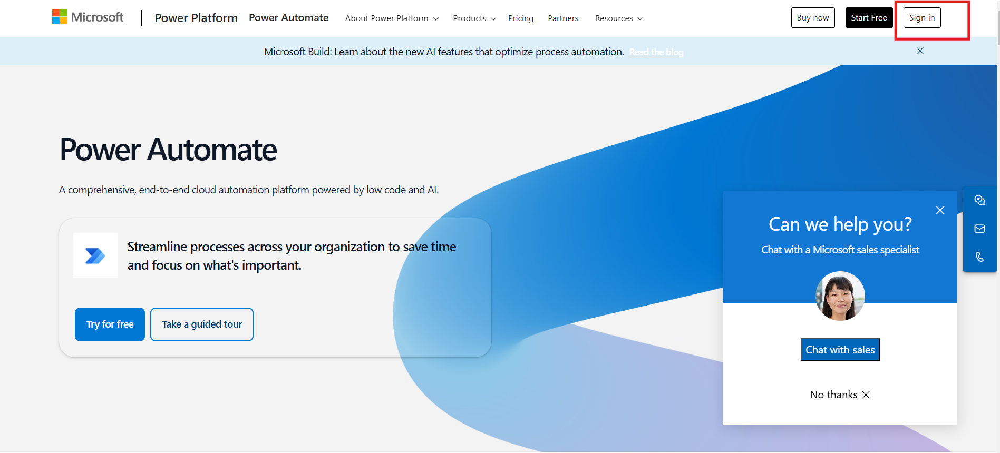
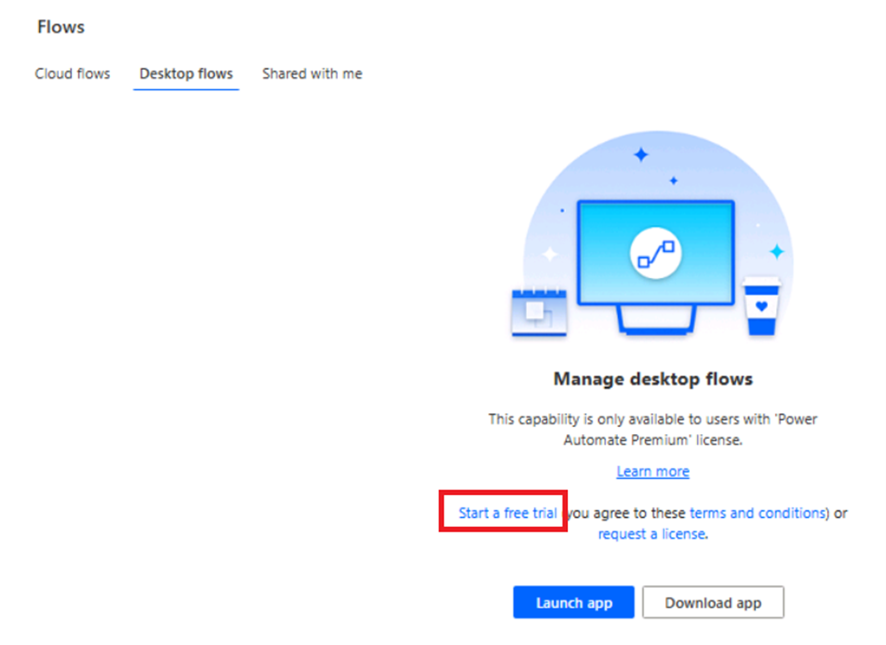
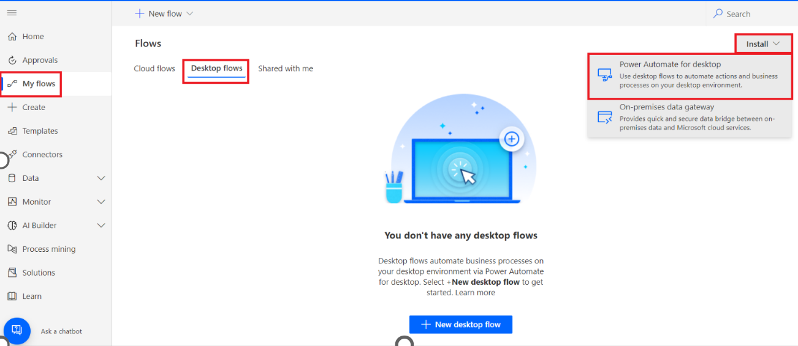
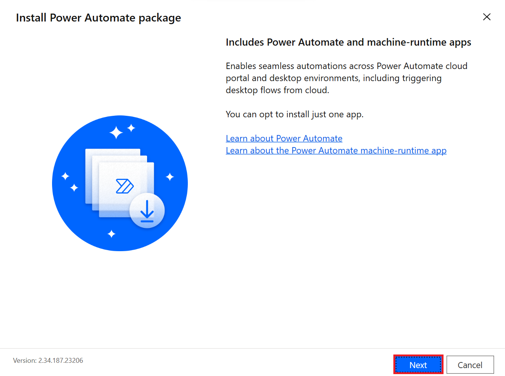
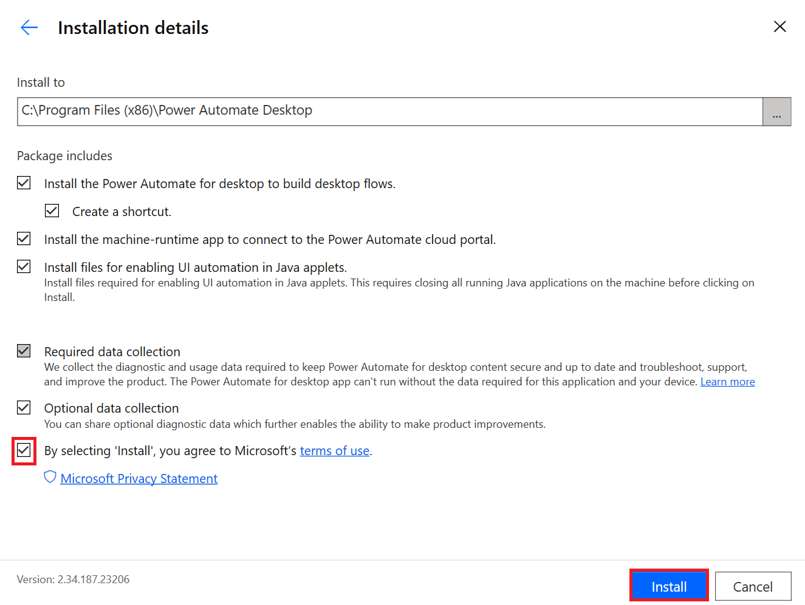
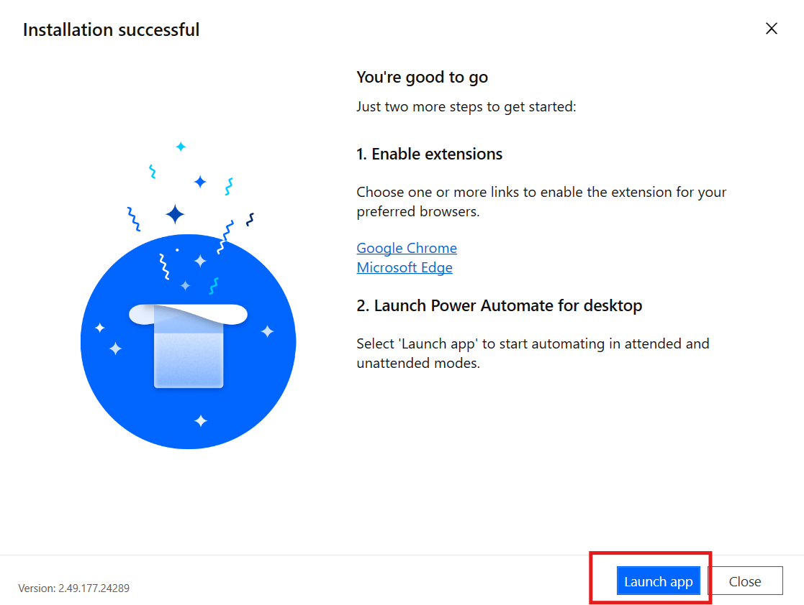

# Lab 9 – Einrichten der Lab-Umgebung für Power Automate Desktop

**Ziel:** Ziel dieses Labs ist es, die Teilnehmer durch den Prozess der
Einrichtung der Power Automate Desktop-Umgebung zu führen. Am Ende des
Labs haben die Teilnehmer Power Automate für Desktop erfolgreich
installiert, Browsererweiterungen konfiguriert und sich mit ihren Office
365-Anmeldeinformationen angemeldet.

**Geschätzte Zeit:** 15 Minuten

### Aufgabe 1: Anmelden bei der Power Automate Desktop-Anwendung

1.  **Melden Sie sich** bei
    **+++https://www.microsoft.com/en-us/power-platform/products/power-automate+++**
    mit Ihren Office 365-Tenant Anmeldeinformationen an.

- 

2.  Klicken Sie im linken Fensterbereich auf **My flows** und wählen Sie
    dann **Desktop-Flows** aus.

- 

3.  Wählen Sie im Desktop-Flow-Fenster die Option **Start a free trial**
    aus. Falls erforderlich, geben Sie bitte Ihre Admin Tenant-ID ein
    und melden Sie sich erneut an.

- 

4.  Klicken Sie im linken Fensterbereich auf **My flows**. Klicken Sie
    auf **Desktop flows** und dann auf **Install -\> Power Automate for
    Desktop.**

- 

5.  Navigieren Sie zum **File Explorer,** klicken Sie im linken Bereich
    auf **Downloads** und doppelklicken Sie dann auf
    **Setup.Microsoft.PowerAutomate.exe**.

- 

6.  Klicken Sie im Bereich **Install Power Automate package** auf
    **Next** .

- 

7.  Aktivieren Sie das Kontrollkästchen für **By selecting Install you
    agree Microsoft’s terms of use**. Klicken Sie im Bereich mit den
    Installationsdetails auf **Install.**

- 

8.  Klicken Sie im Dialogfeld „Do you want to allow this app to make
    changes to your device?“ auf **Yes**.

- 

9.  Wählen Sie nach der Installation der Browsererweiterung die Option
    **Launch app**. Oder Sie können zum **Desktop** der VM wechseln, wo
    die Verknüpfung für **Power Automate Desktop** jetzt verfügbar ist.
    Doppelklicken Sie auf die Verknüpfung.

- 

10. Wählen Sie **Sign in** aus, und melden Sie sich mit Ihren Office
    365-Tenant-Anmeldeinformationen an. Wenn Sie dazu aufgefordert
    werden, wählen Sie **Work or school account** aus.

- 

11. Sie werden zur Startseite von **Power Automate** for Desktop
    navigiert.

### Schlussfolgerung:

In diesem Lab haben die Teilnehmer die Power Automate Desktop-Umgebung
erfolgreich eingerichtet, indem sie die Anwendung installierten,
Browsererweiterungen konfigurierten und sich mit ihren Office
365-Anmeldeinformationen anmeldeten. Nach Abschluss des
Einrichtungsvorgangs sind die Teilnehmer nun bereit, Power Automate
Desktop zur Automatisierung von Workflows und Aufgaben zu verwenden.
Dieses Lab bietet den grundlegenden Schritt zum Untersuchen der
Automatisierung und stellt sicher, dass die Umgebung für zukünftige
Desktopautomatisierungsaufgaben ordnungsgemäß konfiguriert ist.
