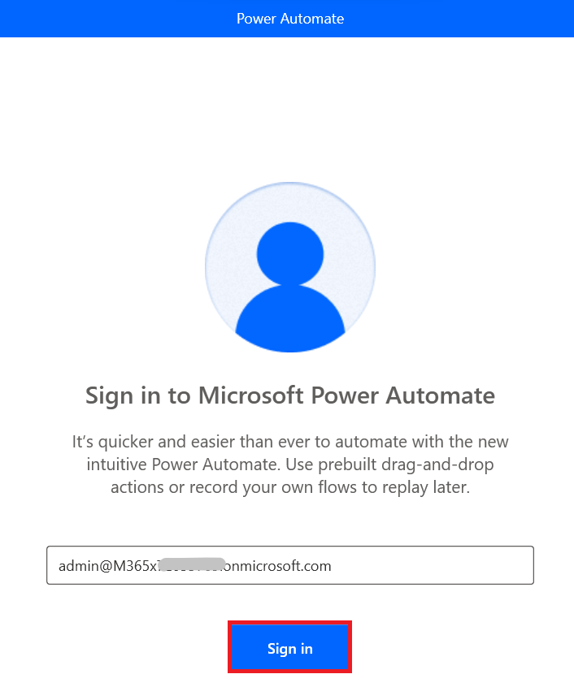

# 實驗 9 - 為 Power Automate Desktop 設置實驗環境

**目標：** 本實驗的目標是指導參與者完成設置 Power Automate Desktop
環境的過程。在實驗結束時，參與者將成功安裝 Power Automate
桌面版、配置瀏覽器擴展並使用其 Office 365 憑據登錄。

**預計時間：** 15 分鐘

### 任務 1 - 登錄到 Power Automate 桌面應用程序

1.  使用 Office 365 租戶憑據**Sign in**到
    **+++https://www.microsoft.com/en-us/power-platform/products/power-automate+++**。

- 

2.  單擊 左側窗格中的 **My flows**，然後選擇 **Desktop flows**。

- 

3.  在 Desktop flow 窗口中，選擇 **Start a free
    trail**。如果需要，請輸入您的管理員租戶 ID 並重新登錄。

- 

4.  單擊左側窗格中的 **My flows**。單擊 **Desktop
    flows**，然後單擊**Install -\> Power Automate for Desktop。**

- 

5.  導航到 **File Explorer**，單擊 左側窗格中的 **Downloads**，然後雙擊
    **Setup.Microsoft.PowerAutomate.exe**。

- 

6.  單擊 **Install Power Automate package** 窗格**上的 Next**。

- 

7.  單擊**“By selecting Install you agree to Microsoft’s terms of
    use”**的複選框。單擊 Installation details 窗格上的 **Install**。

- 

8.  點擊 **Yes** 上 Do you want to allow this app to make changes to
    your device? 對話框。

- 

9.  安裝瀏覽器擴展後，選擇 **Launch app**。或者，您可以轉到 VM 的
    **Desktop**，此時 **Power Automate Desktop**
    的快捷方式現已可用。雙擊快捷方式。

- 

10. 選擇 **Sign in** 並使用您的 Office 365
    租戶憑據登錄。如果系統提示，請選擇 “ **Work or school account**”。

- 

11. 您將導航到 **Power Automate** 桌面主頁。

### 結論：

在本實驗中，參與者通過安裝應用程序、配置瀏覽器擴展並使用其 Office 365
憑據登錄，成功設置了 Power Automate
桌面環境。完成設置過程後，參與者現在可以使用 Power Automate Desktop
自動執行工作流和任務。本實驗提供了探索自動化的基礎步驟，確保為將來的桌面自動化任務正確配置環境。
