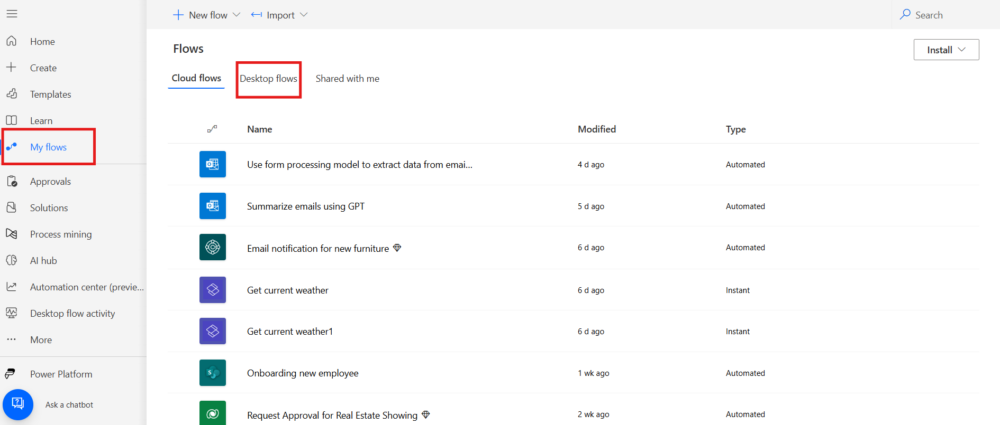
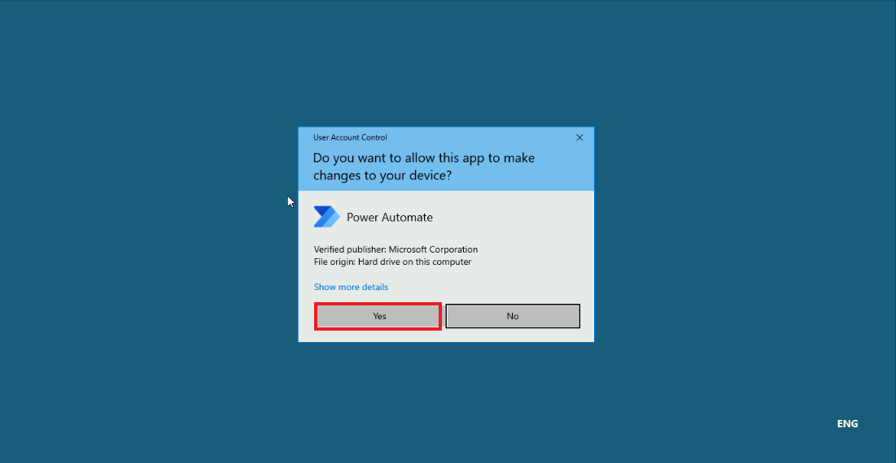

**ラボ 9 - Power Automate Desktop のラボ環境を設定する。**

**目標:**このラボの目的は、Power Automate Desktop
環境のセットアップ手順を参加者に説明することです。ラボの終了時には、参加者は
Power Automate for Desktop
のインストール、ブラウザ拡張機能の設定、Office 365
の資格情報を使用したログインを正常に完了できるようになります。

**所要時間：** 15分

**タスク 1 - Power Automate デスクトップ
アプリケーションにサインインする。**

1.  Office 365 テナント資格情報を使用して、 +++\*\*
    [*https://www.microsoft.com/en-us/power-platform/products/power-automate\*\*+++*に](https://www.microsoft.com/en-us/power-platform/products/power-automate**+++)**Sign
    in**します。

> 

2.  左側のペインから**My flows**をクリックし**Desktop
    flows**を選択します。

> 

3.  デスクトップフローウィンドウで**Start a free
    trail**を選択します。必要に応じて、管理者テナントIDを入力して再度ログインしてください。

> 

4.  左ペインから**My flows**をクリックします。**Desktop
    flows**をクリックし、**Install－\>Power Automate for
    Desktop**をクリックします。

> 

5.  **File
    Explorer**に移動し、左側のペインから**Downloads**をクリックして、**Setup.Microsoft.PowerAutomate.exe
    を**ダブルクリックします。

> 

6.  **Install Power Automate package**ペインで**Next**をクリックします。

> 

7.  **By selecting Install you agree to Microsoft’s terms of
    use**のチェックボックスをクリックします。インストールの詳細ペインで**Install**をクリックします。

> 

8.  このアプリがデバイスに変更を加えることを許可しますか?ダイアログで**Yes**をクリックします。

> 

9.  ブラウザ拡張機能をインストールしたら、「Launch
    app」を選択します。または、VMのデスクトップに移動してPower Automate
    Desktopのショートカットをダブルクリックします。

> 

10. 「**Sign in**」を選択し、Office
    365テナントの資格情報でサインインします。求められた場合は、「**Work
    or school account**」を選択します。

> 

11. **Power Automate** for Desktop のホームページに移動します。

**結論：**

このラボでは、参加者はアプリケーションのインストール、ブラウザ拡張機能の設定、そしてOffice
365の資格情報を使ったログインを通じて、Power Automate
Desktop環境のセットアップに成功しました。セットアッププロセスを完了することで、参加者はPower
Automate
Desktopを使用してワークフローとタスクを自動化できるようになります。このラボは、自動化を探求するための基礎的なステップを提供し、将来のデスクトップ自動化タスクに向けて環境が正しく構成されていることを確認します。
