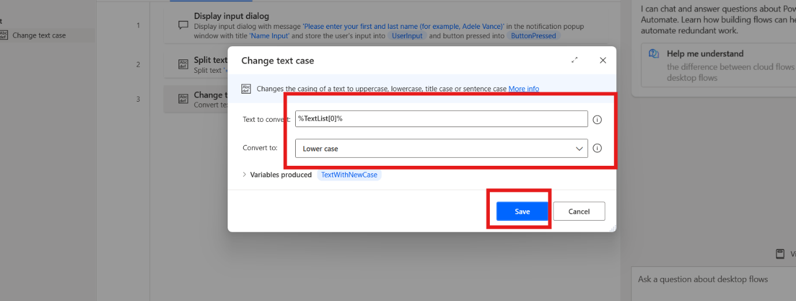
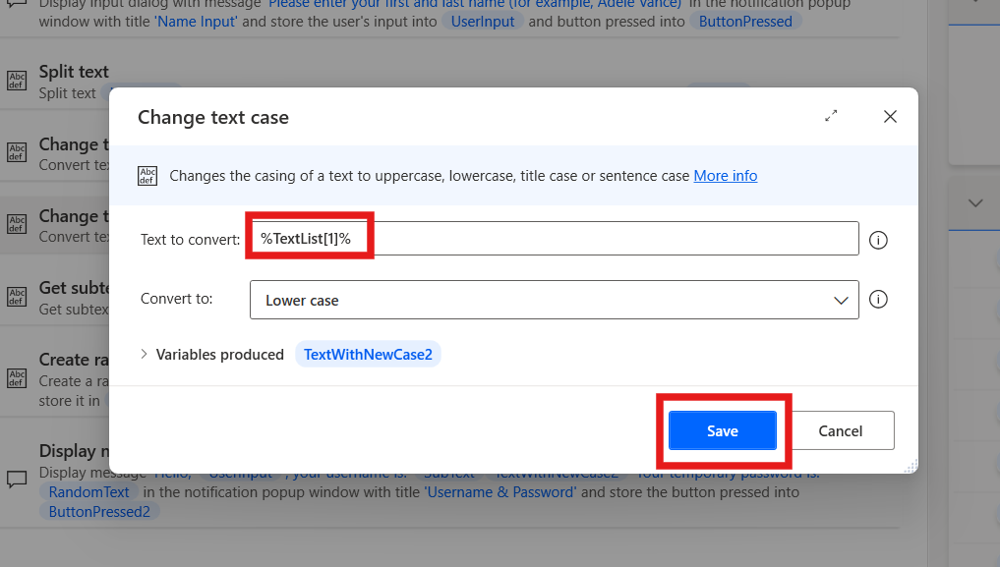
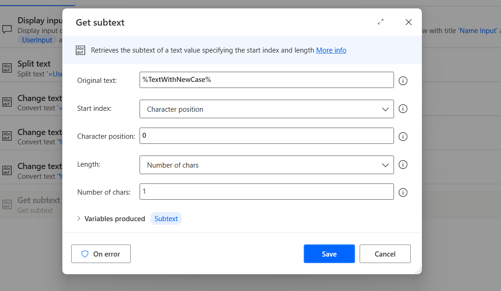

# Laboratoire 10 - Conception d'un flux pour générer un nom d'utilisateur et un mot de passe

**Objectif :** L'objectif de ce laboratoire est de créer et de tester un
Power Automate Desktop flow qui génère un nom d'utilisateur et un mot de
passe aléatoire en fonction de l'entrée de l'utilisateur. En complétant
ce laboratoire, les participants apprendront à concevoir et à
automatiser un flux à l'aide d'actions Power Automate Desktop, y compris
la gestion de la manipulation de texte et la génération de texte
aléatoire.

**Temps estimé :** 20 minutes

# Tâche 1 : Créer un Power Automate Desktop Flow

1.  Connectez-vous et ouvrez **Power Automate Desktop avec Office 365
    tenant** et choisissez un environnement (**Contoso**). Dans le coin
    supérieur gauche, sélectionnez **+ New flow.**

- 

2.  Entrez le nom du flux +++**Generate Username and Password**+++,
    confirmez que le **Power Fx** est désactivé et cliquez sur
    **Create**.

- 

3.  De gauche à droite : Barre d'actions, recherchez +++**Display input
    dialog**+++ action et double-cliquez sur l'action à sélectionner.

- 

4.  Définissez la propriété Titre de la **boîte de dialogue d'entrée**
    sur +++ **Name Input**+++ et la propriété **Message de la boîte de
    dialogue d'entrée** sur +++**Please enter your first and last name
    (for example, Adele Vance)**+++. Cette action affiche un message qui
    prompt l'utilisateur à effectuer une saisie. Cliquez sur le bouton
    **Save**.

- 

5.  À partir de la gauche, recherchez l'action +++ **Split text**+++ et
    double-cliquez sur l'action à sélectionner.

- 

6.  Dans le champ **Text to split**  de l'action Diviser le texte,
    entrez +++** %UserInput %**+++, puis cliquez sur **Save**.

- 

7.  À partir de la gauche, recherchez dans la barre d'actions
    +++**Change text case**+++ et double-cliquez sur l'action à
    sélectionner.

- 

8.  Dans le champ Texte à convertir, entrez +++** %TextList\[0\] %**+++.

9.  Avec l'index d'une variable de type liste, fournissez le premier
    élément de la liste, qui est le prénom. Définissez l'option
    Convertir en **minuscules**, puis cliquez sur **Save**.

- 

10. À partir de la gauche, recherchez dans la barre d'actions
    +++**Change text case**+++ et double-cliquez sur l'action à
    sélectionner.

- 

11. Dans le champ d'action **Texte à convertir,** entrez
    **+++** **%TextList\[1\] %+++.**

12. Avec l'index d'une variable de type liste, fournissez le premier
    élément de la liste, qui est le prénom. Définissez la propriété
    Convertir en **minuscules** , puis cliquez sur **Save**.

- 

13. À partir de la barre d'actions de gauche, recherchez l'action +++
    **Get subtext**+++ et double-cliquez sur l'action à sélectionner.

- 

14. Dans le champ Texte d'origine, entrez +++** %TextWithNewCase %**+++,
    Dans la section Index de départ, définissez Position du caractère
    sur +++**0**+++

15. Dans la section Longueur, définissez le nombre de caractères sur
    +++**1**+++. Ce paramètre récupère le premier caractère de la chaîne
    de texte.

16. Cliquez sur **Save**.

- 

17. Pour générer un mot de passe aléatoire, ajoutez une **action Créer
    du texte aléatoire**. Les propriétés de l'action peuvent être
    laissées à leurs valeurs par défaut. Cliquez ensuite sur **Save.**

- 

18. À partir de la barre d'actions de gauche, recherchez +++**Display
    message**+++ +++ action et double-cliquez sur l'action à
    sélectionner.

- 

19. Dans le champ Titre de la **boîte de message**, entrez +++**Username
    & Password**+++, et dans le champ **Message à afficher**, entrez le
    contenu suivant :

- +++Hello, %UserInput%, your username is: %SubText%%TextWithNewCase2% Your temporary password is: %RandomText%+++

20. Le nom d'utilisateur (première lettre du prénom, combiné au nom de
    famille) s'affiche et le résultat de l' action **Générer du texte
    aléatoire** s'affiche comme mot de passe de l'utilisateur. Cliquez
    sur le bouton **Save**.

- 

21. Le **flux terminé** doit ressembler à la figure suivante.

- 

# Tâche 2 : Tester le flow

1.  Cliquez sur le bouton **Exécuter** pour tester le flow.

- 

2.  Entrez le **prénom et le nom de famille** à des fins de test et
    cliquez sur le bouton **Ok**.

- 

3.  La **sortie finale** du cas de test ressemble une fois à ce qui
    suit.

- 

**Conclusion :** Dans ce laboratoire, les participants ont conçu et
testé avec succès un Power Automate Desktop flow qui génère un nom
d'utilisateur et un mot de passe aléatoires en fonction de l'entrée de
l'utilisateur. En utilisant des actions de manipulation de texte, telles
que le fractionnement, la modification de la casse et la génération de
texte aléatoire, les participants ont acquis une expérience pratique de
l'automatisation des tâches spécifiques à l'utilisateur. Le flux montre
comment créer dynamiquement un nom d'utilisateur et un mot de passe à
l'aide des fonctionnalités de base de Power Automate Desktop. Ce
laboratoire jette les bases de la création de flux d'automatisation plus
complexes dans les tâches futures.
