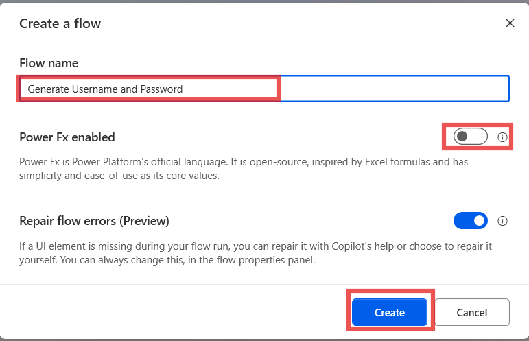

# 實驗 10 - 設計一個流來生成用戶名和密碼

**目標：** 本實驗的目標是創建和測試一個 Power Automate Desktop
流，該流根據用戶輸入生成用戶名和隨機密碼。通過完成此實驗，參與者將學習如何使用
Power Automate Desktop作設計和自動化流，包括處理文本作和生成隨機文本。

**預計時間：** 20 分鐘

# 任務 1：創建 Power Automate 桌面流

1.  登錄並打開具有 **Power Automate Desktop with office 365
    tenant**，然後選擇一個環境 （**Contoso**）。從左上角選擇 **+ New
    flow。**

- 

2.  輸入 流名稱 +++ **Generate Username and Password** +++，確認 **Power
    Fx** 已關閉，然後單擊 **Create。**

- 

3.  從左側作欄搜索 +++ **Display input dialog**
    +++作，然後雙擊要選擇的作。

- 

4.  將“**Input dialog title**”屬性設置為 +++**Name
    Input**+++，將“**Input dialog message**”屬性設置為 +++ **Please
    enter your first and last name (for example, Adele
    Vance)**+++。此作將顯示一條消息，提示用戶輸入。點擊 **Save** 按鈕。

- 

5.  從左側作欄搜索 **+++ Split text +++**作，然後雙擊要選擇的作。

- 

6.  在 Split text作的 **Text to split** 字段中，輸入
    +++**%UserInput%**+++，然後單擊 **Save**。

- 

7.  在左側作欄中，搜索 +++ **Change text case**
    +++作，然後雙擊要選擇的作。

- 

8.  在 Text to convert 字段中，輸入 +++**%TextList\[0\]%**+++。

9.  使用列表類型變量的索引，提供列表的第一項，即名字。設置 轉換成 為
    **Lower case**，然後單擊 **Save**。

- 

10. 在左側作欄中，搜索 +++ **Change text case**
    +++作，然後雙擊要選擇的作。

- 

11. 在 **Text to convert** 作字段中，輸入 +++**%TextList\[1\]%**+++。

12. 使用列表類型變量的索引，提供列表的第一項，即名字。將 Convert to
    屬性設置為 **Lower case** ，然後單擊 **Save**。

- 

> 13\. 在左側作欄搜索 +++ **Get subtext**+++作，然後雙擊要選擇的作。

- 

13. 在 Original text 字段中，輸入 +++**%TextWithNewCase%**+++，在 Start
    index 部分中，將 Character position 設置為 +++**0**+++

14. 在 Length 部分中，將 Number of chars 設置為
    +++**1**+++。此設置獲取文本字符串的第一個字符。

15. 點擊 **Save**.

- 

16. 要生成隨機密碼，請添加 **Create random text**
    作。作的屬性可以保留為默認值。然後點擊 **Save。**

- 

17. 從左側作欄搜索 +++ **Display message** +++作，然後雙擊要選擇的作。

- 

18. 在**Message box title**字段中，輸入**+++ Username &
    Password**+++，然後在** Message to display** 字段中，輸入以下內容：

- +++Hello, %UserInput%, your username is: %SubText%%TextWithNewCase2% Your temporary password is: %RandomText%+++

19. 將顯示用戶名（名字的第一個字母，與姓氏組合），並且 **Generate random
    text**作的結果顯示為用戶的密碼。點擊 **Save** 按鈕。

- 

20. **完成的流程** 應如下圖所示。

- 

# 任務 2：測試流

1.  單擊 **Run** 按鈕以測試流。

- 

2.  輸入 **First and Last Name**用於測試目的，然後單擊 **Ok** 按鈕。

- 

3.  測試用例的 **Final output** 如下所示一次。

- 

**結論：** 在本實驗中，參與者成功設計並測試了一個 Power Automate Desktop
流，該流根據用戶輸入生成用戶名和隨機密碼。通過利用文本作作，例如拆分、更改大小寫和生成隨機文本，參與者獲得了自動化用戶特定任務的實踐經驗。該流程演示了如何使用基本的
Power Automate Desktop
功能動態創建用戶名和密碼。此實驗室為在未來任務中構建更複雜的自動化流程奠定了基礎。
